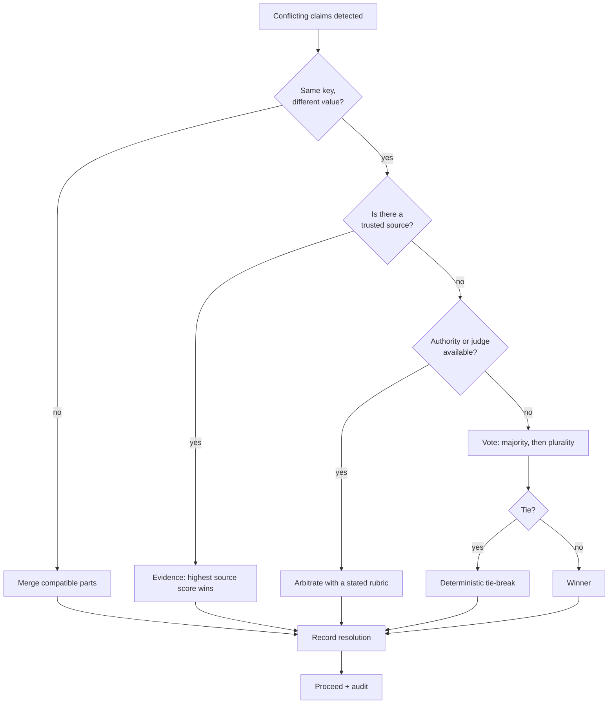

# Conflict Resolution and Consensus

> **Interview answer (say this first).** Agents disagree in three ways: **data conflicts** (two sources report different facts), **plan conflicts** (two valid but incompatible sequences of steps), and **output conflicts** (two answers that cannot both be right). Resolution is not one technique but a ladder: **authority or priority** (a designated owner decides), **evidence** (the better-sourced claim wins), **voting** (agents vote; majority or plurality decides), **arbitration** (a judge agent decides with a stated rubric), and **merge** (combine non-contradictory parts). **Consensus** — majority, quorum, weighted voting — is a coordination mechanism, not a truth machine: when all agents share a base model, their errors are correlated, so agreement can be confidently wrong. Always add a **deterministic tie-break** so the result never depends on message order, and always **record the resolution** — inputs, strategy, winner, and rationale — because the audit trail is what makes a disagreeing system debuggable.

> **Note:**
>
> **Verified.** Every runnable pure-Python example on this page was executed on Python 3.14. The plurality vote and deterministic tie-break, weighted voting with quorum, conflict detection, evidence-based resolution, arbitration, merge, and the audit record all produced the outputs shown. Every JSON payload was parsed with `json.loads`.

## Why this exists

Two agents look at the same task and reach different answers. That is normal, and it is often the reason you built a multi-agent system: independent agents catch each other's mistakes. But disagreement is only useful if the system can resolve it. Otherwise you have created a committee with no chair.

The failure modes are concrete:

- **The loudest wins.** Two agents post contradictory facts; whichever message arrives last is the one downstream agents see. The outcome depends on network timing.
- **The system stalls.** The agents wait for each other to concede, and no one does. The job never finishes.
- **False consensus.** Every agent shares the same base model, so they make the same mistake and vote for the same wrong answer. Agreement looks like confidence.
- **Silent override.** An authority picks an answer and never records why. Months later nobody can explain the decision.

None of these are model failures. They are coordination failures. The fix has two parts:

1. **A resolution strategy** chosen and stated before the conflict happens.
2. **An audit record** that preserves the inputs, the strategy, the winner, and the rationale.

Consensus mechanisms — voting, quorum, weighted votes — are useful, but only when you understand what they can and cannot prove. With LLM agents, agreement is weak evidence, because the agents are not independent.

> **Tip:**
>
> **The one-sentence purpose.** Detect disagreement, resolve it with a declared strategy, break ties deterministically, and write down why — so the system stays correct and explainable.

## Start from zero

| Word | Plain meaning |
| --- | --- |
| **Conflict** | Two agents produce results that cannot both be true or used. |
| **Data conflict** | Two sources report different values for the same fact. |
| **Plan conflict** | Two valid but incompatible sequences of steps. |
| **Output conflict** | Two answers that contradict each other. |
| **Resolution** | The decision about which claim, plan, or output wins. |
| **Resolution strategy** | The declared rule for deciding, chosen before the conflict. |
| **Authority** | A designated agent or role whose decision is final. |
| **Priority** | A ranking that decides who wins when there is no clear evidence. |
| **Evidence** | Signals that make one claim more credible: source, recency, tests. |
| **Voting** | Agents cast a choice; a tally decides. |
| **Plurality** | The choice with the most votes wins, even without a majority. |
| **Majority** | More than half the votes; can fail to exist. |
| **Quorum** | The minimum participation or weight required to decide at all. |
| **Weighted voting** | Votes count differently according to trust or role. |
| **Arbitration** | A judge agent picks a winner using a stated rubric. |
| **Judge agent** | An agent whose job is to decide between conflicting options. |
| **Merge** | Combine compatible parts; keep contradictions separate. |
| **Consensus** | Broad agreement among agents. |
| **Deterministic tie-break** | A fixed rule that resolves a tie the same way every time. |
| **Deadlock** | Agents wait on each other and nothing proceeds. |
| **Supermajority** | A threshold above half, such as two-thirds. |
| **Veto** | The power of one agent to block a decision. |
| **Audit record** | The stored inputs, strategy, winner, and rationale. |
| **Rationale** | The stated reason for the decision. |
| **Provenance** | Where a claim came from and who produced it. |
| **Sycophancy** | Agents agreeing to please the majority rather than because they are right. |
| **Correlated error** | Several agents making the same mistake because they share a base model. |

Two distinctions to hold on to:

- **Consensus vs correctness.** Consensus measures agreement, not truth. A wrong answer can be unanimous.
- **Voting vs arbitration.** Voting combines many weak signals; arbitration applies one accountable decision. Use voting to narrow, arbitration to settle.

## The core idea

Think of a committee with a written rulebook.

- Some disagreements are about **facts**. The committee checks the source and the date. That is evidence.
- Some are about **plans**. Both plans work, but they cannot both run. The chair decides, or the committee votes with weights.
- Some are about **answers**. The parts that agree are merged; the parts that clash go to a judge.
- Whatever happens, the **minutes** record what was proposed, what was chosen, and why. That is the audit record.



The strategies, side by side, are the interview answer:

| Strategy | How it decides | Best when | Weakness |
| --- | --- | --- | --- |
| Authority / priority | A designated role decides | One role owns the domain | Ignores evidence; can be wrong |
| Evidence | Highest-trust, most recent, or tested source wins | Sources are comparable | Needs source metadata |
| Voting | Majority, then plurality | Many independent agents | Correlated errors; sycophancy |
| Arbitration | A judge applies a rubric | High-stakes or fine-grained choice | Judge can be biased or wrong |
| Merge | Combine non-conflicting parts | Outputs overlap partially | Cannot merge true contradictions |

The design rule: **escalate the cheapest way that is reliable.** Merge if you can, evidence if sources differ, vote if the agents are genuinely independent, arbitrate when you need one accountable decision, and invent nothing beyond those.

## How it works

1. **Detect the conflict.** Compare claims by key. The same key with different values is a data conflict; incompatible step sequences are a plan conflict; contradictory answers are an output conflict.
2. **Classify before resolving.** The type decides the strategy. A fact conflict wants evidence; a plan conflict often wants authority; an output conflict may want a judge.
3. **Check whether it is a real conflict.** Two values can differ but not clash, such as partial answers to different questions. Only true contradictions need resolution.
4. **Try merge first.** If the claims touch different fields, combine them. A merge is cheap and loses no information.
5. **Apply evidence next.** Rank claims by source trust, recency, and verification. A measured value beats a guessed one.
6. **Vote when agents are independent.** Count votes, require a majority where you can, fall back to plurality, and enforce a quorum so a tiny minority cannot decide.
7. **Weight the votes if roles differ.** A domain expert should outweigh a generalist. Record the weights so the tally is reproducible.
8. **Arbitrate when you need accountability.** A judge agent receives the conflicting options and a written rubric, picks one, and states the reason. The judge is accountable for the choice.
9. **Break ties deterministically.** Sort candidates by a stable key, such as a hash or the candidate name, so the same tie resolves the same way every run. Never let arrival order decide.
10. **Guard against false consensus.** If all agents share a base model, their agreement is weak. Add a differently-sourced agent, an external check, or a human gate for high-stakes decisions.
11. **Record the resolution.** Store the conflict id, the inputs, the strategy, the winner, the tally, and the rationale. This is the artifact that makes the decision explainable.
12. **Propagate the result as a new version.** The resolution becomes the agreed value in shared state, under a version, so later readers see one answer rather than two.

Two things to plan for:

- **Liveness.** A conflict must not deadlock the job. Set a maximum number of resolution rounds, then escalate to a human or a default.
- **Reversibility.** Keep the losing claims in the audit record. A later run may learn that the loser was right.

## The syntax you will use

**Plurality vote with a deterministic tie-break.** The tie-break never depends on message order.

```python
from collections import Counter
import hashlib

def tie_break(candidates: list[str]) -> str:
    # deterministic: lowest sha256, then lexicographic, so the result never
    # depends on dictionary or message arrival order
    return sorted(candidates, key=lambda c: (hashlib.sha256(c.encode()).hexdigest(), c))[0]

def plurality(ballots: list[tuple[str, str]]) -> tuple[str, str]:
    tally = Counter(choice for _, choice in ballots)
    total = sum(tally.values())
    top = max(tally.values())
    winners = sorted(c for c, v in tally.items() if v == top)
    if len(winners) > 1:
        return tie_break(winners), "tie-break"
    if top * 2 > total:
        return winners[0], "majority"
    return winners[0], "plurality"
```

**Weighted voting with a quorum.** The quorum stops a small group from deciding for everyone.

```python
def weighted_vote(ballots: list[tuple[str, str]], weights: dict[str, int],
                  quorum_weight: int) -> dict:
    tally: dict[str, int] = {}
    cast = 0
    for agent, choice in ballots:
        w = weights.get(agent, 1)
        tally[choice] = tally.get(choice, 0) + w
        cast += w
    if not tally:
        return {"tally": {}, "cast_weight": 0, "quorum": quorum_weight,
                "quorum_met": False, "winner": None, "tie": False}
    top = max(tally.values())
    winners = sorted(c for c, v in tally.items() if v == top)
    winner = winners[0] if len(winners) == 1 else tie_break(winners)
    return {"tally": dict(sorted(tally.items())), "cast_weight": cast,
            "quorum": quorum_weight, "quorum_met": cast >= quorum_weight,
            "winner": winner, "tie": len(winners) > 1}
```

**Detect conflicts by key.** Same key, different value.

```python
def detect_conflicts(claims: list[tuple[str, str, object]]) -> list[dict]:
    # claims: (agent, key, value)
    seen: dict[str, tuple] = {}
    out = []
    for agent, key, value in claims:
        if key in seen and seen[key][1] != value:
            out.append({"key": key, "left": seen[key], "right": (agent, value)})
        else:
            seen.setdefault(key, (agent, value))
    return out
```

**Resolve by evidence.** Highest evidence score wins; ties break deterministically by agent name.

```python
def resolve_by_evidence(claims: list[tuple[str, object, float]]) -> tuple:
    # claims: (agent, value, evidence_score)
    ranked = sorted(claims, key=lambda c: (-c[2], c[0]))
    return ranked[0], [c[0] for c in ranked]
```

**Arbitrate with a stated rubric.** The judge's scores and reason are part of the record.

```python
def arbitrate(conflict: dict, rubric: dict) -> dict:
    left_agent, left_val = conflict["left"]
    right_agent, right_val = conflict["right"]
    left_score = rubric["source_trust"].get(left_agent, 0) \
        + rubric["recency"].get(left_agent, 0)
    right_score = rubric["source_trust"].get(right_agent, 0) \
        + rubric["recency"].get(right_agent, 0)
    if left_score == right_score:
        pick = tie_break([str(left_val), str(right_val)])
        chosen = left_val if pick == str(left_val) else right_val
        reason = "deterministic tie-break"
    else:
        chosen = left_val if left_score > right_score else right_val
        reason = "higher trust score"
    return {"chosen": chosen, "reason": reason,
            "scores": {left_agent: left_score, right_agent: right_score}}
```

**Merge compatible parts and surface the rest.**

```python
def merge(partials: list[dict]) -> dict:
    merged: dict = {}
    clash: dict[str, list] = {}
    for part in partials:
        for k, v in part.items():
            if k in clash:
                if v not in clash[k]:
                    clash[k].append(v)
            elif k in merged and merged[k] != v:
                clash[k] = [merged.pop(k), v]      # omit the key from merged
            else:
                merged.setdefault(k, v)
    return {"merged": dict(sorted(merged.items())),
            "conflicts": dict(sorted(clash.items()))}
```

**Record the resolution.** One JSON object is the audit trail.

```python
record = {
    "conflict_id": "c-1",
    "strategy": "weighted_vote",
    "inputs": [{"agent": "planner", "choice": "planA", "weight": 3},
               {"agent": "researcher", "choice": "planB", "weight": 2}],
    "resolution": "planA",
    "tally": {"planA": 4, "planB": 2},
    "decided_by": "scheduler",
    "deterministic": True,
}
```

## Examples: simple to real

**Example 1 — a clear majority, and a tie broken the same way twice.**

```text
clear majority: ('planA', 'majority')
plurality     : ('planA', 'plurality')
tie           : ('planA', 'tie-break')
tie again     : ('planA', 'tie-break')
```

Three ballots give `planA` two votes and `planB` one, so `planA` has more than half and is labelled `majority`. Four ballots split `planA` two, `planB` one, `planC` one leave `planA` with the most votes but not more than half, so it is only a `plurality`. When the vote is tied, the tie-break returns `planA` both times. Reordering the ballots does not change the outcome, because the rule is deterministic.

**Example 2 — weighted voting with a quorum.**

```text
weighted v1: {"cast_weight": 6, "quorum": 5, "quorum_met": true, "tally": {"planA": 4, "planB": 2}, "tie": false, "winner": "planA"}
weighted v2: {"cast_weight": 1, "quorum": 5, "quorum_met": false, "tally": {"planB": 1}, "tie": false, "winner": "planB"}
weighted v3: {"cast_weight": 0, "quorum": 5, "quorum_met": false, "tally": {}, "tie": false, "winner": null}
```

In the first vote, six units of weight participate, above the quorum of five, and `planA` wins with four. In the second, only one unit participates — below quorum — so the decision is not legitimate even though a winner is named. In the third, no ballots were cast at all, so there is no winner to name and `quorum_met` is `false`; the function returns a result instead of raising. Always check `quorum_met` before acting.

**Example 3 — conflict detection finds the disagreement.**

```text
conflicts found: 1
  key=refund_window_days left=('researcher', 30) right=('billing', 14)
```

Two agents report different refund windows for the same key. The detector surfaces the pair instead of letting the last write win. The conflicting field is now explicit and can be routed to the right strategy.

**Example 4 — evidence picks the better-sourced claim.**

```text
evidence winner: ('billing', 14, 0.9) | ranking: ['billing', 'researcher']
```

The researcher scored `0.55` on evidence; billing scored `0.90` because it reads the policy system directly. Evidence resolves the fact conflict without a vote, because one source is simply better. The full ranking is kept so the losing claim is not lost.

**Example 5 — a judge arbitrates a plan conflict.**

```text
arbiter: {'chosen': 14, 'reason': 'higher trust score', 'scores': {'researcher': 2, 'billing': 6}}
tie    : {'chosen': 30, 'reason': 'deterministic tie-break', 'scores': {'researcher': 3, 'billing': 3}}
```

The judge combines source trust and recency into a score, picks the higher, and states the reason. The scores travel with the decision, so the ruling can be reviewed. If the scores tie, the deterministic tie-break picks one, and the winner is mapped back to the original value (`30`, an `int`) rather than the string used for hashing, so `chosen` keeps the same type on both paths.

**Example 6 — merge combines what it can and flags the rest.**

```text
merge: {'merged': {'a': 1, 'b': 2}, 'conflicts': {'c': [3, 9]}}
```

The partial answers agree on `a` and `b`, so those merge cleanly. For `c`, the values `3` and `9` cannot both be true, so the merge records the clash and **omits** `c` from `merged` rather than silently keeping the first value. The audit record then shows the resolution:

```text
{"conflict_id": "c-1", "decided_by": "scheduler", "deterministic": true, "inputs": [{"agent": "planner", "choice": "planA", "weight": 3}, {"agent": "researcher", "choice": "planB", "weight": 2}], "resolution": "planA", "strategy": "weighted_vote", "tally": {"planA": 4, "planB": 2}}
```

Everything needed to explain the decision is here: who proposed what, the strategy, the tally, the winner, and that the tie-break was deterministic.

## In production

- **Declare the strategy before the conflict.** Choosing after the fact invites the loudest or the latest agent to win. The rule should be part of the task design.
- **Prefer merge, then evidence, then vote, then arbitrate.** Each step is more expensive and more centralised. Start cheap and escalate only when needed.
- **Make tie-breaks deterministic and content-based.** Use the candidate name or a hash of it, never arrival order or wall-clock time. Reproducibility is what makes bugs debuggable.
- **Distrust unanimous LLM agreement.** Agents sharing a base model make correlated errors. Agreement is not verification. Add an external check or a differently-sourced agent for high-stakes calls.
- **Watch for sycophancy.** A judge told "the team prefers plan A" may cave. Give the judge the options and the rubric, not the social pressure.
- **Require a quorum.** A single late voter should not decide for the organisation. Record participation with the tally.
- **Bound the number of resolution rounds.** Two or three rounds, then escalate to a human or a default. Unbounded debate is a deadlock with extra tokens.
- **Keep the losing claims.** The minority may be right, and a later run may prove it. An audit record that discards dissent cannot be re-examined.
- **Separate the fact from the value.** "The window is 14 days" is testable against a source; "we prefer plan A" is a policy choice. Resolve them differently.
- **Never let resolution silently mutate shared state.** The winner becomes a new version with provenance, not an in-place overwrite, so the decision is traceable.
- **Log the rationale, not just the winner.** "Chose 14 because billing scored 6 vs 2" is explainable. "Chose 14" is not.
- **Watch for correlated evidence.** Three agents citing the same web page are one source, not three. Deduplicate sources before counting evidence.

## Interview questions

### 1. When do agents disagree, and what types of conflict exist?

**Answer.** Three types. Data conflicts: two sources report different values for the same fact. Plan conflicts: two valid but incompatible sequences of steps. Output conflicts: two answers that cannot both be right. The type matters because it decides the strategy — facts want evidence, plans often want authority, outputs may want a judge or a merge.

**Follow-up: "Are all differences conflicts?"** No. Partial answers about different fields merge cleanly. A conflict is only a true contradiction that blocks progress.

**Trap.** Treating every disagreement as a vote. Voting on a testable fact throws away the evidence that could settle it.

### 2. What resolution strategies exist, and how do you choose?

**Answer.** Merge compatible parts first. Then evidence, where the better-sourced or more recent claim wins. Then voting, for many independent agents. Then arbitration by a judge with a stated rubric, when you need one accountable decision. Authority or priority is the fallback when there is no evidence and no time to vote. Choose by cost and reliability: cheapest reliable strategy first, escalate only when it cannot decide.

**Follow-up: "Why not always use a judge?"** A judge centralises the decision, can be biased, and adds latency and cost. Use it when the alternatives cannot decide or when the stakes justify an accountable choice.

**Trap.** Choosing the strategy after seeing the disagreement. That lets the strategy be picked to favour a preferred outcome.

### 3. Why is consensus not the same as correctness?

**Answer.** Consensus measures agreement, not truth. A group can agree on a wrong answer. With LLM agents it is worse: if they share a base model, they make correlated errors, so all of them can be confidently wrong together. Consensus is useful for coordinating action and for catching random errors; it is not evidence for factual claims.

**Follow-up: "How do you make voting more meaningful?"** Use agents with genuinely different sources or models, deduplicate evidence, and add an external check. Diversity, not headcount, is what makes a vote informative.

**Trap.** Reporting a unanimous vote as verification. Unanimity among correlated agents proves very little.

### 4. What are majority, quorum, and weighted voting?

**Answer.** Majority means more than half the votes, and it can be impossible to reach with several options. Plurality means the most votes wins, even below half. A quorum is the minimum participation or weight required for the decision to count at all. Weighted voting gives some agents more say according to trust or role. Together they let a group decide while preventing a small or unrepresentative minority from speaking for everyone.

**Follow-up: "Why require a quorum?"** So that a decision is only made when enough of the group participated. Without it, one early voter can decide by default.

**Trap.** Forgetting to check the quorum. A winner without quorum is a result, not a legitimate decision.

### 5. What is a deterministic tie-break, and why does it matter?

**Answer.** It is a fixed rule that resolves a tie the same way every time, for example sorting candidates by a hash of their name and taking the first. It matters because the alternative — arrival order or wall-clock time — makes runs non-reproducible: the same inputs can produce different outcomes. Reproducibility is essential for debugging and for evaluating whether a change helped.

**Follow-up: "Should the tie-break be random?"** Only if you log the seed, so the run can be replayed. Otherwise deterministic content-based rules are safer.

**Trap.** Using "first one to arrive" as the tie-break. Under load, that is effectively random and it hides the race.

### 6. How do you arbitrate with a judge agent?

**Answer.** Give the judge the conflicting options and a written rubric: source trust, recency, cost, risk, or whatever the task values. The judge returns a choice plus a rationale and its scores. The rubric is published in advance so the judge is applying a policy, not inventing one. Keep the judge independent of the agents it is judging, and record the ruling.

**Follow-up: "What is the risk?"** The judge inherits the same biases and correlated errors as the agents. Use a different model or source where possible, and keep a human gate for high-stakes calls.

**Trap.** Letting the judge see the majority opinion before deciding. That invites sycophancy, and it turns arbitration back into a popularity contest.

### 7. How do you prevent conflicts from deadlocking the system?

**Answer.** Bound the resolution. Set a maximum number of rounds, a timeout on each round, and a defined escalation path — a judge, a default value, or a human. Track who is waiting on whom and detect cycles. A conflict must resolve, escalate, or fail; it must never wait indefinitely.

**Follow-up: "What is the simplest safe default?"** After the round limit, escalate to the authority for that domain, or use the last known good version. A bounded default beats an unbounded debate.

**Trap.** Retrying the same unresolved vote. Repeating an indecisive process forever is a deadlock with extra cost.

### 8. What belongs in the audit record for a resolution?

**Answer.** The conflict id, the type, every input with its producer, the strategy used, the tally or scores, the winner, the rationale, who or what decided, the timestamp, and whether the process was deterministic. Also keep the losing claims. This is what lets someone explain months later why the system chose one answer, and it lets a future run revisit a decision that may have been wrong.

**Follow-up: "Why keep the losers?"** Because the minority can be right, and because re-examining a decision needs the alternatives. Discarding dissent destroys the ability to learn.

**Trap.** Logging only the winner. Without inputs and rationale, the decision is unexplainable and effectively unauditable.

## Remember this

- **Three conflict types: data, plan, output.** The type decides the strategy.
- **Resolve cheaply first: merge, then evidence, then vote, then arbitrate.** Authority is the fallback.
- **Consensus is agreement, not truth.** Correlated LLM errors make unanimity weak evidence.
- **Break ties deterministically** with a content-based rule, never arrival order.
- **Record inputs, strategy, tally, winner, and rationale.** Keep the losing claims for audit.
