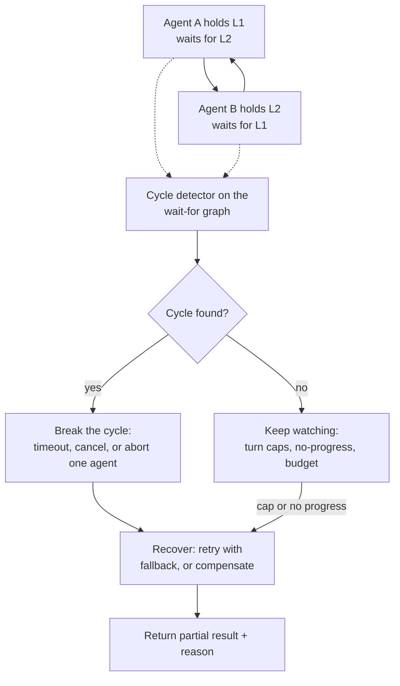

# Deadlocks, Infinite Loops, and Failure Handling

> **Interview answer (say this first).** Multi-agent systems fail in ways a single agent cannot: two agents wait on each other forever (**deadlock**), two agents keep "making progress" without changing anything (**livelock**), a supervisor spawns far too many workers (**runaway fan-out**), or one failed worker takes down a whole chain (**cascading failure**). You handle all of them with three things: **detection** (a cycle check on the wait-for graph, turn and round caps, and no-progress detection on a state fingerprint), **recovery** (timeouts, cancellation, breaking one edge of the cycle, fallbacks, and compensation), and **design** (deterministic control flow, one owner per resource, and bounded delegation). The key idea: never let a cycle or a loop depend on an agent deciding to stop.

> **Note:**
>
> **Verified.** Every runnable example on this page was executed offline in plain Python (Python 3.14). No model calls were made and no vendor prices are quoted; any cost or token number is labelled **illustrative**. Each `#` comment shows the value the code actually prints.

## Why this exists

A single agent can hang, but its hang is local: one loop, one bill, one timeout. A multi-agent system turns that local problem into a distributed one. Agents wait on each other, hold shared resources, and delegate recursively. When coordination is wrong, the whole system can stop without a single error being logged.

Four failure modes cause most of the damage.

**Circular wait (deadlock).** Agent A asked B for a review and is waiting for the reply. B asked A for the original data and is waiting for the reply. Neither will ever move. In code this happens whenever the wait graph has a cycle: A waits on B, B waits on C, C waits on A.

**Infinite loop.** The conversation never terminates. The critic keeps asking for revisions, the writer keeps rewriting, and the pair loops forever because nothing counts the rounds. This is the multi-agent version of the single-agent loop in Phase 4, but it is worse: each round is several model calls, so the cost multiplies.

**Livelock.** The agents are busy but nothing changes. A and B keep handing the same task back and forth with slightly different wording. From the outside the system looks active — messages are flowing, CPU is busy — but the shared state cycles and no goal advances. Livelock is harder to spot than deadlock because there is no waiting; there is activity.

**Runaway fan-out.** A supervisor decides to "be thorough" and spawns fifty workers. Each worker spawns helpers. The breadth explodes, the budget drains, and rate limits trip. Fan-out is a resource decision, not a reasoning decision.

Here is the shape of a deadlock in a wait-for graph:

```text
A holds lock L1, waits for L2
B holds lock L2, waits for L1
A -> B -> A  (cycle, no progress possible)
```

Nothing in that picture will resolve itself. The system needs an outside observer that can see the cycle, because the agents inside only see their own blocked call.

> **Note:**
>
> **The one-sentence purpose.** Multi-agent failure handling means detecting cycles, loops, and blow-ups that no single agent can see, then recovering by breaking an edge, cancelling, or compensating — never by waiting for an agent to notice.

## Start from zero

| Word | Plain meaning |
| --- | --- |
| **Deadlock** | Two or more agents each waiting for the other, so none can proceed. |
| **Circular wait** | The condition behind deadlock: a cycle in the "who waits for whom" graph. |
| **Wait-for graph** | A graph whose nodes are agents and whose edge A to B means "A is waiting on B." |
| **Cycle** | A path that returns to its start, such as A to B to A. |
| **Cycle detection** | Finding a cycle in a graph, usually with depth-first search and three colours. |
| **Livelock** | Agents keep acting, but the shared state repeats and no goal advances. |
| **Infinite loop** | A conversation or loop that never reaches a stop condition. |
| **Non-terminating conversation** | A chat between agents that never ends because nobody counts turns. |
| **Turn** | One agent's single message or action in a conversation. |
| **Round** | One full pass where every agent in the group acts once. |
| **Turn cap / round cap** | A hard maximum on turns or rounds before the system stops. |
| **Fan-out** | Starting many workers at once from one task. |
| **Runaway fan-out** | Fan-out that grows without a width or budget limit. |
| **Fan-in** | Collecting and merging the results of many workers. |
| **Cascading failure** | One component fails, its callers fail, and the failure spreads. |
| **Bulkhead** | A limit that isolates one workload so its failure cannot drain the rest. |
| **Circuit breaker** | A switch that stops calls to a failing dependency for a cooldown once its error rate passes a threshold. |
| **Thundering herd** | Many agents retrying at once and slamming a dependency the moment it recovers. |
| **Partial failure** | Some workers succeed and some fail in the same run. |
| **Timeout** | A maximum time to wait for one operation. |
| **Deadline** | A maximum time for the whole task; children inherit it. |
| **Cancellation** | Telling an in-flight agent to stop and abandon its work. |
| **Cooperative cancellation** | Cancellation that works only when the agent checks a stop flag. |
| **No-progress detection** | Stopping when the state stops changing even if actions continue. |
| **State fingerprint** | A hash or summary of the shared state, used to compare states cheaply. |
| **Progress** | A measurable change: a new fact, a completed task, a smaller error. |
| **Idempotent** | Safe to run more than once with the same effect. |
| **Compensation** | An action that undoes a completed step when a later step fails. |
| **Saga** | A long transaction built from steps, each with a compensating undo. |
| **Fallback** | A backup path used when the primary agent or tool fails. |
| **Backpressure** | Slowing or rejecting work when a queue or budget is full. |
| **Dead-letter** | A place to park work that failed permanently for later inspection. |

Two distinctions cause most confusion, so pin them down now:

- **Deadlock vs livelock.** Deadlock means no one is moving. Livelock means everyone is moving and nothing is changing. Deadlock is detected by a cycle in waits; livelock is detected by a repeating state fingerprint.
- **Stopped vs failed.** A capped conversation that returns a partial result is *stopped*, not *failed*. Only an unrecoverable error or a cycle with no safe break is a failure. Conflating them makes healthy runs look broken.

## The core idea

Think about a **four-way intersection with no traffic lights**.

Two cars arrive at the same moment, each waiting for the other to go, and both sit there. That is a deadlock, and neither driver can solve it alone: each only sees the car in front. A third party — a traffic officer, or a rule like "yield to the right" — is what breaks the tie. Multi-agent systems need the same third party: a detector outside the individual agents.

Now picture two people who keep saying "after you." "No, after you." Both are active and polite, and the doorway stays blocked. That is livelock: motion without progress. The fix is a rule ("the person on the left goes first") and a clock ("if the doorway is still blocked in ten seconds, one steps back").

The mental model is: **the coordination layer, not the agents, owns termination.** Every cycle, cap, and counter lives in deterministic code wrapping the agents.



Notice that the detector reads the wait-for graph, not the agents' reasoning. An agent that is blocked cannot report that it is in a cycle, because the information it needs is on the other agent's side. Detection must be global.

A second mental model is the **failure ladder**, the multi-agent version of graceful degradation:

| Stage | What happens | Example |
| --- | --- | --- |
| 1. Normal | All agents respond in time. | Supervisor plans, workers return results. |
| 2. Retry within budget | A worker times out; retry once. | Retry the analyst with a longer timeout. |
| 3. Fallback agent | The specialist is down; a generalist stands in. | Route to a cheaper worker. |
| 4. Partial result | Some workers failed; ship what succeeded. | Return the answer with a gap flagged. |
| 5. Compensate | Undo already-completed side effects. | Refund the charge, release the stock. |
| 6. Honest failure | Nothing safe; return a typed error. | "Order not placed; nothing charged." |

Every step down is a decision you make in advance. A system with no ladder has two outcomes: perfect, or a deadlock that nobody can explain.

## How it works

1. **Model coordination as a graph.** Nodes are agents and resources; edges are "waits for" and "delegates to." Deadlock is a cycle in the waits. You cannot detect what you do not model.
2. **Detect cycles continuously.** Run cycle detection on the wait-for graph whenever an agent blocks. Use depth-first search with three colours: unvisited, on the current path, and finished. A back edge to an "on path" node is the cycle.
3. **Set turn and round caps before the run starts.** A maximum number of turns per conversation and rounds per run. These are the simplest, cheapest stop conditions and they never depend on the model.
4. **Set a wall-clock deadline per task and per conversation.** Deadline the whole run in seconds, and pass a smaller inherited deadline to every child. Deadlines catch hangs that no counter sees.
5. **Add no-progress detection.** Compute a fingerprint of the shared state (facts learned, tasks done, error size) after each round. If the fingerprint repeats for N consecutive observations after the baseline — that is, the same value seen N+1 times in total — stop. This catches livelock and the "novel but useless" loop.
6. **Bound fan-out by width and budget.** Before spawning, check `min(requested, max_width, budget // cost_per_worker)`. A supervisor that wants fifty workers can only get what the budget allows.
7. **Isolate failures with bulkheads.** Give each agent class and each tenant its own concurrency limit and queue. A stuck retriever then cannot consume the writer's workers.
8. **Detect a deadlock, then break exactly one edge.** Choose a victim by a deterministic rule (lowest priority, newest task, most budget left). Abort that agent's wait, release its held resources, and let the others proceed.
9. **Cancel cooperatively and enforce it with a timeout.** Cancellation is a flag the agent checks between turns. Because a model call cannot be interrupted mid-call, back the flag with a hard timeout that abandons the call.
10. **Retry only idempotent, transient failures, with backoff and jitter.** A failed worker read can be retried. A failed payment cannot, unless it carries an idempotency key.
11. **Fall back to a simpler agent.** A failed specialist can be replaced by a generalist agent or a deterministic function. Keep the fallback tested, because an untested fallback is a second failure.
12. **Compensate completed side effects.** When a saga step fails, run the undo actions for the completed steps in reverse order. Return a partial result plus the compensation log.
13. **Record a structured outcome per run.** `success`, `partial`, `failed`, plus the stop reason (`cycle`, `turn_cap`, `deadline`, `no_progress`, `budget`, `cancelled`). A reason is what makes the next incident debuggable.
14. **Feed stops back into the design.** A rising count of "turn cap" stops means the prompts are not converging. A rising count of cycles means the resource ownership is wrong. Stops are signals, not just endings.

> **Note:**
>
> **The order that matters.** Detect before you spend: check the cap, the deadline, the cycle, and the fingerprint at the top of each round. A check after the expensive call is a check that already cost you the call.

## The syntax you will use

These are the real production forms. Read them once; later chapters use them.

**Cycle detection on a wait-for graph.** Three colours, returns the cycle path. Recursive form shown; for very deep graphs, convert it to an explicit stack so you do not hit Python's recursion limit.

```python
def find_cycle(wait_for: dict[str, set[str]]) -> list[str] | None:
    WHITE, GRAY, BLACK = 0, 1, 2
    color = {node: WHITE for node in wait_for}
    stack: list[str] = []

    def visit(node: str) -> list[str] | None:
        color[node] = GRAY
        stack.append(node)
        for nxt in wait_for.get(node, ()):          # edge = "waits on"
            if color.get(nxt, WHITE) == GRAY:       # back edge -> cycle
                return stack[stack.index(nxt):] + [nxt]
            if color.get(nxt, WHITE) == WHITE:
                found = visit(nxt)
                if found:
                    return found
        stack.pop()
        color[node] = BLACK
        return None

    for node in list(wait_for):
        if color[node] == WHITE:
            found = visit(node)
            if found:
                return found
    return None
```

A `GRAY` node is one on the current path. Reaching a gray node again is the definition of a cycle, and the slice reconstructs the loop.

**A turn and round cap.** The simplest stop condition, checked before every round.

```python
class RoundCap:
    def __init__(self, max_rounds: int) -> None:
        self.max_rounds = max_rounds
        self.used = 0

    def can_continue(self) -> bool:
        return self.used < self.max_rounds

    def spend_round(self) -> None:
        self.used += 1
```

**No-progress detection on a state fingerprint.** The same fingerprint repeated N times after the baseline (N+1 sightings in total) means the conversation is stuck even if it is talking.

```python
class ProgressDetector:
    def __init__(self, patience: int = 3) -> None:
        self.patience = patience
        self.fingerprint: str | None = None
        self.unchanged = 0

    def observe(self, fingerprint: str) -> bool:
        if self.fingerprint is not None and fingerprint == self.fingerprint:
            self.unchanged += 1
        else:
            self.unchanged = 0
        self.fingerprint = fingerprint
        return self.unchanged >= self.patience
```

**Livelock detection by repeated state.** Different messages, same shared state, is the livelock signature.

```python
def repeated_state(states: list[str], repeat_at: int = 2) -> str | None:
    seen: dict[str, int] = {}
    for s in states:
        seen[s] = seen.get(s, 0) + 1
        if seen[s] >= repeat_at:
            return s
    return None
```

**Bound fan-out by width and budget.** Ask for fewer workers when the budget is the binding constraint.

```python
def allowed_fanout(requested: int, max_width: int, budget_usd: float,
                   est_cost_usd: float) -> int:
    by_width = min(requested, max_width)
    by_budget = int(budget_usd // est_cost_usd) if est_cost_usd > 0 else by_width
    return max(0, min(by_width, by_budget))
```

**Break a cycle with a deterministic victim.** Abort one agent so the others can move.

```python
def break_cycle(wait_for: dict[str, set[str]]) -> str | None:
    cycle = find_cycle(wait_for)
    if not cycle:
        return None
    victim = max(cycle[:-1])            # deterministic: highest id
    return f"abort {victim} to break {' -> '.join(cycle)}"
```

**Compensate a failed saga in reverse.** Each completed step has an undo action.

```python
def run_saga(steps, fail_at):
    completed: list[str] = []
    compensators = {
        "reserve_inventory": lambda s: f"released {s}",
        "charge_card":       lambda s: f"refunded {s}",
        "ship_order":        lambda s: f"cancelled {s}",
    }
    for step in steps:
        if step == fail_at:
            return {"status": "failed", "at": step,
                    "compensated": [compensators[s](s) for s in reversed(completed)]}
        completed.append(step)
    return {"status": "ok", "completed": completed, "compensated": []}
```

**Cooperative cancellation with a cap.** The agent checks the flag and the counter between turns.

```python
class Conversation:
    def __init__(self, max_turns: int = 4) -> None:
        self.max_turns = max_turns
        self.cancelled = False
        self.turns = 0

    def cancel(self) -> None:
        self.cancelled = True

    def step(self, progress: bool) -> str:
        if self.cancelled:
            return "stopped: cancelled"
        if self.turns >= self.max_turns:
            return "stopped: turn cap"
        self.turns += 1
        return f"turn {self.turns}: progress" if progress else f"turn {self.turns}: no progress"
```

## Examples: simple to real

**Example 1 — cycle detection finds a three-agent deadlock.** Verified output:

```text
cycle 1: ['A', 'B', 'C', 'A']
cycle 2: None
cycle 3: None
cycle 4: ['A', 'B', 'A']
```

Case 1 is a true deadlock: A waits on B, B on C, C on A. Case 2 has a chain (A to B, C to A) but no loop, so it is safe. Case 3 is a plain chain that terminates. Case 4 shows a two-agent cycle hiding inside a wider graph. The detector finds the cycle regardless of which node you start from.

**Example 2 — the round cap stops a runaway conversation.** Verified output:

```text
cap trail: ['round 1', 'round 2', 'round 3', 'stopped: round cap']
cap used: 3
```

Five rounds are requested; the cap allows exactly three and then returns a stop. The cap does not need to understand the conversation, which is why it works even when the model will not stop on its own.

**Example 3 — no-progress detection catches a stuck pair.** Verified output:

```text
fingerprint 'facts:0' stuck=False
fingerprint 'facts:0' stuck=False
fingerprint 'facts:0' stuck=False
fingerprint 'facts:0' stuck=True
fingerprint 'facts:1' stuck=False
```

The state hash stays `facts:0` for four observations — the baseline plus three repeats, which is what the default `patience=3` requires — so the pair is stuck even though messages are still flowing. When a new fact arrives (`facts:1`) the counter resets. This is what separates livelock from slow-but-real progress.

**Example 4 — livelock: different words, same state.** Verified output:

```text
livelock: draft:A
progress: None
```

The first run alternates `draft:A` and `draft:B`; the state repeats, so a counter fires. The second run produces three distinct states, which is slow progress, not livelock. The distinction is whether the *state* repeats, not whether the messages do.

**Example 5 — fan-out bounded by width and budget.** Verified output:

```text
fanout a: 6
fanout b: 8
fanout c: 3
fanout d: 0
```

Case a asks for 50 workers with an 8-wide limit and a $6 budget at $1 each, so the budget caps it at 6. Case b has plenty of budget, so the width limit caps it at 8. Case c asks for only 3, so the request is the limit. Case d has less than one worker's cost, so it spawns zero and must escalate. **Fan-out is the minimum of desire, width, and money.**

**Example 6 — compensation rolls back a failed saga.** Verified output:

```text
{'status': 'failed', 'at': 'ship_order', 'compensated': ['refunded charge_card', 'released reserve_inventory']}
{'status': 'ok', 'completed': ['reserve_inventory', 'charge_card', 'ship_order'], 'compensated': []}
```

When shipping fails, the refund runs before the inventory release — reverse order, so dependencies unwind correctly. When nothing fails, no compensation runs. A partial-failure result that names the failed step and the undos is what lets a human finish the job safely.

## In production

- **Put termination in the orchestration layer, not in a prompt.** "Stop when you are done" is not a stop condition. Caps, deadlines, cycle checks, and fingerprints are. The model cannot be the referee of its own loop.
- **Detect deadlock with a global view.** An agent that is blocked cannot report it. Model the wait-for graph in the coordinator and run cycle detection whenever an agent blocks on another.
- **Make one agent the owner of each resource.** Deadlock needs a circular wait, and a circular wait needs shared resources with no ordering. A single writer per resource removes most of the risk before any detector is needed.
- **Prefer a timeout to a fix.** For most deadlocks, the fastest safe move is to time out the wait, mark the handoff failed, and let the caller retry or fall back. Detection without a timeout just tells you about the hang.
- **Break cycles deterministically.** Pick the victim by a rule (fewest completed steps, highest id, lowest priority) so the same cycle always resolves the same way. Random victims make incidents irreproducible.
- **Livelock is a metrics problem.** Because livelock has no error, you need a counter: rounds with an unchanged state fingerprint. Add it to your dashboards, not just your code.
- **Cap fan-out at three levels.** A hard width cap, a budget-derived cap, and a global concurrency cap. Each catches a different mistake; a supervisor's "be thorough" only respects the smallest of the three.
- **Cancellation is cooperative or it is nothing.** A model call cannot be interrupted mid-token, so a stop flag is honoured only between turns. Pair every flag with a hard timeout and discard the late result.
- **Isolate with bulkheads.** Separate queues and concurrency limits per agent class and per tenant. Without isolation, one hung retriever becomes everyone's latency.
- **Retry only idempotent work, and cap it.** A retried read is cheap. A retried write without an idempotency key can double-charge. Cap attempts and total retry time per task.
- **Compensate, do not pretend to roll back.** Distributed steps cannot be truly atomic across agents. Record each completed step and its undo, then run the undos in reverse. Compensation can fail too, so log it and escalate.
- **Never swallow the stop reason, and watch the trend of stops.** Return `success`, `partial`, or `failed` with the cause: "round cap reached after 3 rounds with no new facts" is an incident report, "it stopped" is not. A rising rate of cycle stops means resource ownership is wrong; a rising rate of turn-cap stops means a prompt no longer converges. Stops are design feedback.

> **The hiring signal.** Weak candidates add more retries and a bigger prompt. Strong candidates cap the loop, detect the cycle globally, break one edge, compensate in reverse, and return a named stop reason.

## Interview questions

### 1. What is a deadlock in a multi-agent system, and how do you detect it?

**Answer.** A deadlock is a set of agents each waiting for another in a cycle, so none can proceed: A waits on B, B waits on C, C waits on A. You detect it by modelling agents and resources as a wait-for graph, where an edge A to B means "A is waiting on B," and running cycle detection. Depth-first search with three colours finds a cycle when it reaches a node already on the current path. Because the blocked agents cannot see the cycle themselves, detection must run in the coordinator.

**Follow-up: "What if the deadlock is across services, not just agents?"** The same graph, but the nodes are tasks and the edges cross process boundaries. You need a distributed detector, or you rely on timeouts: each wait expires, the handoff fails, and the coordinator retries with a different order. Timeouts turn a hard deadlock into a recoverable partial failure.

**Trap.** Only checking for errors. A deadlock usually produces no error at all — just silence. If detection waits for an exception, it waits forever.

### 2. How does a livelock differ from a deadlock, and why is it harder?

**Answer.** In a deadlock nothing moves. In a livelock everything moves and nothing changes: agents keep handing work back and forth, the shared state repeats, and no goal advances. Livelock is harder because there is no wait to time out and no error to catch. You detect it with a no-progress check: fingerprint the shared state after each round, and stop when the fingerprint is unchanged for N rounds.

**Follow-up: "What fingerprint do you use?"** A hash of the things that should change with progress: facts learned, plan steps completed, or the size of the remaining error. Do not hash the message text — livelock is exactly the case where the text changes but the state does not.

**Trap.** Treating message flow as progress. A busy conversation is not a successful one.

### 3. How do you stop an infinite conversation between two agents?

**Answer.** Three independent guards, all outside the model. A turn cap per conversation, a round cap for the whole run, and a wall-clock deadline inherited by every agent. Check them at the top of each round, before spending another call. On a stop, return the best partial result with the reason. Never rely on the agents agreeing that they are done.

**Follow-up: "Why not just let the critic decide when to stop?"** Because the critic is the loop. A critic that always finds something to improve will never approve, and a writer that always accepts feedback will never finish. The counter has to be external and deterministic.

**Trap.** Setting only a turn cap and no deadline. Two very slow turns can blow a time budget that a turn count would never catch.

### 4. What is runaway fan-out, and how do you bound it?

**Answer.** Runaway fan-out is a supervisor spawning far more workers than the task, budget, or infrastructure can support, often recursively as each worker spawns more. You bound it at three levels: a hard maximum width per fan-out, a budget-derived limit computed as remaining budget divided by estimated cost per worker, and a global concurrency cap. The allowed width is the minimum of the three. Add a delegation-depth cap to stop recursive spawning.

**Follow-up: "What do you do when the allowed width is zero?"** Escalate or degrade: run the task with a single generalist agent, use a cached result, or queue it. Zero workers is a valid answer; over-spawning to look thorough is not.

**Trap.** Treating fan-out as a quality knob. More workers do not improve an answer that is already reachable; they multiply cost, latency, and coordination failure.

### 5. What is the difference between a stopped run and a failed run?

**Answer.** A stopped run hit an intentional guard — a turn cap, a deadline, or a no-progress rule — and should return a partial result plus the reason. A failed run hit an unrecoverable error or a cycle with no safe break, and returns a typed error. The distinction matters because a stopped run is often still useful: a caller can retry with more budget, or a human can finish the work. Conflating them makes healthy capped runs look like outages.

**Follow-up: "How do you decide whether to retry a stopped run or escalate?"** Look at the reason. A budget stop with a near-complete result is worth a bigger budget. A no-progress stop usually means a prompt or tool problem, so retrying identically will stop again; change something or escalate.

**Trap.** Returning a generic timeout for every kind of stop. The reason is the most valuable part of the result.

### 6. How do you handle partial failure when some workers succeed and others fail?

**Answer.** Treat each worker result independently, mark each as success, failed, or timed out, and merge what succeeded. Give the caller a result with the gaps named, not a binary pass or fail. If failed workers produced side effects, compensate those steps in reverse order. If the task needs all results, the whole run degrades to a partial result with a typed reason.

**Follow-up: "What is a saga and why does it fit agents?"** A saga is a long-running transaction split into steps, each with a compensating undo. Agent tasks fit because they span services and cannot be atomic. You cannot roll back a sent email, but you can send a correction; recording the compensator makes that explicit.

**Trap.** Assuming compensation is a true rollback. It is an undo that can itself fail or be imperfect. Log it, and escalate when it fails.

### 7. How do you recover from a deadlock safely?

**Answer.** Detect the cycle, then break exactly one edge. Pick a victim by a deterministic rule, abort that agent's wait, and release the resources it holds so the others can proceed. Combine this with a timeout so a wait cannot last forever even if detection is slow. Retry the aborted work with a different resource order, a fallback agent, or a partial result. Choose the victim deterministically so the same cycle resolves the same way twice.

**Follow-up: "Why not abort every agent in the cycle?"** That discards more work than needed and can cause a **thundering herd** of retries — many agents retrying at once and slamming the dependency the moment it recovers. Breaking one edge is the minimum change that removes the cycle.

**Trap.** Choosing the victim at random. Random resolution makes the incident impossible to reproduce and hides the design flaw that caused the shared circular wait.

### 8. What causes cascading failures between agents, and how do you stop them?

**Answer.** A cascading failure starts when one agent or tool fails, its callers block or retry, and the load or the wait spreads to healthy agents. Common causes: no timeout on handoffs, unbounded retries, shared thread or connection pools, and a supervisor that keeps re-delegating to a dead worker. You stop it with bulkheads per agent class and tenant, a **circuit breaker** in front of a failing dependency (a switch that stops sending calls to a dependency for a cooldown once its error rate passes a threshold), bounded retries with backoff, and fallbacks that route around the failure.

**Follow-up: "Where do you put the bulkhead?"** At every shared pool that different agents compete for: model calls, tool calls, and per-tenant work. The noisiest or stuck agent should hit its own limit, not everyone else's.

**Trap.** Adding retries as the fix. Retries amplify load on a saturated dependency, which is exactly how one failure becomes a cascade. Retry the transient; shed or degrade the saturated.

## Remember this

- **Detect globally, terminate externally.** Deadlock is a cycle in the wait-for graph; livelock is a repeating state fingerprint; both are found outside the agents, never by asking them.
- **Cap everything: turns, rounds, time, fan-out width, budget, and delegation depth.** A cap is the cheapest failure handling in the system.
- **Break one edge, and pick the victim deterministically.** Minimum change, reproducible resolution.
- **Retry only idempotent transient failures; compensate side effects in reverse.** A saga is an undo list, not a rollback.
- **Always return a partial result with a named stop reason.** "Stopped because the round cap was reached with no new facts" is debuggable; "it hung" is not.
