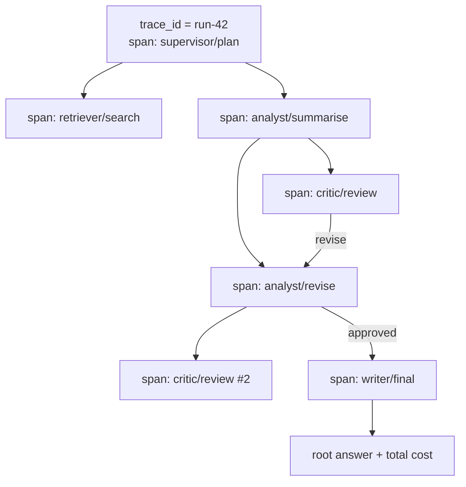

# Multi-Agent Observability and Evaluation

> **Interview answer (say this first).** In a multi-agent system, one user request produces many model calls across several agents, so a single log line tells you nothing. You make the run observable by giving the whole run one **trace** with a **correlation id**, giving each agent action its own **span** with a **parent span id**, and recording on every span the agent name, the delegation edge, the token counts, the cost, and the outcome. That parent-child structure is the **causal chain**: it answers "which agent did what, on whose behalf, and why." You attribute cost, latency, and errors **per agent** by rolling spans up by agent. You evaluate the system on more than task success: **coordination quality**, **redundancy** (duplicated work), **conflict rate** (disagreements between agents), and **loop counts**. You keep a **golden multi-agent trace** per scenario and compare new runs against it, and you classify every failure by cause and by the agent that owned it.

> **Note:**
>
> **Verified.** Every runnable example on this page was executed offline in plain Python (Python 3.14). No model calls were made. Cost and latency numbers are **illustrative** small decimals chosen to show the arithmetic, not vendor prices. Each `#` comment shows the value the code actually prints.

## Why this exists

A single-agent trace is easy: one loop, one sequence of tool calls, one answer. A multi-agent trace is a tree, and the tree is the only way to understand a run. Without it, four questions are unanswerable.

**"Which agent did what?"** The final answer is a string. It does not say that the retriever found three documents, the analyst merged them, the critic rejected the first draft, and the analyst revised. You need a span per action, attributed to the agent that took it.

**"Why did the run cost so much?"** One number on the invoice hides the cause. The cost might live in one verbose agent, in redundant workers doing the same job twice, or in a retry storm after a critic kept sending work back. Only a per-agent rollup can tell them apart.

**"Which agent failed?"** "The run failed" is not actionable. Was it the retriever timing out, the model producing a bad output, or the coordinator looping? Failures must be classified by cause and attributed to an owner.

**"Did coordination actually help?"** A multi-agent run can succeed while wasting effort: two workers solving the same subproblem, or a debate where nobody's position changed. Task success alone hides this. You need coordination metrics.

There is also a fairness problem. Blaming "the system" for every failure means nobody fixes anything. Attribution — this agent, this tool, this step — is what turns an incident into a ticket.

> **Note:**
>
> **The one-sentence purpose.** Multi-agent observability is a causal tree of spans plus per-agent attribution, and multi-agent evaluation is task success measured alongside coordination quality and waste.

## Start from zero

| Word | Plain meaning |
| --- | --- |
| **Trace** | The record of one whole run, from the first request to the final answer. |
| **Span** | One timed step inside a trace, such as one agent's one action. |
| **Root span** | The first span; every other span descends from it. |
| **Parent span id** | The id of the span that caused this one, which builds the tree. |
| **Span id** | A unique id for one span inside the trace. |
| **Trace id / run id** | A unique id for the whole run, shared by every span in it. |
| **Correlation id** | An id passed along a chain so all related events can be joined. |
| **Causal chain** | The parent-to-child path that shows what caused what. |
| **Message envelope** | The wrapper around an inter-agent message: sender, recipient, run id, turn, and payload. |
| **Attribute** | A key-value detail recorded on a span, such as `agent.name` or `tokens`. |
| **Per-agent span** | A span that represents one agent's action, not the whole system. |
| **Rollup** | Aggregating spans by a key, such as agent, to get totals. |
| **Attribution** | Assigning a cost, latency, or error to the agent that caused it. |
| **Critical path** | The longest chain of dependent spans; the true end-to-end latency floor. |
| **Task success** | Did the run produce the correct, accepted result? |
| **Coordination quality** | How well the agents' work combined: were handoffs used, was the plan followed? |
| **Redundancy** | The same work done more than once by different agents. |
| **Conflict rate** | How often agents disagreed and needed resolution. |
| **Loop count** | How many times a cycle or repeat occurred in a run. |
| **Golden trace** | An approved reference trace for a scenario, used to detect drift. |
| **Trace diff** | Comparing a new run's span sequence against the golden trace. |
| **Failure classification** | Putting each failure into a cause bucket: agent, tool, model, coordination, security, or cost. |
| **SLI / SLO** | A measured signal and the target you hold it to. |
| **Sampled judging** | Running an evaluator on a random subset of live traffic, not all of it. |
| **Online eval** | Judging quality on real traffic as it happens. |
| **Offline eval** | Judging on a fixed dataset before release. |
| **Redaction** | Removing secrets and personal data before storing a trace. |
| **High cardinality** | Attributes with many distinct values, such as a run id, useful for findings. |

Two distinctions matter most:

- **Trace vs log.** A log is a line of text. A trace is a tree of timed spans with parent links. Logs tell you *that* something happened; traces tell you *who caused it and how long it took*.
- **Task success vs coordination quality.** A run can succeed by luck while coordinating badly (wasted workers, ignored handoffs). A run can fail while coordinating well (clean handoffs, one downstream outage). Measure both, or you will "fix" the wrong thing.

## The core idea

Think of a **detective's evidence board**, with photographs pinned and string connecting them.

Each photograph is a **span**: one agent, one action, with a timestamp and a cost. The string is the **parent link**: the analyst's summarise span was caused by the supervisor's plan span. Follow the string and you reconstruct the story: who asked whom for what, and what came back. The **correlation id** is the case number that proves every photograph belongs to the same investigation.

The mental model is: **the run is one trace id and a tree of agent spans; causality lives in the parent links, and cost and blame roll up the tree.**



Read the tree top-down for the plan, bottom-up for attribution. The `critic/review #2` node is what shows a revision loop; without the tree you would only see two critic calls in a log and miss that they were a loop.

A second mental model is the **metric stack**: three layers, each answering a different question.

| Layer | Question | Example metric |
| --- | --- | --- |
| Task outcome | Did it work? | task success rate, cost per successful task |
| Coordination | Did the agents work together well? | handoff utilisation, redundancy rate, conflict rate, loop count |
| Per-agent | Which agent cost or broke this? | cost by agent, p95 latency by agent (the value 95% of calls finish within), errors by agent |

Task outcome tells you *whether* to investigate. Coordination tells you *whether the multi-agent design earned its keep*. Per-agent tells you *who to fix*. All three are needed; any one alone is a trap.

## How it works

1. **Start one trace per run and put the run id on everything.** Generate a `trace_id` at the entry point. Every span, message envelope, and log line carries it. This is what makes the run joinable.
2. **Create a child span for every agent action.** Not one span per agent, and not one span for the whole run: one span per action, with the acting agent's name. A supervisor that delegates five times produces at least five spans plus its own.
3. **Set the parent span id from the causal caller.** When the supervisor hands a task to a worker, the worker's span's parent is the supervisor's span. This is what turns a flat list into a causal chain.
4. **Wrap inter-agent messages in an envelope.** Sender, recipient, run id, turn number, and payload. The envelope is how you reconstruct the message flow and detect who talked to whom.
5. **Record the attributes that answer "why."** At minimum: `agent.name`, `agent.role`, `tool.name` or `action`, `model.name`, `prompt.version`, `tokens.input`, `tokens.output`, `cost.usd`, `outcome`, and `stop.reason` on stops.
6. **Roll spans up per agent.** Sum cost, count calls, and sum per-span latency into `busy_ms` (busy time, **not** end-to-end latency). For latency, report the p95 of the individual spans per agent. This is the attribution table, and it is where you find the expensive or slow agent.
7. **Compute the critical path, not just the sum.** Sequential spans add up; parallel spans must not be naively summed. The longest dependent chain is the real end-to-end latency.
8. **Classify each failure by cause and owner.** Buckets: `agent` (timeout, cancellation), `tool` (tool error), `model` (bad or malformed output), `coordination` (loop, deadlock, lost handoff), `security` (injection), `cost` (budget). Record both the bucket and the owning agent.
9. **Define coordination metrics explicitly.** Redundancy rate as `1 - distinct / produced`. Conflict rate as `disagreements / decisions`. Handoff utilisation as the fraction of handoffs whose result was used. Loop count per run.
10. **Keep golden traces per scenario.** Pick one representative input per scenario, run it end to end, approve the span sequence, and store it. Compare the sequence, not the text.
11. **Diff every canary run against the golden trace.** A canary is a small slice of live traffic sent to the new build before full rollout. A missing span, an extra loop, or a different agent taking a step is drift, even if the final answer looks fine.
12. **Redact at the source.** Strip secrets and personal data before the span leaves the process. Storing raw prompts is an observability decision and a breach surface at the same time.
13. **Sample and judge quality online.** Run an evaluator on a random sample of live runs; do not try to judge everything. Join the judgement back to the trace by run id.
14. **Alert on symptoms a user feels.** Task success rate, cost per successful task, p95 end-to-end latency, and loop rate. Per-agent breakage shows up as a coordination signal before it shows up in satisfaction.

## The syntax you will use

These are the real production forms. Read them once; later chapters use them.

**Spans with correlation ids and parent links.** A flat list becomes a tree via `parent_id`.

```python
SPANS = [
    {"span_id": "s1", "seq": 1, "parent_id": None, "agent": "supervisor",
     "action": "plan", "cost_usd": 0.02, "latency_ms": 300, "outcome": "ok"},
    {"span_id": "s2", "seq": 2, "parent_id": "s1", "agent": "retriever",
     "action": "search", "cost_usd": 0.01, "latency_ms": 120, "outcome": "ok"},
    {"span_id": "s3", "seq": 3, "parent_id": "s1", "agent": "analyst",
     "action": "summarise", "cost_usd": 0.05, "latency_ms": 900, "outcome": "ok"},
    {"span_id": "s4", "seq": 4, "parent_id": "s3", "agent": "critic",
     "action": "review", "cost_usd": 0.03, "latency_ms": 500, "outcome": "revise"},
    {"span_id": "s5", "seq": 5, "parent_id": "s3", "agent": "analyst",
     "action": "revise", "cost_usd": 0.04, "latency_ms": 700, "outcome": "ok"},
]
```

`seq` is the span's numeric start order in the run. Never sort spans by `span_id`: as a string, `"s10"` sorts before `"s2"`, which silently corrupts any ordered comparison.

**Build and walk the causal tree.** Group by parent, then print the path from the root.

```python
def build_tree(spans):
    by_id = {s["span_id"]: dict(s, children=[]) for s in spans}
    roots = []
    for s in by_id.values():
        parent = s.get("parent_id")
        if parent and parent in by_id:
            by_id[parent]["children"].append(s["span_id"])
        else:
            roots.append(s["span_id"])
    return by_id, roots
```

**A message envelope.** Every inter-agent message carries the envelope so the flow is reconstructable.

```python
def envelope(run_id: str, sender: str, recipient: str, turn: int, payload: dict) -> dict:
    return {"run_id": run_id, "sender": sender, "recipient": recipient,
            "turn": turn, "payload": payload}
```

**Roll spans up per agent.** The attribution table: calls, cost, and summed busy time by agent.

```python
def rollup_by_agent(spans):
    out = {}
    for s in spans:
        a = out.setdefault(s["agent"], {"calls": 0, "cost_usd": 0.0, "busy_ms": 0})
        a["calls"] += 1
        a["cost_usd"] += s["cost_usd"]
        a["busy_ms"] += s["latency_ms"]   # summed busy time, NOT end-to-end latency
    return {name: {"calls": v["calls"], "cost_usd": round(v["cost_usd"], 3),
                   "busy_ms": v["busy_ms"]}
            for name, v in out.items()}
```

**A deterministic correlation id.** Stable for the same run, agent, and turn, so events can be joined from anywhere.

```python
import hashlib

def correlation_id(run_id: str, agent: str, turn: int) -> str:
    material = f"{run_id}\x1f{agent}\x1f{turn}"
    return hashlib.sha256(material.encode()).hexdigest()[:16]
```

**The coordination metric functions.** Small, testable, and the same ones you put on a dashboard.

```python
def task_success(completed, attempted):
    return round(completed / attempted, 3) if attempted else 0.0

def redundancy_rate(produced, distinct):
    return round(1 - distinct / produced, 3) if produced else 0.0

def conflict_rate(disagreements, decisions):
    return round(disagreements / decisions, 3) if decisions else 0.0

def loop_rate(looped_traces, traces):
    return round(looped_traces / traces, 3) if traces else 0.0
```

**Classify failures by cause, then attribute by agent.** Two passes over the same records.

```python
CAUSES = {
    "timeout": "agent", "tool_error": "tool", "bad_output": "model",
    "loop": "coordination", "deadlock": "coordination",
    "injection": "security", "budget": "cost",
}

def classify_failures(records):
    counts = {}
    for r in records:
        cause = CAUSES.get(r["cause"], "unknown")
        counts[cause] = counts.get(cause, 0) + 1
    return counts
```

**A golden-trace diff.** Compare the ordered `(agent, action)` signature, not the text. Sort by the numeric `seq`, never by `span_id` as a string.

```python
def trace_signature(spans):
    return [(s["agent"], s["action"]) for s in sorted(spans, key=lambda s: s["seq"])]

def diff_trace(golden, actual):
    diffs = []
    for i, (g, a) in enumerate(zip(golden, actual)):
        if g != a:
            diffs.append((i, g, a))
    if len(golden) != len(actual):
        diffs.append(("length", len(golden), len(actual)))
    return diffs
```

## Examples: simple to real

**Example 1 — reading the causal chain.** Verified output:

```text
roots: ['s1']
s3 children: ['s4', 's5']

causal tree:
supervisor/plan
  retriever/search
  analyst/summarise
    critic/review
    analyst/revise
```

The tree answers "which agent did what" in four lines. It also shows the critic's review and the analyst's revision are children of the same summarise span — that is the revision loop, visible only because the parent links are recorded.

**Example 2 — per-agent attribution.** Verified output:

```text
rollup: {'supervisor': {'calls': 1, 'cost_usd': 0.02, 'busy_ms': 300}, 'retriever': {'calls': 1, 'cost_usd': 0.01, 'busy_ms': 120}, 'analyst': {'calls': 2, 'cost_usd': 0.09, 'busy_ms': 1600}, 'critic': {'calls': 1, 'cost_usd': 0.03, 'busy_ms': 500}}
total cost: 0.15
```

The analyst is 60% of the cost (0.09 of 0.15) and 63.5% of the summed busy time (1,600 of 2,520 ms), because it ran twice. The retriever is cheap and fast. If the invoice looked high, the analyst's revise loop is where to look first. **Rollups turn one number into a suspect list.**

**Example 3 — correlation id is stable and joinable.** Verified output:

```text
corr: 3798839bcd7b871f
stable: True
```

The same run, agent, and turn always produce the same id, so events from different services can be joined without a shared counter. The 16-character truncation keeps the id readable in logs while staying collision-resistant for a single run.

**Example 4 — coordination metrics.** Verified output:

```text
success: 0.88
redundancy: 0.3
conflict: 0.15
loop rate: 0.04
```

The task success rate is 88%, which looks fine. But redundancy of 30% says nearly a third of produced artefacts were duplicates, the conflict rate is 15%, and 4% of traces looped. A 88% success rate with 30% wasted work is a system that passes while burning money; the coordination metrics are what surface that.

**Example 5 — failure classification and attribution.** Verified output:

```text
classified: {'agent': 1, 'model': 1, 'coordination': 1, 'tool': 1, 'security': 1}
by agent: {'retriever': 1, 'analyst': 2, 'writer': 1, 'critic': 1}
```

Two views of the same five failures. By cause, they are spread across five buckets. By owner, the analyst owns two. Cause tells you the *kind* of problem (a model-quality issue versus a coordination issue); owner tells you *who fixes it*. You need both or the ticket goes to the wrong team.

**Example 6 — golden trace diff and critical path.** Verified output:

```text
golden: [('supervisor', 'plan'), ('retriever', 'search'), ('analyst', 'summarise'), ('critic', 'review'), ('analyst', 'revise')]
diff: []
sum latency: 2520
critical path: 1900
```

The live run matches the golden signature exactly, so no drift is flagged. The latency numbers show why the critical path matters: summing every span gives 2,520 ms, but two spans run on branches the critical path does not take — the retriever's 120 ms and the critic's 500 ms review — so the true dependent chain (plan → summarise → revise) is 1,900 ms. **Sum of spans overstates latency whenever agents run in parallel; the critical path is the number your users feel.**

## In production

- **One trace id per run, and one span per agent action.** A span for the whole run hides which agent was slow; a span per agent hides which action was slow. The unit is the action.
- **Causality lives in the parent link.** Pass the caller's span id to every child, including across a message queue. Without it you have a bag of spans, not a tree.
- **Wrap every inter-agent message in an envelope.** Sender, recipient, run id, turn, payload. This is how you detect lost handoffs and who-talked-to-whom patterns.
- **Attribute cost per agent, and alert on the top spender.** Cost per successful task is the SLI; the per-agent breakdown is the diagnostic. A single agent silently doubling its call count is a common regression.
- **Do not sum latency across parallel spans.** Compute the critical path from the parent tree. Summed latency is a misleading metric that makes parallel systems look slow and sequential ones look fast.
- **Measure coordination, not just success.** Redundancy, conflict rate, handoff utilisation, and loop count are the metrics that tell you whether the extra agents earned their keep. A successful run with high redundancy is still a design failure.
- **Classify every failure by cause and owner.** "The run failed" is not a ticket. "The critic produced a malformed verdict; owner: critic prompt" is. Keep the taxonomy small and stable.
- **Keep golden traces per scenario and diff them in CI.** Compare the span sequence, not the generated text. A change in which agent ran, or an extra revision loop, is drift worth catching before users do.
- **Sample online judging and join it to the trace.** You cannot judge every run affordably. Judge a random sample, store the verdict under the run id, and slice by agent and prompt version.
- **Redact secrets and PII at the source.** Trace attributes are the most tempting place to dump a raw prompt. Strip credentials and personal data before the span leaves the process, and set a retention limit.
- **High cardinality is the point, and the cost.** Run id, tenant, and prompt version are high-cardinality attributes; they make new questions answerable. Budget for the storage and cardinality limits that follow.
- **Watch loop counts and stop reasons as leading indicators.** A rising loop rate, or more "no progress" stops, predicts quality and cost incidents before task success moves.

> **The senior move.** When asked how you would debug a multi-agent run, describe the trace tree, the parent links, the per-agent rollup, and the failure classification — in that order. It shows you have actually operated one.

## Interview questions

### 1. How do you trace a request that fans out across several agents?

**Answer.** One trace id for the whole run, and one span per agent action. Each span records its parent span id, so the flat list of spans reconstructs into a tree. Every inter-agent message carries a message envelope with the run id and turn number. The trace id is what joins spans and logs; the parent links are what show causality. You end up able to ask both "what happened in this run" and "which agent caused this step."

**Follow-up: "How does the trace id survive across a message queue or a separate service?"** You propagate it in the message envelope and read it back when the message is consumed. The consumer creates a child span with the producer's span id as parent. Any hop that drops the envelope breaks the causal chain, so propagation is part of the contract.

**Trap.** Emitting a span for the whole run only. That tells you the run took 4 seconds and nothing about which of six agents consumed them.

### 2. How do you attribute cost and latency per agent?

**Answer.** Record `cost.usd` and latency on every span, then roll up by the `agent.name` attribute to get calls, total cost, and p95 latency per agent. For latency, do not sum the raw spans if agents ran in parallel — compute the critical path through the parent tree, which is the longest dependent chain. The per-agent cost rollup is the diagnostic; cost per successful task is the headline SLI.

**Follow-up: "What if two agents share one model call?"** Attribute the call to the agent that initiated it and record the shared call in the envelope. If you must split it, split by measured token share, not evenly — even splits hide which agent actually used the tokens.

**Trap.** Summing latency across parallel spans. It inflates the total and points at the wrong agent.

### 3. What is a golden trace and what does it catch?

**Answer.** A golden trace is an approved reference run for one representative input. You store the ordered sequence of `(agent, action)` spans. In CI or a canary, you run the same input and diff the new sequence against the golden one. It catches drift: a step that moved to a different agent, a missing handoff, an extra revision loop, or a new retry — even when the final answer still looks acceptable.

**Follow-up: "What about non-deterministic agents?"** Compare the structural signature, not the exact text or the exact turn count. A tolerance band on turn count plus an exact check on the agent sequence works better than requiring an identical transcript.

**Trap.** Diffing the final answer text only. Reordering tasks within a turn often produces the same words.

### 4. What coordination metrics would you put on the dashboard?

**Answer.** Four, alongside task success: redundancy rate (`1 - distinct / produced`) for wasted duplicate work, conflict rate (`disagreements / decisions`) for how often agents needed resolution, handoff utilisation (the share of handoffs whose result was used), and loop count per run. Add cost per successful task and p95 end-to-end latency. Together they tell you whether the multi-agent design is earning its overhead.

**Follow-up: "What is a healthy redundancy rate?"** Near zero for a well-partitioned design. Some redundancy is deliberate — independent reviewers should overlap a little — so set the target per pattern, not globally.

**Trap.** Putting only task success on the dashboard. A system can succeed while wasting 30% of its work, and success rate will never show it.

### 5. How do you classify failures across agents?

**Answer.** Two dimensions: cause and owner. Cause buckets are `agent` (timeout or cancellation), `tool` (tool error), `model` (bad or malformed output), `coordination` (loop, deadlock, lost handoff), `security` (injection), and `cost` (budget). Owner is the agent whose span failed. Classify each failed span, then roll up by both. The cause routes the fix; the owner names the team.

**Follow-up: "A loop involves two agents. Who owns it?"** The coordinator that failed to cap the loop, not the two agents trapped in it. Coordination failures belong to the orchestration layer, which is exactly why that layer owns the caps and detectors.

**Trap.** Blaming the last agent to act. The final failing span is often downstream of a bad handoff, so always walk the causal chain upward before assigning blame.

### 6. How do you evaluate a multi-agent system, not just its final answer?

**Answer.** Three layers. Task outcome: did the run produce the accepted result, at what cost per success. Coordination: redundancy, conflict rate, handoff utilisation, loop counts. Per-agent: cost, latency, and error rate by agent. You evaluate offline on a fixed dataset and online on a sampled share of traffic, joining each judgement back to the trace by run id. The three layers together distinguish a good answer produced efficiently from a good answer produced by accident.

**Follow-up: "How do you evaluate coordination objectively?"** Use structural signals from the trace: did each delegation produce a used result, did any two agents produce the same artefact, did the supervisor's plan match the executed spans. These are countable from spans and do not need a model judge.

**Trap.** Judging only the final answer with a model. It rewards a lucky, wasteful run and cannot tell you that two workers duplicated each other.

### 7. What would you put on every span, and what must never be on a span?

**Answer.** Put `run_id`, `span_id`, `parent_id`, `agent.name`, `agent.role`, `action`, `model.name`, `prompt.version`, token counts, `cost.usd`, `outcome`, and `stop.reason`. Prompt version and model version are what make a bad run reproducible. Never put credentials, API keys, or raw personal data on a span; redact at the source before the span leaves the process, and apply a retention limit.

**Follow-up: "How do you debug a quality regression without raw prompts?"** Store a hash of the prompt and a reference to a versioned prompt template, plus the input and output token counts and any structured tool arguments. You can reproduce the configuration and often the failure without storing the raw text.

**Trap.** Logging full prompts "for debugging" and forgetting them. The trace store becomes a data breach waiting to happen, and it grows cost linearly with traffic.

### 8. A multi-agent run is slow but every model call is fast. Where do you look?

**Answer.** Start from the trace tree, not the model dashboard. Look for the critical path: if the slow time is a chain of handoffs, the latency is serial coordination, and you can parallelise independent workers. If the spans are short but the gaps between them are long, you are waiting on queues, locks, or a blocked agent — possibly a deadlock or a livelock. Check loop counts and rounds per run. Fast calls plus a slow run almost always means waiting, not thinking.

**Follow-up: "How do you tell a deadlock from ordinary slowness?"** Deadlock means spans stop being created — the trace stops growing while the run is active. Ordinary slowness keeps producing spans. A stalled trace with active agents is the deadlock signature.

**Trap.** Scaling up the model or the hardware. If the time is spent waiting on coordination, more capacity adds cost without reducing latency.

## Remember this

- **One trace id per run, one span per agent action, causality in the parent link.** The tree is the only complete record of a multi-agent run.
- **Attribute cost, latency, and errors per agent; compute latency on the critical path, not the sum.** Parallel spans must not be added.
- **Evaluate on three layers: task outcome, coordination quality, and per-agent health.** Success alone hides wasted work.
- **Classify failures by cause and owner, and walk the causal chain upward before blaming the last agent.** Loops belong to the coordinator.
- **Keep golden traces and diff the agent sequence, not the text.** Drift shows up structurally before it shows up in quality.
