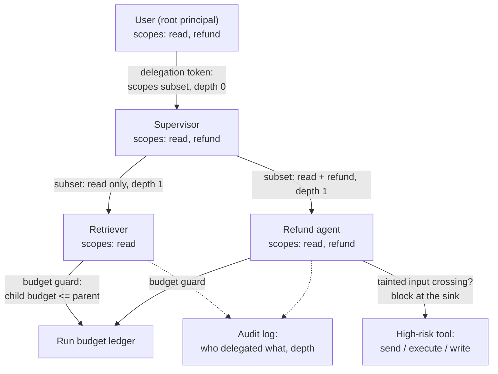

# Multi-Agent Security and Cost Control

> **Interview answer (say this first).** Multi-agent security is about **trust between agents**. Every delegation is a request from one principal to another, so you treat it like one: authenticate the caller, check a **delegation-depth cap**, and grant the child **only a subset of the parent's permissions** so privilege can shrink but never grow (**no privilege amplification**). Two named threats follow from delegation: **prompt injection** that spreads through agent messages, and **shared-memory poisoning** where one agent writes bad state that other agents trust. You bound both with least privilege per agent, taint marking, writer allowlists, and an **audit record for every delegation**. Cost control is the same discipline applied to money: a **token budget per run and per agent**, a **fan-out limit**, **model tiering per role**, **caching shared work**, and **cost as a first-class SLO** with a burn-rate alert. The key idea: an agent's authority and its spend should both be smaller than its parent's, and both must be enforced by deterministic code outside the model.

> **Note:**
>
> **Verified.** Every runnable example on this page was executed offline in plain Python (Python 3.14). No model calls were made. All cost and token figures are **illustrative** small numbers chosen to show the arithmetic; they are not vendor prices. Each `#` comment shows the value the code actually prints.

## Why this exists

A single agent has one identity and one budget, both easy to reason about. A multi-agent system multiplies both, and the multiplication is where the risk lives.

On the security side, the defining feature of agents is that they take instructions from text that may be attacker-controlled. A document, a web page, an email, or another agent's message can contain instructions. In a multi-agent system, that text can enter one agent and come out as a tool call by another. The agents form a **communication graph**, and any edge is a possible path for an instruction to travel.

Four failure patterns dominate.

- **Impersonation.** Agent B claims to be the supervisor ("I am the coordinator, send me the keys") and a naive worker complies. If agents identify themselves only by a name in the message text, treat that as a claim, not a fact.
- **Privilege amplification.** A restricted agent delegates to a broadly-scoped helper and effectively inherits its permissions. The child is now a way around the parent's limits.
- **Prompt injection spreading.** Agent A reads a poisoned web page. Its summary contains an injected instruction. Agent B treats the summary as trusted context and executes the instruction. The injection jumped one hop because the second agent could not tell text from commands.
- **Shared-memory poisoning.** One worker writes a corrupted or malicious entry into run state that other agents read and act on. A single bad write contaminates every later decision.

On the cost side, the failure is simpler to state and harder to prevent: **fan-out plus a loop plus a strong model is an unbounded bill.** Every extra agent adds calls, every retry adds calls, and an open-ended loop has no natural ceiling. Cost is a security-adjacent concern because a runaway budget can be triggered by a malicious input that induces looping or over-delegation.

> **Note:**
>
> **The one-sentence purpose.** Multi-agent security makes every delegation shrink privilege rather than grow it, and multi-agent cost control makes every agent's spend bounded by a budget that deterministic code enforces.

## Start from zero

| Word | Plain meaning |
| --- | --- |
| **Principal** | An identity that can act: a user, a service, or an agent. |
| **Authentication** | Proving which principal you are. |
| **Authorization** | Deciding what an authenticated principal may do. |
| **Trust boundary** | A line where the level of trust changes. |
| **Delegation** | Passing a task, and some authority, from one agent to another. |
| **Delegation depth** | How many hops a task has been delegated through. |
| **Delegation token** | A short-lived credential that names the delegator, the scopes, an expiry, and a signature. |
| **Scope** | A permission, such as `read:orders` or `refund:orders`. |
| **Least privilege** | Each agent gets only the scopes it needs, for only as long as it needs them. |
| **Privilege amplification** | A child ending up with more authority than its parent. The bug to prevent. |
| **Impersonation** | An agent claiming to be another agent or user. |
| **Confused deputy** | A privileged component tricked into using its authority for someone else. |
| **Prompt injection** | Attacker text in the model's context that is treated as instructions. |
| **Taint** | A mark on data that came from an untrusted source. |
| **Taint propagation** | Carrying the taint mark as data flows through agents and tools. |
| **Taint sink** | A dangerous action, such as send, execute, or write, where tainted data must be stopped. |
| **Shared memory** | State that several agents can read and write. |
| **Shared-memory poisoning** | Writing false or malicious data into shared state that others trust. |
| **Writer allowlist** | The explicit set of agents permitted to write a piece of shared state. |
| **Optimistic concurrency** | Writing only if the version you read is still current. |
| **Audit log** | An append-only record of who did what, when, and under what authority. |
| **Non-repudiation** | Evidence strong enough that an actor cannot credibly deny an action. |
| **Token budget** | A maximum number of model tokens for a run or an agent. |
| **Cost budget** | A maximum amount of money for a run or an agent. |
| **Fan-out limit** | A maximum number of workers started from one task. |
| **Model tiering** | Choosing model size by role: cheap for routing, strong for judgement. |
| **Shared-work caching** | Reusing one agent's result so others do not repeat the work. |
| **Burn rate** | How fast you are spending relative to the budget over a time window. |
| **SLO** | A target for a service level indicator, such as cost per successful task. |
| **Kill switch** | A global control that stops spend immediately. |

Three distinctions matter most:

- **Trust vs safety.** Security protects the system from attackers and mistakes; safety protects the world from the system's outputs. Injection is a security problem. A harmful refund is a safety problem. Different controls.
- **Authentication vs authorization.** A message that proves it came from the supervisor still does not earn every permission. Identity and authority are separate checks.
- **Budget vs quota.** A budget is a spending ceiling you enforce inside the run. A quota is a usage limit per tenant or key. You need both; a run budget does not stop one tenant from exhausting the platform.

## The core idea

Think about **power of attorney**.

A person can grant a lawyer the authority to sign for them, but the grant is written down, scoped ("only for this property"), time-limited, and revocable. Critically, the lawyer cannot use the power of attorney to grant someone else *more* authority than they hold. Delegation flows authority **downward and narrower**, never upward and wider.

That is exactly how agent delegation should work.

- The user is the root principal.
- The supervisor receives a scoped, short-lived credential from the user's session.
- Each worker receives a **subset** of the supervisor's scopes, in a delegation token that names the supervisor, the scopes, and an expiry.
- The depth is capped, so delegation cannot recurse forever.
- Every grant is written to an audit log.

The mental model is: **authority and budget are both cones that narrow as they go down the agent tree; every hop shrinks both.**



The two guards to notice are the **depth cap** and the **budget narrowing**. A child's scopes must be a subset of the parent's, and a child's budget must not exceed the parent's remaining budget. Both checks are one line of deterministic code, and both are easy to forget.

A second mental model is the **cost funnel**. The same cone shape applies to money:

| Layer | Control | Question it answers |
| --- | --- | --- |
| Platform | Daily quota, kill switch | Is total spend safe? |
| Tenant | Per-tenant monthly quota | Is one tenant burning the pool? |
| Run | Per-run cost budget | Can this task run away? |
| Agent | Per-agent token and cost budget | Can one agent dominate? |
| Call | Per-call token ceiling | Can one call be enormous? |

Any layer missing is the layer where the blow-up happens.

## How it works

1. **Draw the trust graph first.** Nodes are users and agents; edges are delegations and messages. Mark which edges carry untrusted content. Controls live on edges, not inside agents.
2. **Authenticate each delegation.** A delegation carries a signed token naming the delegator, the scopes, and an expiry. Treat an agent's self-declared name in a message as a claim, not proof.
3. **Cap the delegation depth.** A maximum number of hops from the root. Depth caps bound recursion, fan-out by recursion, and the reach of an injected instruction.
4. **Narrow the scopes at every hop.** The child's scopes must be a subset of the parent's. Compute the grant as the intersection of requested and parent scopes, so a request for more silently yields less.
5. **Give each agent its own identity and least privilege.** The retriever gets read; only the refund agent gets refund; the writer cannot call payment tools. Narrow identities bound the blast radius of a compromised agent.
6. **Enforce authorization in deterministic code, not in the model.** Before a tool runs, check the caller's token against the tool's required scope. The model never decides whether it is allowed.
7. **Mark untrusted data and block it at sinks.** Carry a taint flag as content flows between agents. At a dangerous sink — send, execute, write — refuse to act on tainted input without additional confirmation.
8. **Protect shared memory.** Only approved writers may write, and writes use optimistic concurrency so a stale read cannot clobber a newer value. Validate shared entries against a schema before they are trusted.
9. **Log every delegation and every privileged action.** Who delegated to whom, with which scopes, at what depth, and which tool ran. Append-only, with the run id for correlation.
10. **Set budgets at every level.** A per-call token ceiling, a per-agent token and cost budget, a per-run cost budget, and a per-tenant quota. Enforce them before each call, not after the invoice.
11. **Limit fan-out explicitly.** Maximum width per fan-out and maximum total agents per run, both capped further by the remaining budget. A budget-derived cap is often the real limit.
12. **Tier models by role.** A router does not need the largest model; a final reviewer often does. Choosing the tier per role is the largest single cost lever in most systems.
13. **Cache shared work.** If the retriever's result is needed by three agents, fetch once and share it. Key the cache by content and tenant so caches never cross tenants.
14. **Treat cost as an SLO.** Track cost per successful task, alert on projected burn rate, and keep a global kill switch. A cost spike caused by a loop is an incident, not a billing surprise.

> **Note:**
>
> **What these controls do and do not guarantee.** Depth caps and scope narrowing limit what a compromised agent can reach; they do not make prompt injection impossible. Taint marking catches flows you explicitly model; it does not catch every clever phrasing. State the guarantee honestly: these controls shrink and detect, they do not eliminate.

## The syntax you will use

These are the real production forms. Read them once; later chapters use them.

**Check delegation depth and budget before granting.** A child may not exceed its parent on either axis.

```python
def may_delegate(depth: int, max_depth: int, parent_budget_usd: float,
                 child_budget_usd: float) -> tuple[bool, str]:
    if depth >= max_depth:
        return False, "max_delegation_depth"
    if child_budget_usd > parent_budget_usd:
        return False, "child_budget_exceeds_parent"
    return True, "ok"
```

**Narrow scopes at every hop.** The grant is the intersection, so a request for more is silently reduced.

```python
def delegate_scopes(parent_scopes: set[str], requested: set[str]) -> set[str]:
    return requested & parent_scopes
```

**A delegation token.** Names the delegator, the scopes, the depth, and an expiry, and carries an HMAC signature over the payload. Sign it and verify both the signature and the expiry; never trust a bare name.

```python
import hashlib
import hmac
import json
import time

TOKEN_KEY = b"illustrative-key"   # load from a secret store; never hard-code in production

def _sign(payload: dict) -> str:
    body = json.dumps(payload, sort_keys=True).encode()
    return hmac.new(TOKEN_KEY, body, hashlib.sha256).hexdigest()

def delegation_token(delegator: str, delegatee: str, scopes: set[str],
                     depth: int, ttl_s: int = 300) -> dict:
    token = {"delegator": delegator, "delegatee": delegatee,
             "scopes": sorted(scopes), "depth": depth,
             "expires_at": int(time.time()) + ttl_s}
    token["sig"] = _sign(token)
    return token

def verify_token(token: dict, now: int | None = None) -> tuple[bool, str]:
    now = int(time.time()) if now is None else now
    payload = {k: v for k, v in token.items() if k != "sig"}
    if not hmac.compare_digest(token.get("sig", ""), _sign(payload)):
        return False, "bad_signature"
    if now >= token["expires_at"]:
        return False, "expired"
    return True, "ok"
```

**A per-agent and per-run budget ledger.** Both checks run before every call.

```python
class BudgetLedger:
    def __init__(self, run_limit_usd: float, agent_limit_usd: float) -> None:
        self.run_limit = run_limit_usd
        self.agent_limit = agent_limit_usd
        self.spent: dict[str, float] = {}
        self.run_spent = 0.0

    def can_spend(self, agent: str, amount_usd: float) -> tuple[bool, str]:
        if self.run_spent + amount_usd > self.run_limit:
            return False, "run_budget"
        if self.spent.get(agent, 0.0) + amount_usd > self.agent_limit:
            return False, "agent_budget"
        return True, "ok"

    def charge(self, agent: str, amount_usd: float) -> None:
        self.spent[agent] = self.spent.get(agent, 0.0) + amount_usd
        self.run_spent += amount_usd
```

**Model tiering per role.** Choose the tier from the role, with illustrative relative costs.

```python
MODEL_TIER = {"router": "small", "worker": "medium", "critic": "large"}
# illustrative relative cost per 1k tokens, not a vendor price
TIER_COST = {"small": 0.0002, "medium": 0.001, "large": 0.005}
```

**Taint propagation to a sink.** Reading untrusted data starts the taint; it propagates through every downstream step and is cleared only by an explicit declassifier.

```python
TAINT_CLEAR = "clear"
TAINT_TAINTED = "tainted"
DECLASSIFY_ACTIONS = {"declassify", "redact"}   # explicit, reviewed ways to drop the mark

def propagate_taint(source_taint: str, action: str) -> str:
    if source_taint != TAINT_TAINTED:
        return TAINT_CLEAR
    if action in DECLASSIFY_ACTIONS:
        return TAINT_CLEAR
    return TAINT_TAINTED
```

**Shared memory with a per-key writer allowlist and optimistic concurrency.** Each key has its own allowlist and version, so one bad write cannot silently poison the run.

```python
class SharedMemory:
    def __init__(self, writers_by_key: dict[str, set[str]]) -> None:
        self.writers_by_key = writers_by_key
        self.values: dict[str, tuple[str, int]] = {}   # key -> (value, version)

    def read(self, key: str) -> tuple[str | None, int]:
        value, version = self.values.get(key, (None, 0))
        return value, version

    def write(self, key: str, agent: str, value: str,
              base_version: int) -> tuple[bool, str]:
        if agent not in self.writers_by_key.get(key, set()):
            return False, "not_an_approved_writer"
        _value, version = self.values.get(key, (None, 0))
        if base_version != version:
            return False, "stale_version_conflict"
        version += 1
        self.values[key] = (value, version)
        return True, f"written_v{version}"
```

**An audit record for each delegation.** Append-only and correlated by run id.

```python
def audit_record(run_id: str, parent: str, child: str, scopes: set[str],
                 depth: int) -> dict:
    return {"run": run_id, "from": parent, "to": child,
            "scopes": sorted(scopes), "depth": depth}
```

**Detect a cost blow-up with a burn rate.** Projected spend, not raw spend, is the signal.

```python
def burn_rate(spent_usd: float, elapsed_s: float, budget_usd: float,
              window_s: float) -> float:
    if elapsed_s <= 0:
        return 0.0
    projected = spent_usd / elapsed_s * window_s
    return round(projected / budget_usd, 2)
```

## Examples: simple to real

**Example 1 — delegation depth and budget guard.** Verified output:

```text
(True, 'ok')
(False, 'max_delegation_depth')
(False, 'child_budget_exceeds_parent')
```

The first delegation at depth 0 under a cap of 3 is allowed. The second is at the cap, so it is refused. The third asks for a $2 child budget out of a $1 parent, so it is refused. **Depth and budget are the two axes of a delegation; both must pass.**

**Example 2 — privilege narrowing prevents amplification.** Verified output:

```text
child a: ['read:orders', 'refund:orders']
child b: ['read:orders']
no amplification: True
```

When the child requests exactly the parent's scopes, it gets them. When it requests `delete:orders`, which the parent lacks, the intersection drops it. The "no amplification" check confirms the child's scopes are always a subset. This is one line of set intersection, and it is the single most important security control in a delegation chain.

**Example 3 — per-agent and per-run budget enforcement.** Verified output:

```text
analyst $0.30: True (ok) spent=0.30
analyst $0.20: False (agent_budget) spent=0.30
writer $0.30: True (ok) spent=0.60
writer $0.30: False (agent_budget) spent=0.60
```

Each agent has a $0.40 cap inside a $1.00 run cap. The analyst's second call is refused by the *agent* budget even though the run has room; the writer hits the same wall. The distinctions matter in production: an agent-budget stop means one agent is misbehaving, a run-budget stop means the whole task must degrade or escalate.

**Example 4 — model tiering by role changes the bill.** Verified output:

```text
tiered cost: 0.0164
all-large cost: 0.05
```

Five calls at 2,000 tokens each. Tiering the router small, the workers medium, and the critic large costs 0.0164; putting all five on the large model costs 0.05, roughly three times as much. The numbers are illustrative, but the shape is real: **most calls in a multi-agent run do not need the strongest model.**

**Example 5 — caching shared work and detecting a burn.** Verified output:

```text
saved: 0.12
no cache: 0.0

burn a: 12.0
burn b: 27.0
burn c: 0.6
```

The first pair shows 0.12 saved when five agents share four lookups at a 60% hit rate and an illustrative $0.01 per lookup; without caching, nothing is saved. The second group shows burn rates: spending 0.20 of a 1.00 budget in the first minute of an hour-long window projects to 12x the budget; 0.45 in the same minute projects to 27x. Case c spends 0.10 over ten minutes, projecting to 0.6x — healthy. **A burn rate is a projection; it catches the runaway in the first minute, not on the invoice.**

**Example 6 — taint tracking and shared-memory protection.** Verified output:

```text
tainted read: tainted
read then execute: tainted
tainted summarise: tainted
declassify: clear
execute clear: clear

(False, 'not_an_approved_writer')
(True, 'written_v1')
(False, 'stale_version_conflict')
```

The taint checks show that reading untrusted data keeps the mark, so it propagates through later steps including execution and summarising; only an explicit declassify (here a reviewed `redact`) clears it, and clean input stays clean. The memory checks show a non-approved worker refused, an approved supervisor write accepted, and a stale-version write rejected. **Propagate by default, declassify explicitly, allowlist the writer, version the value** — four cheap controls against poisoning and spread.

## In production

- **Treat an agent's name as a claim until a token proves it.** Identity in message text is attacker-controlled. Signed, short-lived delegation tokens with the delegator, scopes, and expiry are what make impersonation detectable.
- **Never let a child exceed its parent, and give every agent its own least-privilege identity.** Scope narrowing prevents privilege amplification; budget narrowing prevents an expensive child from draining the run. The retriever should not hold refund rights, so narrow identities make a compromised agent a small incident. Check both axes at the delegation boundary.
- **Cap delegation depth explicitly, and say what it buys.** It bounds recursion, fan-out-by-recursion, and how far one injected instruction can travel. It does not make injection impossible; it limits reach.
- **Authorize in code, not in the model.** The model proposes a tool call; deterministic policy checks the caller's token against the tool's required scope. A model that can talk itself into permissions is not a control.
- **Taint what you can, and be honest about the gaps.** Taint marking catches flows you model. It will miss a paraphrase that carries the same instruction. Use it to gate sinks, and pair it with output checks and confirmation for high-risk actions.
- **Protect shared memory with a writer allowlist and a version check.** One unauthorized write or one stale overwrite can poison every later decision. Validate shared entries against a schema before trusting them.
- **Audit every delegation and privileged action, append-only.** Record run id, delegator, delegatee, scopes, depth, and tool. Without it you cannot answer "who authorized this?" after an incident.
- **Set budgets at four levels: call, agent, run, and tenant.** Each catches a different runaway. The call ceiling stops one enormous call; the tenant quota stops one tenant draining the platform.
- **Enforce budgets inside the loop, before the call.** A gateway sees one call at a time; only the loop knows the running total. A check after the call is a budget you have already broken.
- **Cap fan-out by the budget, not by ambition.** `min(requested, max_width, budget // cost_per_worker)` is the honest limit. A "thorough" supervisor that ignores it is a cost incident waiting to start.
- **Tier models by role and watch the misroute.** Cheap for routing and extraction, strong for judgement and final review. Measure how often the router sends a hard task to the cheap tier; that error is a quality SLI, not just a cost trick.
- **Alert on projected burn, and keep a kill switch.** A burn-rate alert fires in the first minutes of a runaway loop. The kill switch is the last line when the alert is not enough.

> **The honest summary.** These controls shrink and detect; they do not eliminate. Say so in a design review, and name the residual risk you are accepting.

## Interview questions

### 1. How do you secure delegation between agents?

**Answer.** Treat each delegation as a request from one principal to another. Authenticate the delegator with a signed, short-lived token that names the delegator, the scopes, and an expiry. Check a delegation-depth cap. Narrow the scopes to a subset of the parent's using an intersection, so a child can never hold more authority than its parent. Check that the child's budget does not exceed the parent's remaining budget. Log every grant. The principle is that authority and spend both flow downward and narrower.

**Follow-up: "What stops an agent from just asking for more scopes?"** The intersection does. The child receives `requested & parent_scopes`, so a request for a scope the parent lacks yields nothing extra. The grant logic is deterministic and runs outside the model.

**Trap.** Trusting a delegation because the message says it came from the supervisor. Identity claimed in text is not authentication, and in an agent system that text may be attacker-controlled.

### 2. What is privilege amplification, and how does it happen?

**Answer.** Privilege amplification is a child agent ending up with more authority than its parent, which turns a restricted agent into a path around its own limits. It happens when a delegation forwards the delegator's credentials unchanged, when a helper runs under a broad service account, or when the child can request arbitrary scopes. The fix is scope narrowing at every hop and a rule that a child's scopes are always a subset of the parent's.

**Follow-up: "Why is a broad service account so dangerous for an agent?"** Because the model can be manipulated by text, so a broad service account turns a prompt injection into privilege escalation. The injected instruction runs with the service account's rights. A narrow, per-agent identity bounds what any single injection can do.

**Trap.** Assuming that because the *user* is restricted, the agents are too. Agents often run under their own credentials, which may be far broader than the user's.

### 3. How does prompt injection spread between agents, and how do you limit it?

**Answer.** One agent reads untrusted content — a page, an email, a document — and its output, still containing the attacker's instruction, is passed to another agent as context. The second agent cannot tell instruction from data, so it may act on it. You limit the spread by marking untrusted data as tainted and carrying that mark through the flow, blocking dangerous sinks (send, execute, write) when the input is tainted, isolating agents that handle untrusted content, and requiring confirmation for high-risk actions. You cannot stop every injection with these, so you also shrink the permissions so an injected action has little it can do.

**Follow-up: "Is taint tracking sufficient?"** No. It catches flows you explicitly model and misses rephrasings. It reduces reach and gives you detection; it does not make the system injection-proof. Say that plainly.

**Trap.** Trusting an agent's summary because it is "another agent." A summary of untrusted content is still untrusted content.

### 4. What is the confused-deputy problem for agents?

**Answer.** A confused deputy is a component with real privileges tricked into using them for someone who lacks those privileges. For agents: a worker without access to a payment tool convinces the supervisor, which holds the scope, to call it on the worker's behalf. The defense is the same as for any deputy: authorize against the *original user's* identity, not the requesting agent's word, and require that a delegation grant only what the ultimate principal holds. The deputy does not act just because a caller asked.

**Follow-up: "How does that differ from privilege amplification?"** Amplification is structural — a child literally holds more scopes. Confused deputy is behavioral — the deputy's scopes are correct, but it is persuaded to use them for the wrong purpose. You need both scope narrowing and per-request authorization.

**Trap.** Checking permission only at the entry point. A request that enters legitimately can be redirected later; re-check at the tool boundary.

### 5. How do you protect shared memory from poisoning?

**Answer.** Treat shared state as a shared resource with access control. Only an explicit writer allowlist may write to a given key. Writes use optimistic concurrency: you may write only if the version you read is still current, which prevents a stale read from clobbering newer data. Validate entries against a schema before other agents trust them, and never let one agent write free-form instructions another agent will follow. Log who wrote what.

**Follow-up: "What if a legitimate writer is compromised?"** Then the allowlist limits the blast radius to that writer's keys, and the schema limits what it can express. That is why you combine controls: least privilege on the writer, a schema on the value, and an audit trail.

**Trap.** Letting every agent write the shared plan. If any agent can rewrite the plan, any poisoned agent can redirect the whole run.

### 6. How do you put a budget on a multi-agent run?

**Answer.** Budgets at four levels: a per-call token ceiling, a per-agent token and cost budget, a per-run cost budget, and a per-tenant quota. Enforce them inside the loop before each call, because only the loop knows the running total. Add a global daily kill switch. Track cost per successful task rather than cost per call, because failures consume tokens too. Alert on projected burn rate so a runaway is caught in minutes, not at the invoice.

**Follow-up: "An agent-budget stop fires while the run still has budget. What does that mean?"** One agent is consuming more than its share — often a loop or an over-broad prompt. The run should degrade or escalate, and the agent's role and prompt should be reviewed. It is a design signal, not just a stop.

**Trap.** Enforcing the budget only at the gateway. The gateway sees one call; the runaway lives across many calls, so only the run loop can stop it.

### 7. How does fan-out control interact with cost and security?

**Answer.** Fan-out is a resource decision with a security edge. A width cap and a total-agent cap bound capacity; a budget-derived cap (`remaining_budget // cost_per_worker`) is usually the binding limit. From a security angle, fan-out also multiplies the number of agents that can act on untrusted input, so the same cap limits how many chances an injection gets. Depth caps bound recursive fan-out, which is the case that explodes fastest.

**Follow-up: "Why is a budget-derived cap often the real one?"** Because a supervisor's requested width is an intention, not a constraint. The budget is a fact. Taking the minimum of desire, width, and money gives you a number that cannot overrun the run.

**Trap.** Capping width but not depth. A binary tree of depth 10 has over a thousand leaves; a width cap alone does not stop recursive explosion.

### 8. How do you balance security and cost against latency and quality?

**Answer.** Name the trade explicitly, then choose with numbers. Stricter taint checks and extra authorization add latency and can reject valid requests. Model tiering cuts cost but raises the misroute rate, which is a quality risk. Shared-work caching cuts cost but can serve stale results. You resolve it by measuring cost per successful task, tracking the router's misroute rate as a quality SLI, and setting explicit thresholds. Then you review the four together, because a security control that triples latency is a net loss.

**Follow-up: "Where would you start?"** With per-run and per-agent budgets and the scope-narrowing rule, because they stop the catastrophic cases cheaply. Fancier controls come after the cheap ones are in place and measured.

**Trap.** Treating security and cost as separate teams' problems. Both act on the same delegation tree, and a single injected loop can be both a breach and a budget incident.

## Remember this

- **Authority and budget both narrow down the agent tree.** A child's scopes and budget must be subsets of its parent's; check both at every delegation.
- **Authenticate delegation with a token, not a name in the text.** Claims are not credentials, especially when the text may be attacker-controlled.
- **Least privilege per agent bounds the blast radius of injection; it does not eliminate injection.** Say the guarantee honestly.
- **Mark tainted data, allowlist shared-memory writers, and version every write.** Three cheap controls against poisoning and spread.
- **Cost is a first-class SLO: budget at call, agent, run, and tenant, alert on projected burn, and measure cost per successful task.** Enforce inside the loop, not at the invoice.
