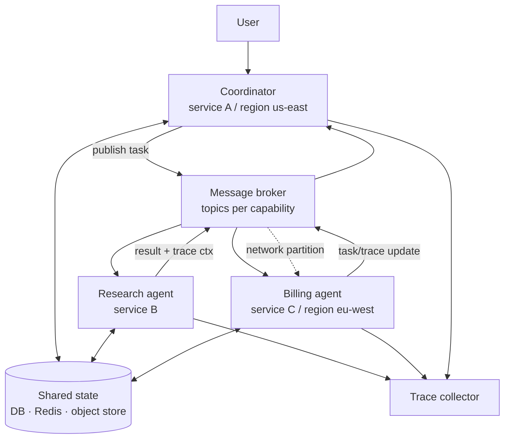

# Distributed Multi-Agent Systems

> **Interview answer (say this first).** A distributed multi-agent system runs its agents as separate processes or services on different machines, and they talk over a network through a message broker. The moment agents leave one process, the network becomes a failure surface: messages can be lost, duplicated, delayed, reordered, or blocked by a partition. The design rules are therefore about the network, not the agents — at-least-once delivery plus idempotent effects, per-key ordering instead of global ordering, distributed state with a defined consistency model, fencing tokens for stale writers, and one trace context carried across every hop. You distribute because you need independent scaling, fault isolation, different resource profiles, or geography — and you pay for it with partial failure, which must be designed for explicitly.

## Why this exists

One process can host a supervisor and a few agents. It cannot host all of them for long. The reasons to leave one process are real:

- **Different resources.** A browser agent needs session memory. A code agent needs a sandbox. An LLM agent needs provider rate-limit headroom. One machine cannot be sized for all three at once.
- **Independent scaling.** The research fleet may need ten times the workers of the writer fleet. Distributed, each pool scales on its own queue depth.
- **Fault isolation.** A sandbox crash must not take down the coordinator. Separate processes and containers contain the blast radius.
- **Ownership.** One team owns billing, another owns compliance. Each team deploys its own agent on its own schedule.
- **Geography.** Users in Europe and Asia want the agent near them for latency and data residency.

Each of those wins adds a network between agents. The network is not a function call. A local call either returns or raises. A remote call may return late, return twice, return after you gave up, or never return while the peer is still working. Messages can also arrive reordered, or a partition can leave two halves each believing the other is down. That is **partial failure**: one part of the system is broken while the rest keeps running, and no component has a global view.

A distributed multi-agent design treats all of that as normal and answers it with explicit mechanisms instead of hope.

> **The one-sentence purpose.** Distribute agents for scale and isolation, then pay for it by making every message idempotent, every ordering explicit, every state's consistency a decision, and every hop traceable.

## Start from zero

| Word | Plain meaning |
| --- | --- |
| **Service** | A deployable unit that exposes an interface to other services. |
| **Agent** | A service or process that runs an agent loop and acts on its own. |
| **Broker** | Middleware that accepts messages from producers and delivers them to consumers (Kafka, RabbitMQ, SQS, Redis Streams). |
| **Queue** | A named list where each message goes to one consumer. |
| **Publish/subscribe** | One producer, many independent subscribers, each getting a copy. |
| **Message envelope** | The metadata wrapped around a payload: ids, timestamps, trace context, retry count. |
| **Correlation id** | An id that ties a request and all its follow-up messages into one logical operation. |
| **Causation id** | The id of the message that caused this one; it builds the causal chain. |
| **Idempotency key** | A stable key that makes a repeated effect run only once. |
| **At-least-once delivery** | A message is never lost but may be duplicated. |
| **Exactly-once effect** | The *effect* happens once, built from at-least-once delivery plus dedupe. The transport is not magical; the effect is. |
| **Ordering** | Whether messages arrive in the order they were sent. Global order is expensive; per-key order is cheap. |
| **Partition key** | The key that selects which shard a message goes to; all messages with one key keep their order. |
| **Consistency model** | The rule for when a reader sees another writer's update (strong, eventual, read-your-writes). |
| **Eventual consistency** | Replicas converge over time; a read may be momentarily stale. |
| **Distributed state** | State shared across processes: a database, a Redis instance, an object store, a log. |
| **Partial failure** | Some components fail while others run; there is no single "everything is down." |
| **Network partition** | The network splits; each side can reach some peers but not others. |
| **Split brain** | Two sides each believe they are the leader and both accept writes. |
| **Quorum** | A majority of replicas that must agree before a read or write is accepted; the minority side refuses so state cannot fork. |
| **Fencing token** | A monotonically increasing number attached to a lease; stale writers are rejected. |
| **Distributed trace** | A tree of spans, one per hop, joined by a shared trace id. |
| **Trace context** | The trace id and parent span id passed to the next hop. |
| **Clock skew** | Different machines' clocks disagree; timestamps are not a global order. |
| **Saga** | A long transaction built from local steps plus compensating actions. |
| **Transactional outbox** | Write the state change and the outgoing message in one local transaction, then publish. |

Two distinctions decide most designs:

- **At-least-once is the practical default.** At-most-once loses work; true exactly-once delivery costs too much. Build at-least-once delivery and make the *effect* exactly-once with an idempotency key.
- **Ordering is per key, not global.** A total order across all agents needs a single bottleneck. Per-agent or per-conversation order is what agent logic usually needs, and it scales.

## The core idea

Think of a company with offices in several cities. Each office keeps its own records and sends instructions by courier. Couriers are fast but unreliable: a parcel can be lost, two copies can arrive, or an urgent letter can overtake a routine one. So the company uses **reference numbers**, writes a **receipt** when an instruction is carried out, and keeps a **central register** of what has already happened. If a duplicate instruction arrives, the receiving office checks the register and does nothing.

An agent is an office. The broker is the courier service. The correlation id is the reference number on the file. The idempotency key is the receipt that stops double execution. The shared store is the central register. The trace id is a paper trail stapled to every parcel so you can reconstruct the whole journey after an incident.



The dashed line is the point. When a partition isolates `eu-west`, the coordinator can still read and write shared state and still talk to `research`, but it cannot reach `billing`. The system must decide whether to wait, fail, or route elsewhere — and it must never assume `billing` did nothing just because no reply arrived.

| You want | Mechanism | What it costs |
| --- | --- | --- |
| No lost work | At-least-once delivery + retry | Duplicates, so effects must be idempotent |
| No duplicate effects | Idempotency key + dedupe store | A shared store and a retention window |
| In-order per agent | Partition key = agent or conversation id | No global order; hotspots on a busy key |
| Debug across hops | One trace id in every message | Every service must propagate the context |
| Survive a lost node | Replicated state, lease + fencing token | Write latency and coordination |

## How it works

1. **Split the system into services by capability.** A coordinator, one or more specialist agents, and shared infrastructure (broker, state store, trace collector). Each service is independently deployable and independently scalable.
2. **Give every service a queue or topic.** The coordinator publishes work; agents consume it. No service calls another's private database. The broker absorbs bursts and decouples availability: if an agent is down, the message waits.
3. **Wrap every message in an envelope.** Carry `message_id`, `correlation_id`, `causation_id`, `idempotency_key`, `retry_count`, a timestamp, and the trace context. The envelope is the contract; the payload is business data.
4. **Deliver at least once and make effects idempotent.** A consumer acks only after the effect is committed. A redelivered message finds its idempotency key in the dedupe store and skips the effect. Exactly-once is an effect property, not a transport promise.
5. **Choose an ordering key.** Route all messages for one agent or one conversation to the same partition. Within a partition, order is preserved; across partitions it is not. Global ordering is a single-writer bottleneck and rarely needed.
6. **Put shared state in a replicated store with a named consistency model.** Agents read and write a database, cache, or object store. Decide whether reads are strongly consistent (see the latest write) or eventually consistent (may be stale). For agent memory, a vector store is usually eventually consistent on purpose.
7. **Design for partial failure with timeouts, retries, and circuit breakers.** Every remote call needs a deadline. Retries use exponential backoff with jitter. A circuit breaker stops calling a failing peer so the failure does not cascade.
8. **Fence stale writers after a lease expires.** When a lease is reassigned, the new holder gets a higher token. A paused old holder that wakes up cannot overwrite the new holder's state, because its token is stale.
9. **Make multi-step work a saga, not a distributed transaction.** Each step is local and committed; failures run compensating actions. A duplicate step is safe because every step is idempotent.
10. **Publish side effects through a transactional outbox.** Write the state change and the outgoing message in one local transaction, then a relay publishes it. This avoids the classic "state committed, message lost" gap.
11. **Carry one trace context end to end.** Each service creates a child span, tags it with the agent's identity, and passes the context on the next message. The collector assembles the tree from the shared trace id.
12. **React to partitions explicitly.** With a quorum store, the minority side refuses writes rather than forking state. With a queue, messages queue until the peer returns. Either way, define the behavior instead of discovering it during an incident.

> **Warning.** A network timeout is not a failure signal — it is an unknown signal. The peer may have completed the work and lost the reply. Every retry must therefore be safe, which means every effect needs an idempotency key before you retry the first time.

## The syntax you will use

**A message envelope.** Every field exists for a failure mode.

```python
from dataclasses import dataclass, field

@dataclass
class Envelope:
    message_id: str
    correlation_id: str          # ties a whole operation together
    causation_id: str            # the message that caused this one
    idempotency_key: str         # makes the effect run once
    partition_key: str           # keeps one agent's messages ordered
    trace_id: str                # one trace across every hop
    parent_span_id: str | None = None
    retry_count: int = 0
    payload: dict = field(default_factory=dict)
```

The envelope is the transport contract. Agents read the routing and tracing fields and treat only `payload` as business data.

**An idempotency guard around an effect.** Check the key and write the receipt in one atomic step, so two concurrent deliveries cannot both pass.

```python
def apply_once(store, key: str, effect) -> str:
    if not store.record_if_absent(key):   # atomic check-and-record; False = already applied
        return "duplicate"
    effect()
    return "applied"
```

`record_if_absent` is a single compare-and-set: it records the receipt only if the key is absent, so two concurrent deliveries cannot both pass the check. Commit the receipt and the effect in the same transaction — or release the claim if the effect fails — because a crash between a separate record and the work either loses the effect or lets a duplicate through.

**Per-key ordering through a partitioner.** All messages for one agent hash to the same partition.

```python
import zlib

def partition_for(key: str, partitions: int) -> int:
    return zlib.crc32(key.encode()) % partitions   # stable hash; same key, same shard
```

Use a real hash, not `sum(ord(c))`, which collides on anagrams (`stop` and `pots` land on the same shard). Real brokers use their own hasher — Kafka defaults to murmur2 — so match the broker's partitioner when your choice must agree with its shard assignment.

Choose the ordering key to match the unit that must be ordered: one conversation, one agent, one user.

**Trace context propagation.** Each hop creates a child span and passes the trace id onward.

```python
def child_span(tracer, parent: Span, name, **tags):
    span = tracer.start(name, parent, **tags)   # same trace_id as the parent
    return span
```

Without propagation the collector sees a pile of unrelated spans, not a trace.

**A fencing token on a lease.** The store rejects a write from a holder whose token is stale.

```python
def write(store, worker: str, token: int, value: str) -> str:
    if token != store.token:
        return f"{worker}: rejected, stale token {token} < {store.token}"
    store.value = value
    return f"{worker}: wrote {value}"
```

Fencing turns "two leaders for a moment" into "the stale leader's writes bounce."

## Examples: simple to real

**Example 1 — at-least-once delivery plus an idempotent effect.** The broker delivers the same message twice, but the agent charges the customer once.

```python
from dataclasses import dataclass

@dataclass
class Message:
    msg_id: str
    agent: str
    seq: int
    effect_key: str

class Agent:
    def __init__(self, name: str) -> None:
        self.name = name
        self.seen: set[str] = set()
        self.effects: list[str] = []

    def handle(self, msg: Message) -> str:
        if msg.effect_key in self.seen:
            return f"{msg.msg_id}: duplicate -> skipped"
        self.seen.add(msg.effect_key)
        self.effects.append(f"charge:{msg.effect_key}")
        return f"{msg.msg_id}: applied once"

agent = Agent("billing")
for m in [Message("m1", "billing", 1, "order-A-100"),
          Message("m1", "billing", 1, "order-A-100")]:
    print(agent.handle(m))
print("effects:", agent.effects)
```

Verified output:

```text
m1: applied once
m1: duplicate -> skipped
effects: ['charge:order-A-100']
```

The transport delivered twice; the effect happened once. That is what "exactly-once" means in practice.

**Example 2 — per-key ordering survives distribution.** Two agents interleave on the broker, but each agent's own events stay in order because they share a partition.

```python
import zlib
from dataclasses import dataclass

@dataclass
class Event:
    agent: str
    seq: int
    kind: str

def partition(key: str, n: int) -> int:
    return zlib.crc32(key.encode()) % n

class PartitionedLog:
    def __init__(self, n: int = 3) -> None:
        self.n = n
        self.parts: dict[int, list[Event]] = {i: [] for i in range(n)}

    def append(self, e: Event) -> None:
        self.parts[partition(e.agent, self.n)].append(e)

    def read(self) -> list[Event]:
        out: list[Event] = []
        for i in sorted(self.parts):
            out.extend(self.parts[i])      # per partition, order preserved
        return out

log = PartitionedLog()
for e in [Event("agent-x", 1, "start"), Event("agent-y", 1, "start"),
          Event("agent-x", 2, "think"), Event("agent-y", 2, "think"),
          Event("agent-x", 3, "done"),  Event("agent-y", 3, "done")]:
    log.append(e)

print("global read order:", [(e.agent, e.seq) for e in log.read()])
for key in ("agent-x", "agent-y"):
    seqs = [e.seq for e in log.read() if e.agent == key]
    print(f"{key} order preserved:", seqs == sorted(seqs), seqs)
```

Verified output:

```text
global read order: [('agent-x', 1), ('agent-x', 2), ('agent-x', 3), ('agent-y', 1), ('agent-y', 2), ('agent-y', 3)]
agent-x order preserved: True [1, 2, 3]
agent-y order preserved: True [1, 2, 3]
```

The global order differs from the send order — the read groups all of `agent-x` before `agent-y`, so `agent-x`'s third event appears before `agent-y`'s first. That is fine, because the system promised per-agent order, not global order. If your agent logic needs a global order, you have a single-writer bottleneck.

**Example 3 — one trace across three agents.** Each hop is a child span; the collector reconstructs the tree from the shared trace id.

```python
from dataclasses import dataclass, field

@dataclass
class Span:
    trace_id: str
    span_id: str
    name: str
    parent_id: str | None = None
    tags: dict = field(default_factory=dict)

class Tracer:
    def __init__(self, trace_id: str) -> None:
        self.trace_id = trace_id
        self.spans: list[Span] = []
        self._n = 0

    def start(self, name: str, parent: Span | None = None, **tags) -> Span:
        self._n += 1
        span = Span(self.trace_id, f"s{self._n}", name,
                    parent.span_id if parent else None, tags)
        self.spans.append(span)
        return span

tracer = Tracer("trace-9")
coord = tracer.start("coordinator", agent="coordinator")
tracer.start("agent_a", coord, agent="a", host="us-east")
b = tracer.start("agent_b", coord, agent="b", host="eu-west", handoff_from="a")
tracer.start("tool:refund", b, tool="refund")
for s in tracer.spans:
    print(f"{s.span_id} {s.name} parent={s.parent_id} {s.tags}")
ids = {s.span_id for s in tracer.spans}
parents = {s.parent_id for s in tracer.spans if s.parent_id}
print("every parent id exists:", parents <= ids)
```

Verified output:

```text
s1 coordinator parent=None {'agent': 'coordinator'}
s2 agent_a parent=s1 {'agent': 'a', 'host': 'us-east'}
s3 agent_b parent=s1 {'agent': 'b', 'host': 'eu-west', 'handoff_from': 'a'}
s4 tool:refund parent=s3 {'tool': 'refund'}
every parent id exists: True
```

`handoff_from: a` is the edge that makes this a multi-agent trace rather than three unrelated calls. Without the trace id in the envelope, the three services' logs cannot be joined.

**Example 4 — a fencing token stops a stale writer.** Worker 1 stalls, its lease expires, worker 2 takes over, then worker 1 wakes up and tries to write.

```python
class LeaseStore:
    def __init__(self) -> None:
        self.token = 0
        self.holder: str | None = None

    def acquire(self, worker: str) -> int:
        self.token += 1
        self.holder = worker
        return self.token

    def write(self, worker: str, token: int, value: str) -> str:
        if token != self.token:
            return f"{worker}: REJECTED (stale token {token} < {self.token})"
        return f"{worker}: wrote {value} with token {token}"

store = LeaseStore()
old = store.acquire("worker-1")     # worker-1 pauses, e.g. a long GC pause
new = store.acquire("worker-2")     # lease expires, worker-2 takes over
print(store.write("worker-2", new, "state=v2"))
print(store.write("worker-1", old, "state=v1"))
```

Verified output:

```text
worker-2: wrote state=v2 with token 2
worker-1: REJECTED (stale token 1 < 2)
```

Without fencing, worker 1's late write would silently overwrite the newer state. This is the mechanism that keeps a network partition from becoming permanent data corruption.

## In production

- **At-least-once delivery is the default; make effects idempotent.** Kafka, SQS, and RabbitMQ can all redeliver. The idempotency key plus a durable receipt is the only thing that prevents a duplicate charge, email, or ticket.
- **Claim the idempotency key and commit the effect in one atomic step.** A compare-and-set such as `record_if_absent` makes the check and the record a single operation. A crash between a record written before the work loses the effect; a crash between the work and the receipt duplicates it. Use one transaction, or release the claim if the effect fails.
- **Pick the ordering key from the unit that must be ordered.** Per-conversation or per-agent order is usually enough. Global order needs a single writer and becomes the bottleneck you distributed to escape.
- **Timeouts must be shorter than the caller's patience and longer than the peer's p99.** Too short creates duplicate work; too long hides a dead peer. Retry with exponential backoff and full jitter, and cap the attempts.
- **Retries are a load multiplier.** In an outage, every retry adds traffic to an already-struggling peer. Use a circuit breaker to stop retries entirely when the peer is clearly down, and a dead-letter queue for work that will never succeed.
- **State consistency is a product decision.** Eventual consistency means a user may read stale memory for a moment. Decide which reads must be strongly consistent (balances, permissions) and which can lag (search, summaries).
- **Never use wall-clock timestamps as a global order.** Clocks skew between machines. Use the broker's offset, a logical sequence number, or a version from the state store when order matters.
- **Fence every lease.** A lease without a fencing token lets a paused holder corrupt state after its lease expired. The token is cheap; the corruption is not.
- **Multi-step agent work is a saga.** You cannot hold a distributed transaction across a model call. Make each step local, idempotent, and compensatable, and track the saga state in shared storage.
- **Propagate the trace context in the message envelope, not in the payload.** Every service, including tool calls and sub-agents, creates a child span. If even one hop drops it, the trace is broken.
- **A partition is not a crash.** The isolated side may still be serving users. Decide whether the minority side fails reads, fails writes, or serves stale data, and make that behavior explicit and alertable.
- **The broker is now a critical dependency.** Persist it, replicate it, monitor its consumer lag, and plan for the day it is unavailable. An agent fleet with no broker is a fleet with no work.

## Interview questions

### 1. Why distribute agents at all instead of running them in one process?

**Answer.** Because agents need different resources, different scaling, and independent failure domains. A browser agent needs session memory, a code agent needs a sandbox, and each fleet scales on its own queue depth. Separate services also let different teams deploy independently and let you place agents near users. You accept the network as the cost.

**Follow-up: "What is the cost exactly?"** Partial failure and coordination. Calls can be lost, duplicated, or reordered, and no single component sees the whole system state. Every mechanism on this page exists to make that survivable.

**Trap.** Distributing for its own sake. A single process with good structure is simpler, faster, and has no network failure modes. Distribute only when a concrete constraint forces it.

### 2. Why is exactly-once delivery a myth, and what do you do instead?

**Answer.** Guaranteeing a message is delivered exactly one time requires the sender and receiver to agree atomically across a network that can fail between the send and the acknowledgement. In practice you get at-least-once, which duplicates, or at-most-once, which loses. So you build at-least-once delivery and make the *effect* exactly-once with an idempotency key and a durable dedupe record.

**Follow-up: "Where is the dedupe record?"** In shared, durable storage — a database, Redis with persistence, or the same transaction as the effect. An in-process set dies with the process and lets the duplicate through.

**Trap.** Confusing transport guarantees with effect guarantees. "Kafka is exactly-once" refers to a specific transactional scope, not to your downstream email.

### 3. How do you keep agent messages ordered?

**Answer.** You order per key, not globally. Choose the ordering key — one conversation, one agent, one user — and route every message with that key to the same partition or the same single consumer. Within that key, order is preserved. Across keys, it is not, and that is usually fine. A global order needs one writer and loses the parallelism you distributed for.

**Follow-up: "What if two messages for the same key arrive out of order anyway?"** Add a sequence number in the envelope and have the consumer reject or buffer stale messages. Brokers preserve per-partition order, but a producer retry can still reorder if it is not careful.

**Trap.** Assuming wall-clock timestamps order events. Clock skew across machines makes timestamps unreliable; use broker offsets or logical sequence numbers.

### 4. What is partial failure and how does it change your design?

**Answer.** Partial failure means some components fail while others keep running, so no component knows the true global state. It changes everything: a timeout is unknown, not failed; a health check may be stale; the other side may be working on the request you just retried. You design with timeouts, retries, circuit breakers, idempotent effects, and explicit handling for "I do not know."

**Follow-up: "Give an agent-specific partial failure."** A sub-agent completes a tool call, then the network drops before it sends the result. The coordinator retries. Without an idempotency key, the tool runs twice.

**Trap.** Treating a timeout as a failure and retrying a non-idempotent operation. That is how a transient blip becomes a duplicate charge.

### 5. How do you handle a network partition?

**Answer.** Decide your behavior with a consistency model. A quorum-based store makes the minority side refuse writes, so state does not fork. A queue holds messages until the peer returns. For agent fleets you often choose availability on the edge and consistency on the shared state: agents keep serving reads, but writes to shared state require a quorum. Whatever you choose, alert on the partition and test it.

**Follow-up: "What is split brain?"** Two sides each believe they are the active leader and both accept writes, producing divergent state. Leases with fencing tokens and quorum writes prevent it.

**Trap.** Assuming a partition is a clean "one side is down." Both sides may be fully up, serving users, and disagreeing about the world.

### 6. How do you share agent memory across machines?

**Answer.** Put it in a replicated store with a named consistency model. Session and working memory often live in Redis for speed; long-term and semantic memory live in a database or vector store; large artifacts live in object storage. The store is the source of truth, and the agent process is stateless or holds only a cache. Decide which reads must be strongly consistent and which can be eventually consistent.

**Follow-up: "Why not give each agent its own memory?"** Then no agent can see another's findings, and a failed agent loses everything. Shared state is what makes a fleet act like one system, at the cost of a network dependency and a consistency choice.

**Trap.** Reading from an eventually consistent replica immediately after a write and acting on stale data. Use read-your-writes for anything a user just changed.

### 7. How do you trace a request that crosses several agents?

**Answer.** Carry a trace context — a trace id and a parent span id — in every message envelope. Each service starts a child span, tags it with its agent identity and host, and passes the context on the next message. A collector assembles the spans into one tree by trace id. This is the only way to see the causal path when a request touches three services and two regions.

**Follow-up: "What breaks tracing?"** A hop that drops the context, a message that is not instrumented, and async work that outlives the request. Enforce propagation in the shared message-envelope library so no producer can forget.

**Trap.** Putting trace ids in logs only and not in the message envelope. Then the next service cannot continue the trace, and you have disconnected fragments.

### 8. Walk through designing a distributed refund flow across billing and compliance agents.

**Answer.** The coordinator assigns a correlation id and an idempotency key, and publishes to the billing agent's queue with a per-conversation partition key. Billing checks the dedupe store, applies the refund, writes an outbox message, and replies with the trace context. The coordinator calls compliance via another queue, with a deadline and a circuit breaker. If compliance is in an isolated region, the saga pauses and retries; if it fails permanently, the coordinator runs a compensating action. State lives in a replicated store, the trace spans every hop, and every step is idempotent so a redelivery is harmless.

**Follow-up: "Where does the human fit?"** At an approval gate between steps. Pause the saga, checkpoint it, surface the pending action to a person, and resume with a decision — knowing the resume may itself be retried.

**Trap.** Treating the flow as a distributed transaction. You cannot lock across a model call. Use a saga with local transactions and compensations.

## Remember this

- **Distribution adds a network, and the network fails partially.** Lost, duplicated, reordered, and delayed are normal, not exceptional.
- **At-least-once delivery plus idempotent effects equals exactly-once results.** The transport is not magic; the effect is.
- **Order per key, not globally.** Pick the ordering key that matches the unit that must be ordered and let everything else interleave.
- **Shared state needs a named consistency model, and leases need fencing tokens.** Stale writers must be rejected, not trusted.
- **One trace context travels with every hop.** Without it, a multi-agent incident is unobservable.
