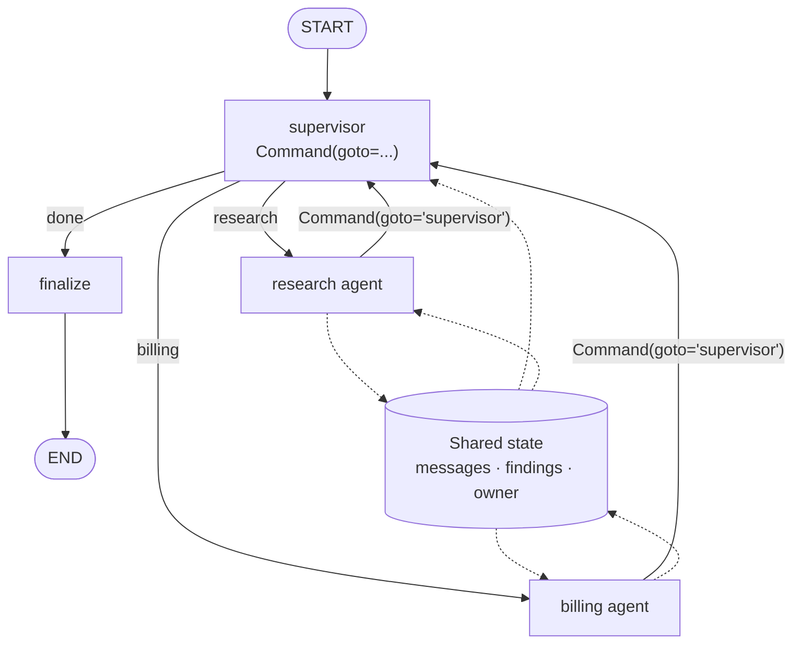

# LangGraph Multi-Agent Patterns

> **Interview answer (say this first).** In LangGraph you express a multi-agent system as one graph whose nodes are agents. They share a typed graph state, and each node returns partial updates that merge through reducers. A **supervisor** is a node that routes work to agent nodes, usually by returning `Command(goto="agent_name")`; a **swarm** lets agents hand control to each other directly, typically with handoff tools or `Command(goto=...)`. Each agent can also be its own compiled **subgraph**, which keeps its state namespaced while shared keys propagate. Because the graph is checkpointed by thread, a multi-agent run is resumable across agents, can pause for human approval between agents with `interrupt`, and can stream per-agent updates. Verified against **langgraph 1.2.11**, plus `langgraph-supervisor 0.0.31` and `langgraph-swarm 0.1.0` for the helper APIs.

## Why this exists

A multi-agent system in plain Python is a pile of loops and function calls. You pass the shared context around by hand, decide who runs next inside each agent, and lose the ability to pause, resume, or draw the system. LangGraph gives the system a structure:

- **State and routing are explicit.** One typed dict is the shared clipboard, and edges and routers say who runs next, so the control flow is inspectable and drawable.
- **Parallelism and recovery are built in.** Reducers merge concurrent writes, and a checkpointer saves the state after every superstep so the run resumes after a crash.
- **Humans and observation fit naturally.** An `interrupt` pauses between agents, and streaming shows which agent wrote what — the only way to debug a system whose failure is "the agents disagreed."

This matters for agentic AI because real multi-agent systems are long-running and stateful, and a graph gives them durability and per-agent visibility instead of leaving you to build both around a collection of loops.

## Start from zero

| Word | Plain meaning |
| --- | --- |
| **Multi-agent graph** | One LangGraph graph whose nodes are agents (or subgraphs) rather than plain steps. |
| **Shared state** | A typed dict every agent reads and writes; the system's common memory. |
| **Reducer** | A function that merges a new value into a state key; without one, last-write-wins. |
| **`add_messages`** | The reducer for chat history: append and deduplicate by message id. |
| **Supervisor** | A node that decides which agent runs next and routes to it. |
| **Handoff** | Transferring control from one agent to another. |
| **Swarm** | A topology where agents hand control to each other directly, with no central supervisor. |
| **`Command`** | A return value that updates state and chooses the next node; fields `update`, `goto`, `resume`, `graph`. |
| **`Command.PARENT`** | The value for `graph` that routes from inside a subgraph to a node in the parent graph. |
| **Subgraph** | A compiled graph used as a node inside another graph. |
| **Superstep** | One round of graph execution: the active nodes run, then their updates merge through reducers before the next round starts. |
| **Checkpointer** | An object that saves state after each superstep, keyed by `thread_id`. |
| **`thread_id`** | The key that groups checkpoints into one resumable run. |
| **`interrupt`** | A pause inside a node that surfaces a payload; resumed with `Command(resume=...)`. |
| **`subgraphs=True`** | A stream option that also yields updates from inside subgraphs, with namespaces. |

Two distinctions matter:

- **Supervisor vs swarm** is *centralised vs decentralised control*. A supervisor owns routing and is easier to reason about; a swarm lets agents hand off directly and is more flexible but easier to loop.
- **Shared vs private state** is *common memory vs agent-local scratch*. Shared state coordinates the team; private subgraph state keeps one agent's intermediate work out of everyone else's context.

## The core idea

Think of an **office**. Every employee reads and writes on one shared whiteboard — the graph state. In a **supervisor** office, a manager reads the board, decides who should act, and calls that person. In a **swarm** office, whoever is handling the case walks it to the next expert and says "you take it from here." Both offices keep one case file; the difference is who chooses the next person.



The supervisor is a node like any other. Its "decision" is just a return value of `Command(goto=...)`. That is why the same machinery can express centralized and decentralized control: the difference is only who emits the `goto`.

| Pattern | Who routes | Typical mechanism | Strength | Risk |
| --- | --- | --- | --- | --- |
| Supervisor | One manager node | `Command(goto=...)` to agents | Easy to reason about, one place to add policy | Supervisor becomes a bottleneck and a single point of context |
| Swarm / handoff | The current agent | Handoff tools or `Command(goto=...)` | Natural, low latency between experts | Harder to bound; handoff loops |
| Pipeline | Fixed edges | `add_edge(a, b)` | Simple, predictable | No dynamic choice |

## How it works

1. **Define one shared state schema.** A `TypedDict` with the keys every agent reads: usually `messages`, plus task-specific fields like `findings`, `owner`, or `next`.
2. **Attach reducers where agents may write in parallel.** `Annotated[list, operator.add]` appends; `add_messages` appends and deduplicates chat messages. A key with no reducer is last-write-wins, and two parallel writes to it raise `InvalidUpdateError`.
3. **Add each agent as a node.** A node is a function (sync or async) that reads state and returns a partial update. An agent node can wrap a model call, a tool loop, or a whole compiled subgraph.
4. **Choose a routing style.** Fixed edges for a pipeline; conditional edges whose router returns a node name; or `Command(goto=...)` for dynamic, state-aware routing.
5. **Add a supervisor node for centralized control.** The supervisor inspects state and returns `Command(goto="agent", update={...})`. Each agent returns `Command(goto="supervisor")` when it is done, so control comes back.
6. **Use handoff for decentralized control.** An agent returns `Command(goto="other_agent")` directly, or calls a handoff tool the framework turns into that routing. Keep a hop counter to stop loops.
7. **Give each agent its own subgraph for isolation.** Compile an agent's internal graph and add it with `add_node("agent", compiled_sub)`. Shared keys propagate; keys only the subgraph defines stay private.
8. **Hand off across subgraph boundaries with `Command.PARENT`.** Inside a subgraph, `Command(goto="sibling", graph=Command.PARENT)` routes to a node in the parent graph.
9. **Compile with a checkpointer and use a `thread_id`.** Every superstep is saved. The multi-agent run resumes from the last checkpoint instead of restarting all agents.
10. **Pause between agents with `interrupt`.** A supervisor or gate node calls `interrupt(payload)`, the run stops, and the caller resumes with `Command(resume=value)`. The interrupted node replays from its top, so put side effects after the interrupt.
11. **Stream per agent.** `stream_mode="updates"` yields each node's write as it happens; add `subgraphs=True` to also see updates inside agent subgraphs, tagged with a namespace.
12. **Bound the system.** Track hops or turns in state, cap total steps, and route to a finalize node when the budget is exhausted. Multi-agent loops must have an explicit exit.

> **Note:** The helper packages are optional. `langgraph-supervisor` provides `create_supervisor(agents, model=...)`, and `langgraph-swarm` provides `create_swarm(agents, default_active_agent=...)` plus `create_handoff_tool(agent_name=...)` and `add_active_agent_router(...)`. They generate the same primitives shown below — a supervisor node, `Command(goto=...)`, and handoff tools. Learn the primitives first so you can debug what the helpers generate.

## The syntax you will use

**Shared state with reducers.** The team's whiteboard. A key with a reducer merges; a key without one replaces.

```python
import operator
from typing import Annotated, TypedDict
from langgraph.graph.message import add_messages

class TeamState(TypedDict):
    messages: Annotated[list, add_messages]      # shared conversation
    findings: Annotated[list[str], operator.add] # parallel-safe notes
    owner: str                                    # last-write-wins
```

**A supervisor that routes with `Command`.** Choose the next node and update state in one return value; an agent returns to the supervisor when done.

```python
from langgraph.types import Command

def supervisor(state: TeamState) -> Command:
    return Command(goto="writer" if state["findings"] else "researcher",
                   update={"owner": "writer"})

def researcher(state: TeamState) -> Command:
    return Command(goto="supervisor", update={"findings": ["found 3 sources"]})
```

**A subgraph per agent, with a cross-boundary handoff.** Compile the agent's graph, add it as a node, then route to a sibling in the outer graph with `graph=Command.PARENT`.

```python
from langgraph.graph import StateGraph, START, END   # TeamState and Command come from the snippets above

def researcher_body(state: TeamState) -> dict:       # the agent's internal work
    return {"findings": ["found 3 sources"]}

outer = StateGraph(TeamState)                        # the parent graph

sub = StateGraph(TeamState)
sub.add_node("work", researcher_body)
sub.add_edge(START, "work")
sub.add_edge("work", END)
outer.add_node("researcher", sub.compile())

def handoff(state: TeamState) -> Command:            # runs inside the subgraph
    return Command(goto="billing_agent", graph=Command.PARENT,
                   update={"owner": "billing_agent"})
```

Without `graph=Command.PARENT`, `goto` resolves inside the current subgraph.

**Checkpoint, pause for a human, and stream per agent.**

```python
from langgraph.checkpoint.memory import InMemorySaver
from langgraph.types import interrupt, Command

graph = builder.compile(checkpointer=InMemorySaver())
config = {"configurable": {"thread_id": "case-42"}}

def approve_handoff(state: TeamState) -> Command:
    answer = interrupt({"ask": "Send to billing?", "findings": state["findings"]})
    return Command(goto="billing_agent" if answer else "finalize")

graph.invoke(Command(resume=True), config)          # answer the pending interrupt
for ns, chunk in graph.stream(inputs, config, stream_mode="updates", subgraphs=True):
    print(ns, chunk)     # () top level; ('agent_name:uuid',) inside a subgraph
```

Use a persistent saver (`SqliteSaver`, `PostgresSaver`) when a run must survive a restart. The optional helper packages `create_supervisor(agents, model=...)` and `create_swarm(agents, default_active_agent=...)` generate these primitives, including handoff tools via `create_handoff_tool(agent_name=...)`; learn the primitives first so you can debug what they build.

## Examples: simple to real

**Example 1 — two agents share one graph state.** `researcher` appends findings; `writer` reads them.

```python
import operator
from typing import Annotated, TypedDict
from langgraph.graph import StateGraph, START, END

class TeamState(TypedDict):
    log: Annotated[list[str], operator.add]
    findings: Annotated[list[str], operator.add]

def researcher(state: TeamState) -> dict:
    return {"findings": ["found 3 sources"], "log": ["researcher ran"]}

def writer(state: TeamState) -> dict:
    return {"log": [f"writer used {len(state['findings'])} findings"]}

b = StateGraph(TeamState)
b.add_node("researcher", researcher)
b.add_node("writer", writer)
b.add_edge(START, "researcher")
b.add_edge("researcher", "writer")
b.add_edge("writer", END)
print(b.compile().invoke({"log": [], "findings": []}))
```

Verified output:

```text
{'log': ['researcher ran', 'writer used 1 findings'], 'findings': ['found 3 sources']}
```

The shared `findings` key is how `writer` sees what `researcher` did. There is no hand-passing of context; the state is the context.

**Example 2 — a supervisor routes with `Command(goto=...)`.** The supervisor sends the request to one agent, the agent returns to the supervisor, and the supervisor finalizes.

```python
import operator
from typing import Annotated, TypedDict
from langgraph.graph import StateGraph, START, END
from langgraph.types import Command

class State(TypedDict):
    route: str
    answer: str
    log: Annotated[list[str], operator.add]

def supervisor(state: State) -> Command:
    nxt = "math_agent" if state["route"] == "math" else "done"
    return Command(goto=nxt, update={"log": [f"supervisor -> {nxt}"]})

def math_agent(state: State) -> Command:
    return Command(goto="supervisor", update={"answer": "4", "route": ""})

def done(state: State) -> Command:
    return Command(goto=END, update={"log": ["done"]})

b = StateGraph(State)
for name, fn in [("supervisor", supervisor), ("math_agent", math_agent), ("done", done)]:
    b.add_node(name, fn)
b.add_edge(START, "supervisor")
print(b.compile().invoke({"route": "math", "answer": "", "log": []}))
```

Verified output:

```text
{'route': '', 'answer': '4', 'log': ['supervisor -> math_agent', 'supervisor -> done', 'done']}
```

`route` is set to `""` by the agent, so the supervisor's second pass falls through to `done`. This is the centralised pattern: only the supervisor decides who runs.

**Example 3 — handoff across a subgraph boundary with `Command.PARENT`.** Agent A is its own compiled graph. When the task needs billing, A hands control to a sibling in the parent graph.

```python
import operator
from typing import Annotated, TypedDict
from langgraph.graph import StateGraph, START, END
from langgraph.types import Command

class State(TypedDict):
    task: str
    owner: str
    log: Annotated[list[str], operator.add]

def a_work(state: State) -> Command:
    if state["task"] == "needs-billing":
        return Command(goto="agent_b", graph=Command.PARENT,
                       update={"owner": "agent_b", "log": ["a_work -> handoff"]})
    return Command(goto=END, update={"owner": "agent_a", "log": ["a_work -> done"]})

sub = StateGraph(State)
sub.add_node("a_work", a_work)
sub.add_edge(START, "a_work")
sub.add_edge("a_work", END)

def agent_b(state: State) -> Command:
    return Command(goto=END, update={"owner": "agent_b", "log": ["agent_b handled it"]})

outer = StateGraph(State)
outer.add_node("agent_a", sub.compile())
outer.add_node("agent_b", agent_b)
outer.add_edge(START, "agent_a")
g = outer.compile()
print(g.invoke({"task": "simple", "owner": "", "log": []}))
print(g.invoke({"task": "needs-billing", "owner": "", "log": []}))
```

Verified output:

```text
{'task': 'simple', 'owner': 'agent_a', 'log': ['a_work -> done']}
{'task': 'needs-billing', 'owner': 'agent_b', 'log': ['a_work -> handoff', 'agent_b handled it']}
```

The second line is a real handoff: control leaves the `agent_a` subgraph and continues in `agent_b` in the parent graph. This is the decentralized pattern, and `agent_b` is now responsible for finishing.

**Example 4 — subgraph private state and per-agent streaming.** The subgraph keeps a private `scratch` key the parent never sees, and streaming with `subgraphs=True` shows the work inside it, tagged with a namespace. A plain `operator.add` list also duplicates the value seeded into the subgraph.

```python
import operator
from typing import Annotated, TypedDict
from langgraph.graph import StateGraph, START, END

class Shared(TypedDict):
    notes: Annotated[list[str], operator.add]

class ChildState(TypedDict):
    notes: Annotated[list[str], operator.add]
    scratch: str                      # private to the subgraph

def child_work(state: ChildState) -> dict:
    return {"notes": ["child note"], "scratch": "internal"}

sub = StateGraph(ChildState)
sub.add_node("work", child_work)
sub.add_edge(START, "work")
sub.add_edge("work", END)

def outer_agent(state: Shared) -> dict:
    return {"notes": ["outer note"]}

outer = StateGraph(Shared)
outer.add_node("outer_agent", outer_agent)
outer.add_node("research_agent", sub.compile())
outer.add_edge(START, "outer_agent")
outer.add_edge("outer_agent", "research_agent")
outer.add_edge("research_agent", END)
g = outer.compile()
out = g.invoke({"notes": []})
print("final notes:", out["notes"])
print("private key leaked:", "scratch" in out)
for ns, chunk in g.stream({"notes": []}, stream_mode="updates", subgraphs=True):
    print(ns, chunk)
```

Verified output:

```text
final notes: ['outer note', 'outer note', 'child note']
private key leaked: False
() {'outer_agent': {'notes': ['outer note']}}
('research_agent:ad9b98e0-4bcd-52cb-11ec-20a58a6ea351',) {'work': {'notes': ['child note'], 'scratch': 'internal'}}
() {'research_agent': {'notes': ['outer note', 'child note']}}
```

Two lessons. First, `scratch` stayed private: if the parent needs a subgraph result, declare that key in both schemas. Second, `outer note` appears twice because the parent seeded the subgraph with its list and the parent reducer appended the subgraph's whole list again. Use `add_messages` on shared chat history (it deduplicates by id) and keep plain append-only keys out of the parent/child boundary. The namespace tuple in the stream is how you attribute each update to the agent that produced it.

**Example 5 — a human approves the handoff.** A gate node pauses before sending work to the billing agent, and the run resumes with the decision.

```python
import operator
from typing import Annotated, TypedDict
from langgraph.graph import StateGraph, START, END
from langgraph.checkpoint.memory import InMemorySaver
from langgraph.types import Command, interrupt

class State(TypedDict):
    request: str
    approved: bool
    log: Annotated[list[str], operator.add]

def approve(state: State) -> Command:
    answer = interrupt({"ask": "Send to billing agent?", "request": state["request"]})
    nxt = "billing_agent" if answer else "close"
    return Command(goto=nxt, update={"approved": bool(answer), "log": [f"human={answer}"]})

def billing_agent(state: State) -> Command:
    return Command(goto=END, update={"log": ["billing_agent ran"]})

def close(state: State) -> Command:
    return Command(goto=END, update={"log": ["closed"]})

b = StateGraph(State)
for name, fn in [("approve", approve), ("billing_agent", billing_agent), ("close", close)]:
    b.add_node(name, fn)
b.add_edge(START, "approve")
g = b.compile(checkpointer=InMemorySaver())
config = {"configurable": {"thread_id": "ma-1"}}

paused = g.invoke({"request": "refund A-100", "approved": False, "log": []}, config)
print("paused at:", g.get_state(config).next)
print("question:", paused["__interrupt__"][0].value)
print("resumed:", g.invoke(Command(resume=True), config))
```

Verified output:

```text
paused at: ('approve',)
question: {'ask': 'Send to billing agent?', 'request': 'refund A-100'}
resumed: {'request': 'refund A-100', 'approved': True, 'log': ['human=True', 'billing_agent ran']}
```

The pause happens between agents, the state is checkpointed, and the run resumes into the chosen agent. That is human-in-the-loop for a team, not just for one node.

## In production

- **Every key two agents can write needs a reducer.** Two parallel agents writing the same non-reducer key raise `InvalidUpdateError` (*"At key 'n': Can receive only one value per step"*), verified. Decide the reducer before you fan out.
- **Prefer `add_messages` for shared chat state.** It deduplicates by id, which also prevents the subgraph-boundary duplication that plain `operator.add` produces.
- **Bound handoffs explicitly.** Store a hop counter or turn budget in state and route to a finalize node when it is exhausted. A swarm with no bound is an infinite loop that also costs money.
- **One `thread_id` per conversation or case.** Never share a thread between users. Derive it from stable business ids so a retried submit rejoins the same run instead of starting a second one.
- **Interrupts replay the node from the top.** Any code before `interrupt()` runs again on resume, so put irreversible side effects after it and guard them with an idempotency key.
- **Subgraph state is namespaced.** A key only the child defines stays private; if the parent needs a result, declare that key in both schemas. Shared keys with reducers can accumulate, as the duplicate example shows.
- **`Command(goto=...)` and conditional edges are two ways to do the same thing.** `Command` is convenient when routing and the state update belong together; conditional edges make the allowed targets explicit in the graph and are easier to draw. Pick one style per graph.
- **Cover the multi-agent failures with tests.** Missing reducer, wrong router return value, a handoff that never returns, and a resume against the wrong thread are the four bugs that reach production most often.
- **Do not confuse parallel agents with independent judgement.** If two agents must reach separate conclusions, give them separate message histories and merge only through explicit state keys. Sharing one history defeats the point.

## Interview questions

### 1. How do you represent multiple agents in one LangGraph?

**Answer.** As nodes in one graph over a shared `TypedDict` state. Each agent is a function or compiled subgraph that reads the state and returns a partial update. Reducers merge the updates. Routing — fixed edges, conditional edges, or `Command(goto=...)` — decides which agent runs next. One graph means one checkpoint stream, one trace, and one place to draw the system.

**Follow-up: "Why not one graph per agent and call them as functions?"** You lose shared state, checkpointing across the whole run, and the ability to stream per agent. One graph keeps the multi-agent run as a single resumable object.

**Trap.** Putting unrelated agents in one graph just because you can. If they never share state and never hand off, they are separate workflows.

### 2. What is the supervisor pattern and how do you implement it?

**Answer.** A supervisor is a node that inspects state and chooses the next agent. Implement it by returning `Command(goto="agent_name", update={...})` from the supervisor. Each worker returns `Command(goto="supervisor")` when finished, so control returns. The supervisor holds the routing policy in one place, which makes it easy to audit and change.

**Follow-up: "How do you stop it running forever?"** Track a step or turn count in state and route to a finalize node when it hits the budget. The recursion limit is a backstop, not a design.

**Trap.** Letting the supervisor do the work itself. Then you have a single agent with extra steps, not a supervisor.

### 3. How is a swarm different from a supervisor?

**Answer.** In a swarm there is no central router; the current agent hands control directly to the next with `Command(goto=...)` or a handoff tool. The swarm tracks an "active agent" in state. It has lower latency between experts and a more natural flow, but it is harder to bound and reason about, because no single node sees the whole routing decision.

**Follow-up: "Which do you choose?"** A supervisor when you need policy, budgets, and auditability; a swarm when the handoff path is genuinely data-dependent and short. You can mix them — a supervisor over swarm subgraphs.

**Trap.** Building a swarm with no hop limit. Agents hand off to each other and the run never ends.

### 4. How does a subgraph help you build one agent?

**Answer.** A subgraph is a compiled graph used as a node, so an agent can have its own internal nodes and state while still participating in the outer graph. Shared keys propagate; keys the subgraph defines alone stay private. You can build and test the agent in isolation, then compose it. From inside, `Command(goto="sibling", graph=Command.PARENT)` hands off to a node in the outer graph.

**Follow-up: "What is the state namespace for?"** It addresses the subgraph's state inside the parent, which matters for debugging and for `stream(subgraphs=True)`, where each chunk carries the namespace it came from.

**Trap.** Expecting a private subgraph key to reach the parent. If the parent needs the value, declare the key in both schemas.

### 5. How do checkpoints make a multi-agent run resumable?

**Answer.** Compile the graph with a checkpointer and pass a `thread_id`. LangGraph saves the shared state after every superstep, including which node runs next. After a crash or a restart, invoking the same thread continues from the last checkpoint instead of rerunning the agents. Combined with `interrupt`, this also lets the run pause for hours and resume.

**Follow-up: "What can still break it?"** Non-deterministic steps before a resume, and side effects that are not idempotent. Capture random or time values in checkpointed state, and guard effects with idempotency keys.

**Trap.** Using `InMemorySaver` in production. It dies with the process; use SQLite or Postgres when the run must outlive a pod.

### 6. How do you add a human approval step between two agents?

**Answer.** Add a gate node, or put the approval in the supervisor, and call `interrupt(payload)` with the exact action and its impact. The run stops and returns `__interrupt__` to the caller. A person decides, and the caller resumes the same thread with `Command(resume=value)`. The chosen agent then runs. Because the state is checkpointed, the pause can outlive the process.

**Follow-up: "What if the resume is retried?"** The interrupted node replays from its first line, so side effects before the interrupt run again. Put irreversible effects after the interrupt and make them idempotent.

**Trap.** Doing the irreversible action before the interrupt. A normal retry then becomes a duplicate charge or ticket.

### 7. How do you observe which agent did what?

**Answer.** Stream with `stream_mode="updates"` to see each node's write, and add `subgraphs=True` to see updates inside agent subgraphs, each tagged with a namespace. For traces, propagate one trace context through the state and the model and tool calls. Log the thread id and the active agent on every line so an incident can be reconstructed.

**Follow-up: "Why is per-agent streaming important?"** Because the most common multi-agent failure is "the agents disagreed," and you cannot see that from the final answer. You need the sequence of state writes.

**Trap.** Streaming `values` on a large multi-agent state. Every step resends the whole history and floods the client.

### 8. How do you avoid an infinite handoff loop?

**Answer.** Bound it in state. Keep a hop or turn counter, increment it on every handoff, and route to a finalize or error node when it exceeds a limit. Add a "no progress" check — if the state does not change between turns, stop. A supervisor can also cap how many times it delegates to each agent. The graph recursion limit is a last-resort backstop.

**Follow-up: "What does a healthy bound look like?"** A small number tied to the task, such as six handoffs, plus a wall-clock or cost budget. Alert when a run hits the bound, because it usually means a routing bug.

**Trap.** Relying on the default recursion limit. It is very high, so the run can spend real money before it raises.

## Remember this

- **One graph, many agent nodes, one shared state.** Reducers merge their writes; a key without a reducer is last-write-wins.
- **Supervisor = one router with `Command(goto=...)`; swarm = agents hand off to each other.** Bound both with a hop budget.
- **Subgraphs give each agent private internal state, with shared keys propagated** and `Command.PARENT` for cross-boundary handoffs. Use `add_messages` on shared histories.
- **A checkpointer plus a `thread_id` makes the whole team resumable**, and `interrupt` pauses between agents for a human.
- **Stream with `updates` and `subgraphs=True`** to see which agent did what; that is how you debug a team.
