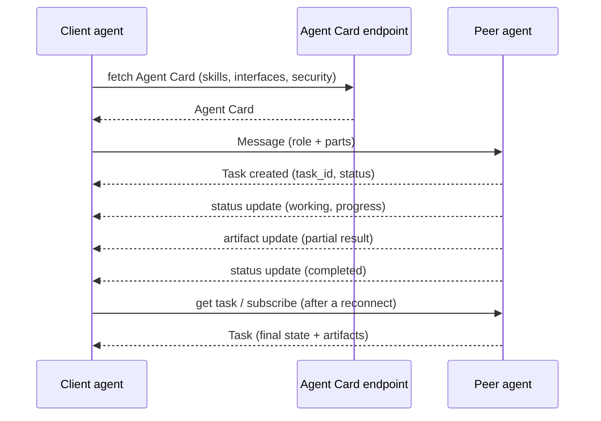

# Agent-to-Agent Protocol Concepts

> **Interview answer (say this first).** MCP connects an agent to tools and data; A2A connects an agent to another agent. A2A exists for interoperability across owners and frameworks: a peer publishes an **Agent Card** at a well-known URL describing its identity, interfaces, skills, and security; a client discovers it, sends a **Message**, and the peer turns the work into a **Task** with a lifecycle it can stream, poll, or push updates for, ending in artifacts. Because the peer is not under your control, the card is a claim, not a fact — you verify the interface and signature, authenticate with the declared scheme, request scoped permissions per skill, and build a reputation from outcomes. The two protocols compose: an agent uses MCP for its own tools and A2A to delegate to peers. Protocol details evolve, so verify the spec version you ship.

## Why this exists

A single agent can only hold so much context, and one team can only own so many capabilities. At some point an agent needs another agent — not another function. That other agent usually lives behind a network boundary and is owned by someone else. Four reasons force the boundary:

- **Specialisation.** One team owns billing, another owns compliance. Each has its own agent, tools, and data.
- **Ownership.** You cannot import another company's agent as a Python function, and you should not trust it as one.
- **Long-running work.** Some jobs run for minutes or hours. A plain function call cannot hold a connection that long.
- **Interoperability.** The peer may be built on a different framework. You need a wire contract, not shared source code.

The naive solution is to wrap the remote agent as a tool, but a flat request/response call cannot give you a task id to check status later, progress to stream, cancellation, artifacts to collect, or capability discovery before you send sensitive data. A2A gives agent-to-agent work a real protocol: discovery through an Agent Card, work represented as a Task with a lifecycle, updates delivered by streaming or push, and a security model both sides agree on.

> **The one-sentence purpose.** A2A lets one agent delegate work to another agent it does not control, track that work over time, and receive artifacts back — while keeping discovery, long-running tasks, and trust explicit.

## Start from zero

| Word | Plain meaning |
| --- | --- |
| **A2A** | Agent-to-Agent: an open protocol for agents to send work to other agents. |
| **MCP** | Model Context Protocol: connects an agent to tools, resources, and prompts. |
| **Agent** | An autonomous service that accepts work and acts on it. |
| **Agent Card** | A JSON document describing an agent: identity, interfaces, skills, capabilities, and security. |
| **Well-known URL** | A fixed path where the card is served, so a client can find it without configuration. |
| **Skill** | One advertised capability, with an id, name, description, tags, and examples. |
| **Message** | One unit sent to an agent, with a role (user or agent) and one or more parts. |
| **Task** | A stateful unit of work created from a message, with an id and a status. |
| **Task state** | The lifecycle stage: submitted, working, input-required, auth-required, completed, failed, canceled, rejected. |
| **`context_id`** | The id that groups messages and tasks into one conversation between a client and a peer. |
| **Artifact** | A concrete output of a task, such as a report or a JSON result. |
| **Streaming** | Receiving incremental status and artifact updates while the task runs. |
| **Push notification** | A webhook the server calls when a task changes, for work that outlives a connection. |
| **Delegation** | Sending a sub-task to a peer and using its result. |
| **Handoff** | Transferring control so the peer owns the rest of the work. |
| **Security scheme** | How the peer wants the caller to authenticate: OAuth2, API key, mTLS, or OpenID Connect. |
| **Scope** | The specific permission a caller needs for a skill, carried in the credential. |
| **Signature** | A cryptographic proof that the Agent Card was issued by the claimed agent. |
| **Reputation** | A score built from a peer's past outcomes, not from its card. |
| **Overclaim** | Advertising a skill the peer cannot actually deliver. |

Two distinctions matter:

- **A2A vs MCP is agents-to-agents vs agents-to-tools.** MCP gives an agent its own capabilities; A2A lets that agent reach a capability owned by someone else's agent. They stack.
- **A card is a claim, not a fact.** Discovery tells you a peer exists and what it says it can do. Trust comes from verification and from outcomes.

## The core idea

Think of a specialist firm. Before hiring them, you read their **brochure and credentials** — the Agent Card. You send a **request letter** — a Message. The firm opens a **case file with a reference number** — a Task. They may write back asking for more detail — the `input-required` state. For a long job, they either let you **watch the case online** (streaming) or **phone you when it changes** (push). When done, they deliver **documents** — Artifacts.



The two protocols divide the world cleanly, and they compose:

| Question | MCP | A2A |
| --- | --- | --- |
| Connects | Agent to tools and data | Agent to another agent |
| Discovery | Tool and resource listing | Agent Card at a well-known URL |
| Unit of work | Tool call, usually request/response | Task with a lifecycle |
| Long-running work | Progress notifications | Task states, streaming, push |
| Output | Tool result content | Messages and artifacts |
| Trust model | Host and gateway enforce scopes | Card, signatures, declared auth schemes |
| Control after the call | Caller keeps control | Caller keeps control (delegation) or the peer owns it (handoff) |

An agent uses MCP to query its own database and A2A to ask another team's billing agent to issue a refund. The peer, in turn, uses its own MCP servers. That layering is the whole point.

## How it works

1. **Publish an Agent Card.** The peer serves a JSON document at a well-known path describing its name, description, version, supported interfaces and protocol bindings, skills, capabilities such as streaming and push, input and output modes, and security schemes.
2. **Discover before sending.** The caller fetches the card, or finds the peer in a registry. It reads the skills to see whether the peer can do the work at all, and the capabilities to choose streaming or polling.
3. **Negotiate the interface.** The caller intersects its supported protocol versions and bindings with the peer's and picks a common one. No common version means the peers cannot interoperate, so fail fast instead of guessing.
4. **Authenticate as declared.** The card may require OAuth2, an API key, mTLS, or OpenID Connect. The caller presents credentials; the peer validates them and checks the caller is allowed to invoke the specific skill.
5. **Send a Message.** A message has a role and one or more parts. Text is common; structured data, files, and URLs cover the rest.
6. **The peer may create a Task.** Sending a message is not guaranteed to create a task: the peer may answer with a plain message, or with a quick completed task. When a task exists, it has a task id and a status, and the caller stores the id.
7. **Follow the lifecycle.** `submitted` means accepted; `working` means in progress; `input-required` means the peer needs an answer; `auth-required` means credentials are missing. Terminal states are `completed`, `failed`, `canceled`, and `rejected` — and terminal really means terminal.
8. **Receive updates by streaming or push.** Streaming sends status and artifact events over an open connection. Push calls a webhook the caller registered, which suits work that outlives any connection.
9. **Fetch state when you reconnect.** Fetching the task returns the current task, including history and artifacts. This is what makes long-running work durable: the caller can come back later, and the task id is the only handle needed.
10. **Cancel when needed.** A cancel request asks the peer to stop. The peer decides whether cancellation is possible.
11. **Collect artifacts, not just status.** A `completed` task with no artifact finished but produced nothing useful. Validate the artifacts as untrusted input.
12. **Verify trust inputs.** Check the card's signature where present, pin the expected host and version, and treat every claim as unproven until the peer authenticates and completes work.

> **Warning.** A card is attacker-controlled data until you verify it. Pinning the interface and checking the signature is what stops a malicious response from redirecting your credentials to another host.

## The syntax you will use

**An Agent Card (vendor-neutral JSON).** These are the fields a caller reads to decide whether and how to call the peer.

```json
{
  "name": "billing-agent",
  "version": "1.4.0",
  "supportedInterfaces": [
    {"url": "https://billing.example.com/a2a",
     "protocolBinding": "JSONRPC", "protocolVersion": "1.0"}
  ],
  "capabilities": {"streaming": true, "pushNotifications": true},
  "defaultInputModes": ["text/plain"],
  "defaultOutputModes": ["application/json"],
  "skills": [
    {"id": "refund", "name": "Refund processing",
     "description": "Start or check a refund for an order.",
     "tags": ["billing", "refund"], "examples": ["Refund order A-100"]}
  ],
  "securitySchemes": {"oauth": {"type": "oauth2",
    "flows": {"clientCredentials": {
      "tokenUrl": "https://auth.example.com/oauth/token",
      "scopes": {"billing.refund": "Start or check a refund"}}}}}
}
```

The card is the discovery and trust entry point; everything else depends on reading it correctly.

**A Message with parts.** One logical request, in whatever form the content needs.

```json
{
  "role": "user",
  "parts": [
    {"kind": "text", "text": "Refund order A-100"},
    {"kind": "data", "data": {"orderId": "A-100"}}
  ]
}
```

A part is text, data, a file, or a URL. Structured parts avoid brittle parsing of free text.

**A Task and its lifecycle.** The states a caller can observe and reason about.

```text
submitted -> working -> completed
working   -> input-required -> working
working   -> auth-required  -> working
working   -> failed | canceled | rejected
```

Once a task reaches `completed`, `failed`, `canceled`, or `rejected`, no further transition is valid.

**Streaming events versus the final task.** Stream for progress; fetch the task for truth.

```text
TaskStatusUpdateEvent(kind="status-update", task_id, context_id, status{state: "working", message: "reading order"})
TaskArtifactUpdateEvent(kind="artifact-update", task_id, context_id, artifact=summary)
TaskStatusUpdateEvent(kind="status-update", task_id, context_id, status{state: "completed"})
```

A dropped stream is not a failed task. Reconcile by fetching the task by id.

**Scoped security requirements.** The card can demand a scope per skill, and the caller must carry it.

```text
securityRequirements: [{"schemes": {"oauth": ["billing.refund"]}}]   # scheme name -> required scopes
```

The scheme name maps directly to the list of scopes it requires; there is no nested `scopes` object. (The v1.0 protobuf JSON wraps the list as `{"schemes": {"oauth": {"list": ["billing.refund"]}}}`.) The caller authenticates once but must hold the scope the specific skill requires.

**Idempotency on the client side.** Retries must not create two tasks: use a client reference the peer maps to a task id, or dedupe on the returned id.

## Examples: simple to real

**Example 1 — parse an Agent Card into routing facts.** The card is plain JSON; a caller extracts skills, interfaces, and capabilities.

```python
import json

card = {
    "name": "billing-agent",
    "version": "1.4.0",
    "supportedInterfaces": [
        {"url": "https://billing.example.com/a2a",
         "protocolBinding": "JSONRPC", "protocolVersion": "1.0"}
    ],
    "capabilities": {"streaming": True, "pushNotifications": True},
    "skills": [
        {"id": "refund", "name": "Refund processing",
         "tags": ["billing", "refund"]}
    ],
}

print("name:", card["name"], "| version:", card["version"])
for s in card["skills"]:
    print("skill:", s["id"], "-", s["name"], "tags:", s["tags"])
for i in card["supportedInterfaces"]:
    print("interface:", i["url"], i["protocolBinding"], i["protocolVersion"])
print("streaming:", card["capabilities"]["streaming"],
      "| push:", card["capabilities"]["pushNotifications"])
print("round-trips:", json.loads(json.dumps(card)) == card)
```

Verified output:

```text
name: billing-agent | version: 1.4.0
skill: refund - Refund processing tags: ['billing', 'refund']
interface: https://billing.example.com/a2a JSONRPC 1.0
streaming: True | push: True
round-trips: True
```

Everything a caller needs to route work is here. If a required skill is absent, the caller should not send the request at all.

**Example 2 — capability discovery with a trust tie-break.** Two peers advertise the same refund skill; matching alone is not enough, so verification breaks the tie.

```python
def tokens(text: str) -> set[str]:
    cleaned = "".join(c if c.isalnum() else " " for c in text.lower())
    return set(cleaned.split())

def skill_score(task: str, skill: dict) -> int:
    return len(tokens(task) & (tokens(skill["name"]) | set(skill.get("tags", []))))

peers = [
    {"agent": "billing", "verified": True,
     "skills": [{"id": "refund", "name": "Refund processing", "tags": ["billing", "refund"]}]},
    {"agent": "sketchy", "verified": False,
     "skills": [{"id": "refund", "name": "Refund processing", "tags": ["billing", "refund"]}]},
    {"agent": "docs", "verified": True,
     "skills": [{"id": "answer", "name": "Answer docs questions", "tags": ["docs", "answer"]}]},
]

task = "please process a refund for my last invoice"
ranked = sorted(
    (skill_score(task, s), p["verified"], p["agent"], s["id"])
    for p in peers for s in p["skills"] if skill_score(task, s) > 0
)
ranked.sort(key=lambda r: (-r[0], not r[1], r[2]))   # match, then verification
print("ranked:", [(p, s) for _, _, p, s in ranked])
_, verified, peer_name, skill_id = ranked[0]
print("chosen:", peer_name, "skill:", skill_id, "verified:", verified)
print("trust gate:", "pass" if verified else "blocked, use fallback")
```

Verified output:

```text
ranked: [('billing', 'refund'), ('sketchy', 'refund')]
chosen: billing skill: refund verified: True
trust gate: pass
```

Both peers match the task equally. Verification decides the caller, and the unverified peer never receives the request. Discovery finds; trust selects.

**Example 3 — the task lifecycle rejects illegal transitions.** A small state machine keeps a client from double-processing a finished task.

```python
TERMINAL = {"completed", "failed", "canceled", "rejected"}
ALLOWED = {
    "submitted": {"working", "rejected", "canceled"},
    "working": {"input-required", "auth-required", "completed", "failed", "canceled"},
    "input-required": {"working", "canceled", "failed"},
    "auth-required": {"working", "canceled", "failed"},
}

def apply(state: str, dst: str) -> str:
    if state in TERMINAL or dst not in ALLOWED.get(state, set()):
        raise ValueError(f"illegal transition {state} -> {dst}")
    return dst

state = "submitted"
for dst in ["working", "input-required", "working", "completed"]:
    state = apply(state, dst)
    print(f"ok: -> {state}")

try:
    apply("completed", "working")
except ValueError as e:
    print("rejected:", e)
print("is terminal:", state in TERMINAL)
```

Verified output:

```text
ok: -> working
ok: -> input-required
ok: -> working
ok: -> completed
rejected: illegal transition completed -> working
is terminal: True
```

A peer that moves a completed task back to `working` is buggy. Reject the update rather than acting on it twice.

**Example 4 — handoff versus delegation.** The choice decides who owns the task, who answers the user, and who handles recovery.

```python
from dataclasses import dataclass

@dataclass
class Task:
    task_id: str
    context_id: str
    owner: str

def route(needs_one_owner: bool) -> Task:
    owner = "specialist" if needs_one_owner else "coordinator"
    return Task("t-1" if needs_one_owner else "t-2", "ctx-1", owner)

handoff = route(needs_one_owner=True)
delegation = route(needs_one_owner=False)
for t in (handoff, delegation):
    mode = "handoff" if t.owner != "coordinator" else "delegation"
    print(f"{mode}: owner={t.owner} task={t.task_id} context={t.context_id}")
print("recovery owner (handoff):", handoff.owner)
print("recovery owner (delegation):", delegation.owner)
```

Verified output:

```text
handoff: owner=specialist task=t-1 context=ctx-1
delegation: owner=coordinator task=t-2 context=ctx-1
recovery owner (handoff): specialist
recovery owner (delegation): coordinator
```

In a handoff, the specialist owns the rest and handles failure. In delegation, the coordinator stays in charge and treats the peer's result as one input among several.

**Example 5 — a retried request must not create two tasks.** The client times out and retries the same reference; the peer returns the original task.

```python
class TaskService:
    def __init__(self) -> None:
        self.by_reference: dict[str, str] = {}
        self.tasks: dict[str, str] = {}
        self._n = 0

    def send_message(self, client_reference: str, text: str) -> dict:
        if client_reference in self.by_reference:
            task_id = self.by_reference[client_reference]
            return {"task_id": task_id, "created": False, "state": self.tasks[task_id]}
        self._n += 1
        task_id = f"task-{self._n}"
        self.by_reference[client_reference] = task_id
        self.tasks[task_id] = "working"
        return {"task_id": task_id, "created": True, "state": "working"}

svc = TaskService()
print(svc.send_message("coordinator/run-7/step-2", "refund A-100"))
print(svc.send_message("coordinator/run-7/step-2", "refund A-100"))
print("tasks created:", len(svc.tasks))
```

Verified output:

```text
{'task_id': 'task-1', 'created': True, 'state': 'working'}
{'task_id': 'task-1', 'created': False, 'state': 'working'}
tasks created: 1
```

A timeout does not mean the peer did nothing. The client reference makes the retry safe, and both sides can dedupe on it.

## In production

- **Verify the card before you use it.** Check the signature where present, pin the expected host, interface, and version, and never let an unexpected URL receive your credentials.
- **Do not treat a skill as a tool.** A skill is a broad capability. Send a message and let the peer decide how to fulfil it. Over-specifying turns A2A into brittle RPC.
- **Plan for `input-required`.** A peer may need clarification. The client must be able to resume a task with an answer, and the peer should bound how many clarification rounds it will accept.
- **Use push plus polling for hours-long work.** An open stream will not survive a deploy, an idle timeout, or a sleeping client. Register a webhook and fall back to fetching the task by id.
- **Make task handling idempotent.** A retried send can create a second task. Use a client-supplied reference or dedupe on the returned task id, and store the id with your run state.
- **Treat terminal states as terminal.** Reject updates that reopen a completed, failed, canceled, or rejected task, or you will process the same result twice.
- **Handle `auth-required` and `rejected` as first-class outcomes.** They are not errors to retry blindly. One means refresh credentials; the other means the peer refused the work.
- **Watch the confused deputy.** A peer with broad permissions can be used through your agent to reach data your user should not see. Pass the user identity and scopes through, and re-check at the peer.
- **Treat messages and artifacts as untrusted input.** A remote agent's text can contain instructions. Never feed a peer's output into a privileged tool call without validation.

## Interview questions

### 1. What is A2A, and how is it different from MCP?

**Answer.** A2A is an open protocol for one agent to delegate work to another agent. MCP connects an agent to tools and data; A2A connects agents to agents. In MCP the unit is a tool call, usually request/response. In A2A the unit is a Task with a lifecycle, discoverable skills, streaming or push updates, and artifacts. They compose: an agent uses MCP for its own tools and A2A to reach peers, and a peer uses its own MCP servers.

**Follow-up: "Why not just wrap the other agent as an MCP tool?"** You lose long-running tasks, status retrieval, cancellation, streaming artifacts, and capability discovery. A flat call cannot represent work that lasts an hour.

**Trap.** Saying they are competitors. The clean design uses both at different layers.

### 2. What is an Agent Card, and what does it contain?

**Answer.** A JSON document describing the agent: name, description, version, supported interfaces and protocol bindings, skills, capabilities such as streaming and push notifications, supported input and output modes, security schemes, and optionally a signature. It is the discovery and trust entry point: a caller reads it before sending anything.

**Follow-up: "What is a skill?"** One advertised capability, with an id, name, description, tags, examples, and input and output modes. Skills are how a caller decides whether the peer can do the work.

**Trap.** Trusting the card's claims. The card is attacker-controlled data until you verify the host and the signature and the peer proves itself with authenticated work.

### 3. Walk through a task's lifecycle.

**Answer.** A message may cause the peer to create a task in `submitted`, though the peer can also answer with a plain message and no task. When a task exists, the peer moves it to `working`, and may pause in `input-required` or `auth-required`. It ends in `completed`, `failed`, `canceled`, or `rejected`. Along the way it accumulates status updates, history messages, and artifacts. Terminal states do not transition further.

**Follow-up: "How does a client observe it?"** By streaming updates while connected, by receiving push notifications when not, or by fetching the task by id to get current state. The task id is the handle for all three.

**Trap.** Treating `input-required` as a failure. It is a request for information, and the task can resume.

### 4. When do you stream, and when do you use push notifications?

**Answer.** Stream when a caller is waiting and can hold a connection: interactive work where the caller wants partial results and progress. Push notifications suit work that outlives a connection — minutes to hours, across deploys, or on the server side with no client online. Use streaming when you can, and push with a poll fallback for durable long-running tasks.

**Follow-up: "What breaks a stream?"** Any network interruption, a deploy, an idle timeout, or a sleeping client. That is why a durable task must be retrievable by id rather than existing only inside the connection.

**Trap.** Assuming a completed stream means the work completed. Reconcile by fetching the task; the connection can drop after the peer finished.

### 5. Explain handoff versus delegation.

**Answer.** A handoff transfers control: the peer owns the rest of the task and the caller steps out. Delegation keeps the caller in control and uses the peer's result as an input to its own next step. A handoff is right when the specialist should finish; delegation is right when the caller must combine several results.

**Follow-up: "Which does A2A support?"** Both, as usage patterns. The protocol gives you tasks and messages; the pattern is which agent holds the task and answers the user.

**Trap.** Handing off and then expecting to post-process. After a handoff, the peer is the owner, and the caller may not see intermediate state.

### 6. How do agents trust each other in A2A?

**Answer.** In layers. The card declares security schemes such as OAuth2, API keys, mTLS, or OpenID Connect, and can carry a signature over the canonicalized card. The client verifies the card, authenticates, and requests scoped permissions per skill. The peer enforces its own authorization, and audit logging ties calls to identities. Trust is never a single check.

**Follow-up: "What is the confused-deputy risk?"** A peer with broad permissions can be used through your agent to reach data your user should not see. Pass the user's identity and scope through, and re-check at the peer rather than trusting the caller.

**Trap.** Relying on network location for trust. Being on the same network does not make a peer authorized.

### 7. What failure modes do you design for in A2A?

**Answer.** Duplicate tasks from retries, dropped streams, peers that need more input, auth expiring mid-task, tasks that never terminate, empty artifacts, and peers that claim a skill but fail it. Handle each with an idempotency key or client reference, task retrieval by id, bounded clarification rounds, credential refresh, a duration cap, artifact validation, and capability verification before routing.

**Follow-up: "What is the hardest one?"** The overclaiming peer. It advertises a skill and then fails. You cannot detect it from the card, only from outcomes, so track success rate per peer and demote peers that break their promises.

**Trap.** Retrying a send blindly. A timeout does not mean the peer did not create the task, and a blind retry can run the work twice.

### 8. How do A2A and MCP scopes relate?

**Answer.** They are different boundaries. MCP scopes decide which tools an agent may call on its own servers. A2A security requirements decide what the peer demands from the caller for each skill. A well-designed agent carries the user's identity and scope through the whole chain, so the peer's check is meaningful, and the gateway still enforces its own allowlist.

**Follow-up: "Where does the audit record live?"** At both ends, joined by the task id and the trace context. Each side records who called, for which skill, under which scopes, and what happened.

**Trap.** Passing a broad service identity and losing the user. Then every peer sees the same powerful caller and per-user access control disappears.

## Remember this

- **MCP is agent-to-tools; A2A is agent-to-agent.** They compose at different layers, not compete.
- **An Agent Card at a well-known URL is the discovery and trust entry point** — skills, interfaces, capabilities, security.
- **A task has a lifecycle** — submitted, working, input-required, auth-required, completed, failed, canceled, rejected — and terminal states stay terminal.
- **Stream when someone is waiting; push and poll for long-running work.** Persist the task id; it is the only handle.
- **A voice on the card is a claim, not a fact.** Verify, authenticate, scope per skill, and build reputation from outcomes.
