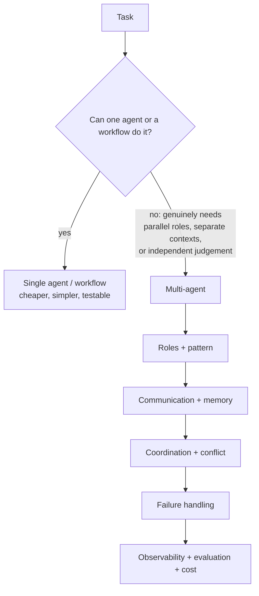

# Phase 12 — Multi-Agent Systems

A multi-agent system splits a job across several agents that talk to each other. It is powerful and it is overused. More agents mean more coordination, more cost, more latency, and more ways to fail — so the first and most important topic in this phase is when **not** to use one.

This phase covers the patterns (supervisor-worker, planner-executor, router, debate, critic, evaluator), the topologies (hierarchical and peer-to-peer), the mechanics (communication, delegation, handoffs, shared and private memory), the coordination problems (scheduling, conflict, consensus), the failure modes (deadlocks, infinite loops), and the operational needs (observability, evaluation, security, cost, distribution). It closes with the two protocol-level topics: LangGraph multi-agent patterns and agent-to-agent (A2A) concepts.

## What you will be able to do

By the end of this phase you should be able to:

- Justify a multi-agent design, or argue against one when a single agent or workflow is enough.
- Assign roles and choose a pattern: supervisor-worker, planner-executor, router, debate, critic, or evaluator.
- Choose a topology (hierarchical vs peer-to-peer) and design communication, delegation, and handoffs.
- Design shared and private memory and shared state, and reason about task delegation and capability discovery.
- Coordinate and schedule agents, and resolve conflicts or reach consensus.
- Prevent and recover from deadlocks, infinite loops, and agent failures.
- Observe, evaluate, and secure a multi-agent system, and control its cost.
- Run a distributed multi-agent system, use LangGraph multi-agent patterns, and understand A2A concepts.

## Why multi-agent is a trade

Each box adds cost and failure modes. The interview question is rarely "how do you build a multi-agent system?" — it is "why is this better than one agent with better tools?" If you cannot answer that, the answer is one agent.

## Topic order

1. [Why multi-agent, and when not to](01-why-multi-agent-and-when-not-to.md) — the central trade.
2. [Agent roles and patterns](02-agent-roles-and-patterns.md) — supervisor-worker, planner-executor, router.
3. [Debate, critic, and evaluator agents](03-debate-critic-and-evaluator-agents.md) — independent judgement.
4. [Hierarchical and peer-to-peer agents](04-hierarchical-and-peer-to-peer-agents.md) — topologies.
5. [Agent communication, delegation, and handoffs](05-agent-communication-delegation-and-handoffs.md) — how agents talk and hand work over.
6. [Shared and private memory and state](06-shared-and-private-memory-and-state.md) — what each agent knows.
7. [Agent scheduling and coordination](07-agent-scheduling-and-coordination.md) — who runs when.
8. [Conflict resolution and consensus](08-conflict-resolution-and-consensus.md) — disagreeing safely.
9. [Deadlocks, infinite loops, and failure handling](09-deadlocks-infinite-loops-and-failure-handling.md) — when it goes wrong.
10. [Multi-agent observability and evaluation](10-multi-agent-observability-and-evaluation.md) — seeing and judging the system.
11. [Multi-agent security and cost control](11-multi-agent-security-and-cost-control.md) — the two budgets.
12. [Distributed multi-agent systems](12-distributed-multi-agent-systems.md) — across machines.
13. [LangGraph multi-agent patterns](13-langgraph-multi-agent-patterns.md) — the framework view.
14. [Agent-to-Agent protocol concepts](14-agent-to-agent-protocol-concepts.md) — interoperating across vendors.
15. [Multi-agent testing, safety, and human factors](15-multi-agent-testing-safety-and-human-factors.md) — coordination failures, escalation, and trust.

> **How to study this phase.** For every pattern, ask: what does the extra agent buy, and what does it cost? Multi-agent is justified by *separate context*, *independent judgement*, or *genuine parallelism* — not by the hope that more agents are smarter.

## Checkpoint and evidence

Complete this checkpoint before moving on. It follows the [competency and evidence contract](../projects/competency-evidence.md) — **learn → build → measure → break → explain**. The artifact is the proof; the explanation is the interview rehearsal.

| Step | Artifact | Pass condition |
| --- | --- | --- |
| **Build** | `artifacts/phase-12/single-vs-multi/` — the same task as a single-agent workflow and a multi-agent system, with delegation and handoff contract tests. | Both designs run on the same task and dataset. |
| **Measure** | Quality, latency, cost, failure rate, and coordination failures. | The comparison is on identical inputs and seeds. |
| **Break** | Deadlock, livelock, duplicate work, and consensus failure. | Each coordination failure is triggered and recovered. |
| **Explain** | When not to use multi-agent systems. | You justify keeping or rejecting the multi-agent design from the numbers and answer “why not just one bigger prompt?”. |

> **Evidence tip.** Keep the artifact in your own repository and record it in the [checkpoint record](../projects/competency-evidence.md#the-checkpoint-record). If the artifact does not exist, the phase is not finished.
