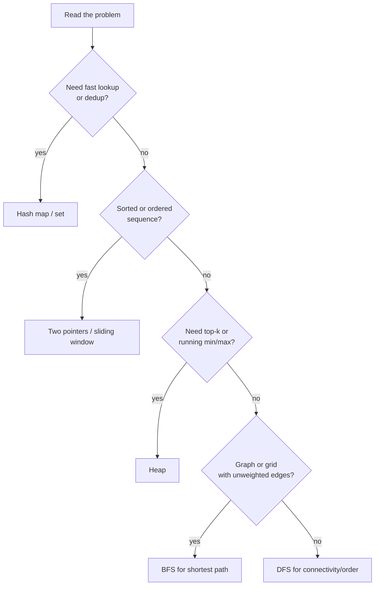

# Python Coding Interviews and Internals

> **Interview answer (say this first).** A Python coding round tests two things at once: whether you can map a problem to a known pattern, and whether you understand the object model well enough to reason about correctness and cost. The patterns are few — hashing for lookups, two pointers and sliding windows for sequences, heaps for top-k and streaming, breadth-first search for shortest paths in unweighted graphs, depth-first search for connectivity and ordering. The internals are also a small set: the GIL, mutable default arguments, references versus values, `is` versus `==`, closures, the method resolution order (MRO), `__slots__`, generators versus lists, `asyncio` versus threads, and exception chaining. In a coding round I clarify the input, state a brute-force baseline, improve it, code it, and test it aloud. In an internals round I give the mechanism, then the trap that breaks the naive answer.

> **Note:**
>
> **Verified.** Every runnable example on this page was executed offline in plain Python (Python 3.14). No network or model calls were made.

## Why this exists

Most rejection at the coding stage is not "could not code". It is one of three things: the candidate pattern-matches too slowly, codes without stating assumptions, or cannot explain *why* their solution is correct or efficient. Internals questions fail for a different reason: the candidate recites a definition but does not know the mechanism, so the first follow-up exposes the gap.

This page is a question bank, not a tutorial. It assumes you have already read Phase 1 — Production Python. Use it to rehearse answers and to find the topic to revise.

What the interviewer is scoring:

- **Pattern recognition.** Did you see that "find a pair that sums to a target" is a hash map, not a nested loop?
- **Communication.** Did you restate the problem, name the edge cases, and say the complexity before coding?
- **Correctness discipline.** Did you walk through an example and test boundaries?
- **Internals depth.** Do you know *why* a mutable default is shared, or what the GIL actually locks?

The internals questions are not trivia. A mutable default silently shares state across calls. A closure that captures a loop variable returns the wrong value. Treating a list as a value copies a reference. Each of these is a real production bug — see Phase 1 — Exception Handling, Phase 1 — Iterators and Generators, and Phase 1 — Threads and Processes.

> **The one-sentence purpose.** A coding interview is pattern recognition plus clear communication; an internals interview is the mechanism plus the trap.

## Start from zero

Learn these words first. They are used loosely in conversation and precisely in interviews.

| Word | Plain meaning |
| --- | --- |
| **Big-O** | How the work grows with input size, ignoring constants. `O(n)` is linear. |
| **Hash map** | A dictionary: keys map to values in about constant time. `dict` and `set`. |
| **Hashable** | An object usable as a dict key or set member: it has a stable hash and is immutable in practice. |
| **Two pointers** | Two indices moving through a sequence, one from each end or both inward. |
| **Sliding window** | A moving range `[left, right]` that grows and shrinks to answer a subarray question. |
| **Heap** | A partly sorted tree that returns the smallest (or largest) item fast. `heapq`. |
| **BFS** | Breadth-first search: explore neighbours level by level; finds shortest paths when edges are unweighted. |
| **DFS** | Depth-first search: follow one branch to the end, then back up; good for connectivity and ordering. |
| **GIL** | Global Interpreter Lock. In CPython, only one thread runs Python bytecode at a time. |
| **Mutable default** | A default argument value created once at function definition, then shared by every call. |
| **Reference** | A name that points at an object. Assignment copies the reference, not the object. |
| **Identity (`is`)** | Whether two names point at the exact same object. |
| **Equality (`==`)** | Whether two objects compare as equal in value. |
| **Closure** | A function that remembers variables from the scope where it was defined. |
| **Late binding** | A closure reads a captured variable when it runs, not when it was created. |
| **MRO** | Method Resolution Order: the order Python searches base classes for a method. |
| **`__slots__`** | A class attribute that replaces the per-instance `__dict__` with fixed fields, saving memory. |
| **Generator** | A function with `yield`; produces values one at a time and holds no full list. |
| **Coroutine** | An `async def` function driven by an event loop. |
| **Exception chaining** | Keeping the original exception attached when raising a new one, via `raise ... from ...`. |
| **Amortised** | An occasional expensive step averaged over many cheap steps, as with dynamic arrays. |

Two distinctions matter most:

- **Identity versus equality.** `is` asks "same object?"; `==` asks "same value?". Use `is` only for `None`, `True`, `False`, and sentinels. Use `==` for data.
- **Reference versus value.** Assignment in Python never copies an object. `a = b` makes `a` point at the same object as `b`. To copy, you must ask for a copy.

## The core idea

Think of a coding interview as a workshop, not an exam.

You are handed a broken machine and a box of tools. You do not invent a new tool. You look at the shape of the problem, pick the tool that fits, explain why it fits, then assemble it and test that it runs. The interviewer is watching your hands, not just the finished machine.

The toolbox is small. Most problems are one of five shapes:



The internals mental model is different. It is a memory diagram. Every name is an arrow pointing at an object; every object knows its type, its value, and whether it is mutable. Most "gotchas" are just arrows pointing somewhere you did not expect.

| Question | Mental model | The trap |
| --- | --- | --- |
| Mutable default | One list object created at `def` time, shared by all calls | Assuming a fresh list each call |
| Closure loop variable | Closures read the variable, not its value at creation | `[lambda: i for i in range(3)]` returns `[2, 2, 2]` |
| `is` vs `==` | Identity is the arrow; equality is the value | Using `is` for strings or numbers |
| Threads vs async | Threads wait on I/O; async waits in one loop; processes add cores | Expecting threads to speed up CPU work |
| `__slots__` | No `__dict__`, fixed fields | Adding an undeclared attribute raises `AttributeError` |

> **The mental model in one line.** Coding rounds are pattern selection; internals rounds are following the arrows from names to objects.

## How it works

Follow one coding problem from hearing it to submitting it.

1. **Restate the problem and ask two questions.** Confirm the input type, the output type, and whether the input is sorted or unique. Ask about empty input and duplicates. Two questions prevent most wrong answers.
2. **Write the brute force first, in words.** "For every pair, check the sum." Say its complexity out loud: `O(n²)` time, `O(1)` space. This gives you a correct baseline and shows you can reason.
3. **Look for the repeated work.** The brute force usually repeats a lookup or a comparison. That repeated work is the clue: a lookup wants a hash map, a sorted scan wants two pointers, a min-so-far wants a heap.
4. **Name the pattern and its complexity before coding.** "This is a hash-map pass, `O(n)` time and `O(n)` space." Saying it first means the code cannot surprise you.
5. **Define the invariant.** For two pointers, the invariant might be "everything outside `[left, right]` is already resolved". For a sliding window, "the window always satisfies the constraint". A clear invariant is how you argue correctness.
6. **Code in small pieces with clear names.** Use `seen`, `left`, `right`, `window`. Prefer a helper function over a clever one-liner. Readability is scored.
7. **Walk one example by hand.** Trace the code on the sample. Then test boundaries: empty input, one element, all identical, no solution.
8. **State the final complexity.** Time and space, average and worst case, and the reason.

For the internals half, the mechanism is always three steps: **what object is created, when it is created, and who shares it.**

1. **Mutable default:** the default object is created once when the `def` is executed, stored on the function, and reused.
2. **Reference:** assignment binds a name to an existing object; it does not copy.
3. **Closure:** the inner function stores a reference to the enclosing variable cell, not its value.
4. **MRO:** Python builds a linear order of base classes with the C3 algorithm and searches it left to right.
5. **GIL:** one lock permits one thread to execute bytecode; it is released during I/O and inside many C extensions.
6. **Exception chaining:** `raise NewError(...) from exc` sets `__cause__` on the new exception and prints the chain.

> **The working rule.** Say the pattern, the complexity, and the invariant before you type. Interviewers score the reasoning, and the code follows from it.

## The syntax you will use

These are real production forms. Read them once; each appears in a coding round or a review.

**1. Hashing for lookups.** Turn a nested loop into a single pass with a dict.

```python
def two_sum(nums, target):
    seen = {}                       # value -> index
    for i, n in enumerate(nums):
        if target - n in seen:      # O(1) average lookup
            return [seen[target - n], i]
        seen[n] = i
    return []
```

The dict trades memory for time: one pass instead of comparing every pair.

**2. Two pointers on a sequence.** Move inward until the pointers meet.

```python
left, right = 0, len(s) - 1
while left < right:
    left += 1
    right -= 1
```

The loop runs `O(n)` times and needs no extra collection.

**3. A heap for top-k or streaming min/max.** `heapq` keeps the smallest item at index 0.

```python
import heapq
heapq.nlargest(k, items, key=lambda kv: kv[1])   # k largest by value
heapq.heappush(heap, item)                        # push
smallest = heap[0]                                # peek, O(1)
```

`nlargest` is `O(n log k)`, better than sorting when `k` is small.

**4. BFS with a deque.** A queue gives level-order exploration, which yields shortest paths.

```python
from collections import deque
q = deque([start])
seen = {start}
while q:
    node = q.popleft()          # FIFO, not LIFO
    for nxt in neighbours(node):
        if nxt not in seen:
            seen.add(nxt)
            q.append(nxt)
```

Mark a node seen when you enqueue it, or you will process it many times.

**5. A generator for lazy sequences.** Produce values on demand instead of building a list.

```python
def squares(n):
    for i in range(n):
        yield i * i

total = sum(squares(1_000_000))   # constant memory
```

The generator holds one value at a time; the list would hold a million.

**6. Closure capturing a value, not a variable.** Bind the current value as a default argument.

```python
fns = [lambda i=i: i for i in range(3)]   # captures each i
```

Without `i=i`, all three lambdas read the same final variable.

**7. Asyncio for many concurrent waits.** One event loop, many coroutines.

```python
import asyncio
results = await asyncio.gather(fetch(a), fetch(b), fetch(c))
```

`gather` runs the awaits concurrently; each releases control while waiting on I/O.

**8. Exception chaining.** Keep the original cause attached.

```python
try:
    return int(raw)
except ValueError as exc:
    raise ValueError("bad count") from exc
```

The chain preserves the root cause for the traceback and for the caller.

## Examples: simple to real

Six graded examples: four coding patterns, then two internals rounds. All outputs are real.

**Example 1 — hashing, the two-sum pattern.** The brute force is `O(n²)`; one dict pass is `O(n)`.

```python
def two_sum(nums, target):
    seen = {}
    for i, n in enumerate(nums):
        need = target - n
        if need in seen:
            return [seen[need], i]
        seen[n] = i
    return []

print(two_sum([2, 7, 11, 15], 9))   # [0, 1]
print(two_sum([3, 3], 6))          # [0, 1]  duplicates are fine
print(two_sum([1, 2, 3], 100))     # []
```

The insight to say aloud: "I am trading `O(n)` extra space for an `O(n²)` to `O(n)` time improvement."

**Example 2 — two pointers, a palindrome ignoring punctuation.** The invariant: characters outside the pointers are already matched.

```python
def is_palindrome(s):
    left, right = 0, len(s) - 1
    while left < right:
        while left < right and not s[left].isalnum():
            left += 1
        while left < right and not s[right].isalnum():
            right -= 1
        if s[left].lower() != s[right].lower():
            return False
        left += 1
        right -= 1
    return True

print(is_palindrome("A man, a plan, a canal: Panama"))  # True
print(is_palindrome("race a car"))                      # False
```

`O(n)` time, `O(1)` extra space. The inner `while` loops are the part candidates forget.

**Example 3 — a heap for top-k.** Count first, then take the `k` largest in `O(n log k)`.

```python
import heapq
from collections import Counter

def top_k_frequent(words, k):
    counts = Counter(words)                       # O(n)
    return [w for w, _ in heapq.nlargest(k, counts.items(), key=lambda kv: kv[1])]

print(top_k_frequent(["a", "a", "a", "b", "b", "c"], 2))   # ['a', 'b']
```

`Counter` is the hash-map step; `nlargest` is the heap step. Naming both shows you recognise the two-stage pattern.

**Example 4 — BFS on a grid.** Unweighted edges mean BFS gives the shortest path.

```python
from collections import deque

def shortest_path(grid, start, goal):
    rows, cols = len(grid), len(grid[0])
    q = deque([(start, 0)])
    seen = {start}
    while q:
        (r, c), dist = q.popleft()
        if (r, c) == goal:
            return dist
        for dr, dc in ((1, 0), (-1, 0), (0, 1), (0, -1)):
            nr, nc = r + dr, c + dc
            if 0 <= nr < rows and 0 <= nc < cols and grid[nr][nc] == 0 and (nr, nc) not in seen:
                seen.add((nr, nc))
                q.append(((nr, nc), dist + 1))
    return -1

grid = [[0, 0, 0], [1, 1, 0], [0, 0, 0]]
print(shortest_path(grid, (0, 0), (2, 2)))   # 4
```

The queue holds `(cell, distance)` pairs, so distance needs no second lookup. Use DFS only when you need connectivity or an ordering, not a shortest path.

**Example 5 — internals: mutable defaults and late-binding closures.** Two bugs that look harmless and are not.

```python
def append_bad(item, box=[]):     # one list, shared by every call
    box.append(item)
    return box

print(append_bad(1), append_bad(2))   # [1, 2] [1, 2]  <- same object

def append_good(item, box=None):
    if box is None:
        box = []                  # fresh list per call
    box.append(item)
    return box

print(append_good(1), append_good(2))  # [1] [2]

fns = [lambda: i for i in range(3)]
print([f() for f in fns])              # [2, 2, 2]  <- late binding
fns = [lambda i=i: i for i in range(3)]
print([f() for f in fns])              # [0, 1, 2]
```

**The trap in one line:** the default is evaluated once at `def`, and a closure reads the variable when it runs. Fix defaults with `None`, and closures with a bound default argument.

**Example 6 — internals: identity, MRO, `__slots__`, and exception chaining.** A rapid-fire round in one block.

```python
a = [1, 2, 3]; b = [1, 2, 3]
print(a == b, a is b)     # True False
print([] is [])           # False  <- new object each time
print(None is None)       # True

class A: pass
class B(A): pass
class C(A): pass
class D(B, C): pass
print([c.__name__ for c in D.__mro__])   # ['D', 'B', 'C', 'A', 'object']

class WithSlots:
    __slots__ = ("x",)
    def __init__(self, x): self.x = x
print(hasattr(WithSlots(1), "__dict__"))  # False

def load(raw):
    try:
        return int(raw)
    except ValueError as exc:
        raise ValueError("bad count") from exc

try:
    load("abc")
except ValueError as e:
    print(type(e.__cause__).__name__, e.__cause__ is not None)  # ValueError True
```

The MRO is `D → B → C → A → object`: Python linearises with C3, then searches left to right. `__slots__` removes the per-instance dict, so memory drops but you cannot add new attributes. `raise ... from` keeps `ValueError` reachable as `__cause__`.

## In production

- **State the complexity before coding.** It is the cheapest signal of seniority in a coding round, and it forces you to notice a bad approach before you write it.
- **Never use a mutable default.** Use `None` and create the object inside the function. This is the most common Python bug interviewers plant.
- **Use `is` only for `None`, `True`, `False`, and sentinels.** For numbers, strings, and lists, use `==`. Small-integer caching makes `is` pass in a test and fail in production.
- **Remember assignment copies references.** `b = a` then `b.append(x)` mutates the object `a` also points at. Copy explicitly when you mean a copy.
- **Bind loop variables in closures.** `lambda i=i: i` captures the value; a bare `lambda: i` captures the variable and reads its last value.
- **Pick the concurrency model by the work.** I/O-bound with async libraries: `asyncio`. Blocking I/O with no async client: threads. CPU-bound pure Python: processes, because the GIL blocks parallel bytecode.
- **Do not assume the GIL protects shared state.** It makes single bytecode operations atomic, not read-modify-write sequences. Guard them with a lock.
- **Use generators for streaming data.** Log lines, model tokens, and database cursors can be unlimited; a list materialises all of it and can exhaust memory.
- **Use `__slots__` for many small objects, not everywhere.** It saves memory but blocks dynamic attributes, breaks some pickling and multiple-inheritance patterns, and removes `__dict__`.
- **Chain exceptions deliberately.** `raise ... from exc` when the low-level cause matters; `from None` when it is noise. Never swallow the original silently.
- **Know the MRO before using multiple inheritance.** If you cannot say the search order, prefer composition; diamond inheritance surprises are hard to debug.
- **Test the boundaries out loud in the interview.** Empty input, one element, duplicates, and no solution catch most submitted bugs and show you think like a tester.

## Interview questions

### 1. How do you approach a coding problem you have never seen?

**Answer.** I restate it and confirm the input, output, and constraints. I describe a brute-force solution and its complexity, then look for repeated work: a repeated lookup suggests a hash map, a sorted sequence suggests two pointers, a min-so-far suggests a heap, an unweighted graph suggests BFS. I name the pattern and the target complexity, define the invariant, code it in small readable pieces, and trace the sample plus edge cases. Finally I state the time and space complexity.

**Follow-up: "What if you are stuck?"** I say what I know and what I am unsure about, then start with the brute force. A working baseline is better than silence, and coding it often reveals the optimisation. I also ask for a hint rather than freeze.

**Trap.** Jumping straight to code without restating the problem or naming the complexity. It reads as memorisation and often solves the wrong problem.

### 2. Why does `def f(x, box=[])` cause a bug?

**Answer.** Default argument values are evaluated once, when the `def` statement executes, and stored on the function object. A mutable default such as a list is therefore created once and shared by every call that does not pass its own `box`. Appending to it accumulates across calls. The fix is `box=None` and creating a new list inside the function when it is `None`.

**Follow-up: "Is the same true for immutable defaults like `0`?"** The sharing still happens, but integers and strings are immutable, so no call can change the shared object. The bug appears only with mutable defaults: lists, dicts, sets, and custom objects.

**Trap.** Saying "Python reuses the default for performance". It is a consequence of when the default is evaluated, not an optimisation, and it applies to every call.

### 3. What is the difference between `is` and `==`?

**Answer.** `is` compares identity: whether both names refer to the same object in memory. `==` compares equality: whether the objects define themselves as equal, via `__eq__`. Two separate lists with the same contents are `==` but not `is`. Use `is` for `None`, `True`, `False`, and sentinel objects, and `==` for values.

**Follow-up: "Why does `256 is 256` work but a large number may not?"** CPython caches small integers and some strings as an implementation detail. That makes `is` pass for small values and fail for large ones, which is exactly why `is` must not be used for numbers.

**Trap.** Using `is` on strings or numbers because it passed in a REPL. It works only until the value leaves the cached range or a different object is created.

### 4. Explain closures and the late-binding gotcha.

**Answer.** A closure is a nested function that keeps access to variables from the enclosing scope after that scope has returned. The function stores a reference to the variable's cell, not a copy of its value. That is late binding: the variable is read when the inner function is called. In `[lambda: i for i in range(3)]`, all three lambdas read the same final `i`, so they all return `2`. Binding the current value as a default argument, `lambda i=i: i`, captures the value at creation time.

**Follow-up: "Where else does this bite?"** Event handlers and callbacks registered inside a loop, and `functools.partial` is a cleaner fix when the callback takes arguments.

**Trap.** Believing the closure copied the value at definition. It did not; it captured the variable, and the variable kept changing.

### 5. What is the GIL, and how does it decide between asyncio, threads, and processes?

**Answer.** The Global Interpreter Lock is a CPython lock that lets only one thread execute Python bytecode at a time. It is released while a thread waits on I/O and inside many C extensions that opt in, such as `hashlib` and parts of NumPy. For many concurrent network waits, use `asyncio`: one thread and an event loop, minimal overhead. For blocking libraries with no async version, use a thread pool. For CPU-bound pure Python, use a process pool, because each process has its own interpreter and GIL. The deciding question is what the task waits on and whether it holds the GIL.

**Follow-up: "Does the GIL make my code thread-safe?"** No. It makes some single bytecode operations atomic, but a read-modify-write sequence can still interleave. Shared mutable state needs a lock.

**Trap.** Using threads to speed up pure-Python computation. They will not, because only one thread runs bytecode at a time.

### 6. What is the MRO, and how does Python resolve a method?

**Answer.** The Method Resolution Order is the linear order in which Python searches base classes for an attribute or method. Python computes it with the C3 linearisation algorithm and searches the result left to right. For `class D(B, C)` where both `B` and `C` inherit from `A`, the MRO is `D, B, C, A, object`. The first match wins, which is why `super()` follows the MRO rather than "the parent class".

**Follow-up: "Why does `super()` need cooperative design?"** `super()` returns the next class in the MRO, not necessarily the direct parent, so mixins work only if every class in the chain calls `super()` and passes the same arguments.

**Trap.** Assuming a method comes from the first-listed base class. It comes from the first class in the MRO that defines it, which can be a class you did not list directly.

### 7. When do you use a generator instead of a list, and when do you use `__slots__`?

**Answer.** A generator produces values lazily with `yield`, holds one value at a time, and cannot be replayed. Use it for large or unbounded sequences — log lines, tokens, cursor rows — where materialising a list would waste memory. A list is right when you need random access, a known length, or to iterate several times. `__slots__` removes the per-instance `__dict__` and stores only the declared fields, which saves memory when you create many small objects. The cost is that you cannot add undeclared attributes, and some patterns such as multiple inheritance with slots and pickling need care.

**Follow-up: "Which is faster?"** A generator has lower setup and memory cost; a list has faster element access because it is an array. Choose by memory and access pattern, not by a blanket rule.

**Trap.** Iterating a generator twice. The second loop sees nothing, because a generator is exhausted after one pass.

### 8. How does exception chaining work, and why use `raise ... from`?

**Answer.** When you catch a low-level exception and raise a higher-level one, `raise NewError(...) from exc` records the original on the new exception as `__cause__`, and `from None` suppresses it. Python prints the full chain, so the root cause is not lost. `__context__` is set automatically when an exception is raised while handling another; `from` sets `__cause__` explicitly and marks the relationship as intentional.

**Follow-up: "Why not just re-raise the original?"** Because the caller may need a domain-specific error with a clear message, while the original is an implementation detail. Chaining gives both: a useful message at the boundary and the true cause in the traceback.

**Trap.** Catching a broad `except Exception` and raising a new error without `from`, or swallowing it entirely. The original cause disappears, and debugging gets much harder.

## Remember this

- **Five patterns cover most coding rounds:** hash map, two pointers or sliding window, heap, BFS, DFS. Name the pattern and the complexity before coding.
- **Mutable defaults are created once and shared.** Use `None`, then build the object inside the function.
- **`is` is identity, `==` is value.** Use `is` for `None` and sentinels only.
- **Closures read variables when they run.** Bind loop values with `lambda i=i: i`.
- **The GIL blocks parallel bytecode, not I/O.** Async for many waits, threads for blocking I/O, processes for CPU-bound work.
