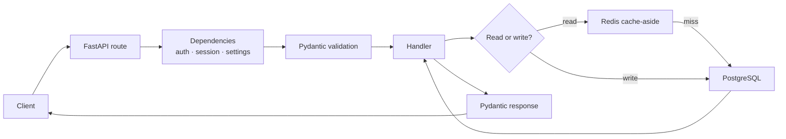

# Backend Interviews: FastAPI, SQL, PostgreSQL, Redis, REST

> **Interview answer (say this first).** These five topics are one system: a request hits a FastAPI endpoint, validation and dependencies run, the handler touches PostgreSQL for durable state and Redis for fast state, and the response follows REST conventions. FastAPI matters for dependency injection, async versus sync endpoints, Pydantic validation, and the lifespan for shared resources. SQL matters for joins, indexes, the N+1 problem, and transactions with isolation levels. PostgreSQL adds MVCC, `EXPLAIN`, and connection pooling. Redis adds cache patterns, expiry, atomic operations, and locks. REST adds verbs, status codes, pagination, idempotency, and versioning. In an interview I connect the layer to the failure it prevents, and I name the trade-off rather than just the API.

> **Note:**
>
> **Verified.** Every runnable example on this page was executed offline in plain Python (Python 3.14). No database, cache, or network calls were made; the examples model the mechanics in standard library code.

## Why this exists

Backend interviews fail in two predictable ways. The first is shallow API recall: the candidate can write a FastAPI route but cannot say when an endpoint must be `async def` and when it must not. The second is database hand-waving: the candidate says "add an index" without knowing which column order, or says "use a transaction" without naming the anomaly it prevents.

The interviewer is testing whether you understand the **path of a request and the path of the data**. Every answer should say where work happens, what it costs, and how it fails. A cache is a consistency decision. An index is a write-cost decision. A pool limit is a backpressure decision. `async def` is a scheduler decision.

This page is a question bank, not a tutorial. It assumes Phase 1 — Production Python, especially FastAPI, SQLAlchemy, PostgreSQL, Redis, Authentication and Authorization, and API Testing. Where an answer needs depth, follow the pointer.

> **The one-sentence purpose.** Answer each backend question as "what it is, which failure it prevents, and what it costs" — not as an API signature.

## Start from zero

Learn these words first. They are used loosely in conversation and precisely in interviews.

| Word | Plain meaning |
| --- | --- |
| **Dependency injection (DI)** | Framework calls your helper for you and passes the result into the endpoint. |
| **Dependency** | The helper FastAPI calls: a shared resource, a session, or a parsed token. |
| **Lifespan** | The startup-and-shutdown hook where you open and close shared resources once. |
| **Async endpoint** | A handler defined with `async def`, run on the event loop; must not block. |
| **Sync endpoint** | A handler defined with `def`; FastAPI runs it in a thread pool so it may block. |
| **Pydantic model** | A typed class that validates and converts request or response data. |
| **Join** | Combining rows from two tables on a matching column. |
| **Index** | A sorted lookup structure that turns a scan into a fast seek. |
| **N+1 query** | One query for a list plus one more per row; a classic performance bug. |
| **Transaction** | A group of statements that either all commit or all roll back. |
| **Isolation level** | How much one transaction sees of another's uncommitted work. |
| **MVCC** | Multi-Version Concurrency Control: readers see a snapshot, so they do not block writers. |
| **`EXPLAIN`** | A command that shows the query plan Postgres will use. |
| **Connection pool** | A fixed set of reused database connections shared by many requests. |
| **Cache-aside** | Read from cache, fall back to the source, then fill the cache. |
| **TTL** | Time to live: how long a cache entry stays valid. |
| **Eviction** | Removing keys when Redis runs out of memory, by a configured policy. |
| **Atomic command** | A Redis operation that runs entirely or not at all, with no interleaving. |
| **Distributed lock** | A mutual-exclusion token in a shared store such as Redis. |
| **Idempotency key** | A client-supplied token that makes a retried write safe. |
| **Pagination** | Splitting a large result into pages; offset-based or key-based. |
| **Versioning** | Evolving an API without breaking existing clients. |

Three distinctions matter most:

- **Async versus sync endpoint.** An `async def` handler shares one event loop; a blocking call inside it stalls every other request. A plain `def` handler is moved to a thread pool, so it may block — but the pool is finite.
- **Offset versus keyset pagination.** Offset is easy but scans and skips; keyset ("after this id") is stable and fast and belongs in any large list.
- **Cache versus source of truth.** Redis is a copy. If losing the data would be a data-loss incident, it belongs in PostgreSQL, not Redis.

## The core idea

Think of a restaurant.

FastAPI is the **front of house**: it checks the order (validation), fetches the right table and menu (dependencies), and hands the order to the kitchen through the right channel. PostgreSQL is the **walk-in fridge**: durable, authoritative, and slow to open. Redis is the **countertop**: fast, small, and not where you keep the only copy of anything. REST is the **menu and house rules**: which actions exist, what a "created" response looks like, and how a guest asks for the next page.

The request path is the mental model:



And the data path has one rule that governs every database answer:

| Layer | Strength | Weakness | Right use |
| --- | --- | --- | --- |
| **Redis** | Microsecond reads, atomic counters, TTL | Volatile, small, no queries or joins | Hot reads, locks, rate limits, counters |
| **PostgreSQL** | Durable, transactional, relational, queryable | Slower, connection-bound | The source of truth |
| **Application** | Full logic, testable | Forgotten by most devs | Orchestration, business rules |

> **The mental model in one line.** FastAPI is the front of house, PostgreSQL is the fridge, Redis is the countertop, and REST is the menu — keep the only copy of anything in the fridge.

## How it works

Follow one request end to end. This ordering is what a good answer reproduces.

1. **The route matches.** FastAPI maps method plus path to a handler. Path and query parameters are parsed and type-checked.
2. **Dependencies resolve.** FastAPI walks the dependency tree, calls each dependency, and caches one result per request by default. This is where you fetch the DB session, verify the JWT, and load settings.
3. **The body is validated.** The declared Pydantic model parses the JSON, coerces types, and raises `422` on failure — before your code runs.
4. **The handler runs.** If it is `async def`, it runs on the event loop and must never block. If it is plain `def`, FastAPI runs it in a worker thread.
5. **Data access happens.** Reads try the cache first, then the database. Writes go to the database inside a transaction, then invalidate or update the cache.
6. **The transaction commits or rolls back.** All statements in a unit of work commit together; on error, the session rolls back and the exception becomes an HTTP error.
7. **The response is serialised.** The declared response model filters fields — this is how you avoid leaking a password hash.
8. **The connection returns to the pool.** The session is closed and its connection is reused by the next request.

For the database half, the mechanism is query, plan, and cost:

1. **Parse and plan.** Postgres parses the SQL and chooses a plan using statistics.
2. **Choose an access path.** A sequential scan reads every row; an index scan seeks, then fetches the table rows.
3. **Join.** Nested loop for small outer sets, hash join for large equality joins, merge join for sorted inputs.
4. **Snapshot.** Under MVCC, the query reads the version of each row visible to its snapshot, so it never waits on a writer.
5. **Return and count.** `EXPLAIN ANALYZE` runs the query and reports actual rows and time per node.
6. **Pool.** The request borrows one connection for the duration of the unit of work and returns it.

> **The working rule.** For every backend answer, say where the work happens, what it costs, and how it fails under load.

## The syntax you will use

These are real production forms. Read them once; later pages and earlier phases explain each.

**1. A dependency that yields a session.** DI provides a resource and cleans it up after the request.

```python
from fastapi import Depends
from sqlalchemy.orm import Session

def get_db() -> Session:                 # dependency
    db = SessionLocal()
    try:
        yield db                         # endpoint uses it, then cleanup runs
    finally:
        db.close()

@app.get("/orders")
def list_orders(db: Session = Depends(get_db)):
    return db.query(Order).all()
```

`Depends` wires the dependency; the `yield` form guarantees closing even on error.

**2. The lifespan for shared resources.** Open the pool and clients once, not per request.

```python
from contextlib import asynccontextmanager

@asynccontextmanager
async def lifespan(app):
    app.state.redis = make_redis()       # startup
    yield
    await app.state.redis.aclose()       # shutdown

app = FastAPI(lifespan=lifespan)
```

Per-request clients exhaust sockets and add latency; the lifespan makes them singletons.

**3. Async versus sync endpoints, deliberately.** Await I/O on the loop, or block in a thread.

```python
@app.get("/async")
async def fast_io():
    return await http_client.get(url)    # non-blocking I/O on the loop

@app.get("/sync")
def blocking_io():
    return cpu_or_legacy_call()          # FastAPI runs this in a thread pool
```

Rule: `async def` for awaited clients; plain `def` when the only client is blocking. Never block inside `async def`.

**4. Pydantic validation and response filtering.** Validate at the edge; shape what leaves.

```python
class OrderIn(BaseModel):
    item_id: int
    quantity: int = Field(gt=0)

class OrderOut(BaseModel):
    id: int
    status: str

@app.post("/orders", response_model=OrderOut, status_code=201)
def create_order(payload: OrderIn):
    ...
```

`response_model` drops fields not declared, so internal data cannot leak.

**5. A join that avoids N+1.** Fetch parents and children in one query.

```sql
SELECT u.id, u.name, o.id AS order_id, o.total
FROM users u
JOIN orders o ON o.user_id = u.id
WHERE u.id = ANY(%s);
```

One round trip instead of one query per user. In SQLAlchemy, `selectinload` or `joinedload` does the same.

**6. An index for a real query shape.** Column order follows the filter and sort.

```sql
CREATE INDEX idx_orders_user_created
    ON orders (user_id, created_at DESC);
```

The index helps `WHERE user_id = ? ORDER BY created_at DESC`; a lone `created_at` index can satisfy the ordering but cannot filter by `user_id`, so it may scan many rows.

**7. Read the plan before guessing.** `EXPLAIN ANALYZE` runs the query and reports actuals.

```sql
EXPLAIN ANALYZE
SELECT * FROM orders WHERE user_id = 42 ORDER BY created_at DESC LIMIT 20;
```

Look for `Seq Scan` on a large table, a huge gap between estimated and actual rows, or a sort that spills to disk.

**8. A transaction with an explicit isolation level.** State the guarantee you need.

```python
with SessionLocal() as db:
    db.connection(execution_options={"isolation_level": "REPEATABLE READ"})
    account = db.get(Account, 1, with_for_update=True)   # row lock
    account.balance -= amount
    db.commit()
```

`with_for_update` prevents a lost update; the isolation level controls snapshot visibility.

**9. Cache-aside with a TTL.** Read cache, fall back, fill, and expire.

```python
async def get_user(user_id):
    key = f"user:{user_id}"
    if (cached := await redis.get(key)) is not None:
        return json.loads(cached)
    user = await db.fetch_user(user_id)
    await redis.set(key, json.dumps(user), ex=300)   # 5-minute TTL
    return user
```

Decide the TTL from how stale a value may be, and invalidate on write.

**10. An atomic lock and its safe release.** `SET NX PX` to acquire; compare-and-delete to release.

```python
token = str(uuid4())
acquired = await redis.set("lock:job:7", token, nx=True, px=30_000)
if acquired:
    try:
        ...
    finally:
        # delete only if we still own the lock, atomically
        await redis.eval(RELEASE_LUA, 1, "lock:job:7", token)
```

Never delete a lock without checking the token; you could release someone else's.

**11. Keyset pagination and an idempotent write.** Two REST habits that scale.

```python
def page(after_id: int, limit: int):          # cursor, not offset
    return (db.query(Item).filter(Item.id > after_id)
              .order_by(Item.id).limit(limit).all())

@app.post("/payments", status_code=201)
def create_payment(payload: PaymentIn, idem: str = Header(...)):
    if (existing := store.get(idem)) is not None:
        return existing                        # replay, do not charge twice
    result = charge(payload)
    store.set(idem, result)
    return result
```

The client passes the last id it saw and reuses the same key on retry, so pages stay stable and charges never duplicate.

## Examples: simple to real

Four graded examples: three mechanics, then a rapid-fire round. All outputs are real.

**Example 1 — N+1 versus one join.** Count the round trips, not the rows.

```python
def orders_for(user_id):
    return [{"id": user_id * 10 + 1}, {"id": user_id * 10 + 2}]

users = [{"id": 1}, {"id": 2}]
queries = 1 + sum(1 for u in users for _ in orders_for(u["id"]))
print("n_plus_1_queries", queries)   # 5  (1 for users + 2 per user)
```

Five queries for two users. **The count grows with the result size**, which is why N+1 is invisible in tests and fatal in production. Fix it with a join or eager loading.

**Example 2 — offset versus keyset pagination.** Both return the same page; only one stays fast.

```python
rows = [{"id": i, "name": f"item-{i}"} for i in range(1, 8)]

def offset_page(rows, page, size):
    start = (page - 1) * size
    return [r["id"] for r in rows[start:start + size]]

def keyset_page(rows, after_id, size):
    return [r["id"] for r in rows if r["id"] > after_id][:size]

print(offset_page(rows, 2, 3))    # [4, 5, 6]
print(keyset_page(rows, 3, 3))    # [4, 5, 6]
```

Same output. **Offset makes the database count and discard `offset` rows**; keyset seeks directly. Offset also skips or repeats rows when data changes mid-pagination.

**Example 3 — a Redis lock, acquired and released safely.** Compare-and-delete is the part people omit.

```python
redis = {}

def set_nx_px(key, token, px):
    if key in redis:
        return False
    redis[key] = (token, px)
    return True

def release_lock(key, token):
    cur = redis.get(key)
    if cur and cur[0] == token:              # only the owner may release
        del redis[key]
        return "released"
    return "not-owner"

print(set_nx_px("lock:job:7", "tok-A", 30_000))  # True
print(set_nx_px("lock:job:7", "tok-B", 30_000))  # False (held)
print(release_lock("lock:job:7", "tok-B"))       # not-owner
print(release_lock("lock:job:7", "tok-A"))       # released
```

**The trap:** a lock with no expiry deadlocks if the holder crashes; a lock released without a token check can delete someone else's lock.

**Example 4 — rapid-fire: isolation and status codes.** Say the anomaly each guard prevents.

```python
# Lost update under read committed: two readers write over each other
committed = {"balance": 100}
a, b = committed["balance"], committed["balance"]   # both read 100
committed["balance"] = a + 10
committed["balance"] = b + 20                       # one update disappears
print("read committed result:", committed["balance"])   # 120, not 130

def status_for(ok, created, invalid, missing, unauthorized):
    if unauthorized:
        return 401
    if missing:
        return 404
    if invalid:
        return 422
    if created:
        return 201
    return 200 if ok else 500

print(status_for(True, False, False, False, False))   # 200
print(status_for(False, True, False, False, False))   # 201
print(status_for(False, False, True, False, False))   # 422
```

The `100` became `120`, not `130`: a lost update. Fix it with a row lock or a higher isolation level. `422` is "understood but invalid"; `400` is malformed; `201` is created; `404` is missing.

## In production

- **Never block inside `async def`.** One `requests.get` or `time.sleep` on the event loop stalls every concurrent request. Use an async client, or make the endpoint plain `def`.
- **Size the thread pool deliberately.** Sync endpoints share a finite pool; a slow dependency can exhaust it and queue everything behind it.
- **Open shared clients in the lifespan.** Redis, HTTP, and database clients are created once at startup and closed at shutdown, not per request.
- **Set pool limits and timeouts.** An unbounded pool lets one slow query consume every connection; a pool timeout turns that into a fast failure instead of a hang.
- **Fix N+1 with eager loading, and assert the query count in tests.** The bug returns the moment someone refactors a loop.
- **Index for the query, not the column, and read `EXPLAIN ANALYZE` first.** Composite indexes only help when the leading columns match the filter; the plan tells you whether the problem is a scan, a bad estimate, or a sort, and unused indexes still slow writes.
- **Keep transactions short.** Long transactions hold snapshots and locks, bloat the table, and delay vacuum; never hold one open across a network call to a user.
- **Know your isolation level.** Read Committed is the Postgres default and allows non-repeatable reads; use a row lock or Repeatable Read when you read-modify-write.
- **Treat the cache as expendable.** Design so the system works when Redis is empty; never store the only copy of durable data there.
- **Give every lock an expiry and a token.** `SET NX PX` plus compare-and-delete release; a lock without TTL is an outage waiting for a restart.
- **Make writes idempotent at the boundary.** Payment, email, and provisioning endpoints need an idempotency key, because clients and load balancers retry.
- **Choose keyset pagination and version the API.** Keyset is stable for large or changing lists where offset is wrong, and a URL prefix or explicit media type plus a deprecation policy beats breaking clients silently.

## Interview questions

### 1. How does FastAPI dependency injection work, and why use it?

**Answer.** FastAPI inspects a handler's parameters, sees `Depends(...)`, and calls each dependency for you, resolving nested dependencies first. It caches one result per request by default, so a dependency shared by several places runs once. It supports plain functions and generator dependencies with `yield`, where the code after `yield` runs as cleanup after the response. You use it to fetch a database session, authenticate a user, load settings, and enforce permissions without repeating that code in every route.

**Follow-up: "What is the difference between a dependency and middleware?"** Middleware wraps every request at the ASGI level and is good for cross-cutting concerns like request IDs and timing. Dependencies are declared per route, can be typed and cached, and are better for resource ownership and per-endpoint authorization.

**Trap.** Opening a new database connection inside a dependency per call instead of per request. That multiplies connections and defeats the pool.

### 2. When should an endpoint be `async def`, and when should it be plain `def`?

**Answer.** Use `async def` when every I/O call in the handler is awaited by an async client: an async database driver, Redis client, or HTTP client. Use plain `def` when the handler calls blocking libraries, because FastAPI runs it in a thread pool and blocking there does not stall the event loop. The rule is that `async def` runs on the event loop and must never block; one blocking call freezes all other requests on that worker.

**Follow-up: "What about CPU-bound work?"** Keep it out of the request path entirely. Push it to a background worker or a process pool; the event loop and the thread pool are both for waiting, not for heavy computation.

**Trap.** Defining `async def` and then calling a synchronous ORM or `requests.get`. It looks modern and it degrades throughput more than plain `def` would.

### 3. How do you validate requests and shape responses, and what is the lifespan for?

**Answer.** Declare Pydantic models for the request body, query parameters, and path parameters; FastAPI parses, coerces, and validates them before the handler runs, returning `422` on failure. Declare a `response_model` to filter and serialise the output, which prevents leaking internal fields. The lifespan is an async context manager that runs once at startup and once at shutdown; it is where you create the database engine, connection pool, Redis client, and HTTP client, and close them on shutdown. It replaced the older `on_event("startup")` handlers.

**Follow-up: "Why does `response_model` matter for security?"** Because it whitelists fields. If you return an ORM object directly, a field added later such as `password_hash` can leak without anyone noticing. The response model fails closed.

**Trap.** Doing setup work per request that belongs in the lifespan, such as constructing a client or loading a model. It wastes resources and can exhaust sockets.

### 4. What is the N+1 problem, and how do you fix it?

**Answer.** N+1 happens when you load N parent rows with one query and then access a relationship on each parent, issuing one more query per row. The first query returns N rows and the code issues N additional queries, for N+1 total. It is invisible on small test data and catastrophic at scale. Fix it by fetching the related data in the same query — a SQL `JOIN`, or an ORM eager-loading option such as `joinedload` or `selectinload`. Then add a test that asserts the query count so a refactor cannot reintroduce it.

**Follow-up: "When is N+1 acceptable?"** Almost never in a request path, but it can be fine for a small, bounded admin page with a handful of rows. Even then, the safe default is to fix it rather than reason about the bound.

**Trap.** Fixing it with a `JOIN` that multiplies rows and then de-duplicating in Python. `selectinload` issues one extra query total and avoids the row explosion.

### 5. How does an index work, and how do you read `EXPLAIN`?

**Answer.** An index is a sorted structure, usually a B-tree, that maps column values to row locations so the planner can seek instead of scanning. It speeds reads and slows writes, because every insert and update must maintain it, and it costs storage. Composite indexes are ordered: `(user_id, created_at)` helps filter by `user_id` and then sort by `created_at`; an index on `created_at` alone can still provide the ordering but cannot filter by `user_id`, so it may scan many rows. `EXPLAIN` shows the plan; `EXPLAIN ANALYZE` runs it and shows actual rows and time. Look for `Seq Scan` on a large table, a large difference between estimated and actual rows, and sorts or hash joins that spill to disk.

**Follow-up: "Why would the planner ignore your index?"** Because a sequential scan is cheaper when the query matches a large fraction of the table, when statistics are stale, or when the filter is wrapped in a function that hides the column, as with `WHERE lower(email) = ...` without a matching expression index.

**Trap.** Adding an index for every column. Write amplification and planner confusion can make the system slower, and unused indexes still cost storage and maintenance.

### 6. Explain transactions, isolation levels, and MVCC in PostgreSQL.

**Answer.** A transaction groups statements so they all commit or all roll back. The isolation level decides what a transaction can see from others. PostgreSQL's default is Read Committed: each statement sees the latest committed data, which allows non-repeatable reads and lost updates if you read-modify-write without a lock. Repeatable Read uses a snapshot from the first statement, so those reads stay stable. Serializable adds predicate tracking and aborts transactions that would break serialisability. MVCC means an update writes a new row version while the old version remains visible to concurrent snapshots, so readers and writers do not block each other; dead versions are cleaned up by vacuum.

**Follow-up: "How do you prevent a lost update?"** Either lock the row you read with `SELECT ... FOR UPDATE`, use an atomic update like `SET balance = balance - 100`, or raise the isolation level and handle serialisation failures with a retry. The atomic update is usually simplest.

**Trap.** Reaching for Serializable for everything. It prevents every anomaly but produces more aborts, so you must implement retries; Read Committed plus a row lock is often enough.

### 7. What Redis patterns do you use, and how do you make operations atomic?

**Answer.** The common patterns are cache-aside for hot reads, `INCR` for counters and rate limits, `SET NX PX` for a distributed lock, sorted sets for leaderboards and time-windowed counts, and streams or lists for lightweight queues. Redis executes commands on a single thread, so a single command is atomic. For multi-step atomicity use `MULTI`/`EXEC`, or a Lua script, which runs as one uninterruptible unit. Expiry is set with `EX`, and eviction is governed by a `maxmemory-policy` such as `allkeys-lru`. Persistence exists via RDB snapshots and AOF, but Redis is still a cache with weaker durability guarantees than PostgreSQL.

**Follow-up: "How do you release a distributed lock safely?"** Compare-and-delete, atomically, checking that the stored token is still yours. Otherwise a client whose lease expired may delete another client's lock. If the work can outlast the lease, use a fencing token so the downstream store rejects stale writes.

**Trap.** Treating `MULTI`/`EXEC` as a database transaction. It does not roll back on a runtime error in one command, and it cannot include conditional logic; that is what Lua is for.

### 8. What makes a REST API well designed?

**Answer.** Use nouns in paths and HTTP verbs for actions, with the correct semantics: `GET` is safe and idempotent, `PUT` and `DELETE` are idempotent, `POST` is not. Return meaningful status codes: `200` for a read, `201` with a `Location` for creation, `202` for accepted async work, `204` for no content, `400` for malformed input, `401` for unauthenticated, `403` for unauthorised, `404` for missing, `409` for conflict, `422` for semantically invalid input, and `429` for rate limiting. Paginate large collections with keyset cursors, make writes idempotent with a client key, and version the API with a URL prefix or explicit media type. Keep it stateless so any replica can serve any request.

**Follow-up: "PUT versus PATCH, and when does idempotency matter?"** `PUT` replaces a resource and is idempotent; `PATCH` applies a partial change and need not be. Idempotency matters wherever a retry could duplicate a side effect: payments, emails, and provisioning.

**Trap.** Using `POST /getUser` or `GET /deleteUser`. Method-in-path design throws away caching, idempotency, and the status-code conventions clients rely on.

## Remember this

- **`async def` must never block.** Await async clients, or use plain `def` and let FastAPI run it in a thread pool.
- **Fix N+1 with a join or eager loading, and assert the query count.** The bug hides in tests and explodes at scale.
- **Index for the query shape.** Composite column order follows the filter and sort; read `EXPLAIN ANALYZE` before and after.
- **A transaction is not a lock.** Prevent lost updates with a row lock or an atomic update, and keep transactions short.
- **Redis is a cache, not the truth.** Give every key a TTL, every lock an owner token, and every write an idempotency key.
