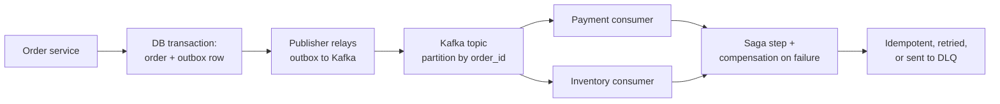

# Backend Architecture, Distributed Systems, Kafka, Microservices, and Events

> **Interview answer (say this first).** Distributed systems exist because one machine cannot do everything: it fails, it is too small, or it is too far away. That forces trade-offs. The CAP theorem says that during a network partition you choose consistency or availability, so you choose per operation, not per company. Networks duplicate and reorder messages, so every consumer must be **idempotent** and every producer must assume at-least-once delivery. Kafka gives ordering **within a partition** and scales by adding partitions and consumers in a group, so the partition key is what determines both ordering and parallelism. Microservices buy independent deployment and team autonomy at the cost of network calls, partial failure, and distributed data; a modular monolith is often the right starting point. Event-driven design uses events to decouple producers from consumers, and you keep the write and the event consistent with the **transactional outbox**, then coordinate multi-step work with a **saga** instead of a distributed transaction. Retries need backoff and jitter, a circuit breaker stops hammering a failing dependency, and a dead-letter queue holds what cannot be processed.

> **Note:**
>
> **Verified.** Every runnable example on this page was executed offline in plain Python (Python 3.14). No Kafka broker, database, or network call was made; the examples model the mechanics in standard library code.

## Why this exists

This is the round where interviewers separate people who have read about Kafka from people who have operated it. The definitions are easy; the failure modes are not. What happens when a consumer is slow and the group rebalances mid-batch? What happens when a retry storm brings down a dependency that was merely slow? What happens when a service writes to its database and the event publish fails?

Every answer in this area should end with a failure mode. "Kafka gives ordering" is incomplete; "Kafka gives ordering within a partition, so I key by the entity to keep that entity's events ordered" is the answer. "Use a transaction" becomes "use an outbox, because the database and the broker cannot participate in one transaction".

This page is a question bank, not a tutorial. It assumes Phase 6 — Distributed Systems for AI, especially Consistency and the CAP Theorem, Kafka, Delivery Guarantees, Idempotency, Saga Pattern and Transactional Outbox, Retries Backoff Jitter and Timeouts, and Circuit Breakers and Bulkheads. Where an answer needs depth, follow the pointer.

> **The one-sentence purpose.** Name the guarantee, the failure it does not cover, and the mechanism that closes the gap.

## Start from zero

Learn these words first. They are used loosely in conversation and precisely in interviews.

| Word | Plain meaning |
| --- | --- |
| **CAP theorem** | During a network partition, a system must choose consistency or availability. |
| **Partition** | A network split where parts of the system cannot talk to each other. |
| **Strong consistency** | Every reader sees the latest committed write. |
| **Eventual consistency** | Replicas converge given time; readers may see stale data briefly. |
| **Idempotency** | Doing the same operation twice has the same effect as doing it once. |
| **At-most-once** | A message may be lost, never duplicated. |
| **At-least-once** | A message is never lost, may be duplicated. The practical default. |
| **Exactly-once** | Neither lost nor duplicated; approximated end to end with idempotency. |
| **Topic** | A named stream of messages in Kafka. |
| **Partition** | An ordered, append-only subset of a topic. The unit of parallelism. |
| **Offset** | A message's position in a partition; how a consumer tracks progress. |
| **Key** | The value that decides which partition a message goes to. |
| **Producer** | The client that writes messages to a topic. |
| **Consumer group** | Consumers sharing a topic, each partition assigned to one member. |
| **Rebalance** | Reassigning partitions when a group member joins or leaves. |
| **Ack** | A producer durability setting: `0`, `1`, or `all`. |
| **Replication factor** | How many brokers hold a copy of each partition. |
| **ISR** | In-Sync Replicas: the copies currently caught up with the leader. |
| **Microservice** | A small, independently deployable service owning its own data. |
| **Monolith** | One deployable unit containing all the modules. |
| **Bounded context** | A business boundary with its own language and data model. |
| **Event** | A fact about something that already happened, named in the past tense. |
| **Event sourcing** | Storing the sequence of events as the source of truth, not just the state. |
| **Saga** | A multi-step business process with compensating actions instead of one transaction. |
| **Choreography** | Services react to events; no central coordinator. |
| **Orchestration** | A coordinator tells each service what step to run next. |
| **Outbox** | A table that stores events in the same transaction as the state change. |
| **CDC** | Change Data Capture: reading a database's write log to publish changes. |
| **Backoff** | Waiting longer between retries. |
| **Jitter** | Randomising backoff so retries do not synchronise. |
| **Circuit breaker** | A switch that stops calls to a failing dependency for a while. |
| **Bulkhead** | Isolating resources so one failure cannot consume them all. |
| **DLQ** | Dead-Letter Queue: where unprocessable messages are parked. |
| **Backpressure** | Slowing producers when consumers cannot keep up. |

Three distinctions matter most:

- **At-least-once versus exactly-once.** True end-to-end exactly-once is a property you engineer with idempotent writes, not a toggle you switch on. Plan for duplicates.
- **Ordering versus throughput.** Ordering is per partition. More partitions means more parallelism and less global order, so you key by the entity whose order you must preserve.
- **Monolith versus microservices.** A monolith is one deployable and one transaction; microservices are many deploys and no shared transaction. That trade is about team topology and failure isolation, not code size.

## The core idea

Think of a postal system.

A sender writes a letter and drops it in a mailbox (the **producer**). The post office sorts letters into routes (**partitions**) by the postcode (**key**). Each route is delivered in order by one carrier at a time (**a partition is consumed by one member of a consumer group**). The sender gets a receipt when the letter reaches the office (**ack**), but the recipient may still receive a copy twice if a truck is reloaded (**at-least-once**). The reader must therefore tolerate a duplicate letter (**idempotent consumer**).

For coordination across services, think of a relay race with a receipt. You cannot make two runners hold the baton at once, so instead each writes down "I finished my leg" in the same notebook as their work (**the outbox**), and a courier carries that note onward. If the note is lost, the notebook still has it; if the note arrives twice, the next runner recognises it.



Two features matter. The outbox makes the state change and the event atomic, because they share one database transaction. The consumer side is where duplicates and failures land, so it must be idempotent, retry with backoff, and dead-letter what it cannot handle.

| Choice | You gain | You give up |
| --- | --- | --- |
| **CP during a partition** | Correctness: no divergent writes | Availability: some requests fail |
| **AP during a partition** | Availability: writes are accepted | Immediate consistency: reconcile later |
| **More partitions** | Parallelism and throughput | Global order and more overhead |
| **Strong ordering** | Simple reasoning | Scaling limited to one partition |
| **Microservices** | Independent deploy, isolation, team autonomy | Transactions, latency, operational load |
| **Events** | Loose coupling, replay, audit | Eventual consistency, schema evolution |

> **The mental model in one line.** The network will duplicate and reorder messages, so make the consumer idempotent, key by the entity that needs ordering, and keep state and events in one transaction with an outbox.

## How it works

Follow one business action through a distributed system.

1. **A request arrives at one service.** The service handles it locally; it does not call five other services synchronously to complete the write.
2. **The state change and the event are written together.** The service inserts the order row and an outbox row in one database transaction, so either both exist or neither does.
3. **A relay publishes the outbox.** A separate process reads unsent outbox rows and publishes them to Kafka, then marks them sent. If it crashes between steps, it publishes again — hence at-least-once.
4. **Kafka stores the event by key.** The producer hashes the key to choose a partition, so all events for one order go to the same partition in order.
5. **A consumer group processes the partition.** Each partition is assigned to exactly one consumer in the group, giving both scale and per-key ordering.
6. **The consumer processes idempotently.** It records the message id or uses a natural key, so a redelivery changes nothing.
7. **Offsets are committed after processing.** Commit before processing loses messages; commit after gives at-least-once. This is the deliberate trade.
8. **Failures retry, then park.** Transient errors retry with backoff and jitter; permanent errors go to a dead-letter queue for inspection.
9. **A saga coordinates the steps.** Each step has a compensating action; if payment succeeds and inventory fails, the saga refunds the payment.
10. **Observability ties it together.** A correlation id flows through every event, so one trace covers the whole process.

The retry mechanism is the other half, and it is a small state machine:

1. **Retry only what is safe.** Retry transient failures; never retry a non-idempotent write unless it carries an idempotency key.
2. **Wait longer each time.** Exponential backoff gives the dependency time to recover.
3. **Add jitter.** Without randomisation, every client retries at the same instant and creates a thundering herd.
4. **Cap the wait and the attempts.** An unbounded retry loop turns a slow dependency into an outage.
5. **Open the circuit.** After a failure threshold, fail fast instead of queueing requests against a dead dependency.
6. **Half-open and probe.** After a cooldown, allow a few requests; close on success, reopen on failure.

> **The working rule.** State the guarantee, then state what it does not cover, then name the mechanism that covers the gap.

## The syntax you will use

These are real production forms. Read them once; each appears in a service or an interview answer.

**1. Produce with a key and a durability setting.** The key chooses the partition; acks choose durability.

```python
producer.send(
    "orders",
    key=str(order_id).encode(),      # same key -> same partition -> order
    value=json.dumps(event).encode(),
).get(timeout=5)                     # block for the broker acknowledgement
```

With `acks=all` the write waits for all in-sync replicas; `acks=1` waits only for the leader.

**2. Consume as a group with manual commit.** Process first, then commit.

```python
consumer.subscribe(["orders"])
for msg in consumer:
    handle(msg)                      # must be idempotent
    consumer.commit()                # commit after success -> at-least-once
```

Auto-commit can acknowledge a message before your handler finishes, losing it on a crash.

**3. The outbox insert.** The state change and the event share one transaction.

```sql
BEGIN;
INSERT INTO orders (id, user_id, total, status) VALUES ($1, $2, $3, 'placed');
INSERT INTO outbox (id, aggregate_id, type, payload)
VALUES (gen_random_uuid(), $1, 'OrderPlaced', $4);
COMMIT;
```

The relay can always find unsent rows; the broker is never in the critical path of the transaction.

**4. An idempotent consumer.** A unique constraint turns a duplicate into a no-op.

```sql
INSERT INTO processed_messages (message_id) VALUES ($1)
ON CONFLICT (message_id) DO NOTHING;
-- row count 0 means "already processed, skip the side effect"
```

This works only if the dedup insert and the side effect commit in the same transaction.

**5. A saga with a compensation path.** Each step names its undo.

```text
1. reserve inventory      -> compensate: release inventory
2. charge payment         -> compensate: refund payment
3. create shipment        -> compensate: cancel shipment
on failure at step N: run compensations for steps N-1 .. 1 in reverse
```

Compensating actions must themselves be idempotent, because the saga may retry them.

**6. Retry with exponential backoff and full jitter.** The randomisation prevents synchronised retries.

```python
delay = random.uniform(0, min(cap, base * 2 ** attempt))
time.sleep(delay)
```

Full jitter spreads retries over the whole interval; it is the most effective simple strategy.

**7. A circuit breaker's three states.** Closed normally, open on failure, half-open to probe.

```python
if breaker.state == "open":
    raise FailFast                       # do not call the dead dependency
elif breaker.state == "half_open":
    probe_one_request()                  # close on success, reopen on failure
else:
    call_dependency()                    # count failures, trip at the threshold
```

Fail fast protects the caller's threads and lets the dependency recover.

**8. A dead-letter topic.** Messages that cannot be processed are preserved, not dropped.

```text
orders.DLT: original message + error + stack trace + attempt count + timestamp
```

Alert on DLT depth; a growing DLT is a silent data-loss path if nobody looks.

**9. A consumer group's partition assignment.** Each partition has exactly one owner in the group.

```text
Topic orders: partitions 0,1,2,3,4,5,6,7
Group billing (3 members) -> member A: [0,1,2] | B: [3,4,5] | C: [6,7]
```

More members than partitions leaves the extra members idle; partition count is the scaling ceiling.

**10. A CAP decision, made per operation.** State which way you lean and why.

```text
payments ledger:      CP  -> refuse a write when quorum is lost
typing indicator:     AP  -> accept and reconcile later
```

Choosing one model for the whole system over-constrains some parts and under-protects others.

## Examples: simple to real

Six graded examples: three distributed mechanics, then three failure-handling patterns. All outputs are real.

**Example 1 — exponential backoff with full jitter.** The randomisation is the important part.

```python
import random

def backoff_delays(base, cap, attempts, seed=0):
    rng = random.Random(seed)
    out = []
    for a in range(attempts):
        upper = min(cap, base * (2 ** a))
        out.append(round(rng.uniform(0, upper), 3))
    return out

print(backoff_delays(0.5, 8, 5))
# [0.422, 0.758, 0.841, 1.036, 4.09]
```

The ceiling doubles each attempt, but the actual wait is random within it. **Without jitter, a fleet of clients that failed together retries together.**

**Example 2 — consumer group partition assignment.** The group's parallelism is bounded by the partition count.

```python
def assign_range(partitions, consumers):
    out = {c: [] for c in consumers}
    per, extra = divmod(len(partitions), len(consumers))
    i = 0
    for idx, c in enumerate(consumers):
        n = per + (1 if idx < extra else 0)
        out[c] = partitions[i:i + n]
        i += n
    return out

print(assign_range(list(range(8)), ["c1", "c2", "c3"]))
# {'c1': [0, 1, 2], 'c2': [3, 4, 5], 'c3': [6, 7]}
```

Eight partitions across three consumers gives `3, 3, 2`. **Add a fourth consumer and the group rebalances to `2, 2, 2, 2`** — a member is only idle once there are more consumers than partitions.

**Example 3 — a circuit breaker.** It protects the caller and gives the dependency room to recover.

```python
class Breaker:
    def __init__(self, threshold=3):
        self.threshold = threshold
        self.fails = 0
        self.state = "closed"
    def call(self, ok):
        if self.state == "open":
            return "rejected"            # fail fast
        if ok:
            self.fails = 0
            self.state = "closed"
            return "ok"
        self.fails += 1
        if self.fails >= self.threshold:
            self.state = "open"
        return "failed" if self.state == "closed" else "tripped"

b = Breaker()
print([b.call(False) for _ in range(3)], b.call(True))  # ['failed', 'failed', 'tripped'] rejected
```

After three failures the breaker opens and rejects calls. **A breaker without a half-open probe never recovers**, and one with too low a threshold trips on normal noise.

**Example 4 — an idempotent consumer.** Duplicates are expected, so make them harmless.

```python
seen = set()

def consume(msg_id, apply):
    if msg_id in seen:
        return "duplicate-ignored"
    seen.add(msg_id)
    apply()
    return "applied"

applied = []
print(consume("m1", lambda: applied.append("m1")),      # applied
      consume("m1", lambda: applied.append("m1")),      # duplicate-ignored
      applied)                                           # ['m1']
```

The dedup record must commit with the side effect. **If the side effect commits and the dedup record does not, a redelivery applies it twice** — the outbox pattern avoids that by writing both together.

**Example 5 — the transactional outbox.** One local transaction, then a relay.

```python
def place_order(tx, order):
    tx["orders"].append(order)
    tx["outbox"].append({"type": "OrderPlaced", "order_id": order["id"]})
    return tx

tx = {"orders": [], "outbox": []}
print(place_order(tx, {"id": 1})["outbox"])
# [{'type': 'OrderPlaced', 'order_id': 1}]
```

The two writes cannot diverge because they share the transaction. **Publishing directly to Kafka inside the request is the dual-write bug**: the database commit can succeed while the publish fails, silently losing the event.

**Example 6 — a saga, step by step.** Distributed work without a distributed transaction.

```text
Forward:     reserve -> charge -> ship
On failure:  run compensations in reverse: un-ship -> refund -> release
```

The saga is not atomic; it is **eventually consistent**. Every step and every compensation must be idempotent, because retries and crashes can replay either.

## In production

- **Assume at-least-once and write idempotent consumers.** A duplicate is the normal case after any retry, rebalance, or crash. Design for it instead of hoping.
- **Key by the entity whose order matters.** Orders for one customer must share a partition; global ordering across a topic is not available without collapsing to one partition.
- **Do not create more consumers than partitions.** Extra members sit idle; scale partitions first, and remember that partitions cannot be reduced and reshuffling changes key assignment.
- **Commit offsets after processing, not before.** Auto-commit can acknowledge a message your handler has not finished, losing it on a crash.
- **Use the transactional outbox for any state-change-plus-event.** Directly publishing inside a request is the dual-write bug: the commit succeeds and the event is lost.
- **Make dedup atomic with the side effect.** A separate dedup store that can fail independently reintroduces duplicates.
- **Add jitter to every retry.** Synchronised retries from many clients turn a blip into a thundering herd and can keep a dependency down.
- **Trip a circuit breaker on a failure threshold, and probe to recover.** Fail fast while the dependency is down; never queue requests against it.
- **Bound retries, send the rest to a DLQ, and alert on DLQ depth and consumer lag.** An unbounded retry loop hides a permanent bug and burns resources forever; a quiet DLQ with no alert is a data-loss channel, and lag that only grows means consumers cannot keep up.
- **Watch for rebalance storms.** Frequent rebalances pause consumption, so use cooperative rebalancing and static membership. **Event schemas are APIs.** Version them, prefer additive changes, and never rename a field in place — old consumers break silently.
- **Start with the monolith and split on real pressure.** Team autonomy, independent scaling, or fault isolation justify a split; "microservices are best practice" does not.
- **Keep saga compensations idempotent and observable.** A half-finished saga with no trace is the hardest incident to debug.

## Interview questions

### 1. What does CAP really say, and how do you apply it?

**Answer.** CAP says that during a network partition — when two parts of the system cannot communicate — a distributed system must choose consistency or availability. It is not a choice among three things at all times; partition tolerance is a given in a real network. Consistency here means linearisability: every read sees the latest write. Availability means every request gets a non-error response. So during a partition you either refuse some writes to stay correct (CP) or accept them and reconcile later (AP). I apply it per operation: a payments ledger is CP, a presence indicator is AP.

**Follow-up: "What does PACELC add?"** It adds that even without a partition you still trade latency against consistency: strong consistency costs coordination round trips. Most of the time you are making the latency choice, not the partition choice.

**Trap.** Reciting "pick two of three". Partition tolerance is not optional on a network; the real decision is what to do while partitioned, and it can differ per operation.

### 2. How do you handle duplicates and delivery guarantees?

**Answer.** I assume at-least-once delivery, because that is what a network with retries and rebalances gives you. At-most-once can lose messages; true exactly-once across arbitrary systems is not achievable, but **effectively-once** is, by making the consumer idempotent. I dedup on a message id or a natural business key, and I make the dedup record commit in the same transaction as the side effect. Where the operation is naturally idempotent, such as `SET status = 'shipped'`, nothing extra is needed.

**Follow-up: "Does Kafka's exactly-once mode solve it end to end?"** It solves it inside Kafka: an idempotent producer plus transactions, with consumers reading only committed messages. The moment you write to an external database, the guarantee stops at the boundary, so the sink must still be idempotent.

**Trap.** Saying "Kafka is exactly-once" and stopping there. The guarantee is within Kafka and dies at the external side effect.

### 3. How does Kafka ordering work, and how do you scale it?

**Answer.** A topic is split into partitions, and each partition is an append-only log with a total order. Kafka guarantees order within a partition, not across the topic. The producer's key is hashed to choose a partition, so all messages with the same key land in the same partition in order. That is how you get per-entity ordering — key by `order_id` or `user_id`. To scale, add partitions and consumers; the partition count is the parallelism ceiling. The trade is that more partitions means less global order and more rebalance overhead.

**Follow-up: "What if you need global order?"** Use a single partition. That serialises the whole stream through one consumer, so it is fine only if the throughput fits through one partition — the cost is lost parallelism, though replication can still keep the partition available.

**Trap.** Assuming increasing partitions preserves key-to-partition mapping. Adding partitions changes the hash mapping, so the same key can move; plan the partition count early and key deliberately.

### 4. What is a consumer group, and what happens during a rebalance?

**Answer.** A consumer group is a set of consumers that cooperatively read a topic. Each partition is assigned to exactly one member, so the group processes each message once as a group while still scaling across partitions. When a member joins, leaves, or is judged dead, the group rebalances and reassigns partitions. During the rebalance, consumption pauses, which creates lag. Committed offsets survive the rebalance, so the new owner resumes from the last commit; because that commit can lag processing, some messages are reprocessed.

**Follow-up: "How do you reduce rebalance pain?"** Use cooperative rebalancing so only affected partitions move instead of stopping the world, set a sensible session timeout so a slow consumer is not evicted, and use static membership to avoid a rebalance when a known consumer restarts.

**Trap.** Running more consumers than partitions and expecting more throughput. The extras stay idle.

### 5. How do you keep data consistent across services without a distributed transaction?

**Answer.** Two mechanisms. First, the transactional outbox: the service writes its state change and an outbox row in one local transaction, and a relay publishes the outbox to the broker. That removes the dual-write bug and guarantees the event is eventually published. Second, a saga: the multi-step business process is a sequence of local transactions, each with a compensating action. If a later step fails, the saga runs the compensations in reverse. The result is eventually consistent, not atomic, so every step and compensation must be idempotent and observable.

**Follow-up: "Choreography or orchestration?"** Choreography — services react to events — is loosely coupled and good for simple flows but hard to trace. Orchestration — a coordinator drives the steps — is easier to reason about and to observe, at the cost of a central component. Start with orchestration for complex or long-running sagas.

**Trap.** Trying to use a two-phase commit across services. It couples them, blocks on the slowest participant, and breaks under partition; the industry moved to sagas and outbox precisely because of that.

### 6. How do you retry safely?

**Answer.** Retry only transient, idempotent operations. Use exponential backoff with jitter so clients do not retry in lockstep, cap the number of attempts and the maximum wait, and stop retrying permanent errors such as validation failures. Wrap the dependency in a circuit breaker so that after a failure threshold you fail fast instead of queueing requests against a dead service, and probe with a half-open state to recover. Park what still fails in a dead-letter queue with the error context, and alert on its depth.

**Follow-up: "Why jitter, not just backoff?"** Backoff spreads one client's retries, but if a thousand clients all failed at the same moment they will still retry together at each backoff step. Jitter randomises within the interval and breaks the synchronisation.

**Trap.** Retrying on every error type. Retrying a `400` or a non-idempotent write just repeats the failure and can duplicate a side effect.

### 7. Microservices versus monolith — how do you decide?

**Answer.** A monolith is one deployable with one database and one transaction; it is simple, fast to change, and easy to reason about. Microservices split the system into independently deployable services that own their data, which buys independent scaling, fault isolation, and team autonomy. The cost is network latency, partial failure, distributed data, and real operational overhead. I decide from concrete pressure: multiple teams stepping on each other in one deploy, a component with a wildly different scaling profile, or a fault domain that must be isolated. Otherwise I stay with a well-structured modular monolith and draw the seams so a later split is cheap.

**Follow-up: "How do you keep a modular monolith split-ready?"** Enforce module boundaries in code, keep each module's data behind its own interface, and avoid cross-module joins so a future service can own its tables.

**Trap.** Choosing microservices for the résumé. A two-person team running ten services on a strict deadline ships slower and pages more than the same team running one service.

### 8. When are microservices the wrong answer?

**Answer.** When the domain boundaries are not understood yet, when the team is small, when the workload is low and uniform, or when the requirement is a single transaction across what would become several services. Early-stage products discover their boundaries by changing them, and a distributed system makes every change expensive. If you cannot state the bounded context and the data ownership, you are not ready to split. The honest answer is: start as a modular monolith, measure the pressure, and extract a service when a real constraint — independent scaling, fault isolation, or team boundaries — demands it.

**Follow-up: "What would make you split one out later?"** A module whose load profile is very different, a module that needs a different availability or compliance boundary, or a team that cannot ship without coordinating every deploy.

**Trap.** Confusing code size with architecture. A 200,000-line monolith with clean module boundaries is often healthier than twenty services sharing three databases.

## Remember this

- **CAP is per operation, during a partition.** Refuse writes to stay correct, or accept and reconcile; choose per feature, not per company.
- **Assume at-least-once and be idempotent.** Exactly-once inside Kafka stops at the external side effect, so the sink must dedup.
- **Ordering is per partition.** Key by the entity that needs order; partition count is both the parallelism ceiling and the ordering unit.
- **Never dual-write.** Write state and event in one transaction via the outbox, then publish; coordinate steps with an idempotent saga.
- **Retry only transient work, with backoff and jitter, behind a circuit breaker.** Park permanent failures in a DLQ and alert on it.
