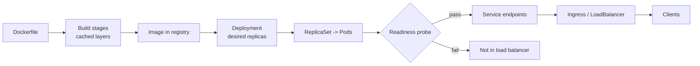

# Infrastructure Interviews: Docker, Kubernetes, AWS

> **Interview answer (say this first).** These three topics are one pipeline. Docker packages an application and its dependencies into an immutable **image** built from cached **layers**; a multi-stage build keeps the final image small, and the container should run as a non-root user with a process that handles signals as **PID 1**. Kubernetes takes that image and runs it as **pods**, managed by a **deployment** that performs rolling updates through a **ReplicaSet**, fronted by a **service** and probed by **liveness**, **readiness**, and **startup** checks. Requests and limits decide scheduling, throttling, and eviction, and the **HPA** scales replicas from metrics. AWS provides the underlying primitives: **IAM** for identity and least privilege, **VPC** for network isolation, compute such as EC2, ECS, EKS, and Lambda, storage such as S3, EBS, and RDS, messaging such as SQS, SNS, EventBridge, and Kinesis, and observability through CloudWatch, X-Ray, and CloudTrail. In an interview I connect each choice to the failure it prevents and the cost it adds.

> **Note:**
>
> **Verified.** Every runnable example on this page was executed offline in plain Python (Python 3.14). No container runtime, cluster, or cloud account was contacted; the examples model the arithmetic and mechanics in standard library code. No vendor prices or service limits are asserted.

## Why this exists

Infrastructure interviews catch two kinds of candidate. The first can write a Dockerfile but cannot explain why the image is 1.2 GB, or why the container ignores `SIGTERM` and gets killed after a timeout. The second can recite Kubernetes objects but cannot say when a pod is evicted, why the HPA is not scaling, or what a readiness probe actually removes the pod from.

The questions are really about failure and cost. A layer order decides build time. A probe decides whether traffic reaches a starting pod. A resource limit decides whether the kernel throttles or kills the container. An IAM policy decides the blast radius of a leaked key. Every answer should say what the mechanism does and what breaks without it.

This page is a question bank, not a tutorial. It assumes Phase 7 — AI Platform Engineering, especially Docker and Docker Compose, Kubernetes Core, Kubernetes Workloads, Kubernetes Networking and Scaling, AWS Fundamentals IAM and VPC, AWS Compute, AWS Storage and Databases, AWS Messaging and AI, and AWS Operations. Where an answer needs depth, follow the pointer.

> **The one-sentence purpose.** Answer each infrastructure question as "what it does, what it prevents, and what it costs" — then name the failure mode when it is missing.

## Start from zero

Learn these words first. They are used loosely in conversation and precisely in interviews.

| Word | Plain meaning |
| --- | --- |
| **Image** | An immutable, layered filesystem plus metadata used to start containers. |
| **Container** | A running process isolated by kernel namespaces and cgroups. |
| **Layer** | A filesystem diff created by one build instruction; layers are cached and shared. |
| **Registry** | A store for images, such as a private registry or a public hub. |
| **Dockerfile** | The recipe that builds an image, instruction by instruction. |
| **Multi-stage build** | A Dockerfile with several `FROM` stages; only the final stage is shipped. |
| **Build context** | The files sent to the builder; smaller context means faster builds. |
| **PID 1** | The first process in a container; it must reap children and handle signals. |
| **Non-root** | Running the container process as an unprivileged user. |
| **Pod** | One or more containers sharing a network namespace and volumes; the smallest unit. |
| **Deployment** | A controller that manages ReplicaSets and performs rolling updates. |
| **ReplicaSet** | A controller that keeps a specified number of identical pods running. |
| **Service** | A stable virtual IP and DNS name that load-balances across ready pods. |
| **Ingress** | An HTTP(S) entry point that routes external traffic to services. |
| **ClusterIP / NodePort / LoadBalancer** | The service types: internal, per-node port, and cloud load balancer. |
| **ConfigMap** | Non-secret configuration injected as environment variables or files. |
| **Secret** | Configuration for sensitive values; base64-encoded, not encrypted by default. |
| **Liveness probe** | Restarts the container when the check fails. |
| **Readiness probe** | Removes the pod from service endpoints when the check fails. |
| **Startup probe** | Protects slow-starting apps from liveness restarts. |
| **Request** | The resource amount reserved for scheduling. |
| **Limit** | The maximum the container may use before throttling or being killed. |
| **QoS class** | Guaranteed, Burstable, or BestEffort, derived from requests and limits. |
| **HPA** | Horizontal Pod Autoscaler: adjusts replica count from metrics. |
| **Taint / toleration** | A node repels pods unless the pod tolerates the taint. |
| **Affinity** | Rules that attract or repel pods to nodes or to each other. |
| **IAM** | AWS Identity and Access Management: who may do what to which resource. |
| **Role** | An identity that services and users assume to get temporary credentials. |
| **Policy** | A JSON document with `Allow` and `Deny` statements. |
| **VPC** | A private network in one AWS region, divided into subnets. |
| **Subnet** | A CIDR range in one Availability Zone; public or private. |
| **Security group** | A stateful, allow-only firewall applied to resources. |
| **NACL** | A stateless, subnet-level firewall with allow and deny rules. |
| **Availability Zone** | An isolated data-centre group within a region. |

Three distinctions matter most:

- **Image vs container.** The image is the immutable template; the container is one running instance. Rebuilding the image is how you change the app; restarting the container is not.
- **Readiness vs liveness.** Readiness controls traffic; liveness controls restarts. Confusing them sends traffic to a starting pod or restarts a healthy one under load.
- **Request vs limit.** The request is what the scheduler reserves; the limit is what the kernel enforces. Setting them equal gives Guaranteed QoS; a memory limit that is too low causes OOM kills.

## The core idea

Think of shipping freight.

Docker is the **container standard**: you pack your goods and everything they need into a standard box, so any port can move it without opening it. The box is sealed (immutable image), and each layer you added is a shelf in the box; if you change what is on the top shelf, the lower shelves are untouched and can be reused from the last shipment (the build cache). Kubernetes is the **port authority**: it decides where each box is placed (scheduling), keeps the promised number of boxes moving (ReplicaSet), routes trucks to dock doors (service), and removes a box from the queue while it is being repaired (readiness). AWS is the **land, power, and shipping lanes**: the network, the buildings, and the identity badges that decide who may enter which dock.

The build-to-traffic path is the mental model:



The probe gates are the part candidates under-explain. A pod can be `Running` and receive no traffic because it is not `Ready`; a pod can be `Ready` and still be killed because the liveness probe fails.

| Layer | What it owns | The failure without it |
| --- | --- | --- |
| **Docker** | Packaging, image layers, the process contract | Huge images, signal loss, zombie processes |
| **Kubernetes** | Scheduling, scaling, health, rollout | Traffic to dead pods, no zero-downtime deploy |
| **AWS IAM** | Identity and least privilege | One leaked key owns the account |
| **AWS VPC** | Network isolation and routing | Databases exposed to the internet |
| **AWS compute/storage/messaging** | Durability, capacity, decoupling | Data loss, tight coupling, scale cliffs |

> **The mental model in one line.** Docker is the standard box, Kubernetes is the port authority that places and repairs boxes, and AWS is the land, power, and badges underneath.

## How it works

Follow one release from a commit to live traffic.

1. **Build the image in stages and order it for cache reuse.** A builder stage installs compilers and dependencies; the final stage copies only the artifact, and dependency manifests are installed before application code so editing code does not re-resolve dependencies.
2. **Push the immutable tag to a registry.** Deploy by digest or a unique tag, never a floating `latest`, so a rollout is reproducible.
3. **The deployment creates a ReplicaSet.** The desired replica count becomes pods; the scheduler places each pod on a node that satisfies requests, affinity, and taints.
4. **The pod starts and is probed.** A startup probe covers slow boots; a readiness probe must pass before the pod joins the service's endpoints; a liveness probe restarts a stuck process.
5. **The service routes traffic.** The service selects ready pods by label and load-balances across them; ingress or a cloud load balancer exposes it externally.
6. **The rollout proceeds within budget.** `maxSurge` adds new pods and `maxUnavailable` removes old ones, so capacity never drops below the allowed floor.
7. **The HPA reacts to load.** It computes desired replicas from the current metric and the target, then the deployment adjusts.
8. **Logs and metrics flow out, and a failed rollout rolls back.** Containers write to stdout and stderr for collection, and deployment revisions make `kubectl rollout undo` a first-class operation.

The resource-and-probe mechanism is where most production incidents live:

1. **Requests schedule, limits enforce.** The scheduler only places a pod on a node with enough unreserved CPU and memory, and the kernel throttles CPU over the limit or kills the container when memory exceeds it (OOMKill).
2. **QoS follows from the numbers.** Requests equal to limits for every container gives Guaranteed; some set gives Burstable; none gives BestEffort, and under node memory pressure the lower classes are evicted first.
3. **Readiness gates traffic, liveness gates restarts.** A failing readiness probe removes the pod from endpoints without restarting it; a failing liveness probe restarts the container, so it must test the process, not a downstream dependency.

> **The working rule.** For every infrastructure answer, say what the mechanism enforces and what breaks when it is wrong or absent.

## The syntax you will use

These are real production forms. Read them once; each appears in a repository or a cluster.

**1. A multi-stage Dockerfile with a non-root user.** Build with the toolchain, ship without it.

```dockerfile
FROM python:3.12-slim AS builder
WORKDIR /app
COPY requirements.txt .
RUN pip install --no-cache-dir -r requirements.txt

FROM python:3.12-slim
WORKDIR /app
COPY --from=builder /usr/local/lib/python3.12/site-packages /usr/local/lib/python3.12/site-packages
COPY . .
USER 10001                                   # non-root
ENTRYPOINT ["python", "-m", "app"]           # exec form: signals reach PID 1
```

`COPY --from=builder` takes only the installed packages; the compilers stay behind.

**2. Order instructions to protect the cache, and shrink the context.** Dependencies first, source last.

```dockerfile
COPY requirements.txt .        # changes rarely
RUN pip install -r requirements.txt
COPY . .                       # changes often; only this layer rebuilds
HEALTHCHECK --interval=30s --timeout=3s CMD python -c "import httpx; httpx.get('http://localhost:8000/health')"
```

A source edit invalidates only the last layer, and a `.dockerignore` listing `.git`, `.venv`, and `tests` keeps the build context small and out of the image.

**3. A deployment with probes and resources.** The three numbers and three probes that matter most.

```yaml
spec:
  replicas: 4
  strategy:
    rollingUpdate: { maxSurge: 1, maxUnavailable: 0 }
  template:
    spec:
      containers:
        - name: api
          image: registry.example.com/api@sha256:abc123
          resources:
            requests: { cpu: "250m", memory: "256Mi" }
            limits:   { cpu: "1",    memory: "512Mi" }
          readinessProbe: { httpGet: { path: /ready, port: 8000 }, periodSeconds: 5 }
          livenessProbe:  { httpGet: { path: /health, port: 8000 }, periodSeconds: 10 }
          startupProbe:   { httpGet: { path: /health, port: 8000 }, failureThreshold: 30 }
```

`maxUnavailable: 0` guarantees no capacity drop; the startup probe prevents a slow boot from being killed.

**4. A service and an HPA.** Stable addressing plus automatic scaling.

```yaml
apiVersion: v1
kind: Service
metadata: { name: api }
spec:
  selector: { app: api }
  ports: [{ port: 80, targetPort: 8000 }]
---
apiVersion: autoscaling/v2
kind: HorizontalPodAutoscaler
spec:
  scaleTargetRef: { apiVersion: apps/v1, kind: Deployment, name: api }
  minReplicas: 2
  maxReplicas: 10
  metrics: [{ type: Resource, resource: { name: cpu, target: { type: Utilization, averageUtilization: 50 } } }]
```

The HPA only sees pods whose metrics it can read, and it needs `metrics-server` or a custom metrics adapter.

**5. A ConfigMap and a Secret mounted as files.** Configuration separated from the image.

```yaml
apiVersion: v1
kind: ConfigMap
metadata: { name: api-config }
data:
  LOG_LEVEL: "info"
---
apiVersion: v1
kind: Secret
metadata: { name: api-secrets }
type: Opaque
stringData:
  DATABASE_URL: "postgres://..."
```

Secrets are base64-encoded, not encrypted by default; enable encryption at rest and lock down RBAC.

**6. Scheduling controls.** Place pods deliberately on the right nodes.

```yaml
nodeSelector: { disktype: ssd }
tolerations:
  - key: "gpu"
    operator: "Equal"
    value: "true"
    effect: "NoSchedule"
affinity:
  podAntiAffinity:
    requiredDuringSchedulingIgnoredDuringExecution:
      - labelSelector: { matchLabels: { app: api } }
        topologyKey: kubernetes.io/hostname     # spread replicas across nodes
```

Anti-affinity prevents all replicas landing on one node and turning a node failure into an outage.

**7. An IAM least-privilege policy.** Explicit actions on explicit resources, explicit deny wins.

```json
{
  "Version": "2012-10-17",
  "Statement": [
    { "Effect": "Allow", "Action": ["s3:GetObject"], "Resource": "arn:aws:s3:::my-bucket/reports/*" },
    { "Effect": "Deny",  "Action": ["s3:DeleteObject"], "Resource": "arn:aws:s3:::my-bucket/*" }
  ]
}
```

The `Deny` overrides any `Allow`; wildcard `Action` and `Resource` are how blast radius grows.

**8. A VPC with public and private subnets.** Only the load balancer is public.

```text
VPC 10.0.0.0/16
  public  10.0.0.0/24   (AZ-a)  -> internet gateway
  public  10.0.1.0/24   (AZ-b)  -> internet gateway
  private 10.0.10.0/24  (AZ-a)  -> NAT gateway for egress
  private 10.0.11.0/24  (AZ-b)  -> NAT gateway for egress
```

The database lives in private subnets; the NAT gateway lets private instances pull updates without accepting inbound traffic.

**9. Messaging with a visibility timeout, and observability.** Retries for queues; metrics and audit for the account.

```text
SQS:  ReceiveMessage -> visibility timeout starts (e.g. 30s)
        success -> DeleteMessage; failure -> reappears; after maxReceiveCount -> DLQ
CloudWatch alarm: ApproximateNumberOfMessagesVisible > N for 5 minutes -> notify
CloudTrail: management API calls by default (data events are opt-in), who made them, from where, and when
```

If processing can exceed the visibility timeout, extend it, or the message is delivered again while you are still working. Metrics tell you the system is unhealthy; CloudTrail tells you who changed it.

## Examples: simple to real

Six graded examples: three container and cluster mechanics, then three AWS and delivery mechanics. All outputs are real.

**Example 1 — image layers and deduplication.** Only changed layers are rebuilt and transferred.

```python
def image_size(layers):
    seen, total = set(), 0
    for name, size in layers:
        if name not in seen:          # shared layer counted once
            seen.add(name)
            total += size
    return total

print(image_size([("base", 100), ("deps", 200), ("app", 30)]))    # 330
print(image_size([("base", 100), ("deps", 200), ("app", 35)]))   # 335
```

Changing `app` added 5 MB, not 330; the base and dependency layers are reused. **Putting `COPY . .` before `pip install` invalidates the dependency layer on every code change.**

**Example 2 — HPA desired replicas.** Scale on a ratio, clamped to the bounds.

```python
import math

def desired_replicas(current, current_metric, target_metric, min_r, max_r):
    if current_metric == 0:
        return min_r
    raw = math.ceil(current * current_metric / target_metric)
    return max(min_r, min(max_r, raw))

print(desired_replicas(4, 80, 50, 2, 10))   # 7  (above target, scale up)
print(desired_replicas(4, 20, 50, 2, 10))   # 2  (below target, scale down to min)
```

At 80% against a 50% target, four pods become seven. **A scale-down that is too eager causes flapping**, so the HPA has a stabilisation window.

**Example 3 — container restart backoff.** A crash-looping container is restarted with growing delays.

```python
def restart_backoff(restarts, base=10, cap=300):
    return min(cap, base * (2 ** max(0, restarts - 1)))

print([restart_backoff(n) for n in range(1, 7)])
# [10, 20, 40, 80, 160, 300]
```

The delay doubles to a cap. **A pod stuck in `CrashLoopBackOff` is usually a bad config or a failing dependency**, not a scheduling problem.

**Example 4 — subnet sizing.** Each subnet must hold the pods or instances you expect.

```python
def cidr_hosts(prefix):
    return 2 ** (32 - prefix) - 2      # generic: minus network and broadcast

def aws_subnet_hosts(prefix):
    return 2 ** (32 - prefix) - 5      # AWS reserves 5 addresses per subnet

print([(p, cidr_hosts(p)) for p in (24, 25, 26, 28)])
# [(24, 254), (25, 126), (26, 62), (28, 14)]
print([(p, aws_subnet_hosts(p)) for p in (24, 25, 26, 28)])
# [(24, 251), (25, 123), (26, 59), (28, 11)]
```

Generically a `/24` gives 254 usable addresses and a `/28` gives 14, but **AWS reserves five addresses in every subnet**, so a `/24` has 251 usable and a `/28` has 11 — and `/28` is the smallest subnet AWS allows. **Running out of IPs in a subnet is a common and confusing scaling failure**, because the nodes are healthy but no new pod can get an address.

**Example 5 — IAM evaluation: explicit deny wins.** Default is deny; a `Deny` overrides any `Allow`.

```python
def allowed(identity_actions, resource_actions, requested):
    if requested in resource_actions.get("Deny", []):
        return False
    return requested in identity_actions.get("Allow", [])

print(allowed({"Allow": ["s3:GetObject"]}, {"Deny": []}, "s3:GetObject"))            # True
print(allowed({"Allow": ["s3:*"]}, {"Deny": ["s3:DeleteObject"]}, "s3:DeleteObject"))  # False
```

The second policy allows everything except deletion, and the `Deny` wins. **Least privilege means naming actions and resources**, so a leaked key cannot read every bucket in the account.

**Example 6 — rolling update capacity and readiness.** Surge and unavailability decide whether the deploy is safe.

```python
def rolling_surge(desired, max_surge, max_unavailable):
    return desired + max_surge, desired - max_unavailable

print(rolling_surge(4, 1, 0))    # (5, 4)  extra pod first, no capacity drop
print(rolling_surge(4, 0, 1))    # (4, 3)  one pod down during the rollout

endpoints = [{"pod": "a", "ready": True}, {"pod": "b", "ready": False}]
print(sum(1 for e in endpoints if e["ready"]), len(endpoints))    # 1 2
```

With `maxUnavailable: 0`, capacity never drops. **A pod that is `Running` but not `Ready` is still excluded from the service**, so a broken readiness probe looks like a sudden capacity loss.

## In production

- **Order Dockerfile layers by change frequency and use multi-stage builds.** Dependencies before source, so a one-line code change rebuilds one layer; the final stage ships without compilers and caches, which would bloat every pull and widen the vulnerability surface.
- **Use the exec form of `ENTRYPOINT` and a proper init.** Shell form wraps the process in `/bin/sh`, so `SIGTERM` is not forwarded and the pod is killed after the grace period instead of shutting down cleanly.
- **Run as non-root and read-only where possible.** A container escape is far worse as root; drop Linux capabilities the app does not need.
- **Pin images by digest, never `latest`.** A floating tag makes a rollout non-reproducible and a rollback unreliable.
- **Set requests and limits from measurement.** Missing requests make scheduling random; a memory limit below real usage causes OOMKills; a CPU limit that is too low causes throttling without any error.
- **Use readiness for traffic and liveness only for a truly stuck process.** A liveness probe that checks a downstream dependency will restart every pod during a downstream outage and turn a degradation into an outage.
- **Add a startup probe for slow boots.** It gives a slow app time without a loose liveness probe that would let a hung process linger.
- **Keep secrets out of images and ConfigMaps.** Use a secrets manager or encrypted Secrets with tight RBAC; rotation must not require a rebuild.
- **Spread replicas across nodes and zones.** Pod anti-affinity and topology spread constraints stop a single node failure from taking every replica.
- **Give IAM least privilege and prefer roles over static keys.** Services should assume a role and use temporary credentials; long-lived access keys are the most common breach vector.
- **Put data stores in private subnets.** Only the load balancer belongs in a public subnet; reach private resources through a NAT gateway or VPC endpoints.
- **Alert on queue depth, DLQ depth, and error rate together.** Depth alone is noisy; a growing DLQ is the real signal of lost work, and the visibility timeout must exceed the worst-case processing time or SQS redelivers a message still in flight.

## Interview questions

### 1. How do Docker image layers and the build cache work?

**Answer.** Each Dockerfile instruction creates a filesystem layer, and layers are content-addressed, so identical layers are shared between images and reused from the cache. During a rebuild, Docker walks instructions top to bottom and reuses a cached layer until one instruction's inputs change; from that point on, every later layer is rebuilt. That is why you copy dependency manifests and install dependencies before copying application source: a code change then only invalidates the final layer. Multi-stage builds add more layers during the build but only the final stage's layers are shipped.

**Follow-up: "What invalidates the cache?"** A changed instruction, a changed file included in a `COPY`, or a changed parent image. A broad `COPY . .` invalidates the cache whenever any file changes, including tests and docs.

**Trap.** Believing the cache is keyed by the whole image. It is keyed per layer, and one early change rebuilds everything after it.

### 2. Why use a multi-stage build, and what is the PID 1 problem?

**Answer.** A multi-stage build uses one stage with the full toolchain to compile or install, then copies only the needed artifacts into a smaller final stage. You get a much smaller image, faster pulls, and fewer packages that could contain vulnerabilities. The PID 1 problem is that the first process in a container is special: it must reap orphaned child processes and forward signals. If you use the shell form of `ENTRYPOINT`, the app runs as a child of `/bin/sh`, which does not forward `SIGTERM`, so Kubernetes sends `SIGKILL` after the grace period and the app never shuts down cleanly. The fix is the exec form, or a tiny init such as `tini`.

**Follow-up: "Does a smaller image matter much?"** Yes: it pulls faster on every node, starts faster for autoscaling, and shrinks the attack surface. It also makes the supply chain easier to scan.

**Trap.** Running as root and calling it fine because the container is "isolated". Isolation is not a security boundary you should bet a host on.

### 3. What is the difference between liveness, readiness, and startup probes?

**Answer.** The readiness probe controls traffic: when it fails, the pod is removed from the service's endpoints but is not restarted. The liveness probe controls restarts: when it fails, the kubelet restarts the container. The startup probe protects slow-starting applications by disabling liveness and readiness checks until it succeeds, so a long boot is not mistaken for a hang. Use readiness to reflect "I can serve traffic", liveness to reflect "my process is alive and not deadlocked", and startup for a slow initialisation.

**Follow-up: "What goes wrong if liveness checks a dependency?"** A slow or down database fails the liveness probe on every pod at once, so Kubernetes restarts the entire fleet and turns a degradation into a full outage. Liveness should test the process, not its dependencies.

**Trap.** Using one probe for everything, or setting no readiness probe, so traffic reaches pods that are still warming caches.

### 4. How do requests and limits affect scheduling, performance, and eviction?

**Answer.** A request is what the scheduler reserves on a node, so it decides where a pod can be placed. A limit is what the kernel enforces through cgroups: CPU over the limit is throttled, and memory over the limit triggers an OOMKill. If requests equal limits for every container, the pod is Guaranteed; if some are set, it is Burstable; if none, it is BestEffort. Under node memory pressure, the kubelet evicts BestEffort pods first, then Burstable pods that exceed their requests, and Guaranteed pods last. So the numbers are not just performance tuning; they are an eviction priority and a stability policy.

**Follow-up: "Why can a CPU-bound service be slow with plenty of CPU free?"** Because CPU limits cause throttling at the cgroup level, reported as `nr_throttled` in `cpu.stat`. A low limit can make a service slow even when the node is idle.

**Trap.** Setting limits without requests, which leaves scheduling to guesswork, or setting a memory limit below measured peak usage, which produces OOMKills under load.

### 5. How does the HPA work, and how are pods scheduled?

**Answer.** The HPA reads a metric — CPU utilisation, memory, or a custom or external metric — computes desired replicas as `ceil(current_replicas × current_metric / target_metric)`, clamps it to the min and max, and updates the deployment. It needs a metrics source such as `metrics-server`, and it has stabilisation windows to prevent flapping, especially on scale-down. Scheduling is a two-phase decision: the scheduler filters nodes that cannot fit the pod, based on requests, node selectors, affinity, and taints versus tolerations, then scores the survivors and picks the best. If a pod is `Pending`, the filter phase found no node, and the events explain why.

**Follow-up: "Why does the HPA sometimes not scale even though CPU is high?"** Because the metric is missing, the deployment is already at `maxReplicas`, or the pods have no CPU requests so utilisation cannot be computed as a percentage.

**Trap.** Assuming the HPA fixes an overloaded database. Scaling stateless pods multiplies load on a downstream bottleneck and can make the incident worse.

### 6. How do ConfigMaps, Secrets, and IAM fit together?

**Answer.** ConfigMaps hold non-sensitive configuration and Secrets hold sensitive values, both injected as environment variables or mounted files and kept out of the image so the same image runs in every environment. Secrets are base64-encoded, not encrypted by default, so you enable encryption at rest, restrict RBAC so only the right service accounts can read them, and prefer an external secrets manager. IAM is the AWS-wide version of the same idea: a role grants temporary credentials, a policy names allowed actions and resources, an explicit `Deny` overrides any `Allow`, and the default is deny. The goal is least privilege, so a leaked credential has a small blast radius.

**Follow-up: "Why prefer roles over access keys?"** Roles issue short-lived credentials that rotate automatically and are not copyable, while static access keys live in config, get committed by accident, and never expire.

**Trap.** Putting secrets in a ConfigMap or in the image. Anyone with read access to the object or the registry has the secret, and rotation requires a rebuild.

### 7. Which AWS service would you use for a given problem?

**Answer.** I choose by workload shape. For a containerised service with a steady load, ECS or EKS on EC2 or Fargate; for a short, event-driven function, Lambda; for a raw VM with full control, EC2. For relational data with transactions, RDS or Aurora; for key-value at high scale, DynamoDB; for caching, ElastiCache; for object storage and static assets, S3 with lifecycle policies; for block storage attached to one instance, EBS. For decoupling, SQS for a queue with pull-based consumers, SNS for pub/sub fan-out, EventBridge for event routing between services, and Kinesis or MSK for streaming with replay. For observability, CloudWatch for metrics and logs, X-Ray for traces, and CloudTrail for API audit.

**Follow-up: "SQS versus SNS versus EventBridge?"** SQS is a queue: each message is handed to one consumer rather than fanned out, but it is at-least-once, so consumers must be idempotent. SNS is pub/sub: many subscribers each get a copy, push-based. EventBridge is a routing layer with rules and schemas, good for decoupling many producers and consumers.

**Trap.** Choosing DynamoDB for access patterns you have not defined. Its design is driven by queries, and a poor key choice forces a painful migration.

### 8. A deployment is failing in production. How do you debug it?

**Answer.** I work from the outside in. First, is it the deploy or the platform? `kubectl rollout status` and `kubectl describe deployment` show the rollout state, and `kubectl get pods` shows `Pending`, `CrashLoopBackOff`, `ImagePullBackOff`, or `Running` but not `Ready`. `kubectl describe pod` gives the events: scheduling failure, image pull error, probe failure, or OOMKill. `kubectl logs --previous` shows why the last attempt died. Then I check whether traffic is the problem: are endpoints populated, does the readiness probe pass, is the service selector matching the pod labels? On AWS, CloudWatch metrics and alarms show whether the failure is load, latency, or errors, and CloudTrail shows recent changes such as an IAM policy or security-group edit. Finally I confirm the fix with the same signals and roll back if needed.

**Follow-up: "How do you make rollback safe?"** Deploy by immutable digest, keep database migrations backward compatible, use deployment revisions so `kubectl rollout undo` works, and treat the migration as a separate, reversible step.

**Trap.** Debugging the application first. If the pod never started, or the readiness probe fails, the application code is not running, and reading it wastes the incident.

## Remember this

- **Layers cache by instruction.** Copy dependencies before source; a multi-stage build ships only the final stage.
- **Readiness gates traffic, liveness gates restarts.** Never let a liveness probe depend on a downstream service.
- **Requests schedule, limits enforce.** CPU limits throttle, memory limits OOMKill, and QoS decides eviction order.
- **IAM is default-deny with explicit denies winning.** Prefer roles and temporary credentials over static keys.
- **Observability is part of the answer.** Rollout status, pod events, logs, CloudWatch, and CloudTrail are how you prove a fix, not just guess it.
