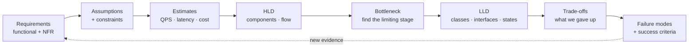

# System Design, Low-Level Design, and High-Level Design

> **Interview answer (say this first).** A system-design interview is a structured conversation, not a drawing contest. I run the same loop every time: **clarify requirements with numbers, state assumptions, estimate scale, sketch the high-level design (HLD), find the bottleneck, drill into the low-level design (LLD) of the one or two hardest components, name the trade-offs, and finish with failure modes and success criteria.** HLD answers "what are the components and how does data flow between them?" LLD answers "what are the classes, interfaces, and state machines inside one component?" I spend most of my time on the bottleneck, because that is where the interviewer learns whether I have actually built systems.

## Why this exists

Two candidates can produce the same boxes on a whiteboard and get very different scores. The difference is almost never the boxes. It is whether the candidate can answer the next question: *why this box, what happens when it fails, and how do you know it works?*

The failure pattern is predictable. The interviewer says "design a RAG service for internal documents." The candidate immediately draws a vector database, an LLM, and a cache. Then the interviewer asks:

- How many documents and how many questions per day?
- What latency do users expect?
- What happens when retrieval returns nothing?
- How do you stop one team from reading another team's documents?
- Where is the class that owns the retry logic, and what states can it be in?

The candidate has no answer, because the drawing skipped the decisions. **HLD without numbers is decoration. LLD without state is hand-waving.**

This page is a rehearsal layer. It compresses the method from Phase 11 into interview moves, then shows a full worked HLD (an AI assistant over internal documents) and a full worked LLD (a token-bucket rate limiter and an agent-loop state machine). If a step feels thin, the pointer tells you which phase page to reread.

> **The one-sentence rule.** HLD is components and flow; LLD is classes, interfaces, and state. You must be able to zoom between them on demand, and justify every zoom with a number.

## Start from zero

Every word below is used later on this page. Read the table before continuing.

| Word | Plain meaning |
| --- | --- |
| **System design interview** | An open-ended exercise: design a system, defend the choices, handle follow-ups. Usually 45–60 minutes. |
| **HLD (high-level design)** | The bird's-eye view: services, data stores, data flow, scaling, and deployment. Also called *architecture design*. |
| **LLD (low-level design)** | The close-up view of one component: classes, interfaces, fields, methods, and state transitions. Also called *object-oriented design*. |
| **Requirement** | Something the system must do (functional) or a quality it must have (non-functional). |
| **NFR** | Non-functional requirement: latency, throughput, cost, availability, privacy, quality. |
| **Assumption** | A belief you state out loud because you cannot verify it in the interview. |
| **Back-of-the-envelope estimate** | Rough arithmetic, good to an order of magnitude, that tests whether a design is feasible. |
| **QPS** | Queries per second: requests arriving per second on average. |
| **Peak factor** | How many times the average load the busiest moment is. Often 3×–10×. |
| **p95 / p99** | Percentile latency. p95 means 95% of requests finish within that time. |
| **Latency budget** | The allowed end-to-end time, split across the stages that consume it. |
| **Bottleneck** | The one stage that limits the whole system. Fixing anything else does not help. |
| **Fan-out** | One request triggering many parallel or sequential calls, such as several tool calls. |
| **Interface** | A named contract: the methods and types one component offers to another. |
| **Class** | A blueprint for objects: fields (data) plus methods (behaviour). |
| **State machine** | A model of a component as a set of states plus the transitions allowed between them. |
| **Idempotent** | Safe to run more than once with the same effect, so retries do not double-charge or double-write. |
| **Invariant** | Something that must always be true, such as "a tenant never sees another tenant's chunk". |
| **Trade-off** | Gaining one property by giving up another, such as latency for cost. |
| **Failure mode** | A specific way the system can fail: provider down, retrieval empty, agent loops, cost spike. |
| **Blast radius** | Everything affected when one component fails. |
| **Revisit trigger** | The condition that would make you change the decision: quality drops, cost rises, a better model appears. |
| **Success criterion** | A testable statement that the design worked, such as "p95 under 3 s and 98% answered without a human". |

Two distinctions matter before we start:

- **HLD vs LLD is a zoom level, not two projects.** The same system has one HLD and several LLDs, one per hard component.
- **A class diagram is not LLD by itself.** LLD includes the *behaviour over time* — which states exist, which transitions are legal, and what happens on each edge.

## The core idea

Think about designing a **hospital**. The HLD is the campus map: the emergency entrance, the wards, the lab, the pharmacy, and how a patient flows between them. The LLD is the close-up of one ward: the roles on shift, who may administer drugs, what happens when a patient codes, and the checklist that must be true before discharge.

You cannot design the ward before you know the campus. You also cannot run the hospital with only a campus map. Interviews test whether you can move between the two.



The whole interview is that loop, run at whatever depth the time allows. Notice the order: cheap questions first, expensive drawings last, and the LLD only for the component the bottleneck points at.

### HLD vs LLD, side by side

| | HLD (high-level design) | LLD (low-level design) |
| --- | --- | --- |
| Question | What are the parts, and how does data flow? | What is inside one part, and how does it behave? |
| Output | Boxes, arrows, data stores, scaling plan | Classes, interfaces, fields, methods, state machines |
| Typical units | Services, queues, caches, databases, regions | `TokenBucket`, `Retriever`, `AgentLoop`, `Policy` |
| Time scale | Deployment and request lifetime | One method call or one turn of a loop |
| Failure view | Which component is down, blast radius, fallback path | Which state is stuck, which exception is retried |
| Interview time | First 15–20 minutes | Next 15–20 minutes |
| Common mistake | Drawing before agreeing on requirements | Listing classes without state or invariants |
| Phase to reread | Phase 11, System-Design Methodology | Phase 1 (Rate Limiting) and Phase 4 (The Agent Loop) |

> **Why interviewers love the zoom.** Anyone can memorise a reference architecture. Only someone who has built a system can open one box and say "this state is where we got stuck, so we added a deadline and a dead-letter path."

## How it works

Follow one interview from first question to defended decision.

1. **Clarify requirements.** Ask who the user is, what the job is, and what a good answer looks like. Split functional (what it does) from non-functional (latency, cost, availability, privacy, quality). Write the out-of-scope list. This takes 3–5 minutes and prevents a wrong design.
2. **State assumptions and constraints.** Turn every unknown into a labelled assumption: "documents are clean text", "provider p95 stays under one second". Note region, budget ceiling, existing systems, and regulation. Constraints are fixed; assumptions are testable.
3. **Estimate scale, latency, and cost.** Rough numbers are enough. You are deciding whether the problem is 10 QPS or 10,000, and whether the bill is hundreds or hundreds of thousands. Use Little's law — average requests in flight equals arrival rate times average time in the system — for concurrency (Phase 11, Estimation).
4. **Sketch the HLD.** Draw the request path: client, gateway, orchestrator, retrieval, reranker, model, tools, data stores, evaluation. Say which box owns which concern. Do not optimise yet.
5. **Find the bottleneck.** Walk the path and name the stage that limits throughput or eats the latency budget. Usually it is the model call, retrieval, or a fan-out that must all succeed.
6. **Zoom into the LLD.** Pick the one or two hardest components and design them properly: interfaces, data structures, state machine, error handling, and invariants. This is where seniority shows.
7. **Name the trade-offs.** For each significant choice, say what you gave up and the condition that would flip the decision. "We chose retrieval over fine-tuning because policy changes monthly; we would revisit if recall stays below 0.8."
8. **Plan failure modes.** For every component, decide what happens when it is slow, dead, or wrong: cache, fallback, degrade, queue, or reject. Define the blast radius.
9. **Define success criteria and evaluation.** Write testable targets and the golden set that measures them. State the gate that blocks a deploy.
10. **Close with trade-offs and a revisit trigger.** Summarise the two or three decisions that shaped the design, and say what new evidence would change them. That closing sentence is what the interviewer writes down.

Notice that the LLD comes after the HLD, and only for the bottleneck. A candidate who designs a beautiful `Chunker` class while never asking how many documents there are has optimised the wrong thing.

### The interview timer, roughly

| Minutes | Move | What the interviewer is grading |
| --- | --- | --- |
| 0–4 | Requirements and out-of-scope | Do you ask before you draw? |
| 4–8 | Assumptions, constraints, estimates | Are the numbers sane and are they labelled? |
| 8–20 | HLD and bottleneck | Can you separate concerns and find the limit? |
| 20–38 | LLD of the hard component | Are the interfaces, states, and edge cases real? |
| 38–48 | Failures, trade-offs, evaluation | Do you know how it breaks and how you would know? |
| 48–55 | Close: decisions and revisit triggers | Can you summarise and defend? |

Times are illustrative; the order is not. Keep the loop even if the clock is short.

## The syntax you will use

These are real production forms. In an interview you write them on a whiteboard; in a repo they live in `docs/` and in code.

**A requirements one-pager, with numbers.** Vague quality words are the most common miss.

```markdown
# Internal Document Assistant — Requirements

## Functional
- Answer questions from the internal knowledge base.
- Cite the source document and section for every factual claim.
- Refuse when the knowledge base does not contain the answer.

## Non-functional (numbers, not adjectives)
- Latency: p95 first token < 900 ms; p95 full answer < 3.5 s.
- Cost: < $0.01 per answered question at 40k questions/day.
- Availability: 99.9% monthly for the answer endpoint.
- Privacy: documents never leave the company network; per-team access control.
- Quality: >= 95% of answers judged faithful on the golden set.

## Out of scope (v1)
- Legal advice, HR disciplinary decisions, and any irreversible action.
```

Every NFR has a **target** and a **measure**. Without the measure it cannot be tested.

**An estimate block.** Rough is fine; labelled assumptions are mandatory.

```python
users, questions_per_user = 20_000, 2
qpd = users * questions_per_user          # 40,000 questions/day
avg_qps = qpd / 86_400                     # 0.463
peak_qps = avg_qps * 6                     # 2.78  (6x peak factor, illustrative)
concurrency = peak_qps * 3.5               # 9.72 requests in flight (Little's law)
print(qpd, round(avg_qps, 3), round(peak_qps, 2), round(concurrency, 2))
# 40000 0.463 2.78 9.72
```

**A latency budget.** Percentiles do not add exactly; this is a budgeting tool, not a theorem. Measure the real end-to-end value.

```python
stages = {"auth": 30, "route": 20, "retrieve": 250, "rerank": 150,
          "assemble": 40, "ttft": 600, "generate": 1600, "post": 60, "network": 40}
budget = 3000
print(sum(stages.values()), budget - sum(stages.values()))   # 2790 210
```

**A component sketch with ownership.** Keep only boxes you can defend.

```text
client -> api-gateway -> orchestrator -> retriever (vector + BM25)
                                     -> reranker (cross-encoder)
                                     -> model-gateway -> provider
                                     -> answer-cache (Redis)
                                     -> audit-log (append-only)
ingest -> parse -> chunk -> embed -> vector store
tenant policy service -> access-control-list (ACL) filter on every retrieval
```

**An LLD interface.** Contracts, not implementation. A `Protocol` says what is required without forcing an inheritance tree.

```python
from typing import Protocol, Sequence

class Retriever(Protocol):
    def search(self, query: str, tenant_id: str, k: int) -> Sequence[str]:
        """Return the top-k chunk ids visible to tenant_id."""
        ...

class Reranker(Protocol):
    def rerank(self, query: str, chunks: Sequence[str], top_n: int) -> Sequence[str]: ...

class Clock(Protocol):
    def now(self) -> float:
        """Seconds since an arbitrary epoch. Injected so the limiter is testable."""
        ...
```

**An LLD state machine, as data.** Transitions are a dictionary, so illegal moves are rejected in one place.

```python
TRANSITIONS = {
    "idle":              {"reasoning"},
    "reasoning":         {"tool_requested", "answered", "failed"},
    "tool_requested":    {"awaiting_approval", "tool_running", "failed"},
    "awaiting_approval": {"tool_running", "rejected"},
    "tool_running":      {"reasoning", "failed"},
    "rejected":          {"reasoning", "done"},
    "answered":          {"done"},
    "failed":            {"done"},
    "done":              set(),
}

def can_go(src: str, dst: str) -> bool:
    return dst in TRANSITIONS.get(src, set())

print(can_go("tool_running", "reasoning"))     # True
print(can_go("reasoning", "tool_running"))     # False  (must request a tool first)
```

## Examples: simple to real

**Example 1 — separate functional from non-functional before drawing anything.** The first exercise is a two-column sort.

```python
REQUIREMENTS = [
    ("answer questions from internal documents", "functional"),
    ("cite the source document and section", "functional"),
    ("p95 first token under 900 ms", "non-functional"),
    ("cost under $0.01 per answered question", "non-functional"),
    ("per-team access control", "non-functional"),
    ("refuse when the answer is absent", "functional"),
]

def by_kind(kind):
    return [t for t, k in REQUIREMENTS if k == kind]

print(len(by_kind("functional")), len(by_kind("non-functional")))   # 3 3
```

Half the requirements are non-functional. That is where the design tension lives: latency, cost, privacy, and quality pull against each other.

**Example 2 — estimate before you design, and let the cost decide the architecture.** Two model tiers, and a router that sends easy questions to the small one.

```python
in_tok, out_tok = 3000, 300
small = in_tok * 0.15 / 1e6 + out_tok * 0.60 / 1e6     # $0.00063
large = in_tok * 3.00 / 1e6 + out_tok * 15.00 / 1e6    # $0.0135
mixed = 0.7 * small + 0.3 * large                       # 70% routed small
qpd = 40_000
print(round(small, 6), round(large, 6), round(mixed, 6))
print(round(mixed * qpd, 2), round(mixed * qpd * 30, 2))
# 0.00063 0.0135 0.004491
# 179.64 5389.2
```

The large model alone would be `0.0135 × 40,000 × 30 = $16,200/month`. Routing 70% of the traffic to the small model cuts that to about `$5,400/month`, a saving of roughly 67%. That single number is a better design argument than any diagram.

**Example 3 — split the latency budget and find the stage that eats it.** Generation dominates, which tells you where to optimise.

```python
stages = {"auth": 30, "route": 20, "retrieve": 250, "rerank": 150,
          "assemble": 40, "ttft": 600, "generate": 1600, "post": 60, "network": 40}
total = sum(stages.values())
for name, ms in sorted(stages.items(), key=lambda kv: kv[1], reverse=True):
    print(f"{name:9s} {ms:5d} ms  {100*ms/total:4.1f}%")
# generate   1600 ms  57.3%
# ttft        600 ms  21.5%
# retrieve    250 ms   9.0%   ...
print("total", total, "margin", 3000 - total)   # total 2790 margin 210
```

You cannot remove generation time, so the levers are streaming (so the user sees the first token early), a smaller model for easy questions, and caching. Retrieval is only 9%: shaving it is invisible next to the model.

**Example 4 — design the LLD of a token bucket rate limiter and test it.** Capacity is the allowed burst; refill rate is the steady limit. This is the component behind per-tenant token quotas.

```python
class TokenBucket:
    def __init__(self, capacity: int, refill_per_sec: float):
        self.capacity, self.rate = capacity, refill_per_sec
        self.tokens, self.last = float(capacity), 0.0

    def allow(self, now: float, cost: int = 1) -> bool:
        elapsed = now - self.last
        self.tokens = min(self.capacity, self.tokens + elapsed * self.rate)
        self.last = now
        if self.tokens >= cost:
            self.tokens -= cost
            return True
        return False

b = TokenBucket(capacity=5, refill_per_sec=1.0)
print([b.allow(0.0) for _ in range(6)])   # [True, True, True, True, True, False]
print(b.allow(0.5), round(b.tokens, 2))   # False 0.5
print(b.allow(1.0), round(b.tokens, 2))   # True 0.0
print(b.allow(3.0), round(b.tokens, 2))   # True 1.0
```

The first five requests burst through; the sixth is denied. Half a second later there is still only half a token, so it is denied again. Note two LLD details an interviewer listens for: **inject the clock** (so the limiter is testable without sleeping), and **make the check atomic in a distributed system** (Redis + Lua, Phase 1, Rate Limiting). A local `dict` of buckets is wrong the moment you run two replicas.

**Example 5 — design the LLD of an agent loop as a state machine.** A loop is only safe if every state has a way out.

```python
TRANSITIONS = {
    "idle": {"reasoning"},
    "reasoning": {"tool_requested", "answered", "failed"},
    "tool_requested": {"awaiting_approval", "tool_running", "failed"},
    "awaiting_approval": {"tool_running", "rejected"},
    "tool_running": {"reasoning", "failed"},
    "rejected": {"reasoning", "done"},
    "answered": {"done"},
    "failed": {"done"},
    "done": set(),
}
def can_go(src, dst):
    return dst in TRANSITIONS.get(src, set())

for s, d in [("idle", "reasoning"), ("reasoning", "tool_running"),
             ("tool_running", "reasoning"), ("done", "reasoning")]:
    print(f"{s:18s} -> {d:18s} {can_go(s, d)}")
# idle               -> reasoning          True
# reasoning          -> tool_running       False   (must request a tool first)
# tool_running       -> reasoning          True    (result feeds the next turn)
# done               -> reasoning          False   (terminal)
```

Three LLD decisions hide in this tiny table. `reasoning -> tool_running` is illegal: the model must first emit a structured tool request. `tool_running -> reasoning` is the feedback edge that makes it a loop rather than a chain. `done` is terminal, and every other state can reach it — that guarantees there is no stuck state, but it does not by itself prevent cycles, because the table already contains several. Termination is enforced by the turn budget and the wall-clock deadline, added as guards rather than states (Phase 4, Retries, Termination, and Loop Detection).

**Example 6 — close with trade-offs by scoring both designs against the NFRs.** When two designs pass the gates, weights make the argument visible.

```python
WEIGHTS = {"latency": 0.30, "cost": 0.25, "quality": 0.35, "privacy": 0.10}
A = {"latency": 0.90, "cost": 0.55, "quality": 0.85, "privacy": 1.00}
B = {"latency": 0.70, "cost": 0.95, "quality": 0.90, "privacy": 0.60}
def score(s, w):
    return sum(s[k] * w[k] for k in w) / sum(w.values())
print(round(score(A, WEIGHTS), 4), round(score(B, WEIGHTS), 4))   # 0.805 0.8225
```

Design B wins because its cost and quality gains outweigh A's leads on latency and privacy. The weights are not ordered the way the result is decided: quality is highest at 0.35, latency second at 0.30, and cost third at 0.25, yet B's large cost advantage is what carries it. But the winning sentence is not the number: *"B wins on quality and cost, so we choose B; if the privacy weight rises because a new region requires data residency, A wins and we revisit."* Show the reasoning, invite the interviewer to change a weight.

## In production

- **Ask before you draw.** Requirements and out-of-scope come first. A box drawn before a number is a guess.
- **Give every NFR a target and a measure.** "Fast" is not a requirement; "p95 first token under 900 ms" is.
- **State assumptions out loud with a confidence.** The interviewer can only challenge what you say. An unstated assumption is a future incident.
- **Estimate in minutes, not hours.** Order-of-magnitude is the goal. One bad input is worse than no estimate, so label every input.
- **Find the bottleneck before optimising.** In a RAG assistant it is usually generation or retrieval; in an agent it is often the number of sequential model turns.
- **Use the LLD for the hard component, not for everything.** Interfaces, invariants, and state machines for the component under stress; skip ceremony elsewhere.
- **Make every class testable.** Inject the clock, the model client, and the retriever. A class that constructs its own dependencies cannot be unit-tested.
- **Design idempotency into anything retried.** A retry that charges a card twice is worse than the original failure (Phase 6, Idempotency).
- **Enforce invariants in one place.** "A tenant never sees another tenant's chunk" belongs in the retrieval policy layer, not in a prompt the model may ignore.
- **Name the failure mode for every component.** Slow, dead, or wrong: decide cache, fallback, degrade, queue, or reject in advance.
- **Put cost in the design.** Token budgets and routing are architecture. A design that is technically correct can be unaffordable at scale.
- **End with a revisit trigger.** A decision without a condition to revisit it becomes legacy the day it is written (Phase 11, Architecture Trade-offs and ADRs).

## Interview questions

### 1. What is the difference between HLD and LLD, and how do you decide where to spend time?

**Answer.** HLD is the bird's-eye view: services, data stores, data flow, scaling, and failure boundaries. LLD is the close-up of one component: interfaces, classes, fields, state machine, and invariants. I always do HLD first, find the bottleneck, then spend the LLD time on the component the bottleneck points at. Depth everywhere is impossible in 45 minutes and mostly wasted.

**Follow-up: "What if the interviewer asks for LLD before HLD?"** I still ask two or three requirement questions so I know which component matters, then design that component and state the surrounding assumptions. LLD without a bottleneck is a class-diagram exercise.

**Trap.** Treating LLD as "write the classes for the whole system". That produces shallow classes everywhere. LLD means one component designed deeply enough to implement.

### 2. Walk me through your first five minutes of a system-design interview.

**Answer.** I ask who the user is, what job they are doing, and what a good answer looks like. I split requirements into functional and non-functional, and I ask for numbers: users, requests per day, documents, latency target, budget, region. I write the out-of-scope list. Then I state assumptions for anything I could not get, and move to estimates. No drawing until the problem is agreed.

**Follow-up: "The interviewer says 'just assume anything'."** I still say the assumptions out loud and label them, because the design depends on them. "Assume 40k questions/day, p95 under 3.5 s, EU-only" gives me something to defend and the interviewer something to challenge.

**Trap.** Jumping to technology. Naming a vector database in the first sentence tells the interviewer you skipped the problem.

### 3. How do you estimate scale for an AI system?

**Answer.** Four numbers: how much work (QPS and peak), how much waiting (latency budget at a percentile), how much machine (throughput per worker or GPU), and how much money (tokens in and out, times price, times volume). I use Little's law, `concurrency = peak_QPS × latency_seconds`, to connect arrival rate, latency, and in-flight requests. I label every input as illustrative, because a wrong input hides behind confident arithmetic.

**Follow-up: "Give a number that would change the design."** If the cost is `$0.0135` per request on a large model at 40k requests/day, the monthly bill is about `$16,200`. That forces a router, a smaller model, or caching into the design before anything else is drawn.

**Trap.** Estimating only the happy path. Retries, fan-out, and evaluation calls also cost money and time.

### 4. Design a RAG service for internal documents. Where do you start?

**Answer.** Requirements, then the request path. The HLD is: client → API gateway → orchestrator → (retriever over vector + BM25) → reranker → model gateway → provider, plus an answer cache, an audit log, and an offline ingest pipeline (parse → chunk → embed → vector store). A tenant policy service filters every retrieval. I estimate ~40k questions/day at ~2.8 peak QPS, then find the bottleneck: model generation at 1600 ms of a 2790 ms budget.

**Follow-up: "What is the hardest LLD component?"** Probably the retrieval policy. It must enforce tenant isolation, apply metadata filters, and never let an ACL decision live in the prompt. Its interface is `search(query, tenant_id, k)`, and its invariant is that no chunk outside the tenant's visibility can be returned.

**Trap.** Forgetting the ingest pipeline. Half the system is offline: parsing, chunking, embedding, and re-indexing. If you do not mention it, you have designed only half the product.

### 5. How do you decide when to use a queue in the HLD?

**Answer.** When the work is long-running or spiky and the user does not need it synchronously. Ingestion, re-embedding, batch evaluation, and long agent tasks go to a queue with a worker pool, because they would otherwise blow the request latency budget. User-facing answers that must stream stay synchronous. The queue also gives retries, dead-letter handling, and backpressure for free.

**Follow-up: "What is the failure mode you introduce with a queue?"** Duplicate delivery and out-of-order processing. Consumers must be idempotent, and the job must carry an idempotency key (Phase 6, Message Queues and Producer-Consumer).

**Trap.** Queuing everything. A queue adds latency and operational complexity; for a 3-second answer the user is waiting anyway.

### 6. How do you design the LLD of a rate limiter for per-tenant token budgets?

**Answer.** A token bucket per tenant key, with capacity for burst and a refill rate for steady throughput. The class holds `tokens`, `rate`, `capacity`, and `last_seen`; `allow(now, cost)` refills lazily from the clock, then spends. In production the counter lives in Redis and the check-and-spend is one atomic Lua script, so two replicas cannot both spend the last token. Return `429` with `Retry-After`.

**Follow-up: "Why lazy refill instead of a timer?"** A timer per bucket does not scale to millions of tenants. Computing the refill from `now - last_seen` costs one subtraction and needs no background job.

**Trap.** Checking the limit and spending in two round trips. That race lets a tenant exceed the budget under concurrency. It must be one atomic operation.

### 7. How do you design an agent loop as a state machine, and how does it terminate?

**Answer.** States are `idle`, `reasoning`, `tool_requested`, `awaiting_approval`, `tool_running`, `answered`, `rejected`, `failed`, and `done`. Legal transitions are declared in one table, so an illegal move like `reasoning → tool_running` is rejected. Termination is guaranteed by three guards: the model answers without a tool call, a turn budget is reached, or a wall-clock deadline fires. Every non-terminal state can reach `done`.

**Follow-up: "Where does human approval fit?"** As the `awaiting_approval` state, entered from `tool_requested` for privileged tools. The loop pauses and persists state, so the process can restart without losing the pending action (Phase 4, Human-in-the-Loop and Approvals).

**Trap.** Relying on the model to stop. A loop is only as safe as its stopping conditions, and a model can repeat the same failing tool forever unless the code enforces the budget.

### 8. How do you close a system-design interview?

**Answer.** I summarise the two or three decisions that shaped the design, the trade-off each one made, and the condition that would change it. For example: "Retrieval over fine-tuning, because policy changes monthly; a router because the large model alone costs `$16k/month`; Redis-backed token buckets for fairness. We would revisit if recall stays below 0.8 or if data residency changes." Then I name one thing I would test first.

**Follow-up: "What if you had twice the time?"** I would build the golden set and measure the two assumptions the design rests on: retrieval recall and provider p95. Those decide whether the architecture holds.

**Trap.** Ending on the diagram. The interviewer remembers the trade-off sentence, not the boxes. A design with no stated trade-off reads as a memorised reference architecture.

## Remember this

- **Clarify, estimate, then draw.** Requirements and numbers come before components; HLD comes before LLD.
- **Spend LLD time on the bottleneck.** One component designed deeply beats ten designed shallowly.
- **Little's law and labelled assumptions win estimates.** `concurrency = peak_QPS × latency_seconds`; mark every input as illustrative.
- **Every component has a failure mode and every decision has a revisit trigger.** Cache, fallback, degrade, queue, or reject — decide in advance.
- **Close with trade-offs, not the diagram.** The sentence "we chose X over Y because Z, and would revisit if W" is what gets written down.
