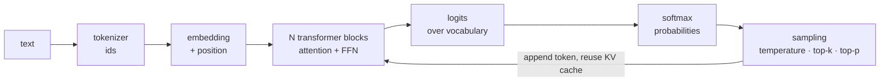

# LLM Fundamentals and Transformer Questions

> **Interview answer (say this first).** An LLM is a **decoder-only transformer** trained to predict the next token. Text is split into **tokens**, each token becomes an **embedding** vector, and a stack of blocks applies **multi-head self-attention** (tokens exchange information) plus a **feed-forward network** (each token is processed alone), with residual connections and normalisation. Because attention is order-blind, **positional information** is injected, usually as **RoPE**. At inference the model produces **logits**, **softmax** turns them into probabilities, and a **sampling rule** picks the next token, reusing a **KV cache** so it does not recompute the prefix. Training is next-token prediction; **fine-tuning/PEFT** adapts behaviour, **quantization** shrinks the weights, and **structured outputs** constrain decoding so the result is valid JSON.

## Why this exists

This is the round where interviewers separate "I use LLM APIs" from "I understand what is expensive and why". The questions look definitional, but every one has a production consequence:

- Why does a long prompt cost more and start slower? Because attention work grows with the **square** of the sequence length and the **KV cache** grows linearly and occupies GPU memory.
- Why does the same prompt give different answers? Because decoding **samples** from a probability distribution.
- Why did my fine-tune learn a tone but not a fact? Because fine-tuning shapes behaviour; retrieval supplies facts.
- Why is the quantized model not always faster? Because you traded precision for memory, and decoding is often memory-bandwidth-bound, not compute-bound.

Candidates who memorised "attention is all you need" fail the follow-up. Candidates who can put a number on the KV cache, explain what temperature actually changes, and say when fine-tuning is the wrong tool pass.

This page is a question bank over Phase 2. Where an answer needs depth, the pointer tells you where to read.

> **The one rule.** Never answer with a definition alone. Say what it is, why it exists, what it costs, and when it breaks. "Attention is a weighted sum of values" is a definition; "attention is quadratic, so long context is the latency and memory bottleneck" is an answer.

## Start from zero

Every term below appears later on this page. Read the table first.

| Word | Plain meaning |
| --- | --- |
| **Token** | A chunk of text the model reads and writes, roughly ¾ of an English word. |
| **Tokenization** | Splitting text into tokens with a fixed vocabulary. Byte-pair encoding is the common method. |
| **Vocabulary** | The fixed set of tokens the model knows, often 50k–200k entries. |
| **Embedding** | A vector of numbers representing a token, a word, or a document. |
| **d_model** | The width of the model's hidden vector, for example 4096. |
| **Transformer block** | One repeated unit: self-attention plus feed-forward, each with a residual and normalisation. |
| **Self-attention** | Each token compares itself with other tokens and mixes in their information. |
| **Query, key, value (Q, K, V)** | Three projections of a token. A query is matched against keys to weight the values. |
| **Multi-head attention (MHA)** | Several attention computations in parallel on narrower projections, then concatenated. |
| **Causal mask** | A rule that stops a token from attending to future tokens, so generation is honest. |
| **Feed-forward network (FFN / MLP)** | A position-wise two-layer network that adds nonlinearity; holds most parameters. |
| **Residual connection** | Adding a sublayer's input to its output, `x + sublayer(x)`, so deep stacks train. |
| **Layer normalisation** | Rescaling each token's vector (mean 0, variance 1) to stabilise training. |
| **Positional encoding** | Information about token order. Sinusoidal, learned, or rotary (RoPE). |
| **RoPE** | Rotary position embedding: rotates Q and K by an angle based on position. |
| **Logits** | Raw, unnormalised scores over the vocabulary for the next token. |
| **Softmax** | Turns logits into probabilities that sum to 1. |
| **Temperature** | Divides the logits before softmax. Lower = sharper and more deterministic. |
| **Top-k / top-p** | Sampling rules that restrict choices to the k best tokens or the smallest set covering probability p. |
| **Greedy decoding** | Always pick the highest-probability token. Deterministic, can be dull or repetitive. |
| **KV cache** | Stored keys and values for past tokens, reused so each decoding step is linear in the prefix length; the total for a sequence is still quadratic. |
| **Prefill / decode** | Prefill processes the prompt in parallel (compute-heavy); decode emits one token at a time (memory-heavy). |
| **Context window** | The maximum tokens the model can process in one call, prompt plus completion. |
| **Autoregressive** | Generating one token at a time, each conditioned on the ones before it. |
| **Fine-tuning** | Continuing training on your data so the model's weights change. |
| **PEFT** | Parameter-efficient fine-tuning: train a small number of extra parameters instead of all weights. |
| **LoRA** | A PEFT method that adds two small low-rank matrices next to a frozen weight matrix. |
| **Quantization** | Storing weights (and sometimes activations) in fewer bits, such as 8-bit or 4-bit. |
| **Structured output** | Constraining decoding so the output matches a JSON Schema. |
| **Constrained decoding** | Forbidding tokens that would make the output invalid at each step. |

Two clarifications to hold on to:

- **Token ≠ word.** One word can be several tokens, and one token can be a fragment or a whole short word. Cost and limits are counted in tokens.
- **Model embedding ≠ retrieval embedding.** A decoder's token embeddings are internal and context-free; retrieval uses a separate encoder model trained so similar meanings land close together. They are not interchangeable (Phase 3, Embedding Models and Dimensions).

## The core idea

Think of a decoder-only LLM as a **relay team reading a sentence aloud, one word at a time, with a shared notebook**. Each runner (block) does two things: first they compare notes with every previous runner (attention), then each thinks privately (feed-forward). A baton pass (residual connection) carries the original text alongside, so nothing is lost. A sticky-note pad (KV cache) means each new word does not force a full reread.



The loop arrow is the whole cost story. Every generated token is one more forward pass, and the cache is what keeps each pass cheap.

Every topic on this page is one link in that chain, and each link has a number attached:

| Topic | The number that matters |
| --- | --- |
| Tokenization | ~0.75 words per token; cost is per token |
| Embeddings | `d_model` width; attention cost scales with sequence length |
| Attention | `n × n` scores per head per layer — quadratic in context |
| KV cache | `2 × n_layers × n_kv_heads × head_dim × tokens × bytes` — linear and large |
| Sampling | temperature, top-k, top-p; determinism needs temperature 0 |
| Fine-tuning | trainable parameters and a labelled dataset |
| Quantization | bits per weight: fp16 = 2 bytes, int8 = 1, int4 = 0.5 |
| Structured outputs | schema complexity and grammar-compilation overhead |

> **Why the quadratic term dominates interviews.** A prompt of 1,024 tokens builds about 1M attention scores; 8,192 tokens builds about 67M. Doubling context roughly quadruples attention work. That single fact explains long-prompt latency, long-prompt price, and why retrieval must be selective.

## How it works

Follow one request from raw text to a generated token.

1. **Tokenize.** The tokenizer splits text into tokens from a fixed vocabulary and maps each to an integer id. The count of these ids is what you pay for.
2. **Embed.** An embedding table maps each id to a vector of width `d_model`, giving shape `(batch, sequence, d_model)`.
3. **Add position.** Attention has no order, so inject position: sinusoidal patterns, learned per-position vectors, or RoPE rotations on Q and K.
4. **Run the block stack.** Each of `n_layers` blocks applies pre-LayerNorm, multi-head self-attention with a causal mask, a residual add, then LayerNorm, a feed-forward network, and a second residual add. The shape never changes, which is why blocks stack.
5. **Produce logits.** After a final normalisation, a linear layer (often weight-tied to the embedding table) outputs one score per vocabulary entry for the last position.
6. **Convert to probabilities.** Softmax normalises the logits. Temperature divides them first: lower temperature sharpens the distribution, higher flattens it.
7. **Sample the next token.** Greedy takes the argmax; top-k restricts to the k best; top-p (nucleus) keeps the smallest set whose probabilities sum to at least p. Then one token is chosen.
8. **Append and repeat.** The chosen token joins the sequence, its key and value are appended to the **KV cache**, and the next forward pass attends over the cache instead of recomputing the prefix. This is autoregressive generation.
9. **Stop.** Generation ends at an end-of-sequence token, a stop string, or `max_tokens`.

Training is the same forward pass plus a loss: each position's logits are scored against the true next token with cross-entropy, and gradients update the weights. Inference does no weight updates.

### Training vs inference, side by side

| | Training | Inference |
| --- | --- | --- |
| Weights | Updated by backpropagation | Frozen |
| Goal | Learn next-token prediction over a corpus | Produce a useful answer for one request |
| Batching | Large batches, gradient accumulation | Continuous batching, many users |
| Memory | Activations, gradients, optimiser state | Weights plus KV cache |
| Cost shape | Hours or days on many GPUs, once | Per-token, forever, scaling with usage |
| Precision | Often mixed precision, fp16/bf16 | Often quantized (int8/int4) |
| Failure style | Loss does not fall, overfitting | Hallucination, latency, cost spike |
| Phase to reread | Phase 2, Forward Pass and Backpropagation | Phase 10, Inference Batching and the KV Cache |

## The syntax you will use

**The attention formula.** One line explains the whole mechanism: similarity scores, scaled, masked, softmaxed, then used to weight the values.

```python
import torch
import torch.nn.functional as F

def attention(q, k, v, causal=True):
    d_k = q.shape[-1]
    scores = q @ k.transpose(-2, -1) / d_k ** 0.5        # n x n
    if causal:
        n = scores.shape[-1]
        mask = torch.triu(torch.ones(n, n, dtype=torch.bool), diagonal=1)
        scores = scores.masked_fill(mask, float("-inf"))
    weights = F.softmax(scores, dim=-1)
    return weights @ v, weights
```

The `1 / sqrt(d_k)` scaling stops dot products from growing with head dimension, which would saturate the softmax.

**Sampling parameters.** These are the knobs you actually set per request.

```python
response = client.chat.completions.create(
    model="example-large",
    messages=messages,
    temperature=0.2,      # low = focused, high = diverse
    top_p=0.95,           # nucleus: keep the smallest set summing to 0.95
    max_tokens=500,       # hard cap; also protects the budget
    seed=7,               # helps reproducibility when the provider supports it
)
```

Low temperature does not make the model truthful; it makes the distribution sharper. Facts come from retrieval, not from a lower temperature.

**Counting tokens before you spend.** Token counts drive both the context-window check and the bill.

```python
import tiktoken

enc = tiktoken.get_encoding("cl100k_base")
text = "Quantization trades precision for memory."
ids = enc.encode(text)
print(len(ids), ids)
# tokenizers are model-specific; never assume len(text.split()) == token count
```

**KV cache size, as arithmetic.** This is the formula interviewers want.

```python
def kv_bytes(n_layers, n_kv_heads, head_dim, tokens, bytes_per=2):
    return 2 * n_layers * n_kv_heads * head_dim * tokens * bytes_per

print(kv_bytes(32, 8, 128, 1))       # 131072 bytes = 128 KiB per token
print(kv_bytes(32, 8, 128, 4096) / 2**20)   # 512.0 MiB for a 4k context
```

**A LoRA configuration.** Only the small A and B matrices train; the base weights stay frozen.

```python
from peft import LoraConfig, get_peft_model

cfg = LoraConfig(r=16, lora_alpha=32, lora_dropout=0.05,
                 target_modules=["q_proj", "v_proj"], task_type="CAUSAL_LM")
model = get_peft_model(base_model, cfg)
model.print_trainable_parameters()
# prints the real counts for the chosen base model; for one adapted 4096x4096
# matrix the adapter is 2 * r * d = 131,072 parameters, about 0.78% of that matrix
```

**Quantized loading.** 4-bit weights roughly quarter the memory of fp16, and QLoRA combines 4-bit base weights with fp16 LoRA adapters.

```python
from transformers import BitsAndBytesConfig

bnb = BitsAndBytesConfig(
    load_in_4bit=True,
    bnb_4bit_quant_type="nf4",
    bnb_4bit_compute_dtype="bfloat16",   # compute stays higher precision
)
model = AutoModelForCausalLM.from_pretrained("meta-llama/example-8b",
                                             quantization_config=bnb,
                                             device_map="auto")
```

**Constrained decoding for structured output.** The schema is compiled to a grammar, and invalid tokens are masked at each step.

```python
from pydantic import BaseModel
from typing import Literal

class Route(BaseModel):
    action: Literal["search", "summarise", "escalate"]
    query: str | None = None
    confidence: float

# Provider-supported structured outputs guarantee the shape;
# you still validate, because the schema can be right while the content is wrong.
route = Route.model_validate_json(model_output)
```

## Examples: simple to real

**Example 1 — attention cost is quadratic, and that is the interview point.** Count the scores.

```python
for n in (1024, 2048, 4096, 8192):
    print(n, n * n)
# 1024 1048576
# 2048 4194304
# 4096 16777216
# 8192 67108864
```

Double the context and the attention work roughly quadruples. This is why long prompts cost more, start slower, and need selective retrieval rather than "put everything in the prompt".

**Example 2 — temperature changes the distribution, not the knowledge.** Same logits, three temperatures.

```python
import math

def softmax(logits, T=1.0):
    m = max(x / T for x in logits)
    exps = [math.exp(x / T - m) for x in logits]
    s = sum(exps)
    return [round(e / s, 4) for e in exps]

logits = [3.0, 2.0, 1.0, 0.0]
print(softmax(logits, 0.5))   # [0.865, 0.1171, 0.0158, 0.0021]
print(softmax(logits, 1.0))   # [0.6439, 0.2369, 0.0871, 0.0321]
print(softmax(logits, 2.0))   # [0.4551, 0.276, 0.1674, 0.1015]
```

At `T = 0.5` the top token has 86.5% probability; at `T = 2.0` it has 45.5%. Same model, same knowledge, different behaviour. Temperature 0 (greedy) is as close to deterministic as you get, and still not identical across hardware or providers.

**Example 3 — size the KV cache before you choose a context length.** The cache is often the real GPU limit.

```python
def kv_bytes(n_layers, n_kv_heads, head_dim, tokens, bytes_per=2):
    return 2 * n_layers * n_kv_heads * head_dim * tokens * bytes_per

print(round(kv_bytes(32, 8, 128, 1) / 1024, 1), "KiB/token")      # 128.0 KiB/token
print(round(kv_bytes(32, 8, 128, 4096) / 2**20, 1), "MiB")        # 512.0 MiB
print(round(kv_bytes(32, 8, 128, 32768) / 2**30, 2), "GiB")       # 4.0 GiB
```

At 4k tokens one conversation needs 0.5 GiB of cache; at 32k it needs 4 GiB. That is why long-context traffic halves concurrency every time you double length, and why grouped-query attention exists.

**Example 4 — token count is the unit of cost.** Estimate before you call.

```python
words = 1000
tokens = words / 0.75
print(round(tokens, 1))            # 1333.3
# a 3,000-token prompt with 300 output tokens on a large model:
cost = 3000 * 3.00 / 1e6 + 300 * 15.00 / 1e6
print(round(cost, 6))              # 0.0135
```

Rule of thumb: English text is about 1.33 tokens per word. Code, JSON, and non-English text are usually denser, so always measure with the real tokenizer.

**Example 5 — LoRA trains a tiny fraction of the weights.** The rank `r` is the knob.

```python
d, r = 4096, 16
trainable = 2 * r * d
base = d * d
print(trainable, base, round(100 * trainable / base, 4))
# 131072 16777216 0.7812
```

LoRA adds `2 × r × d_model` trainable parameters per adapted weight, here 0.78% of the matrix. Adapters are small and swappable, which is why serving many fine-tunes is practical (Phase 10, LoRA and Adapter Serving).

**Example 6 — quantization shrinks memory, but the speed depends.** Weights, not activations.

```python
params = 7e9
for name, bytes_per in [("fp16", 2), ("int8", 1), ("int4", 0.5)]:
    print(name, round(params * bytes_per / 2**30, 2), "GiB")
# fp16 13.04 GiB
# int8 6.52 GiB
# int4 3.26 GiB
```

A 7B model is ~13 GiB in fp16, ~6.5 GiB in int8, ~3.3 GiB in int4. It now fits on a smaller GPU, but decode is memory-bandwidth-bound, so the speed-up is often far less than 4×, and quality can drop — especially on reasoning and long context. Quantization is a memory and cost trade, not a free win.

## In production

- **Attention is quadratic; the feed-forward network is linear.** At long context, attention and the KV cache dominate memory and latency; at short context, the FFN dominates parameters. Optimise the right one.
- **The KV cache isolates requests, but only if the server manages it.** PagedAttention stores it in fixed-size blocks so memory is not pre-allocated per maximum length, which is why modern servers handle many concurrent requests.
- **Grouped-query attention is the common cache fix.** Letting groups of query heads share a few key/value heads cuts cache memory several-fold with little quality loss.
- **Long context is not a substitute for retrieval.** Attention dilutes across irrelevant tokens ("lost in the middle"), and cost and memory grow with every token. Retrieve selectively, then place the best evidence near the end.
- **Temperature 0 is not true determinism.** Batching, hardware, and provider updates can still change output. For reproducible evaluation, pin the model version and accept small variation.
- **Fine-tuning teaches behaviour and format, not fresh facts.** Policy that changes monthly belongs in retrieval. Fine-tuning is for tone, format, domain style, and tool-call reliability (Phase 2, Pretraining, Fine-Tuning, and Instruction Tuning).
- **LoRA does not reduce inference latency by itself.** It reduces training cost and checkpoint size; merging the adapter changes nothing about the forward pass's size class.
- **Quantization trades quality for memory.** Test on your own evaluation set. 4-bit can be excellent for chat and noticeably worse for reasoning, math, and long code.
- **Structured output needs generation-time constraint, not just a polite prompt.** JSON mode guarantees syntax, not your schema; schema mode constrains to the schema. Validate anyway (Phase 2, Structured Outputs and JSON Schema).
- **A schema can be right while the content is wrong.** Valid JSON with an invented `order_id` is still a bug. Validate values, not only shape.
- **Tokens are model-specific.** The same text is a different number of tokens in a different tokenizer, so cost estimates do not transfer between models.
- **Version prompts, model ids, and tokenizers together.** A model update that changes tokenization changes cost and can change quality with no code change.

## Interview questions

### 1. Walk me through a transformer block.

**Answer.** A block has two sublayers: multi-head self-attention, which lets positions exchange information, and a position-wise feed-forward network, which processes each position independently. Each sublayer is wrapped in a residual connection `x + sublayer(x)`, and modern models normalise before each sublayer (pre-LN). The block preserves the shape `(batch, sequence, d_model)`, so blocks stack; the feed-forward network adds the nonlinearity and holds most of the parameters. Verified in the Phase 2 page that zeroing the sublayers makes the block return its input.

**Follow-up: "Why can a block learn nothing and not hurt?"** Because of the residual path: the block only has to learn a small change on top of its input, so at initialisation it approximates the identity and adding depth does not damage the signal.

**Trap.** Saying the feed-forward network mixes tokens. It is applied position by position; only attention moves information between positions.

### 2. Explain self-attention, and what multi-head attention adds.

**Answer.** Each token is projected into a query, a key, and a value. Attention compares a query with every key, scales by `1 / sqrt(d_k)` to keep the softmax stable, masks future positions so a decoder cannot cheat, applies softmax to get weights, and takes the weighted sum of the values. Multi-head attention runs several of these in parallel on narrower projections, then concatenates and mixes them, so the model can attend to different relationships at once (syntax, coreference, previous-token links) for roughly the cost of one full-width attention.

**Follow-up: "Is attention the same as explainability?"** No. Attention weights show where information flowed in one layer, not why the model produced a token. They are a useful debugging signal, not a proof of reasoning.

**Trap.** Saying more heads always help. Heads can be redundant; many can be pruned with little loss, and the head dimension is `d_model / n_heads`, so head count and head size trade off.

### 3. Why do transformers need positional encoding, and how do the choices differ?

**Answer.** Self-attention is permutation-equivariant: compare every query with every key and order disappears, so "dog bites man" and "man bites dog" become the same multiset. Positional information restores order. Sinusoidal encodings are fixed sine/cosine patterns with no parameters but poor extrapolation. Learned embeddings are trainable but capped at the maximum trained length. RoPE rotates queries and keys by a position-dependent angle so attention depends on relative distance, which generalises better and is the modern default.

**Follow-up: "How do long-context models extend RoPE?"** By rescaling the frequencies (RoPE scaling) and training on longer sequences, so positions beyond the original training length are less out of distribution.

**Trap.** Thinking positional encoding is added inside attention. Sinusoidal and learned forms are added to the embeddings; RoPE is applied to Q and K inside every layer.

### 4. What are tokens and embeddings, and why do they matter for cost?

**Answer.** A tokenizer splits text into tokens from a fixed vocabulary, and each token id is mapped to a vector called an embedding. Cost, context limits, and latency are all counted in tokens, not words. In English one word is about 1.33 tokens, but code, JSON, and non-English text are denser, so you measure with the actual tokenizer. The embedding width `d_model` sets the model's representational size and the per-token attention cost.

**Follow-up: "Are these the same embeddings used for retrieval?"** No. The decoder's token embeddings are internal and context-free. Retrieval uses a separate encoder trained so that similar meanings have high cosine similarity. Mixing the two spaces breaks search.

**Trap.** Calling `len(text.split())` a token count. That is a word count, and it can be off by 30% or more.

### 5. Explain the context window and the KV cache.

**Answer.** The context window is the maximum tokens the model can process in one call, prompt plus completion. Two costs create it: attention work grows with the square of sequence length, and the KV cache grows linearly because the model stores the keys and values of every past token for every layer and key/value head. Without the cache, every new token would re-attend over the whole prefix, so generation would be dramatically slower. The cache trades memory for speed, and it is often the binding GPU constraint.

**Follow-up: "How would you reduce cache memory?"** Grouped-query attention (share key/value heads), PagedAttention (block allocation instead of pre-allocation), sliding-window attention (constant-size local cache), and lower cache precision.

**Trap.** Thinking the cache persists across requests. Each request has its own cache; a **prefix cache** may reuse shared prompt prefixes, but that is a server-level optimisation, not model memory.

### 6. How does the model turn logits into text, and how do you get reliable JSON?

**Answer.** The final layer produces logits over the vocabulary. Softmax turns them into probabilities, and a sampling rule picks the next token: greedy takes the argmax, top-k restricts to the k best, top-p keeps the smallest set summing to at least p, and temperature divides the logits first to sharpen or flatten the distribution. For JSON, I use structured outputs, which compile a JSON Schema into a grammar and mask invalid tokens at each decoding step, so an invalid shape is impossible. I still validate, because valid JSON can contain invented values.

**Follow-up: "Does low temperature make the model accurate?"** No. It makes the distribution sharper, which reduces variation but does not add knowledge. Accuracy comes from retrieval, good prompts, and evaluation.

**Trap.** Confusing JSON mode with schema mode. JSON mode promises valid JSON, not your fields; schema mode promises the shape. Only schema mode plus validation is safe for machine consumption.

### 7. What is the difference between training, fine-tuning, and PEFT?

**Answer.** Training (pretraining) learns next-token prediction from a huge corpus and produces the base model. Fine-tuning continues that training on your data, updating all weights; it shapes behaviour, format, and style, and it is poor at teaching fresh facts. PEFT trains a tiny number of extra parameters while freezing the base model; LoRA adds two low-rank matrices next to a weight matrix, which is why it needs far less memory and produces small, swappable adapters. QLoRA combines a 4-bit frozen base with fp16 adapters.

**Follow-up: "When would you choose fine-tuning over RAG?"** When the requirement is behaviour — a strict output format, a domain tone, reliable tool-call syntax — and the knowledge is stable. When knowledge changes often and citations matter, retrieve instead. The two combine well.

**Trap.** Saying fine-tuning reduces inference latency or cost. It changes weights; it does not shrink the forward pass. Adapter serving can multiplex many fine-tunes on one base, which is a serving benefit, not a latency one.

### 8. What does quantization actually buy you?

**Answer.** It stores weights (and sometimes activations) in fewer bits: fp16 is 2 bytes, int8 is 1, int4 is 0.5. A 7B model drops from ~13 GiB to ~6.5 GiB at int8 and ~3.3 GiB at int4, so it fits on smaller or cheaper hardware and serves more concurrent requests. The costs are a small quality loss — worst on reasoning, math, and long context — and a speed-up that is often much less than the memory saving, because decode is memory-bandwidth-bound rather than compute-bound.

**Follow-up: "How do you decide whether int4 is safe?"** Run your own evaluation set at fp16 and int4 and compare quality and latency on the tasks that matter. The answer is workload-specific; there is no universal safe bit width.

**Trap.** Confusing quantization with distillation or pruning. Quantization reduces the precision of the same weights; distillation trains a smaller model; pruning removes weights. They are different levers with different quality profiles.

## Remember this

- **Decoder-only transformer:** tokens → embeddings → attention + feed-forward blocks with residuals → logits → softmax → sampling.
- **Attention is quadratic in sequence length; the KV cache is linear and large.** That is the real reason context is expensive.
- **Temperature shapes the distribution, not the knowledge.** Determinism needs temperature 0 and pinned versions, and is still not guaranteed.
- **Fine-tuning shapes behaviour; retrieval supplies facts.** Quantization shrinks memory, and the speed-up depends on the bottleneck.
- **Constrain decoding, then validate.** Structured outputs guarantee the shape; only your checks guarantee the values.
