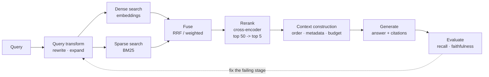
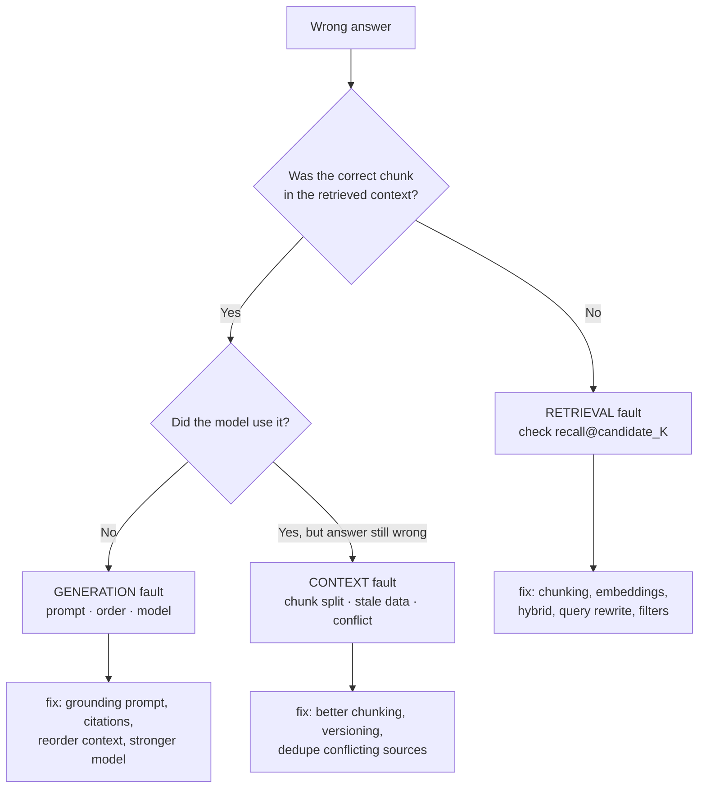

# RAG Interviews: Architecture, Debugging, Evaluation

> **Interview answer (say this first).** RAG retrieves relevant evidence at query time and puts it in the prompt so the model answers from your data instead of its memory. The pipeline is **ingest** (parse → chunk → embed → index), **retrieve** (dense vector search plus keyword search), **fuse and rerank** (merge the lists, reorder a short candidate set with a cross-encoder), **construct the context** (fit the best chunks in the window with metadata and citations), **generate** (answer only from the context), and **evaluate** (retrieval metrics and faithfulness). When an answer is wrong, I localise it first: **is the evidence missing, or did the model ignore evidence it had?** That single split decides whether I fix retrieval or generation, and it is the most valuable debugging step in the interview.

## Why this exists

RAG looks simple on a slide and is hard in production. The demo works because the demo query is easy. Real traffic exposes the failure modes:

- The right chunk was never retrieved, so the model invented an answer.
- The right chunk was retrieved but buried under four irrelevant ones, so the model used the wrong one.
- The context was too long and the useful passage sat in the middle, where attention is weakest.
- The answer was correct but had no citation, so nobody trusted it.
- A tenant's query matched another tenant's document, which is a security incident, not a quality bug.
- The system changed end to end and nobody could tell which stage caused the regression.

Every one of those has a different fix, and the fixes point in opposite directions. If you tune the prompt when retrieval is broken, you will spend a week for nothing. If you add a reranker when recall is already low, you have polished a list that never contained the answer.

RAG interviews are really **debugging interviews**. The interviewer wants to see whether you can measure the pipeline stage by stage and localise a fault, rather than guessing at prompts.

> **The one-sentence rule.** RAG quality is capped by retrieval recall: if the evidence is not in the context, no prompt, model, or temperature can produce a grounded answer.

## Start from zero

Every word below is used later on this page. Read the table first.

| Word | Plain meaning |
| --- | --- |
| **RAG** | Retrieval-augmented generation: fetch evidence, then generate an answer conditioned on it. |
| **Corpus** | The full set of documents you can search. |
| **Chunk** | A slice of a document, usually a few hundred tokens, that is indexed as one unit. |
| **Embedding** | A vector that represents meaning, so similar meanings are close in space. |
| **Dense retrieval** | Search by embedding similarity. Handles paraphrase, misses exact keywords. |
| **Sparse retrieval** | Keyword search such as BM25. Handles exact terms and rare ids, misses paraphrase. |
| **Vector store** | A database that finds nearest embeddings quickly. |
| **ANN** | Approximate nearest neighbour: a fast, slightly inexact search over vectors. |
| **HNSW** | A popular ANN index: a layered graph you walk toward the query. |
| **Hybrid search** | Running dense and sparse retrieval, then combining the results. |
| **RRF** | Reciprocal rank fusion: merge lists using `1 / (k + rank)` so scores need no calibration. |
| **Reranker** | A second-stage model (usually a cross-encoder) that reorders a short candidate list. |
| **Bi-encoder** | Encodes query and document separately; fast, used for retrieval. |
| **Cross-encoder** | Reads query and document together; accurate, too slow for the whole corpus. |
| **Top-k** | The number of results taken from a ranked list. |
| **Context construction** | Deciding which chunks, in what order, with what metadata, go into the prompt. |
| **Citation** | A link from a claim in the answer to the source chunk it came from. |
| **Grounded** | The answer is supported by the retrieved context. |
| **Faithfulness** | Fraction of the answer's claims that the context supports. |
| **Hallucination** | A claim that is not supported by the context or is simply invented. |
| **Recall@K** | Share of all relevant chunks present in the top K. |
| **MRR** | Mean reciprocal rank: where the first relevant chunk appears, averaged over queries. |
| **NDCG@K** | Ranking quality that rewards putting the most relevant chunks highest. |
| **Golden set** | A labelled set of queries with known relevant chunks, used as a regression test. |
| **Abstention** | The system says "I do not know" instead of guessing. |
| **Lost in the middle** | Long contexts attend most strongly to the start and end, so middle evidence is missed. |
| **Tenant isolation** | Guaranteeing one customer never sees another customer's data. |

Two distinctions cause most confusion, so fix them now:

- **Recall vs precision.** Recall asks "did we find all the relevant chunks?" Precision asks "how clean is the returned list?" A retrieval miss is fatal; noise is survivable. Tune recall first, then precision with a reranker.
- **Retrieval failure vs generation failure.** Missing evidence is a retrieval bug. Ignoring good evidence is a generation bug. The same wrong answer can come from either, and the fix is different.

## The core idea

Think of RAG as **a researcher with a small desk**. The query goes to the library (retrieval). The researcher carries back a pile of notes (chunks). The desk is small (context window), so only the best notes fit, and where you place them matters. Then the researcher writes an answer using only those notes, and marks which note each sentence came from (citations). If the answer is wrong, you check two things in order: were the right notes in the pile, and did the writer use them?



The evaluation arrow is what makes this engineering rather than hoping. The cache and the access-control-list (ACL) filter sit on the retrieval path; the citations sit on the generation path.

Where the faults live, at a glance:

| Symptom | Likely stage | First measurement |
| --- | --- | --- |
| Answer is wrong and evidence was never retrieved | Retrieval / indexing | Recall@candidate_K (recall at the candidate-set size K, e.g. 50) |
| Evidence was retrieved but the wrong chunk won | Ranking / fusion | Precision@K, NDCG@K |
| Evidence is in the context but the model ignored it | Generation / context order | Faithfulness, lost-in-the-middle check |
| Answer is right but nobody trusts it | Citations | Citation coverage and correctness |
| One tenant sees another's data | Access control | ACL filter audit |
| Quality dropped after a change | Any | Per-stage metrics on the golden set |

### Debugging "the answer is wrong", as a decision tree

This is the interview favourite. Say the two branches out loud.



## How it works

Follow one query from raw text to a grounded answer.

1. **Ingest.** Parse each source document (PDF, HTML, wiki, ticket), strip boilerplate, and extract metadata: tenant, source, section, version, timestamp, access level.
2. **Chunk.** Split into passages of a few hundred tokens, with overlap so a sentence spanning a boundary is not lost. Preserve the heading path with each chunk, because a chunk out of context is ambiguous.
3. **Embed and index.** Encode each chunk with an embedding model and store the vector plus metadata in a vector store. Build a sparse index (BM25) over the same chunks for keyword search.
4. **Rewrite the query.** Optionally expand, decompose, or rewrite the user's question into a better search query. This helps multi-hop and conversational follow-ups (Phase 3, Query Transformation).
5. **Retrieve.** Run dense and sparse search in parallel, with ACL and metadata filters applied. Take a generous candidate set, often 50–100.
6. **Fuse.** Merge the two ranked lists. RRF is the common default because it needs no score calibration between the two systems.
7. **Rerank.** Run a cross-encoder over the candidate set and keep the top few, often 3–8. Reranking fixes ordering; it cannot recover a chunk retrieval never found.
8. **Construct the context.** Deduplicate, enforce a token budget, order the best evidence near the end, and attach source ids so a citation can be produced.
9. **Generate.** Prompt the model to answer only from the context, cite each factual claim, and say "not in the provided context" when evidence is missing. Constrain the output shape if a machine will read it.
10. **Evaluate and monitor.** Log the query, retrieved ids, scores, context, answer, and citations. Run retrieval metrics and faithfulness on a golden set, and track them per stage so a regression is attributable.

Notice step 10 keeps happening. A RAG system without per-stage logging cannot be debugged, only guessed at.

### Chunking: the decision nobody agrees on

There is no universal chunk size. The trade is context completeness against precision and cost.

| Strategy | Strength | Weakness | When to use |
| --- | --- | --- | --- |
| **Fixed-size + overlap** | Simple, predictable token counts | Splits mid-sentence or mid-table | Baseline; uniform prose |
| **Recursive by separator** | Respects paragraphs and headings | Uneven chunk sizes | Most documents |
| **Semantic / sentence-window** | Chunks break at meaning boundaries | Slower, needs sentence embeddings | Q&A over dense prose |
| **Parent-child** | Index small chunks, return the parent | More storage, two-step lookup | Precise matching, rich context |
| **Structure-aware** | Uses headings, rows, and code blocks | Parser per format; brittle | Tables, code, legal clauses |

> **Why overlap exists.** A fact that straddles a boundary is unanswerable if both halves are separate chunks with no overlap. Overlap of 10–20% is cheap insurance, but it also duplicates content, which inflates recall and NDCG unless you deduplicate before scoring.

## The syntax you will use

**Retrieval metrics.** Short functions you own; standard library is enough (full treatment in Phase 3, Retrieval Metrics).

```python
import math

def recall_at_k(retrieved, relevant, k):
    if not relevant:
        return None                       # zero-relevant query: skip
    return sum(1 for d in retrieved[:k] if d in relevant) / len(relevant)

def reciprocal_rank(retrieved, relevant):
    for i, d in enumerate(retrieved, start=1):
        if d in relevant:
            return 1.0 / i
    return 0.0

def dcg(grades):
    return sum((2 ** g - 1) / math.log2(i + 1) for i, g in enumerate(grades, 1))

def ndcg_at_k(retrieved, grades, k):
    if not grades:
        return None
    actual = [grades.get(d, 0) for d in retrieved[:k]]
    ideal = sorted(grades.values(), reverse=True)[:k]
    return dcg(actual) / dcg(ideal)
```

**Reciprocal rank fusion.** Merge dense and sparse lists without calibrating their scores. `k = 60` is the common default.

```python
def rrf(rankings, k=60, weights=None):
    weights = weights or [1.0] * len(rankings)
    scores = {}
    for w, ranking in zip(weights, rankings):
        for rank, doc in enumerate(ranking, start=1):
            scores[doc] = scores.get(doc, 0.0) + w * (1.0 / (k + rank))
    return sorted(scores.items(), key=lambda kv: kv[1], reverse=True)
```

**A retrieval call with filters and ACL.** Security belongs here, not in the prompt.

```python
hits = vector_store.search(
    vector=embed(query),
    top_k=50,
    filter={"tenant_id": tenant_id, "access_level": {"$in": user_roles}},
)
# The filter is mandatory: a prompt cannot enforce tenant isolation.
```

**Context assembly with a budget and citations.** Keep the best evidence near the end, and always carry source ids.

```python
def build_context(chunks, max_tokens=2400, best_last=True):
    chosen, used = [], 0
    for c in chunks:
        if used + c.tokens > max_tokens:
            break
        chosen.append(c)
        used += c.tokens
    if best_last:
        chosen.sort(key=lambda c: c.score)      # best chunk ends up last
    return "\n\n".join(f"[{c.id}] {c.text}" for c in chosen)
```

**A grounding prompt.** The instruction that turns retrieved text into a citational answer.

```text
Answer only from the context below. Cite every factual claim with [chunk_id].
If the context does not contain the answer, reply exactly:
"The provided documents do not answer this."
Do not use outside knowledge.

Context:
{context}

Question: {question}
```

**A per-stage trace.** One log line per request is what makes debugging possible.

```python
log.info("rag_request", extra={
    "request_id": rid, "tenant": tenant_id,
    "retrieved_ids": dense + sparse, "fused_ids": fused_ids, "reranked_ids": final_ids,
    "context_tokens": used, "answer": answer, "citations": cited_ids,
    "latency_ms": {"retrieve": 250, "rerank": 150, "generate": 1600},
})
```

## Examples: simple to real

**Example 1 — one query, by hand.** Relevant chunks are `{A, C}`; the retriever returns `[A, B, C, D, E]`.

```text
Recall@5    = 2 / 2 = 1.0     (both relevant chunks found)
Precision@5 = 2 / 5 = 0.4     (two of five were relevant)
RR          = 1 / 1 = 1.0     (first relevant is at rank 1)
NDCG@5      = 1.5 / 1.6309 = 0.9197
```

Recall is perfect and precision is poor: the evidence is present but competing with three irrelevant chunks. That is a reranking problem, not a retrieval problem.

**Example 2 — rank matters, and recall cannot see it.** Same relevant set `{A, C}`, but `A` sits at rank 3.

```python
relevant = {"A", "C"}
print(round(recall_at_k(["X", "Y", "A", "C"], relevant, 4), 2))     # 1.0
print(round(reciprocal_rank(["X", "Y", "A", "C"], relevant), 4))   # 0.3333
```

Recall is unchanged at 1.0; MRR fell from 1.0 to 0.33. If the context budget only fits two chunks, the answer is now wrong even though retrieval "found" everything. **Report a rank-aware metric as well as recall.**

**Example 3 — hybrid fusion with RRF.** Dense and sparse lists disagree; RRF rewards chunks that both rank highly.

```python
bm25  = ["A", "B", "C"]
dense = ["B", "D", "A"]
for doc, score in rrf([bm25, dense]):
    print(doc, round(score, 6))
# B 0.032522   <- second and first: the consensus winner
# A 0.032266   <- first and third
# D 0.016129
# C 0.015873
```

`B` wins because it appears near the top of both lists. RRF needs no score normalisation, which is why it is the standard first fusion step. Adding a weight, for example `weights=[2.0, 1.0]` to trust BM25 more for exact ids, is a one-line change.

**Example 4 — compute the chunk count and context budget before you promise a design.** Numbers make the pipeline concrete.

```python
import math
tokens = 10_000 / 0.75          # ~13,333 tokens for a 10k-word document
chunk, overlap = 500, 50
chunks = math.ceil(tokens / (chunk - overlap))     # 30 chunks
context = 5 * chunk + 800 + 50                     # top 5 + system prompt + question
print(chunks, context)          # 30 3350
```

Five 500-token chunks plus a system prompt and the question is ~3,350 tokens. That fits an 8k window with room for the answer, so for this corpus you do **not** need a 128k model. The 10k-word document becomes 30 chunks, so your index is 30 vectors per document — size the store and re-embedding cost from that.

**Example 5 — localise the fault with a classifier over logs.** The debugging move, expressed as a rule.

```python
def diagnose(correct_chunk_retrieved: bool, answer_uses_chunk: bool,
             answer_correct: bool) -> str:
    if not correct_chunk_retrieved:
        return "RETRIEVAL: fix chunking, embeddings, hybrid search, or query rewrite"
    if not answer_uses_chunk:
        return "GENERATION: fix grounding prompt, context order, or model"
    if not answer_correct:
        return "CONTEXT: fix chunk split, stale data, or conflicting sources"
    return "OK"

print(diagnose(False, False, False))   # RETRIEVAL: ...
print(diagnose(True, False, False))    # GENERATION: ...
print(diagnose(True, True, False))     # CONTEXT: ...
```

The first branch is the one people skip. `correct_chunk_retrieved=False` means the answer was doomed before generation ran, and no prompt change will fix it. This is why you log retrieved ids with every request.

**Example 6 — faithfulness and abstention are the generation-side metrics.** Retrieval can be perfect and the answer still ungrounded.

```python
claims, supported = 4, 3
faithfulness = supported / claims
answered, correct, faithful = 940, 900, 880
print(round(faithfulness, 2))                     # 0.75
print(round(correct / 1000, 3), round(faithful / answered, 3))
# 0.9 0.936
```

Read it as a funnel. Of 1,000 questions, 940 were answered rather than abstained, 900 were correct (`90%` end-to-end), and 880 of the 940 answers were fully faithful (`93.6%`). Track coverage (how often it answers at all), correctness, and faithfulness separately, because a system that abstains more can look better on faithfulness while being less useful.

## In production

- **Recall first, then precision.** A retrieval miss is unfixable by the model; extra chunks are noise the model can often ignore. Measure recall at the candidate K, then add a reranker.
- **A reranker cannot invent a chunk.** If Recall@50 is low, fix indexing, chunking, embeddings, or query rewriting before touching stage two.
- **Chunk on structure, not just a character count.** Headings, sections, table rows, and code blocks carry meaning. Always store the heading path with the chunk.
- **Overlap duplicates content.** Deduplicate near-identical chunks before scoring, or recall and NDCG look better than the context really is.
- **Hybrid search beats either method alone.** Dense handles paraphrase; sparse handles exact terms, product codes, and rare names. Fuse with RRF by default.
- **Reranking is usually the highest-return single change.** It fixes the "right chunk, wrong order" failure that shows up as good recall and bad precision.
- **Context order matters.** Models attend most strongly to the beginning and end. Put the strongest evidence near the end and keep the window tight; "lost in the middle" is real.
- **Enforce access control at retrieval, never in the prompt.** A tenant filter in the query is a guarantee; an instruction in the prompt is a hope (Phase 3, RAG Security and Access Control).
- **Cite at claim level, and validate the citation.** A citation that points to a chunk which does not support the sentence is worse than no citation, because it manufactures trust.
- **Golden sets rot.** Re-indexing changes ids; documents change; labels go stale. Version the golden set with the corpus and re-check on every index rebuild.
- **Track metrics per stage, not just end to end.** Store retrieved ids, fused ids, reranked ids, context tokens, and citations so a regression is attributable.
- **Separate coverage from correctness.** A system can minimise hallucinations by abstaining too often. Watch how often it answers, how often it is right, and how faithful it is, as three numbers.

## Interview questions

### 1. Walk me through a RAG pipeline.

**Answer.** Offline: parse documents, chunk them with metadata, embed the chunks, and build a dense index plus a sparse index. Online: rewrite the query if useful, retrieve 50–100 candidates from both indexes with an ACL filter, fuse the lists with RRF, rerank with a cross-encoder down to a handful, assemble them into a token-budgeted context ordered best-last, generate with a grounding prompt and citations, then log everything and evaluate retrieval and faithfulness on a golden set. The evaluation is not a final step; it is what makes the rest debuggable.

**Follow-up: "What is the biggest quality lever?"** Retrieval recall, then reranking. Generation can only use what retrieval returns, so quality is capped there. Reranking is usually the highest-return single change after recall is adequate.

**Trap.** Describing only the online path. Half the system is ingestion: parsing, chunking, embedding, re-indexing, and versioning. Interviewers notice when it is missing.

### 2. How do you choose a chunk size and overlap?

**Answer.** Match the chunk to the question type and the document structure. For fact lookup, smaller chunks (200–500 tokens) improve precision; for multi-paragraph reasoning, larger chunks or parent-child retrieval give the model enough context. I chunk on structure — headings, paragraphs, table rows — rather than a raw character count, keep 10–20% overlap so facts spanning a boundary survive, and store the heading path with each chunk because a chunk without its section is ambiguous. Then I tune size empirically against the golden set, not by taste.

**Follow-up: "What is parent-child retrieval?"** Index small child chunks for precise matching, but return the larger parent section as context. You get precision from the small chunk and completeness from the parent.

**Trap.** Assuming one chunk size fits every corpus. A support FAQ, a legal contract, and a code repository want different chunking, and mixing formats in one index usually needs per-format rules.

### 3. Dense versus sparse retrieval: when do you use each?

**Answer.** Dense retrieval embeds the query and documents and searches by vector similarity, so it handles paraphrase and synonyms. Sparse retrieval such as BM25 matches terms directly, so it nails exact strings: product codes, error numbers, rare names. Each fails where the other shines, so production systems run both and fuse the lists, usually with reciprocal rank fusion, which needs no score calibration. Hybrid search is the default for enterprise corpora.

**Follow-up: "Why RRF instead of adding the scores?"** Dense cosine scores and BM25 scores live on different scales, so adding them lets one dominate arbitrarily. RRF uses only rank, which is comparable across systems.

**Trap.** Believing embeddings understand negation and exact identifiers. Dense vectors often place "not covered" near "covered", and they blur a specific part number. That is exactly what the sparse half is for.

### 4. How does vector search work underneath, and what are the trade-offs?

**Answer.** A vector store indexes embeddings so it can find the nearest neighbours to a query vector without scanning everything. Most production indexes, such as HNSW, are approximate: they trade a little recall for a large speed-up. The knobs are the graph size and search breadth — more breadth means higher recall and higher latency and memory. So there is a three-way trade among recall, latency, and index size, and the right point depends on whether you rerank afterward.

**Follow-up: "Why is approximate search acceptable?"** Because a reranker only needs the correct chunk to be somewhere in the candidate set, not at rank 1. High recall@50 is enough; exact ordering is the reranker's job.

**Trap.** Assuming the index always returns the true nearest neighbours. ANN can miss them, so measure recall of the index itself, not just the pipeline.

### 5. Why add a reranker, and what does it fix?

**Answer.** First-stage retrieval is fast but noisy near the top because a bi-encoder compresses each document into one vector without seeing the query. A cross-encoder reads the query and document together, so it judges relevance far better, but it costs one forward pass per candidate, which is why it only runs on a short list. Reranking fixes ordering: it raises precision and NDCG while leaving recall unchanged, because it can only reorder what retrieval already found.

**Follow-up: "How do you size the candidate list?"** Big enough that recall is high — often 50–100 — and small enough that reranking latency stays inside the budget. Measure recall at that K before tuning the reranker.

**Trap.** Expecting reranking to fix a retrieval miss. If the right chunk is absent, the cross-encoder has nothing to promote.

### 6. How do you construct the context and produce trustworthy citations?

**Answer.** I deduplicate the reranked chunks, enforce a token budget, and order them so the strongest evidence sits near the end, because models attend most to the start and end. Each chunk carries a source id and metadata, and the prompt requires the model to cite the chunk id for every factual claim and to abstain when the context does not answer the question. Then I validate citations: does the cited chunk actually support the sentence? A fabricated citation is worse than none.

**Follow-up: "What is lost in the middle?"** Evidence placed in the middle of a long context is attended to less than evidence at the edges, so a correct answer can be missed even when the chunk is present. Tight context and best-last ordering both help.

**Trap.** Treating citations as decoration. If the citation is not validated against the claim, it manufactures false trust and is worse than no citation at all.

### 7. A user says the answer is wrong. How do you debug it?

**Answer.** I localise the fault before changing anything. First question: was the correct chunk in the retrieved context? I check the logged retrieved ids against a known relevant chunk and look at Recall@candidate_K. If it was missing, it is a retrieval fault: chunking, embeddings, filters, or query rewrite. If it was present, I check whether the model used it — that is a generation or context-order problem. If the model used it and the answer is still wrong, the chunk itself is stale, split badly, or in conflict with another source. Each branch has a different fix.

**Follow-up: "What if retrieval recall is high and faithfulness is still low?"** Then it is generation: the grounding prompt is weak, the context is too long, the evidence is buried in the middle, or the model is too small. Reorder the context, tighten the prompt, or upgrade the model.

**Trap.** Starting with a prompt change. It is the cheapest change to make and the easiest to make uselessly when the evidence never reached the model. Measure retrieval first.

### 8. How do you evaluate a RAG system?

**Answer.** Two layers. Retrieval: Recall@K at the candidate K, plus a rank-aware metric such as MRR or NDCG to capture ordering, measured on a golden set with independent labels. Generation: faithfulness (what fraction of claims the context supports), answer relevance, citation correctness, and coverage or abstention rate. I keep a hard slice — multi-hop, acronym, no-answer questions — because averages hide failures, and I gate deploys on the golden set so a change is judged by numbers rather than by a demo query.

**Follow-up: "How do you build the golden set?"** From real user questions, labelled by a human or a strong model with human spot-checks, never from the retriever's own output. Split it into a tuning part and a held-out part so the reported number is not a memory of your own choices.

**Trap.** Using an LLM judge without validating it against human labels. An unvalidated judge can be confidently wrong, and it will reward the same biases the system already has.

## Remember this

- **Recall is the ceiling.** If the evidence is not in the context, no prompt or model can save the answer.
- **Debug in order: retrieval, then generation, then context.** Check whether the correct chunk was retrieved before blaming the model.
- **Hybrid retrieval plus a reranker is the production default.** Dense for meaning, sparse for exact terms, cross-encoder for order.
- **Measure per stage on a versioned golden set.** Recall@K, MRR, and NDCG for retrieval; faithfulness, citation correctness, and coverage for generation.
- **Citations and access control are guarantees, not prompts.** Enforce tenant filters at retrieval, and validate every citation against the claim it supports.
