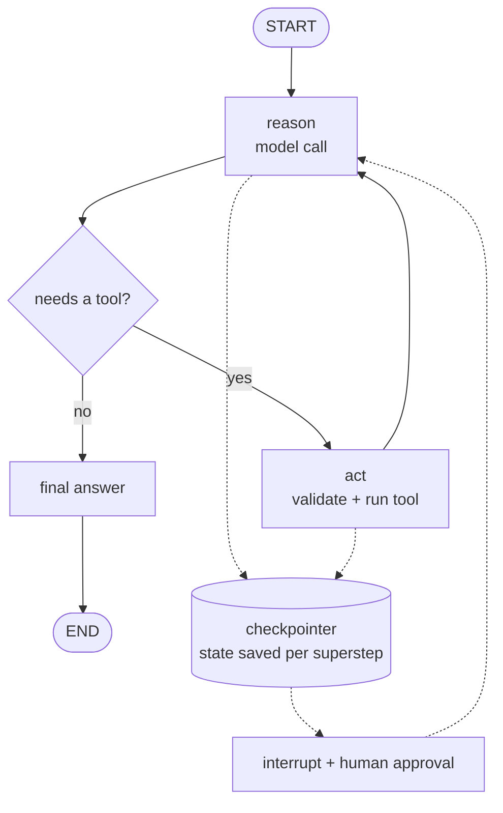

# Agent and LangGraph Interviews

> **Interview answer (say this first).** An agent is a language model inside a loop, given a goal plus tools and memory, that decides what to do next, acts, reads the result, and decides again until a stopping condition. The model supplies judgment; your code supplies the loop, the tools, the limits, and the permissions. LangGraph models that loop as a state machine: typed **state**, **nodes** that return partial updates, **edges** and **conditional edges** for routing, and **reducers** that merge updates so parallel branches do not clobber each other. A **checkpointer** saves state after every step, keyed by `thread_id`, which makes a run resumable; **interrupt** pauses it for a human and `Command(resume=...)` continues it. Reliability comes from bounds (turns, tokens, cost, deadline), loop detection, idempotent side effects, and evaluation on the end state, the trajectory, and safety — not from hoping the model stops.

> **Note:**
>
> **Verified.** Every runnable pure-Python example on this page was executed offline (Python 3.14). No model calls were made. Where a line represents framework behaviour, it is taken from the source pages and labelled.

## Why this exists

Agent questions separate people who have run a loop from people who have only read a definition. Three traps catch the second group:

- **They define an agent by its framework.** "We use LangGraph" is not an answer. LangGraph, the OpenAI Agents SDK, and a hand-written `while` loop implement the same cycle.
- **They forget termination.** A loop is only as safe as its stopping conditions, and the model cannot be the referee of its own loop.
- **They cannot explain the state.** A node returns a *partial update*, not the whole state, and a parallel branch needs a *reducer*. Miss that and two concurrent writes to the same key raise an `InvalidUpdateError` instead of merging.

This page is the revision layer. Every topic here was taught in Phase 4; the job now is to answer it out loud, with the trade-off and the failure mode.

## Start from zero

| Word | Plain meaning |
| --- | --- |
| **LLM** | Large language model: predicts the next token from the text before it. Reads and writes text. |
| **Agent** | A model plus tools, memory, and a goal, wrapped in a loop that runs until a stopping condition. |
| **Turn** | One model call plus whatever your code does with the reply before the next call. |
| **Tool** | A function your code exposes to the model, such as `lookup_order`. The model asks; your code runs. |
| **Tool call** | The model's structured request: a tool name plus JSON arguments. |
| **Tool result** | The output of running the tool, appended to the conversation as an observation. |
| **Trajectory** | The full ordered record of turns, tool calls, arguments, results, and errors. |
| **Workflow** | A fixed sequence of steps written in code, also called a chain or pipeline. |
| **State** | The data defining where a run is: messages, plan, step count, tool results, scratch. |
| **Short-term memory** | The live conversation kept in the context window. Grows every turn. |
| **Working memory** | The agent's scratchpad: current plan, step, and gathered facts. Small and rewritten. |
| **Long-term memory** | Stored facts and past runs kept outside the context and retrieved when relevant. |
| **Context window** | The maximum text, in tokens, the model can consider in one call. |
| **Token budget** | The number of tokens you allow, below the hard limit, shared by input and output. |
| **Loop detection** | Spotting that the agent is repeating an action or a state, and breaking out. |
| **Stopping condition** | A rule that ends the loop: no tool call, turn cap, budget, deadline, or no progress. |
| **Planning** | Deciding the steps before acting; decomposition is splitting one goal into subtasks. |
| **Routing** | Choosing which tool, agent, or skill handles each step. |
| **Static plan** | A plan computed once, before execution, and followed as written. |
| **Plan-and-execute** | A pattern that writes the full plan first, then runs its steps, replanning only within a bound. |
| **ReAct** | A loop that interleaves one reasoning step with one action, adapting to each observation. |
| **Replanning** | Revising the plan during execution after a failure or new information. |
| **Checkpoint** | One saved snapshot of state, identified by a `checkpoint_id`. |
| **Checkpointer** | An object that saves graph state after each superstep (in-memory, SQLite, or Postgres). |
| **Thread / `thread_id`** | The key that groups checkpoints into one resumable run. |
| **Durable execution** | Saving each step so a crash resumes from the last one instead of the start. |
| **Human-in-the-loop (HITL)** | A person approves or edits before the agent continues. |
| **Interrupt** | A designed pause inside a node that returns a payload to the caller. |
| **Resume** | Continuing an interrupted run with `Command(resume=value)`. |
| **LangGraph `StateGraph`** | The builder that records a state schema and an empty graph of nodes and edges. |
| **Node** | One step: a function that reads state and returns a partial update. |
| **Edge** | A fixed transition: "after A, always run B." |
| **Conditional edge** | A transition chosen at runtime by a router function that returns the next node name. |
| **Reducer** | A function that merges a new value into a state key instead of replacing it. |
| **`Annotated[X, f]`** | Python syntax attaching reducer `f` to a type; LangGraph reads it as "merge with `f`." |
| **Superstep** | One round of execution: ready nodes run, then all their updates merge at once. |
| **`START` / `END`** | Virtual entry and exit markers for a graph. |
| **Subgraph** | A compiled graph used as a node inside another graph; its state is namespaced. |
| **`Command(goto=...)`** | A return value that both updates state and chooses the next node. |
| **`invoke` / `stream`** | Run a compiled graph to completion, or yield its state after each step. |

Three distinctions matter most:

- **Agent vs workflow.** In a workflow the developer fixes the step order. In an agent the model chooses it at runtime. Both may use an LLM and tools.
- **State vs memory.** State is the live working set for *this* run. Memory is knowledge retrieved across runs. Persist state; load only a slice as memory.
- **Node vs edge.** A node is the work; an edge is the routing. Do not put routing logic inside the node if a router can express it.

## The core idea

Think of a **taxi ride versus a train line**. A train follows a fixed route — cheap, reliable, and you know when it arrives. That is a workflow. A taxi takes you wherever you ask and turns based on traffic. That is an agent. The taxi needs a driver (the model), a map and a meter (tools and state), and rules about where it may not go (guardrails).

LangGraph adds a **shared clipboard in the middle of the car**. Each step reads the clipboard, writes down what it learned, and an arrow decides who reads next. The clipboard is the state. That single decision — make state explicit and persistable — is what buys checkpointing, human pauses, and time travel.



The corresponding state table is the part to memorise:

| State key | Reducer | What a node returning a new value does |
| --- | --- | --- |
| `n: int` | none | Replaces the old `n` (last-write-wins). |
| `log: Annotated[list[str], operator.add]` | `operator.add` | Concatenates: old list plus new list. |
| `messages: Annotated[list, add_messages]` | `add_messages` | Appends and deduplicates by message id. |
| `total: Annotated[int, operator.add]` | `operator.add` | Adds the new number to the old one. |

Reducers are what make fan-out correct. Without one, two concurrent writes to the same key raise an `InvalidUpdateError` instead of merging.

## How it works

1. **You define the goal.** A system prompt states the agent's job, constraints, and tone. The user message supplies the concrete task.
2. **You register tools.** Each tool has a name, a description, and an argument schema. Only registered tools can ever run; never `eval` a model-provided name.
3. **You assemble context.** Current messages, tool schemas, and memory (recent turns, scratchpad, retrieved documents) are packed into the prompt.
4. **The model decides.** It answers directly or returns one or more tool calls. This runtime choice is what makes it an agent.
5. **Your code parses and validates.** Arguments arrive as JSON. Parse, check against the schema, and reject bad input before touching anything real.
6. **Your code executes through the registry.** A fixed table maps tool names to functions. An unknown name returns an error instead of running something unexpected.
7. **The result goes back into context.** Append the assistant message first, then one tool result per call, each carrying its `tool_call_id`.
8. **The loop repeats and context grows.** Every turn resends everything before it, so total input cost is the sum of the growing contexts — cost grows faster than the final size.
9. **A stopping condition ends it.** No tool call, a turn cap, a token/cost budget, a deadline, repeated-action detection, or a denied approval.
10. **You log the trajectory.** Turns, tools, arguments, results, tokens, latency, and errors. Without it, debugging is guesswork.

In LangGraph the same loop becomes a graph:

1. **Define the state schema.** A `TypedDict` names each key and its type — the clipboard's shape.
2. **Attach reducers.** Wrap a type in `Annotated[..., reducer]`. Keys without a reducer are last-write-wins.
3. **Create the builder.** `StateGraph(State)` records the schema and starts an empty graph.
4. **Add nodes.** `add_node("name", fn)` registers a function that takes state and returns a partial update.
5. **Add edges.** `add_edge(a, b)` means "after `a`, run `b`." `START` and `END` mark the boundaries.
6. **Add conditional edges.** `add_conditional_edges(source, router, mapping)` sends execution to the node the router names.
7. **Compile with a checkpointer.** `builder.compile(checkpointer=...)` validates the graph and enables saves.
8. **Invoke or stream.** `invoke(input, config)` runs to an end state; `stream(...)` yields updates as they happen.
9. **Execute in supersteps.** Ready nodes run together; their updates merge through the reducers at the boundary.
10. **Pause and resume.** `interrupt(payload)` stops a node; `Command(resume=value)` continues the same thread.

## The syntax you will use

**A bounded tool loop.** The smallest honest agent: a loop, a registry, and a turn cap.

```python
for turn in range(1, MAX_TURNS + 1):
    reply = call_model(messages, tools=TOOL_SCHEMAS)
    messages.append(reply)
    if not reply.get("tool_calls"):
        break                                   # natural stop
    for call in reply["tool_calls"]:
        messages.append(execute_and_pack(call))
else:
    raise RuntimeError("turn limit reached")    # safety stop
```

The `else` on a `for` runs when the loop finishes without `break`; it is the safety net, not a flourish.

**A tool registry.** The lookup table is the security boundary.

```python
TOOLS = {"lookup_order": lookup_order, "send_email": send_email}

def execute(call):
    name = call["function"]["name"]
    if name not in TOOLS:
        return {"error": f"unknown tool: {name}"}
    return TOOLS[name](**json.loads(call["function"]["arguments"]))
```

**Loop detection by action signature.** Hash the tool name and sorted arguments so the same call always hashes the same.

```python
import hashlib, json

def action_signature(tool: str, args: dict) -> str:
    payload = json.dumps([tool, args], sort_keys=True)
    return hashlib.sha256(payload.encode()).hexdigest()[:12]

def is_stuck(seen: dict, signature: str, limit: int = 2) -> bool:
    seen[signature] = seen.get(signature, 0) + 1
    return seen[signature] > limit
```

**A LangGraph state schema with reducers.** `operator.add` appends; a bare `int` is last-write-wins.

```python
import operator
from typing import Annotated, TypedDict
from langgraph.graph import StateGraph, START, END

class State(TypedDict):
    findings: Annotated[list[str], operator.add]
    calls: int

builder = StateGraph(State)
builder.add_node("search", search)
builder.add_edge(START, "search")
builder.add_edge("search", END)
graph = builder.compile()
```

**A reducer-aware merge.** Without a reducer the new value replaces the old; with one it combines.

```python
import operator

def merge(state: dict, update: dict, reducers: dict) -> dict:
    out = dict(state)
    for key, value in update.items():
        out[key] = reducers[key](out[key], value) if key in reducers else value
    return out

merge({"n": 1, "log": ["a"]}, {"n": 2, "log": ["b"]}, {"log": operator.add})
# {'n': 2, 'log': ['a', 'b']}
```

**Resume continues from checkpointed state.** The checkpoint records how many steps already ran and the state they produced, so the resumed run picks up the real end state.

```python
def run_from(steps, done_upto, state):
    """Resume from the checkpoint saved after `done_upto` steps."""
    executed = []
    for i, step in enumerate(steps):
        if i < done_upto:
            continue
        state = step(state)
        executed.append(i)
    return state, executed
```

**Conditional edges build the agent loop.** The router decides whether to call a tool or finish.

```python
def should_continue(state: State) -> str:
    return "tools" if state["calls"] < 3 else "done"

builder.add_conditional_edges("reason", should_continue,
                              {"tools": "tools", "done": "done"})
builder.add_edge("tools", "reason")     # loop back
```

**A checkpointer and a thread id.** State is saved after every superstep and can be read back.

```python
from langgraph.checkpoint.memory import InMemorySaver

graph = builder.compile(checkpointer=InMemorySaver())
config = {"configurable": {"thread_id": "refund-1"}}
graph.invoke({"findings": [], "calls": 0}, config)
graph.get_state(config).values          # the current state
graph.get_state_history(config)          # newest-first snapshots
```

**An interrupt and a resume.** The pause can outlive the process because the state is checkpointed.

```python
from langgraph.types import interrupt, Command

def approve(state):
    answer = interrupt({"question": "Approve refund?", "amount": state["amount"]})
    return {"approved": bool(answer)}

graph.invoke({"amount": 500}, config)              # pauses, returns __interrupt__
graph.invoke(Command(resume=True), config)          # continues the same thread
```

**A subgraph as a node.** The inner graph keeps a namespaced state; shared keys propagate.

```python
subgraph = sub_builder.compile()
outer = StateGraph(State)
outer.add_node("double_it", subgraph)
outer.add_edge(START, "double_it")
outer.add_edge("double_it", END)
```

**A static approval gate.** `interrupt_before` pauses around a node without editing it.

```python
graph = builder.compile(checkpointer=InMemorySaver(), interrupt_before=["pay"])
graph.invoke(state, config)     # pauses with next == ('pay',)
graph.invoke(None, config)      # resume
```

## Examples: simple to real

**Example 1 — a bounded loop ends naturally or by cap.** A scripted model either finishes or gets stuck. Verified:

```text
finishing run: {'status': 'done', 'turn': 2, 'log': [('lookup_order', {'id': 'A100'})]}
stuck run:     {'status': 'loop', 'turn': 3, 'log': [('search', {'q': 'invoice 99'}), ('search', {'q': 'invoice 99'})]}
```

The finishing run stopped when the model returned no tool call. The stuck run called the same tool with the same arguments twice, tripped the detector on the third attempt, and stopped with a reason instead of looping forever.

**Example 2 — a reducer decides append vs overwrite.** A small merge function shows the whole model. Verified:

```python
state = {"n": 1, "log": ["start"]}
state = merge(state, {"n": 2, "log": ["step"]}, reducers)
state = merge(state, {"n": 3, "log": ["more"]}, reducers)
# {'n': 3, 'log': ['start', 'step', 'more']}
```

`n` was overwritten by each update; `log` was concatenated. Swap the reducer and two parallel branches can each write the same key without losing data.

**Example 3 — a checkpoint resumes from the last step, not the start.** Three steps run from zero, then from a checkpoint loaded with the state saved after step 1. Verified:

```text
steps = [lambda s: s + 6, lambda s: s + 4, lambda s: s + 5]
from zero:           (15, [0, 1, 2])
from checkpoint 2:   (15, [2])
```

The second run executed only step index 2, starting from the checkpointed state (10) instead of zero, and still reached the same end state (15). That is durable execution in one line: at most the work since the last checkpoint is replayed.

**Example 4 — pass@1 and pass@5 tell different stories.** One hundred sampled runs, forty successes. Verified:

```text
pass@1: 0.4
pass@5: 0.93
```

The single-attempt experience is 40%, but with five tries the task is reachable about 93% of the time. Report both: pass@1 is the user experience, pass@5 tells you whether a retry design can work.

**Example 5 — a rapid-fire interview round.** Answer each in one breath, then name the trade-off:

```text
Q: Agent or workflow?       A: workflow unless the path is unknown at design time.
Q: What stops the loop?     A: no tool call, turn cap, budget, deadline, no-progress.
Q: What is a reducer?       A: how an update merges; without one, last-write-wins.
Q: What does a checkpointer store?  A: full state after each superstep, keyed by thread.
Q: Why is interrupt not a retry?    A: the run is healthy and paused; resume restarts the node.
```

The pattern to practise: answer, then immediately give the cost or the failure mode. "A reducer merges updates; forget it and two concurrent writes to the same key raise an error, while sequential writes silently last-write-wins."

**Example 6 — a quick reliability drill.** Given a run that succeeded but took 40 steps and refunded twice, name the two failing axes. The end state passed; the trajectory and the side-effect count failed. The fixes are a step budget (fail the run, not warn) and an idempotency key on the refund. This is the exact distinction Phase 4 draws between "the answer looked right" and "the run was safe."

## In production

- **Default to a workflow.** Reach for an agent only when the path genuinely cannot be known in advance. This one decision saves more money and incidents than any prompt trick.
- **Bound every loop in four dimensions.** Turns, tokens, cost, and wall-clock deadline. A single huge turn can blow a token budget without touching the turn limit.
- **Check limits before spending.** Evaluate budgets and detectors at the top of the iteration, or the last expensive call has already happened.
- **Treat repeated actions and repeated states as different signals.** Actions catch "same call again"; a state hash catches `A -> B -> A` with different actions. Run both.
- **Return errors as results, not exceptions.** An error message lets the model recover; an exception kills the loop.
- **Every state key two nodes can write needs a reducer.** Two parallel writes to a non-reducer key raise an update error; with a reducer they merge.
- **Nodes return partial updates.** Returning the whole state overwrites parallel work and bypasses the reducer model.
- **Persist state outside the process and persist after every step.** A restart or a second worker must resume, not start over, and a crash at step nine must not lose steps one to eight.
- **`interrupt` restarts the node on resume.** Any code before the interrupt runs again, so put irreversible side effects after it and guard them with an idempotency key.
- **Use a persistent checkpointer in production.** In-memory dies with the process; SQLite or Postgres makes the pause and the resume survive a deploy.
- **A `thread_id` is a tenancy and idempotency boundary.** Never share it between users; derive it from stable business ids so a retried submit rejoins the same run.
- **Bound fan-out and wrap the uncertain step with deterministic code.** Routing, validation, aggregation, budgets, and approvals are code. Only the uncertain decision is a model call.

## Interview questions

### 1. What is an AI agent, and when would you not build one?

**Answer.** An agent is a language model inside a loop with a goal, tools, and memory. Each turn the model decides the next action, your code executes it, the result goes back into context, and the cycle repeats until a stopping condition. I would not build one when the steps are known in advance: extraction, classification, routing, and summarisation are better as a single call or a fixed workflow — cheaper, faster, and testable. Build an agent only when the path genuinely depends on runtime results and cannot be enumerated.

**Follow-up: "Is a model with tools an agent?"** Only if it loops. One tool call in one turn is tool use; the loop that lets the model choose the next step from the result is what makes it an agent.

**Trap.** Defining an agent by its framework. LangGraph, the OpenAI Agents SDK, and a hand-written `while` loop are all ways to implement the same loop.

### 2. Walk me through the agent loop.

**Answer.** Assemble the context — system prompt, goal, memory, and tool schemas. Call the model. If it returns no tool calls, return its answer and stop. Otherwise append the assistant message, and for each tool call parse the arguments, validate them, execute through the registry, and append a tool result with the matching id. Check the limits, then call the model again with the longer conversation. Repeat until a stopping condition. The model returning content with no tool calls is the natural stop; every other stop is a safety limit.

**Follow-up: "How does context change across turns?"** It grows every turn, and every call resends everything before it. Total input cost is the sum of the per-turn contexts, so cost grows faster than the final size. Control it with smaller tool results, a rolling window, compaction, and cached prefixes.

**Trap.** Forgetting to append the assistant's tool-call message before the results. Providers must see both sides of the exchange.

### 3. How do you handle tools and memory in an agent?

**Answer.** Tools are registered functions with a name, a description, and a JSON Schema. The description is the model's routing hint; the schema rejects bad arguments. Only registered tools run, and the model's arguments are validated before execution and again by the tool. Memory is a budgeting problem, not "store everything." Keep the system prompt, goal, and active plan pinned; keep recent turns verbatim; summarise older turns; retrieve long-term facts only when relevant; and count tokens with the real tokenizer every turn. Never evict the system prompt, the goal, the plan, or a safety constraint.

**Follow-up: "Short-term versus long-term?"** Short-term is the context window and dies with the run. Long-term is an external store written by a policy and read by a policy; episodic is what happened, semantic is what is true, procedural is how to do it.

**Trap.** Treating the context window as "the agent's memory." That is short-term only; an agent that persists nothing is amnesiac between runs, and an agent that stores everything drowns retrieval in noise.

### 4. Planning versus routing — when does planning help?

**Answer.** Planning decides *what steps exist and in what order*; routing decides *who performs each step*. Planning pays off on multi-step or ambiguous tasks: it makes the path inspectable and gives each step its own recovery point. It hurts on a simple single-action request, where it adds a model call, latency, and a chance to invent a wrong step. Route simple requests directly; plan when a task needs two or more dependent steps or the steps are not obvious. Validate any model-written plan as untrusted input against a schema and a tool allow-list, and cap steps and replans.

**Follow-up: "Plan-and-execute versus ReAct?"** Plan-and-execute writes the plan first and uses fewer model calls; it is inspectable and auditable. ReAct interleaves one reasoning step and one action and adapts naturally to surprises. Use a plan for repeatable work and a ReAct loop for exploration, and allow bounded replanning in both.

**Trap.** Adding a planner to everything. A planner in front of a one-call task doubles latency and adds a failure point.

### 5. How do you stop an agent that is going in circles?

**Answer.** Layer several guards and check them at the top of each iteration. A turn cap, a token and cost budget, a wall-clock deadline, an action-signature detector, a state-hash detector for cycles, and a no-progress counter. When a guard fires, stop gracefully: return the best partial result plus a named reason, and persist a checkpoint so a later run can resume. Fix the cause too — ambiguity, a missing tool, or an unhelpful error result is why the model loops.

**Follow-up: "Why not just raise the turn limit?"** That converts an infinite loop into an expensive one. The detector exists to stop early, not to survive longer.

**Trap.** Relying on the model to decide when to stop. Models often believe they are almost done; the loop needs its own independent guards.

### 6. Explain LangGraph state, nodes, edges, and reducers.

**Answer.** State is a typed `TypedDict` — the shared clipboard every node reads and writes. A node is a function that reads state and returns a *partial update*, a dict of only the keys it changed. An edge is a fixed transition; a conditional edge runs a router function that returns the name of the next node. A reducer says how a new value merges into a key: `Annotated[list, operator.add]` appends, `add_messages` appends and deduplicates chat messages, and a key with no reducer is last-write-wins. Reducers are what make parallel branches safe, and they run at the superstep boundary, not per node.

**Follow-up: "Why partial updates instead of the whole state?"** LangGraph merges the partial update through the reducers. Returning the whole state marks every key as written, so a non-reducer key that a concurrent branch also writes raises an `InvalidUpdateError` instead of merging.

**Trap.** Forgetting a reducer on a key that two branches write. Concurrent writes to a non-reducer key raise an `InvalidUpdateError`; last-write-wins applies only across sequential supersteps, not to parallel branches.

### 7. How do checkpoints, interrupts, and subgraphs work?

**Answer.** A checkpointer saves state after every superstep, keyed by `thread_id`, so a run can be inspected, resumed, or rewound; without a `thread_id` the call fails. `interrupt(payload)` pauses inside a node, saves a checkpoint, and returns the payload to the caller; `Command(resume=value)` continues the same thread, restarting the interrupted node from its first line. A subgraph is a compiled graph used as a node, with namespaced state: keys in both schemas propagate, keys only the child defines stay private. Together these give durable execution, human-in-the-loop approval, and time travel.

**Follow-up: "Why must code before an interrupt be idempotent?"** Because resume restarts the node from the top, so that code runs again on every resume. Put irreversible side effects after the interrupt and guard them with an idempotency key.

**Trap.** Thinking durable execution means exactly-once effects. It gives at-most-one-step replay; side effects still need idempotency.

### 8. How do you evaluate and make a non-deterministic agent reliable?

**Answer.** Evaluate on three axes at once: the end state (did the task get done), the trajectory (right tools, valid order, no forbidden calls), and safety (side effects, counts, approvals). Because the agent is non-deterministic, run each task several times and report a pass rate with an interval, plus pass@1 and pass@k. For reliability, bound turns, tokens, cost, and time; classify failures and retry only transient ones with backoff, jitter, and an idempotency key; keep golden traces and gate changes in CI; require approval for irreversible actions; and keep a kill switch.

**Follow-up: "What does a final-answer check miss?"** A duplicate refund, three emails, a forbidden tool, or a forty-step run. The end state can look perfect while the trajectory is unacceptable.

**Trap.** Claiming the agent is reliable because it passed once, or because a scripted test passed. Scripted tests prove mechanics, not model behaviour.

## Remember this

- **An agent is model + tools + memory + goal + loop.** Remove the loop and it is just a call; choose the lowest autonomy that solves the task.
- **The model decides, the code executes.** Permissions, allowlists, budgets, and approvals never leave your code.
- **State is a partial update plus a reducer.** Two concurrent writes to a key with no reducer raise `InvalidUpdateError`; last-write-wins applies only across sequential supersteps.
- **A checkpointer keyed by `thread_id` makes a run resumable; `interrupt` pauses it and `Command(resume=...)` continues it.**
- **Stop with limits, not hope.** Turn, token, cost, deadline, and no-progress guards, then return a partial result with a reason.
