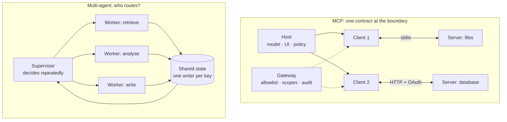

# MCP and Multi-Agent Interviews

> **Interview answer (say this first).** MCP (Model Context Protocol) is an open protocol that lets an AI host discover and call external capabilities through one uniform contract. A **host** owns the model and all policy, each **client** manages one connection to one **server**, and a server exposes three primitives: **tools** (model-invoked actions), **resources** (app-controlled context by URI), and **prompts** (user-invoked templates). Transport is **stdio** for local subprocesses or **Streamable HTTP** for remote, multi-tenant servers. Remote auth is OAuth 2.1 with scoped, audience-bound tokens, and the security threats — tool poisoning, rug pulls, confused deputies — are contained by allowlists, fingerprinting, sandboxing, and approvals, not by trusting the server. A multi-agent system is several agents on one goal. It buys exactly four things — separate context, independent judgement, genuine parallelism, and specialisation — and charges coordination, latency, tokens, and non-determinism. Start with one agent; add a second only when you can name and measure the benefit.

> **Note:**
>
> **Verified.** Every runnable pure-Python example on this page was executed offline (Python 3.14). No model calls were made. MCP and LangGraph forms follow Phase 5 and Phase 12.

## Why this exists

These two topics are asked together because both are about **boundaries**. MCP is the boundary between an AI host and the outside world; multi-agent is the boundary between several agents on one job. Interviewers listen for whether you can answer three questions:

- **Where is the trust boundary?** For MCP it is the host, not the server and not the model. For multi-agent it is the delegation edge, where privilege must shrink.
- **What does the pattern cost?** A tool catalog costs context on every turn; a second agent costs a prompt, a context, an interface, and a new way to fail.
- **When do you not use it?** A single app with a fixed set of functions does not need MCP. A task that fits in one context does not need multiple agents.

## Start from zero

| Word | Plain meaning |
| --- | --- |
| **MCP** | Model Context Protocol: an open spec for connecting AI apps to external systems. |
| **Protocol** | An agreed message contract. MCP is a protocol, not a library or a framework. |
| **Host** | The user-facing app. Owns the model, the UI, and every trust decision. |
| **Client** | A connection manager inside the host. Exactly one server per client. |
| **Server** | A program that exposes tools, resources, and prompts over MCP. |
| **Transport** | How bytes move: stdio (local pipe) or Streamable HTTP (remote). |
| **Primitive** | One of the three things a server exposes: tool, resource, prompt. |
| **Tool** | A model-invoked action with a JSON Schema for its arguments. |
| **Resource** | Read-only context identified by a URI, loaded by the application. |
| **Resource template** | A parameterized resource URI, such as `notes://{name}`. |
| **Prompt** | A reusable message template with arguments, chosen by the user. |
| **Discovery** | Asking a server what it offers: `tools/list`, `resources/list`, `prompts/list`. |
| **JSON-RPC 2.0** | The message envelope MCP uses: requests, responses, and notifications. |
| **Capability** | A feature a peer declares it supports, such as "I have tools." |
| **`initialize` / `server/discover`** | Lifecycle methods: `initialize` is the legacy handshake; `server/discover` is an optional probe under the stateless current revision. |
| **stdio** | Newline-delimited JSON over a local subprocess's stdin/stdout. |
| **Streamable HTTP** | One HTTP endpoint (`POST /mcp`) with JSON or request-scoped SSE replies. |
| **OAuth 2.1** | The delegated-authorization framework remote MCP uses. |
| **Scope** | A named permission such as `files:read` or `repo:write`. |
| **Audience (`aud`)** | The service a token was issued for; the server must check it. |
| **Token passthrough** | Forwarding a token to a service it was not issued for. Forbidden. |
| **PKCE** | Proof Key for Code Exchange: binds the authorization request to the token exchange so a stolen code cannot be redeemed. |
| **Gateway** | One front door in front of many MCP servers, holding policy and credentials. |
| **Namespacing** | Prefixing tool names by server, such as `github__search`, to avoid collisions. |
| **Tool poisoning** | A hostile tool name, description, or schema that steers the model. |
| **Rug pull** | A server changes a tool after it was approved; fingerprinting detects it. |
| **Confused deputy** | A trusted component tricked into using its authority for an attacker. |
| **Multi-agent system** | Two or more agents that work on one goal and coordinate. |
| **Coordination** | Deciding who does what, in what order, and merging the results. |
| **Context isolation** | Giving each agent only the slice it needs, so noise cannot leak. |
| **Role** | A job: a responsibility with declared inputs, outputs, and tools. |
| **Router** | A component that classifies once and dispatches to one path. |
| **Supervisor** | A manager agent that delegates to workers in a loop and merges results. |
| **Planner-executor** | A pattern that writes the plan first, then runs the steps. |
| **Critic / evaluator** | A party that did not write the work checks it. Critic improves; evaluator gates. |
| **Handoff** | Transferring control so the new agent finishes the task. |
| **Agent-as-tool** | Calling another agent for a bounded job; the caller keeps control. |
| **Shared state** | The run's source of truth: goal, plan, results, counters. |
| **Private state** | One agent's scratch and reasoning, hidden from the others. |
| **Single-writer rule** | Exactly one agent may write each shared key. |
| **Compare-and-swap (CAS)** | Write only if the version you read is still current. |
| **Deadlock** | A cycle of agents each waiting for the other, so none moves. |
| **Livelock** | Agents keep acting, but the state repeats and no goal advances. |
| **Fan-out / fan-in** | Start many workers, then wait for all and merge. |
| **Model tiering** | Choosing model size by role: cheap for routing, strong for judgement. |
| **Bulkhead** | Isolating each dependency in its own worker pool so one slow or failing dependency cannot exhaust the rest. |
| **Burn rate** | How fast you spend relative to budget over a time window. |

Three distinctions matter most:

- **Capability vs permission.** A capability is a claim ("I have tools"). A permission is a decision the host makes. Never authorize from a claim.
- **Role vs agent.** A role is the job; an agent is the process filling it. One agent can hold several roles, and one role can run as several agents.
- **Router vs supervisor.** A router decides once and gets out of the way. A supervisor stays in the loop, deciding repeatedly.

## The core idea

For MCP, think **USB-C**. Before a standard port, every device needed its own plug, so you kept a drawer of adapters. One port shape means a laptop and a device connect without knowing each other's internals. MCP is "USB-C for AI capabilities": each app speaks the protocol once, and each capability is exposed once. The win is turning `M × N` connectors into `M + N`.

For multi-agent, think of **hiring**. A single agent is one excellent generalist. A multi-agent system is a small firm with a manager and specialists. A firm is worth it when the job needs several skills, when independent pieces can run at once, when each specialist must not see the others' noise, or when a second person must check the first. A firm with one employee is just overhead.



The comparison table for orchestration patterns is the part to memorise:

| Pattern | Control shape | Best when | Main failure mode |
| --- | --- | --- | --- |
| Single agent | One loop | One domain, small tool set | Context and tool bloat |
| Router | Classify once, dispatch | Many request types, one path each | Silent misroute |
| Planner-executor | Plan first, bounded replan | Steps knowable, audit needed | Plan too coarse to execute |
| Supervisor-worker | Manager repeats delegation | Broad task, many skills | Endless or repeated delegation |
| Critic / evaluator | Generate, then check | A wrong answer is expensive | Vague rubric, oscillation |

## How it works

**MCP, one interaction at a time:**

1. **The host creates a client for one server.** Local servers are launched as a subprocess; remote servers are reached by URL. One client, one server.
2. **The client discovers the server.** The current revision is stateless: protocol version and capabilities travel on each request, and a client *may* probe with `server/discover` (the high-level client does so in its default `auto` mode). Older revisions run an `initialize` handshake.
3. **The client lists what is available.** `tools/list` returns names, descriptions, and JSON Schemas; `resources/list` and `prompts/list` return the other primitives.
4. **The host shows the model a catalog.** It converts MCP tool schemas into the provider's function-calling format.
5. **The model proposes a tool call.** This is ordinary function calling; the model never sees the server.
6. **The host validates and routes.** It checks the tool against policy and sends `tools/call` to the server that advertised it.
7. **The server executes and returns a result.** A thrown exception becomes an error result, so the model can react rather than crash.
8. **The host treats the result as untrusted.** It labels it as data and keeps policy decisions outside the model.

**A multi-agent system, one design at a time:**

1. **Build the single-agent baseline.** Record success rate, cost, and latency. Every extra agent must beat it on a metric you care about.
2. **Name the benefit.** Separate context, independent judgement, genuine parallelism, or specialisation. If you cannot name one, stay single.
3. **Name the roles before the agents.** Retrieve, classify, draft, verify. A role is a job; an agent is the process filling it.
4. **Declare each role's interface.** Input schema, output schema, allowed tools. Validate at the boundary so a malformed handoff fails fast.
5. **Pick the smallest pattern.** Many request types → router. Knowable steps → planner-executor. Broad multi-skill task → supervisor-worker. Otherwise single agent.
6. **Apply the single-writer rule.** Each shared key has exactly one writer; others read or request a change.
7. **Version shared state and use compare-and-swap.** A stale write is rejected, not silently applied.
8. **Isolate context.** Hand each worker its goal and its own scratch, never the whole conversation.
9. **Cap every loop.** Supervisor steps, replan rounds, hop counts, fan-out width, delegation depth, tokens, and cost.
10. **Detect deadlock and livelock globally.** Deadlock is a cycle in the wait-for graph; livelock is a repeating state fingerprint. The blocked agents cannot see either.
11. **Break one edge deterministically.** Pick a victim by a rule so the same cycle resolves the same way twice, then retry with a fallback or return a partial result.
12. **Evaluate the whole topology.** Task outcome, coordination quality (redundancy, conflict, loops), and per-agent cost and errors.

## The syntax you will use

**An MCP server with one tool.** The type hints become the JSON Schema; the description is what the model reads.

```python
from mcp.server.mcpserver import MCPServer

server = MCPServer(name="docs", version="1.0.0")

@server.tool(description="Search internal documentation. Read-only.")
def search_docs(query: str, top_k: int = 5) -> list[str]:
    return [f"{query}:{i}" for i in range(top_k)]

if __name__ == "__main__":
    server.run(transport="stdio")   # local subprocess
```

**An MCP client discovers and calls.** Discovery and call are two separate round trips; that separation is the heart of MCP.

```python
import asyncio
from mcp import Client

async def main():
    async with Client(server) as client:
        print([t.name for t in (await client.list_tools()).tools])
        result = await client.call_tool("search_docs", {"query": "billing"})
        print(result.structured_content)

asyncio.run(main())
```

**What a tool descriptor looks like on the wire.** This is the contract the model ultimately sees.

```json
{
  "name": "search_docs",
  "description": "Search internal documentation. Read-only.",
  "inputSchema": {
    "type": "object",
    "properties": {"query": {"type": "string"}, "top_k": {"type": "integer"}},
    "required": ["query"]
  }
}
```

**The three primitives, mapped to owners.** Tools go to the model, resources to the app, prompts to the user.

```python
@server.tool(description="Create a GitHub issue. Has side effects; needs approval.")
def create_issue(repo: str, title: str) -> str: ...

@server.resource("policy://refund", mime_type="text/markdown")
def refund_policy() -> str: return "# Refund policy\n30 days."

@server.prompt(description="Review a pull request.")
def review_pr(pr: int, focus: str = "correctness") -> str:
    return f"Review PR #{pr}, focusing on {focus}."
```

**A remote server with OAuth-style auth.** The gateway or server validates the token, its audience, and its scopes.

```python
from mcp.server.auth.settings import AuthSettings

settings = AuthSettings(
    issuer_url="https://auth.example.com",
    resource_server_url="https://mcp.example.com",
    required_scopes=["tools:call"],
    validate_token_resource=True,   # reject tokens issued for another service
)
```

**A gateway policy, evaluated deny-first.** Unknown tool, missing scope, or explicit deny all mean deny.

```python
import fnmatch

def evaluate(user, tool, policy):
    if any(fnmatch.fnmatchcase(tool, p) for p in policy["tool_deny"]):
        return "deny:explicit"
    if tool.split("__", 1)[0] in policy["server_deny"]:
        return "deny:server"
    if not any(fnmatch.fnmatchcase(tool, p) for p in policy["tool_allow"]):
        return "deny:not-allowed"
    needed = set(policy["tool_scopes"].get(tool, []))
    if not needed <= set(policy["user_scopes"].get(user, [])):
        return "deny:missing-scope"
    return "allow"
```

**Aggregate catalogs with a registration-derived prefix.** Detect name collisions at registration, not at call time.

```python
def aggregate(servers: dict[str, list[str]]):
    catalogue, collisions = {}, []
    for server, names in servers.items():
        for name in names:
            qualified = f"{server}__{name}"
            if qualified in catalogue:
                collisions.append(qualified)
            catalogue[qualified] = server
    return catalogue, collisions
```

**Narrow scopes at every delegation.** The child gets the intersection, so a request for more silently yields less.

```python
def delegate_scopes(parent_scopes: set[str], requested: set[str]) -> set[str]:
    return requested & parent_scopes
```

**Versioned shared state with compare-and-swap.** A stale write is rejected and the writer re-reads.

```python
def compare_and_swap(state, expected_version, writer, patch):
    if expected_version != state["version"]:
        raise ValueError(f"stale write by {writer}")
    state["data"].update(patch)
    state["version"] += 1
```

**Deadlock detection on the wait-for graph.** A back edge to a node on the current path is the cycle.

```python
def find_cycle(wait_for):
    WHITE, GRAY, BLACK = 0, 1, 2
    color = {n: WHITE for n in wait_for}
    stack = []
    def visit(node):
        color[node] = GRAY; stack.append(node)
        for nxt in wait_for.get(node, ()):
            if color.get(nxt, WHITE) == GRAY:
                return stack[stack.index(nxt):] + [nxt]
            if color.get(nxt, WHITE) == WHITE:
                found = visit(nxt)
                if found:
                    return found
        stack.pop(); color[node] = BLACK
        return None
    return next((f for n in list(wait_for) if color[n] == WHITE
                 for f in [visit(n)] if f), None)
```

**Bound fan-out by width and budget.** The allowed width is the minimum of desire, width, and money.

```python
def allowed_fanout(requested, max_width, budget, est_cost):
    by_width = min(requested, max_width)
    by_budget = int(budget // est_cost) if est_cost > 0 else by_width
    return max(0, min(by_width, by_budget))
```

## Examples: simple to real

**Example 1 — gateway policy is deterministic and deny-first.** Running the evaluator on five realistic cases. Verified:

```text
alice github__search        -> allow
alice github__delete_repo   -> deny:explicit
bob   github__create_issue  -> deny:missing-scope
alice shell__exec           -> deny:explicit
alice wiki__unknown         -> deny:not-allowed
```

`github__delete_repo` appears in the allowlist, yet the explicit deny wins — that ordering is the whole point. Bob has read scope only, so his write is denied. An unknown tool is rejected by default, not implicitly trusted.

**Example 2 — namespacing prevents collisions, not impersonation.** Two servers both expose `search`. Verified:

```text
({'github__search': 'github', 'github__create_issue': 'github',
  'wiki__search': 'wiki', 'wiki__fetch': 'wiki'}, [])
```

The prefix comes from the registration, so the destination is explicit in the tool name, the policy, and the audit log. A gateway must derive the prefix from the server it actually connected to, because a malicious server can name its tool `github__search`.

**Example 3 — a child can never exceed its parent's scopes.** Verified:

```text
exact:     ['read:orders', 'refund:orders']
escalate:  ['read:orders']
```

The child requested `read:orders` and `delete:orders` from a parent holding only `read:orders`. The intersection dropped `delete:orders`. That one line of set intersection is the most important security control in a delegation chain.

**Example 4 — deadlock is a cycle, and a chain is not a deadlock.** Verified:

```text
cycle: ['A', 'B', 'C', 'A']
chain: None
```

A waits on B, B on C, C on A: none can proceed. A chain that ends is safe. The blocked agents cannot see the cycle themselves, so detection must run in the coordinator on a global wait-for graph.

**Example 5 — fan-out is bounded by desire, width, and money.** Verified:

```text
asked 50, width 8, $6 at $1 each: 6
asked 5, width 8, $0.50 at $1 each: 0
```

The first case is capped by the budget, the second by cost: fewer than one worker is affordable, so it spawns zero and must escalate. Over-spawning to look thorough is not a quality knob.

**Example 6 — shared state CAS prevents a lost update, and the split is not free.** Verified:

```text
A read v0 | B read v0
A wrote v1
stale write by B: expected v0, actual v1
B re-read v1 | B wrote v2

single agent $0.0135
multi-agent $0.036   ratio 2.67x
sequential 1.9s      parallel 0.8s
```

Both agents read version 0; B's write was rejected and succeeded only after a re-read. The cost and latency numbers show the trade: multi-agent costs about 2.7 times a single agent, and parallelism saves wall-clock time only for independent work.

## In production

- **The host owns policy, not the server.** A server cannot enforce your user's permissions. Allowlists, scopes, approvals, and tenancy checks belong in the host or gateway.
- **Treat every server-provided string as untrusted input.** Names, descriptions, schemas, annotations, and results are an attack surface. A description is read by the model, so it is an instruction channel.
- **Fingerprint approved tools and re-review on change.** A changed fingerprint returns the tool to review. Fingerprinting detects a rug pull; it does not prevent one.
- **Bind tokens to an audience and keep them short-lived.** Reject a token not issued for the receiving service, and never forward a client token to a different service.
- **Namespace tools by registration, and keep the routing map.** Never parse the prefix back apart, and filter the catalog by what each caller may use.
- **Never write to stdout in a stdio server.** stdout is the protocol; logs go to stderr. A stray `print` corrupts the stream.
- **Default to one agent, then a workflow, then multi-agent.** Climb only when the rung below fails a metric, and write the benefit on the ticket.
- **One writer per shared key, enforced in code.** A documented rule drifts; a permission check fails closed. Version every shared write.
- **Cap every loop and every fan-out.** Steps, rounds, hop counts, delegation depth, width, tokens, and cost. An uncapped supervisor is unbounded spend.
- **Detect coordination failures globally.** Deadlock is a cycle in the wait-for graph; livelock is a repeating state fingerprint. A busy conversation is not progress.
- **Attribute cost and latency per agent.** Roll spans up by agent, and compute latency on the critical path, not by summing parallel spans.
- **Tier models by role and cache shared work.** Routing does not need the largest model; a failed specialist can fall back to a cheaper generalist.

## Interview questions

### 1. What is MCP, and how does it relate to function calling?

**Answer.** MCP is an open protocol that standardises how an AI host discovers and calls external capabilities, turning `M × N` custom connectors into `M + N` implementations. Function calling is the model-provider feature that lets a model emit a structured tool call — it is model-to-host. MCP is host-to-server: it standardises where tool definitions come from and how the call reaches the capability. They compose: the host lists MCP tools, converts them into the provider's function-calling format, the model chooses, and the host routes the call back over MCP.

**Follow-up: "Does MCP replace function calling?"** No. A model only understands its own provider's tool format; MCP feeds that format, and the provider still executes the model's call.

**Trap.** Calling MCP "function calling with extra steps." Function calling has no discovery, no transports, no cross-vendor catalog, and no server process.

### 2. What are the MCP roles and the three primitives?

**Answer.** The **host** is the user-facing application: it owns the model, the UI, and all policy. Each **client** inside the host manages one connection to one **server**. The shape is one host, many clients, many servers. A server exposes three primitives: **tools** are model-invoked actions with a JSON Schema; **resources** are read-only context addressed by URIs and loaded by the app; **prompts** are reusable message templates the user selects. Control is the key distinction: tools are the model's, resources the app's, prompts the user's.

**Follow-up: "Can the model call a resource directly?"** No. Resources are app-controlled by design. If the model must choose what to read, expose a read tool or pre-load the relevant resources.

**Trap.** Using a resource when you need a tool, or turning a read-only wiki into five hundred `get_page_N` tools. That inflates the catalog, costs context every turn, and worsens selection.

### 3. stdio versus Streamable HTTP — how do you choose?

**Answer.** Use **stdio** when the server is local, single-user, and can use your own machine's identity — filesystem, Git, and local database tools. Use **Streamable HTTP** when the server is shared, remote, multi-tenant, or needs OAuth, elastic scaling, and central governance. stdio is a private pipe you start; HTTP is a service you authenticate to on every request. The current revision is stateless, so any instance can serve any request and a plain round-robin load balancer works without sticky sessions.

**Follow-up: "What breaks stdio?"** A stray `print` to stdout corrupts the protocol stream, and a leaked or hung subprocess exhausts memory and file descriptors. Logs go to stderr, and every call needs a timeout.

**Trap.** Choosing HTTP by default because it "sounds more production." For a personal local tool, a subprocess is simpler, faster, and has a smaller attack surface.

### 4. How does MCP discovery work, and what does a tool descriptor contain?

**Answer.** Discovery has two stages. First, protocol version and capabilities are established. The current revision is stateless: they travel on each request, and a client *may* send a `server/discover` probe (optional — the high-level client does it in its default `auto` mode). A legacy server uses `initialize` plus `notifications/initialized`. Second, the client lists concrete items with `tools/list`, `resources/list`, `resources/templates/list`, and `prompts/list`. Each tool carries a name, an optional description, an `inputSchema` as JSON Schema, and sometimes an `outputSchema` and annotations. The schema is the contract; the description is the routing hint. If a server advertises `listChanged`, a change notification tells the client to re-list.

**Follow-up: "What do the annotations mean?"** `readOnlyHint`, `destructiveHint`, `idempotentHint`, and `openWorldHint` hint at risk so the host can decide whether to prompt for approval. They are advisory claims, not facts, and a malicious server can lie about them.

**Trap.** Treating `capabilities.tools` as the tool list. It is only a flag saying tools exist; the actual items come from `tools/list`, which can change.

### 5. How does MCP auth work, and what are the main MCP security threats?

**Answer.** Remote MCP uses an OAuth 2.1 flow: the client hits the server, gets a 401 pointing at protected-resource metadata, discovers the authorization server, runs the authorization-code flow with PKCE, and receives a scoped, audience-bound token. The server validates the signature or introspects, checks expiry and audience, and checks the scope for the specific tool. The main threats are a malicious server, **tool poisoning** (a hostile description steering the model), a **rug pull** (a tool changed after approval), a **confused deputy** (a trusted proxy used for an attacker), and **token leakage**. Controls are least privilege, scoped and audience-bound tokens, allowlists, fingerprinting, sandboxing, human approval, and audit — enforced in the host or gateway, never in the prompt.

**Follow-up: "How do you detect a rug pull?"** Fingerprint the approved tool's name, description, and schema, and re-check on `notifications/tools/list_changed` and on reconnect. A changed fingerprint returns the tool to review. It detects, it does not prevent.

**Trap.** Trusting a server's `readOnlyHint`. It is a claim by an untrusted party. Authorize the action in code regardless of what the annotation says.

### 6. When is a multi-agent system worth it, and when is it not?

**Answer.** It buys exactly four things: separate context (each agent sees only what it needs), independent judgement (a party that did not write the work checks it), genuine parallelism (independent pieces run at once), and specialisation (one narrow job and a few tools). It charges coordination overhead, latency, a larger token bill, and harder debugging and evaluation. I would not build one when the task fits in one context, when the steps are fixed and knowable, or when there is no independent work and no independent check. Start with one agent, improve the tools and prompt, and split only when I can name one of the four benefits and measure it against the baseline.

**Follow-up: "Which benefit is worth the most?"** Context isolation, because it makes the other three cheaper: smaller contexts mean lower cost and cleaner decisions.

**Trap.** Claiming "better reasoning" as the benefit. More agents do not think harder; they divide work. The reasoning quality comes from the model and the prompt, not the agent count.

### 7. Explain supervisor-worker, planner-executor, router, and critic. How do agents share state safely?

**Answer.** A **router** classifies once and dispatches to one specialist; it is the cheapest multi-agent form. A **planner-executor** writes the plan first, then runs the steps with a bounded replan; it is inspectable and auditable. A **supervisor** holds the remaining work and delegates in a loop until the goal is met, with a step cap and no-progress detection. A **critic** reviews a draft and returns specific feedback for a revision; an **evaluator** gates against a rubric; both need independence, a threshold, and a round cap. For state, keep reasoning private and publish only conclusions. Each shared key has exactly one writer, enforced in code, and every shared write is versioned with compare-and-swap so a stale write is rejected instead of silently overwriting.

**Follow-up: "How do you handle a genuine write conflict?"** Detect it with the version check, then resolve deterministically: retry after re-reading, merge non-overlapping fields, or escalate to a resolver. Record the conflict; never let arrival order decide.

**Trap.** Using a prompt instruction like "do not overwrite each other." Prompts are not locks. Only ownership enforced in code prevents a lost update.

### 8. How do multi-agent systems fail, and how do you evaluate and control the cost?

**Answer.** The characteristic failures are **deadlock** (a cycle of agents waiting on each other), **livelock** (everyone busy, state unchanged), **runaway fan-out** (a supervisor spawns far too many workers), and **cascading failure** (one failed worker takes down a chain). Detection is global: a cycle check on the wait-for graph, a state fingerprint for no progress, turn and round caps, plus timeouts and bulkheads. Evaluation has three layers: task outcome, coordination quality (redundancy, conflict rate, handoff utilisation, loop count), and per-agent cost, latency, and errors, all attributed by a trace with parent-child spans. Cost control is budgets at call, agent, run, and tenant level; a fan-out cap; model tiering by role; and a burn-rate alert inside the loop.

**Follow-up: "What is the difference between a stopped run and a failed run?"** A stopped run hit an intentional guard and returns a partial result with the reason; a failed run hit an unrecoverable error. The reason is the most valuable part of the result — "round cap reached with no new facts" is debuggable, "it hung" is not.

**Trap.** Adding retries as the fix for a cascade. Retries amplify load on a saturated dependency, which is exactly how one failure becomes a cascade.

## Remember this

- **MCP turns `M × N` into `M + N`.** It is a protocol; the host owns policy; tools are model-invoked, resources app-invoked, prompts user-invoked.
- **stdio is a local private pipe; Streamable HTTP is a shared, stateless service.** Transport decides trust, auth, scale, and latency.
- **The host is the trust boundary.** Fingerprint tools, bind tokens to an audience, scope credentials, sandbox, and require approval — never trust a server or a description.
- **Start single-agent.** Add an agent only for separate context, independent judgement, genuine parallelism, or specialisation, and prove the gain.
- **One writer per shared key, versioned with compare-and-swap, and cap every loop, fan-out, and budget.** Deadlock is a cycle; livelock is a repeating state.
