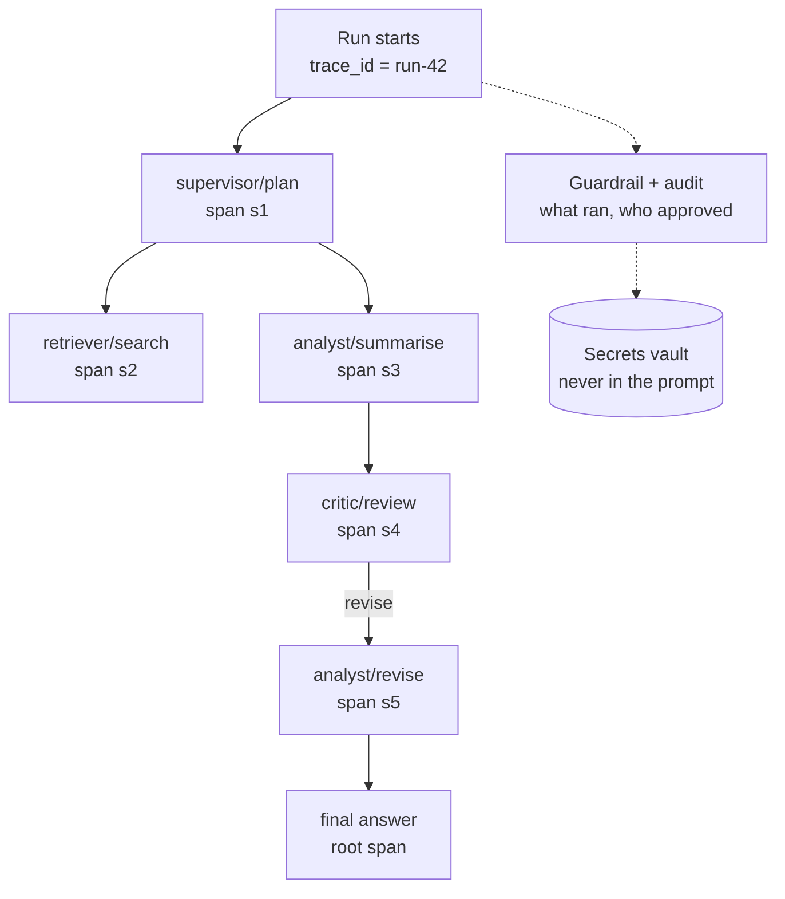

# AI Security, Observability, and Evaluation

> **Interview answer (say this first).** Security starts with a threat model: assets, actors, attack surface, controls, residual risk. The central rule is that **the model is not a security boundary** — it proposes, code decides. Prompt injection comes from untrusted text in the context, **direct** from the user and **indirect** from anything the agent reads, and there is no reliable detection, so you contain it with least privilege, argument allowlists, isolation, output validation, and approval for irreversible actions. Poisoning is injection that persists through a write path, so you guard the write as hard as the read. Exfiltration flows through tool calls, rendered output (the markdown-image trick), logs, and errors, so you vault secrets, restrict reads, allowlist egress, and redact. Observability means one trace per run with a span per step and a parent link, using OpenTelemetry, so you can attribute cost, latency, and errors per agent. Evaluation uses datasets, deterministic checks, LLM-as-judge calibrated against humans, and CI gates — offline to decide whether to ship, online to decide whether it helped.

> **Note:**
>
> **Verified.** Every runnable pure-Python example on this page was executed offline (Python 3.14). No model calls were made. Security examples follow Phase 9; observability and evaluation follow Phase 8.

## Why this exists

Security, observability, and evaluation are asked together because they are the same discipline from three angles: **you cannot secure, operate, or improve a system you cannot see and measure.** Three traps catch weak candidates:

- **Overclaiming a control.** "We scan for injection, so we are safe." The scanner misses paraphrases, encodings, and translations; the model is not fixed.
- **Confusing detection with prevention.** A detector raises a signal; only code that blocks, scopes, or approves changes the outcome.
- **Judging the final answer only.** An agent can refund an order twice, email three times, or loop forty steps and still produce a correct-looking final state.

The honest answer names the control, its limit, and the residual risk.

## Start from zero

| Word | Plain meaning |
| --- | --- |
| **Asset** | Anything valuable you are protecting: data, credentials, tools, reputation. |
| **Actor** | Who or what could cause harm: external attacker, malicious user, compromised dependency, insider. |
| **Attack surface** | Every place an attacker can send input or influence behaviour. |
| **Trust boundary** | A line where data or control passes between parties that do not fully trust each other. |
| **Threat model** | A written list of assets, actors, threats, controls, and residual risk. |
| **Residual risk** | What remains after controls are applied; it needs an owner. |
| **Prompt injection** | Untrusted text in the context that the model follows as an instruction. |
| **Direct injection** | The user themselves types the malicious instruction. |
| **Indirect injection** | The instruction arrives through a page, file, email, or tool result the agent reads. |
| **Jailbreak** | Getting the model to break its own safety rules; related but a different target. |
| **Poisoning** | Placing attacker content where the system will trust it later. |
| **Context poisoning** | Poison in retrieved content: a document, page, or tool result. |
| **Memory poisoning** | Poison written to persistent notes or a vector store and trusted later. |
| **Tool poisoning** | A hostile tool name, description, or schema that steers the model. |
| **Rug pull** | A tool changes after it was approved; fingerprinting detects it. |
| **Exfiltration** | Sending private data to an attacker-controlled destination. |
| **Egress** | Outbound network traffic leaving your system. |
| **Markdown image** | Image syntax a UI may fetch automatically, creating an unrequested request. |
| **Vaulting** | Keeping a secret out of the context; code injects it only at the point of use. |
| **Redaction** | Replacing sensitive values in text with a placeholder. |
| **Least privilege** | Giving each step only the access it needs, for only as long as it needs it. |
| **Allowlist** | An explicit list of permitted items; everything else is denied. |
| **Excessive agency** | Giving the agent more capability than the task needs. |
| **Privilege escalation** | Using one granted capability to gain another. |
| **Sandbox** | A restricted environment limiting files, network, and system calls. |
| **Approval gate** | A mandatory human decision before a dangerous action. |
| **Separation of duties** | The requester cannot be the approver. |
| **Audit log** | An append-only record of who did what, when, with which arguments, and the result. |
| **Trace** | The record of one whole run, identified by a `trace_id`. |
| **Span** | One timed step inside a trace, with a parent link. |
| **Context propagation** | Passing the trace id and parent span id across services, usually via `traceparent`. |
| **Tail sampling** | Deciding whether to keep a trace after it finishes, so slow or failed runs are kept and the rest thinned. |
| **OpenTelemetry (OTel)** | The vendor-neutral standard and SDK for traces, metrics, and logs. |
| **GenAI semantic conventions** | Agreed attribute names such as `gen_ai.request.model`. |
| **Metric** | A number over time, such as error ratio, p95 latency, or cost. |
| **LLM-as-judge** | Using a model to score or compare outputs against a rubric. |
| **Pointwise / pairwise** | Score one answer alone, or pick the better of two. |
| **Rubric** | An explicit scoring guide with criteria and weights. |
| **Calibration** | Checking the judge against human labels. |
| **Cohen's kappa** | Agreement corrected for the agreement expected by chance. |
| **Golden set** | A fixed set of inputs with trusted expected behaviour. |
| **CI gate** | A threshold check that can fail a build. |
| **Baseline** | The stored metric from a known-good run, used for comparison. |
| **Online eval** | Judging quality on live traffic as it happens. |
| **Drift** | The world or the model changes, so yesterday's good behaviour stops being good. |

Three distinctions matter most:

- **Injection vs jailbreak.** Injection hijacks your application's instructions and tools; a jailbreak attacks the model's own safety training. Injection is your problem because it is about your tools and permissions.
- **Injection vs poisoning.** Injection is an event; poisoning is a stored state that future prompts trust.
- **Prevention vs detection.** Prevention blocks the channel; detection finds the attempt. You need both, and neither is complete.

## The core idea

For security, picture a **bank**. The vault holds the money; the teller talks to customers and has a key to the cash drawer, not the vault; the rules are enforced by the system, not by the teller's honesty; and a camera records what happened. An LLM agent is the teller — fluent and easily convinced by a well-written note. You do not ask the teller to police themselves. You design the vault, the keys, the rules, and the camera so a fooled teller still cannot open the vault.

For observability, picture a **detective's evidence board**. Each photograph is a span: one action, with a timestamp and a cost. The string is the parent link: the analyst's summarise step was caused by the supervisor's plan step. Follow the string and you reconstruct who asked whom for what. The trace id is the case number proving every photograph belongs to one investigation.



The metric stack is the part to memorise for evaluation:

| Layer | Question | Example metric |
| --- | --- | --- |
| Task outcome | Did it work? | task success rate, cost per successful task |
| Coordination | Did the agents work together well? | handoff utilisation, redundancy, conflict rate, loop count |
| Per-agent | Which agent cost or broke this? | cost by agent, p95 latency by agent, errors by agent |
| Safety | Did it avoid harm? | forbidden-tool rate, side-effect counts, approval coverage |

## How it works

1. **List the assets and rank them.** Data, credentials, tools, and reputation. If everything is an asset, nothing is.
2. **Enumerate the actors.** External attacker, malicious user, compromised dependency, curious insider. Each reaches you by a different route.
3. **Draw the trust boundaries.** User to app, app to model, retrieval to context, model to tool layer, tool layer to external systems, memory to context.
4. **Map the six attack-surface channels.** Prompts, retrieved content, tools, memory, model output, and the supply chain. Ask who can write into each.
5. **Apply a STRIDE-style lens.** Spoofing, tampering, repudiation, information disclosure, denial of service, elevation of privilege — translated to AI.
6. **Rate threats by likelihood times impact, and assign an owner.** Rank so effort follows risk, and write the residual risk next to each control.
7. **Put a deterministic control at the boundary.** Allowlists, argument validation, scoped credentials, approvals, sandboxing, and audit. A prompt sentence is not a control.
8. **Guard the write path as hard as the read path.** Provenance labels, trusted writers, verification, and re-validation stop injection from becoming durable poison.
9. **Vault secrets and allowlist egress.** Keep keys out of the context, route outbound traffic through one chokepoint, and inspect output for URLs.
10. **Instrument one trace per run with a span per step.** Parent links make the causal chain; attributes record agent, model, tool, tokens, cost, and outcome.
11. **Roll spans up per agent and classify failures by cause and owner.** Rollups turn one number into a suspect list; "the run failed" is not a ticket.
12. **Evaluate offline and online.** A golden dataset and deterministic checks gate a release; sampled online judging tells you whether it actually helped.
13. **Calibrate every judge against human labels.** A metric you cannot trust is worse than no metric, because people make decisions with it.
14. **Gate on trustworthy metrics and warn on noisy ones.** Block safety and schema checks; warn on open-ended helpfulness and tiny slices.

## The syntax you will use

**A keyword injection detector.** It catches the obvious case and looks useful in a dashboard; it is a smoke alarm, not a lock.

```python
import re
PATTERNS = {"ignore-previous": r"ignore\s+(all\s+)?(previous|prior|above)\s+instructions",
            "you-are-now": r"you\s+are\s+now\b",
            "reveal-prompt": r"(reveal|print|repeat)\s+.*(system\s+prompt|instructions)"}

def detect(text):
    return [n for n, p in PATTERNS.items() if re.search(p, text, re.IGNORECASE)]
```

**Normalise before matching.** Strip invisible format characters so a zero-width space cannot split a keyword.

```python
import unicodedata
def normalize(text):
    return "".join(ch for ch in text if unicodedata.category(ch) != "Cf").lower()
```

**An allowlist plus an approval gate.** The decision is in code, so the action is blocked even when the model proposes it.

```python
ALLOWED = {"search_docs", "send_email"}
IRREVERSIBLE = {"send_email"}

def authorize(call):
    if call["tool"] not in ALLOWED:
        return f"denied: tool not allowed: {call['tool']}"
    if call["tool"] in IRREVERSIBLE:
        return f"approval required: {call['tool']}"
    return f"allowed: {call['tool']}"
```

**Find egress URLs in model output.** A markdown image is an automatic request; links are the click channel.

```python
import re
IMG = re.compile(r"!\[[^\]]*\]\(([^)]+)\)")
LINK = re.compile(r"(?<!!)\[[^\]]*\]\(([^)]+)\)")
def find_egress(text):
    return IMG.findall(text) + LINK.findall(text)
```

**An egress allowlist on the parsed host.** Check the hostname, not a substring, so a lookalike cannot hide.

```python
from urllib.parse import urlparse
ALLOWED_HOSTS = {"api.ourcompany.com"}

def host_allowed(url):
    host = (urlparse(url).hostname or "").lower()
    return host in ALLOWED_HOSTS
```

**A capability gate in front of every tool.** The session's capabilities decide, not the model's request.

```python
TOOL_CAP = {"read_file": "read", "run_shell": "exec", "send_email": "send"}

def invoke(tool, session_caps):
    needed = TOOL_CAP.get(tool)
    if needed is None:
        return f"deny: unknown tool {tool}"
    if needed not in session_caps:
        return f"deny: needs {needed}"
    return f"ok: {tool}"
```

**An OpenTelemetry span for one model call.** The GenAI conventions make the trace a cost and quality record.

```python
with tracer.start_as_current_span("chat gpt-4o", kind=SpanKind.CLIENT) as span:
    span.set_attribute("gen_ai.operation.name", "chat")
    span.set_attribute("gen_ai.request.model", "gpt-4o")
    span.set_attribute("gen_ai.usage.input_tokens", 812)
    span.set_attribute("gen_ai.usage.output_tokens", 96)
    span.set_attribute("gen_ai.agent.name", "support-agent")
```

**A trace id in every log line.** One correlation key is what links a metric spike to a trace and then to a log.

```python
import logging
log = logging.getLogger("agent")
def log_step(trace_id, span_id, **fields):
    log.info("step", extra={"trace_id": trace_id, "span_id": span_id, **fields})
```

**A baseline-aware CI gate.** Fail only when the new mean drops below the baseline's lower confidence bound.

```python
import random
from statistics import mean

def bootstrap_lower(scores, n=2000, alpha=0.05, seed=0):
    rng = random.Random(seed)
    means = sorted(mean(rng.choices(scores, k=len(scores))) for _ in range(n))
    return means[int(alpha / 2 * n)]

def baseline_gate(new, base):
    lo = bootstrap_lower(base)
    return {"baseline_lower": round(lo, 3), "new_mean": round(mean(new), 3),
            "gate": "FAIL" if mean(new) < lo else "PASS"}
```

**Cohen's kappa to calibrate a judge.** It removes the agreement that chance alone would produce.

```python
def cohen_kappa(a, b):
    n = len(a)
    observed = sum(x == y for x, y in zip(a, b)) / n
    pa, pb = sum(a) / n, sum(b) / n
    expected = pa * pb + (1 - pa) * (1 - pb)
    return (observed - expected) / (1 - expected)
```

## Examples: simple to real

**Example 1 — a keyword detector misses five of six payloads.** Verified:

```text
baseline   ['ignore-previous']
base64     MISSED
zero-width MISSED
leet       MISSED
synonym    MISSED
french     MISSED
```

Base64 hides the words, a zero-width space splits `ignore`, leetspeak changes the letters, a synonym avoids the phrase, and a translation is a different language. Detection improves monitoring; it does not prevent impact. Pair it with least privilege so a miss is survivable.

**Example 2 — the allowlist and approval gate block the action, not the words.** Verified:

```text
allowed: search_docs
approval required: send_email
denied: tool not allowed: exec_shell
```

The model proposed `send_email` and `exec_shell`; neither ran, because the decision is in code. Security is won at the tool layer, not inside the model.

**Example 3 — output inspection finds the exfiltration URL and the allowlist blocks it.** Verified:

```text
False https://evil.example/collect?d=W1NFQ1JFVA==
True  https://api.ourcompany.com/v1
```

The first URL carries a base64 fragment; the second is approved. Note the residual risk: an allowed destination can still leak data if it has an open redirect or a writable bucket, so pair the allowlist with content inspection.

**Example 4 — the capability gate stops one tool from calling another.** Verified:

```text
ok: read_file
deny: needs exec
deny: unknown tool wire_transfer
```

A read-only session cannot reach a shell, and an unknown tool is denied by default rather than raising an unexpected error. Argument scope still matters: `read_file` sounds safe, but `read_file("../../id_rsa")` is an escalation, so confine paths to a workspace root.

**Example 5 — a CI gate that catches a real regression but not noise.** Baseline 18 correct out of 20 tasks (mean 0.90), a small drop to 17/20 (mean 0.85), and a large drop to 11/20 (mean 0.55). Verified:

```text
baseline   = [1]*18 + [0]*2     # 18/20, mean 0.90
small_drop = [1]*17 + [0]*3     # 17/20, mean 0.85
big_drop   = [1]*11 + [0]*9     # 11/20, mean 0.55

small drop: {'baseline_lower': 0.75, 'new_mean': 0.85, 'gate': 'PASS'}
big drop:   {'baseline_lower': 0.75, 'new_mean': 0.55,  'gate': 'FAIL'}
```

The baseline's bootstrap lower bound is 0.75. The small drop to 0.85 sits above that bound, so the build stays green. The large drop to 0.55 is a real regression, so the gate blocks the merge. A gate that fires on noise gets ignored, which is worse than no gate.

**Example 6 — calibrate the judge before trusting it.** Verified:

```text
kappa: 0.5833
```

Raw agreement was 80%, but both labellers chose the common label most of the time, so chance alone gave 52%. Kappa removes that baseline: `0.58` is a moderate signal, usable to warn but not strong enough to be the only gate.

## In production

- **Make the model's trust level explicit.** Write down that model output is untrusted input, so every consumer validates it. A rule that lives only in the prompt is a hint.
- **Treat retrieved content as the highest-risk channel.** The agent must read it to be useful, and an attacker only needs to plant it. Provenance, isolation, and argument-level controls matter most there.
- **Never put secrets in the prompt, tool arguments, or logs.** Vault first, redact second; a secret in the context is a secret in the blast radius.
- **Route all egress through one chokepoint.** Tool calls, fetches, and webhooks pass a destination allowlist, and every denial is logged and alerted.
- **Disable remote image loading in rendered output.** It is the easiest exfiltration path because it needs no tool and no click.
- **Split the powerful steps.** Read versus write, preview versus commit, request versus approve. Each split removes a path from "fooled model" to real damage.
- **Default to deny and make deny beat allow in any gateway.** Unknown tool, missing scope, unreachable policy, or an error all mean deny.
- **Log the full hop, and treat the audit store as evidence.** Actor, tool, exact arguments, decision, server, version, latency, and outcome, joined by a correlation id. Append-only and access-controlled.
- **One trace id per run, one span per step, causality in the parent link.** A span for the whole run hides which step was slow or wrong.
- **Attribute cost and latency per agent, and compute latency on the critical path.** Summing parallel spans inflates the total and points at the wrong agent.
- **Calibrate judges and keep humans in the loop.** A random human-labelled sample per release is the only way to catch a confidently wrong judge.
- **Do not overclaim.** Detection is probabilistic, redaction misses encodings, and a server with real authority can still misuse it. State the residual risk and keep independent layers.

## Interview questions

### 1. How do you threat-model an AI system?

**Answer.** The same four questions as any system — assets, actors, attack surface, controls — plus one new element: the model is a component whose decisions can be steered by the data it reads. I list assets and rank them, enumerate the four actors (external attacker, malicious user, compromised dependency, curious insider), draw the trust boundaries, and map the six channels: prompts, retrieved content, tools, memory, model output, and the supply chain. I apply a STRIDE-style lens for coverage, rate each threat by likelihood times impact, map it to a deterministic control at the boundary, and record the residual risk and an owner. The central rule: the model is not a security boundary; it proposes, code decides.

**Follow-up: "How do you keep it alive?"** Treat any new model, tool, data source, or MCP server as a trigger: add a row, re-rank, and re-run an adversarial test suite. Store it in version control next to the code.

**Trap.** Saying the model is "the security layer." A better instruction can override it, so it cannot enforce anything.

### 2. What is prompt injection, direct versus indirect, and how do you mitigate it?

**Answer.** Prompt injection is untrusted text in the context that the model follows as if the developer wrote it. It happens because instructions and data share one token stream with no enforced boundary. **Direct** injection comes from the user typing; **indirect** injection arrives through a web page, document, email, or tool result the agent reads. Indirect is the bigger agent threat because the attacker never touches your app. There is no reliable detection, so I mitigate in layers: bound what the model can do (least-privilege tools, argument allowlists), bound what it sees (isolation, provenance, no secrets in context), check what it produces (output validation), and require approval for irreversible actions. Detection is a monitoring signal, not the foundation.

**Follow-up: "Which layer matters most?"** The tool layer, because that is where real effects happen. If `send_email` only reaches internal recipients and irreversible actions need approval, an injection has little to steal and nowhere to send it.

**Trap.** Trying to fix it with a better system prompt. Wording reduces frequency; it does not stop a motivated attacker or bound the damage.

### 3. What is poisoning, and how does it differ from prompt injection?

**Answer.** Injection is an event: a payload arrives and the model acts on it now. Poisoning is a state: attacker content is stored somewhere the system trusts later, such as a retrieval index, a cache, or long-term memory. That persistence is what makes it worse — a poisoned document can be retrieved into many future prompts, and a poisoned memory becomes the system's own belief. There are four write paths: context (documents and tool results), memory (notes, summaries, vectors), tool descriptions, and the MCP server itself. I guard each where it is written: provenance labels, trusted-writer lists, verification or corroboration before a fact becomes durable, fingerprinting tools and re-reviewing on change, and isolation between the step that reads untrusted text and the step that persists or acts.

**Follow-up: "What about the agent summarising a web page?"** That summary is derived from untrusted text, so it is not a trusted source. Store it with a derived label and require corroboration before it becomes durable memory. Do not let an agent silently promote its own summary to fact.

**Trap.** Defending only the read path. If you persist unfiltered text, the next session starts already compromised.

### 4. How does data exfiltration happen, and how do you stop it?

**Answer.** Through several channels, each needing its own control. Tool calls send arguments to external APIs. Rendered output can contain a markdown image or link that triggers a fetch — the markdown image needs no click and no tool. Logs and traces ship the prompt and response to an observability system. Error messages can echo the request body. At training time, memorisation can reproduce text seen in training. I vault secrets so they never enter the context, restrict what the model can read with row-level filters and least privilege, route all egress through one allowlisting chokepoint, redact at the logging and output boundaries, make errors generic, and alert on blocked destinations. Detection is probabilistic, so the design must make exfiltration small and detectable, not impossible.

**Follow-up: "Redaction or vaulting?"** Vaulting is stronger: the secret never enters the text, so there is nothing to leak. Redaction cleans up what still appears and is pattern matching, so re-encoding and splitting can slip past it.

**Trap.** Assuming exfiltration requires a tool call. The model only needs to produce text your client renders.

### 5. What is excessive agency, and how do least privilege, allowlists, approvals, sandboxing, and audit address it?

**Answer.** Excessive agency is giving the agent more capability than the task needs — a browser, a shell, and a write key for a job that only reads orders. It multiplies the impact of every other mistake. Least privilege scopes each session to the task and tenant; an allowlist passes only named tools and destination values; approvals gate irreversible, expensive, or sensitive actions with separation of duties (the requester is not the approver); sandboxing limits files, network, and system calls so a compromised tool reaches little; and audit records the actor, the exact arguments, the decision, and the outcome so an incident is provable. Argument scope is where escalation lives: confine paths, cap amounts, allowlist recipients, and forbid arbitrary SQL.

**Follow-up: "Where does the enforcement live?"** In deterministic code at the trust boundary, never in the prompt. The model proposes a call; code checks the capability and either blocks it or allows it.

**Trap.** Trusting the tool name. `read_file` sounds safe; `read_file("../../id_rsa")` is privilege escalation through an allowed tool.

### 6. How do you make an AI system observable?

**Answer.** One trace per run, one span per step, and a parent link on every span, using OpenTelemetry. Each span records the agent name, the action or tool, the model and prompt version, input and output tokens, cost, latency, and outcome. Context propagates across services in the W3C `traceparent` header. I roll spans up per agent for cost, latency, and error attribution, and compute latency on the critical path rather than summing parallel spans. Metrics answer "how often" (error ratio, p95 latency, cost per successful task), logs answer "what text," and the trace id is the one key that joins all three. The collector batches, redacts, tail-samples, and fans out, so app code stays vendor-neutral.

**Follow-up: "What must never be on a span?"** Credentials, API keys, and raw personal data. Prompts and completions are opt-in; store a hash or a template name by default, and cap attribute size and cardinality.

**Trap.** Emitting one span for the whole run. That tells you the run took four seconds and nothing about which of six agents consumed them.

### 7. How do you evaluate an AI or agent system?

**Answer.** On several axes, not one. For an agent: the end state (did the task get done), the trajectory (right tools, valid order, no forbidden calls), safety (side-effect counts, approvals), and budgets (steps, loops, cost). Use a golden dataset with trustworthy examples, deterministic checks first wherever a rule can decide, and LLM-as-judge for paraphrase and nuance — calibrated against human labels with kappa. Because agents are non-deterministic, run each task several times and report a pass rate with an interval, plus pass@1 and pass@k. Gate releases in CI on the trustworthy metrics (schema, required facts, safety) and warn on noisy ones.

**Follow-up: "When should you not use an LLM judge?"** When a deterministic check can decide: exact numbers, IDs, required formats, JSON validity, or citation presence. Also when you cannot afford the calibration work, because an uncalibrated judge is a confidence trick.

**Trap.** Judging only the final answer. That rewards a lucky, wasteful run — an agent that refunds twice or deletes a test to make the metric pass.

### 8. How do you run online evaluation and detect drift?

**Answer.** Offline evaluation decides whether to ship; online evaluation decides whether it helped. In production I sample live traffic and run an evaluator on the sample, joining the verdict back to the trace by run id so I can slice by agent, prompt version, and tenant. I monitor task success rate, cost per successful task, p95 latency, and loop rate, and treat a rising loop rate or more no-progress stops as a leading indicator. A model or prompt upgrade is a deploy: pin versions, canary to a small share, compare pass rate with a statistical test, and keep the previous version ready to roll back. Every production miss becomes a permanent regression case the same week.

**Follow-up: "How do you compare two versions honestly?"** Compare against a pinned baseline with a margin, not a bare number, and pin the prompt hash, model version, dataset version, judge version, and seed. A comparison across different versions measures the versions, not your change.

**Trap.** Trusting a green offline gate as proof of production success, or re-running a failed gate until it passes. Both turn a measurement into a coin flip.

## Remember this

- **The model is not a security boundary.** It proposes; deterministic code decides, and every control has a stated limit.
- **Injection is an event; poisoning is a stored state.** Direct comes from the user, indirect from anything the agent reads, and you guard the write path too.
- **Secrets never reach the model, and all egress passes one allowlist.** Vault first, redact second; a markdown image needs no tool to leak data.
- **Least privilege, allowlists, approvals, sandboxing, and audit bound the blast radius.** Argument scope is where escalation lives.
- **Observe with one trace per run and one span per step; evaluate with datasets, calibrated judges, and CI gates.** Attribute cost, latency, and errors per agent.
