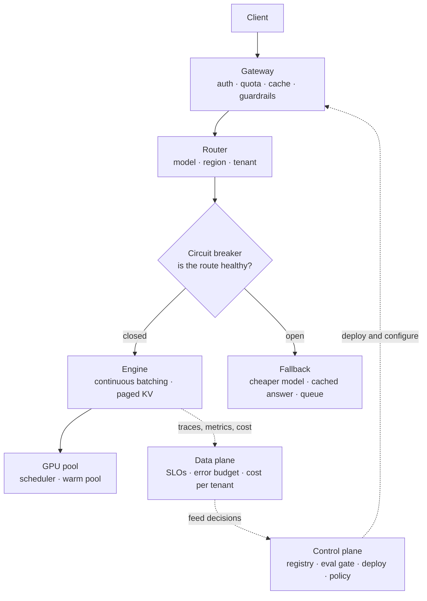

# AI Platform, Serving, Cost, and Reliability

> **Interview answer (say this first).** An AI platform is three planes over one request path. The **runtime plane** serves traffic: a gateway for auth, quota, cache, and guardrails; a router that picks the model, region, and tenant policy; an engine that batches with a paged KV cache; and a GPU pool underneath. The **control plane** changes the system: a model registry of versioned artifacts, an evaluation gate, a deployment controller for canary and rollback, and the tenancy and policy that constrain what runs. The **data plane** observes and accounts: metrics, traces, logs, quality signals, and cost per tenant. Serving asks how one request is produced. Reliability asks what happens when a dependency is slow or wrong: SLOs, timeouts, retries with jitter, circuit breakers, graceful degradation, and disaster recovery. Cost is not a separate topic. Cost is the same dial as latency and throughput, because utilisation, batching, routing, and caching move all three together. The honest answer in an interview is always a trade-off: "faster and safer costs money, cheaper costs tail latency, and I would pick the point that meets the SLO and then prove it with a number."

> **Note: Verified.** Every runnable example on this page was executed offline in plain Python (Python 3.14). No model calls were made. Every number shown is computed from the formula on the page rather than quoted from a vendor. Rates such as dollars per GPU-hour are labelled placeholders for your own contract price. Cross-references point to the phase that taught the topic in depth.

## Why this exists

It is tempting to treat platform, serving, cost, and reliability as four separate interviews. In practice interviewers ask about them together, because in a real system they are the same decision seen from four angles:

- **You cannot promise latency without a capacity model.** "P95 under one second" is a claim about replicas, batching, queueing, and GPU memory, not a wish.
- **You cannot cut cost without touching latency or quality.** Caching, routing to a smaller model, and shorter prompts all reduce spend and all risk correctness.
- **You cannot be reliable without knowing what to degrade.** When a dependency fails, the choice is to wait, retry, fail fast, or return a partial answer. That is a product decision.
- **You cannot operate a model without a platform.** Without a registry and an eval gate, a model update is an irreversible experiment on production traffic.
- **Interviewers grade trade-off reasoning, not recall.** They want to hear the cost of each option and the condition under which you would change your mind.

Here is what that looks like in practice:

- A team scaled on average GPU utilisation, which stayed low while the request queue grew, because the bottleneck was the batch scheduler, not compute.
- A gateway cached answers without the tenant in the key, and one customer saw another customer's cached response.
- Three retry layers each tried twice, so one user request multiplied into twenty-seven attempts and turned a slow dependency into an outage.
- A model was upgraded in place with no eval gate and no pinned digest, so quality dropped and there was nothing to roll back to.
- A team ran active-active multi-region for a workload with an eight-hour recovery target, and paid double for availability it did not need.

The lesson: **platform, serving, cost, and reliability are one design problem.** State the SLO, build the path, name the trade-off, and prove it with arithmetic.

> **The one-sentence purpose.** The platform turns a model into an operable product; serving turns it into tokens; reliability keeps those tokens coming when things break; and cost decides how much of all three you can afford.

## Start from zero

Assume you have never run a model in production. Here are the words this page keeps using.

| Word | Plain meaning |
| --- | --- |
| **Inference** | Running a trained model to produce an output. |
| **TTFT** | Time to first token. The wait before output starts. |
| **TPOT / ITL** | Time per output token / inter-token latency. The pace once output starts. |
| **Throughput** | Tokens or requests served per second. |
| **Batching / continuous batching** | Grouping requests so one GPU pass serves many; continuous batching adds and removes sequences each step. |
| **KV cache** | Stored attention state for tokens already processed, so the model does not recompute them. |
| **PagedAttention** | Managing the KV cache in fixed-size pages, like virtual memory, to cut waste and raise concurrency. |
| **Quantization** | Storing weights or cache in fewer bits (for example 8 or 4) to save memory and raise speed. |
| **Tensor parallelism** | Splitting one model layer's weights across several GPUs so they compute in parallel. |
| **GPU scheduling** | Deciding which pod or job lands on which GPU, given memory, topology, and fairness. |
| **Autoscaling** | Adding or removing replicas as load changes, driven by a metric such as queue depth. |
| **Warm pool / cold start / scale to zero** | A pre-started replica; the load delay when a replica starts; running none when idle. |
| **Gateway / router / engine** | The entry point that authenticates and limits; the component that picks the model; the inference server that runs batched generation. |
| **Model registry** | A versioned store of model artifacts, digests, and model cards. |
| **Model card** | A document describing a model's purpose, data, limits, and evaluation. |
| **Evaluation gate** | A CI check that blocks a model or prompt release if quality regresses. |
| **Groundedness** | Whether an answer is supported by the retrieved sources rather than invented. |
| **Control / runtime / data plane** | Control changes the system; runtime serves requests; data observes and accounts. |
| **Multi-tenancy** | Serving many customers with isolation and usage caps, partitioned by a logical namespace. |
| **Quota / rate limit / budget** | A cap on usage (tokens, requests) or spend, enforced before work is done. |
| **SLI / SLO / SLA** | An indicator you measure; a target for it; a contractual promise with a penalty. |
| **Error budget** | The allowed failure implied by an SLO, for example 0.1% of a month. |
| **Timeout / retry / backoff / jitter** | Give up after a deadline; try again; wait longer each time; add randomness so retries do not synchronise. |
| **Circuit breaker / bulkhead** | Stop calling a failing dependency for a while; isolate resources so one failure cannot consume all. |
| **Graceful degradation** | Returning a worse-but-useful answer instead of an error. |
| **RTO / RPO** | Recovery time objective (how long to recover); recovery point objective (how much data loss is acceptable). |
| **Right-sizing** | Matching instance or model size to the real load instead of over-provisioning. |
| **Data residency** | A rule that data must stay in given regions or on given hardware. |

Three distinctions matter most:

- **Serving vs platform.** Serving is the runtime path; the platform is the registry, evaluation, deployment, tenancy, and policy around it. A model can serve without a platform; it cannot be safely changed.
- **Reliability vs availability.** Availability is "is it up?". Reliability is "does it keep its promises, including under failure?". A system can be up and still give wrong or late answers.
- **Cost vs price.** Cost is what you spend to serve one token at your real utilisation. Price is what a vendor lists. The interview trap is comparing a vendor list price against your own cost at 100% utilisation, a rate production never reaches.

## The core idea

Think of a **busy hospital**. The **emergency department** is the runtime plane: patients arrive, get triaged, and are treated now. The **administration office** is the control plane: it sets staffing rules, protocols, and which treatments are approved. The **medical records** are the data plane: they record what happened and what it cost. When a ward floods, the hospital does not stop admitting; it **degrades** — it diverts non-urgent cases and keeps the critical path open. The mental model is one path with three planes, and a plan for what to shed when it is under stress.



The four topics are one loop. The control plane deploys a pinned version. The runtime plane serves it behind a breaker. The data plane measures latency, quality, and cost against the SLO. The measurement decides the next change. Break any arrow and the platform becomes a pile of scripts.

The reliability choices are a menu, and each row trades one thing for another:

| Control | What it buys | What it costs |
| --- | --- | --- |
| Timeout | Bounded worst case | Kills slow-but-valid responses |
| Retry | Hides transient faults | Amplifies load during an outage |
| Circuit breaker | Protects the failing dependency and the caller | Fails requests that might have worked |
| Cache | Cuts cost and latency | Serves stale or unauthorised data if the key is wrong |
| Route to smaller model | Cuts cost and latency | Loses quality on hard inputs |
| Multi-region active-active | Fast failover | Roughly double the cost and a harder consistency story |
| Warm standby | Fast recovery at lower cost | Idle capacity most of the time |
| Graceful degradation | Keeps the critical path alive | Returns a worse answer that must be labelled |

> **The mental model in one line.** Serving is one path, the platform is the loop around it, and reliability and cost are the two dials you turn together.

## How it works

Follow a request through the platform, then wrap reliability and cost around it.

1. **Define the SLOs first.** Write down availability, p95 TTFT, p95 TPOT, quality floor, and cost per thousand tokens. Every later choice is judged against these numbers.
2. **Split the planes.** Put the registry, eval gate, deploy controller, and tenancy policy in the control plane. Put the gateway, router, and engines in the runtime plane. Put metrics, traces, logs, audits, and cost in the data plane.
3. **Admit at the gateway.** Authenticate, check quota and rate limits, run input guardrails, look up the cache, and attach a trace id. Nothing reaches a model without passing here.
4. **Route declaratively.** Choose the model by task difficulty, cost class, latency class, region, and tenant policy. Keep the rules versioned so they can be tested and rolled back.
5. **Serve with continuous batching and a paged KV cache.** Add and remove sequences each decode step, and allocate cache in fixed pages so long and short requests coexist without pre-reserving the maximum length.
6. **Quantize and parallelise deliberately.** Use 8-bit or 4-bit weights to fit a larger model or serve more concurrency; use tensor parallelism when the model does not fit one GPU. Each choice costs quality or adds communication.
7. **Right-size and place on GPUs.** Fit weights, KV cache, and activations with headroom; schedule by GPU memory and topology; keep a warm pool for latency-sensitive paths and scale to zero only where a cold start is acceptable.
8. **Autoscale on the user signal.** Scale on queue depth or p95 TTFT, not average utilisation, and keep a minimum that survives a rolling update.
9. **Add a timeout to every call.** Each layer's deadline must be shorter than its caller's, and the total worst case must fit under the product target.
10. **Retry only idempotent, transient failures.** Use exponential backoff with jitter, a retry budget, and a cap. Never stack retries at every layer without lowering the count above.
11. **Break the circuit and degrade.** When a dependency crosses an error or latency threshold, open the breaker, and fall back to a smaller model, a cached answer, or a queue with a clear message.
12. **Gate and deploy every change.** Pin artifact digests, run the offline eval in CI, canary to a small slice, and keep rollback warm.
13. **Enforce tenancy and budgets at admission.** Namespaces, quotas, allowlists, and residency are checked before any GPU work. A post-hoc check cannot unspend tokens.
14. **Attribute cost and close the loop.** Tag every request with tenant, model version, tokens, and cache status. Export the data plane's numbers so the next control-plane decision is evidence-based.

The platform test: **can you answer "which version served this request, was it evaluated, what did it cost, and can you roll it back?"** If any part is missing, the platform is incomplete.

## The syntax you will use

These are real production forms. Read them once; earlier phases explain each.

**A platform deployment in YAML.** A pinned artifact, a release strategy, and an autoscaling target.

```yaml
# platform/serving/deployment.yaml
apiVersion: serving.example/v1
kind: ModelDeployment
metadata:
  name: support-agent-llm
  labels: { model: llama-3.1-8b-instruct, version: "2026-08-01", tenant: shared }
spec:
  replicas: 4
  engine: vllm
  artifact:
    registry: registry.internal/models
    reference: llama-3.1-8b-instruct@sha256:9f2c...   # immutable digest, never a tag
  resources:
    gpu: { type: a100-80gb, count: 1 }
  batching:
    max_batch_tokens: 8192
    max_concurrent_requests: 64
  autoscaling:
    min_replicas: 2
    max_replicas: 12
    target: { metric: time_to_first_token_p95_ms, value: 800 }
  rollout:
    strategy: canary
    canary_percent: 5
    abort_on: { metric: error_ratio, threshold: 0.02 }
```

`reference` pins the exact bytes that serve traffic; `rollout` makes the release reversible. Those two lines are what "versioned release" means.

**An SLO with an error budget, in YAML.** The target and the escape hatch in one place.

```yaml
# platform/slos/support-agent.yaml
service: support-agent
window: 30d
slis:
  availability: { good: "status < 500", total: "all_requests", objective: 0.999 }
  ttft:         { histogram: ttft_seconds, quantile: 0.95, threshold_ms: 800 }
  quality:      { judge: groundedness, objective: 0.90 }
burn_rate_alerts:
  - { long_window: 1h, short_window: 5m, factor: 14.4 }   # 2% of budget in 1h
  - { long_window: 6h, short_window: 30m, factor: 6 }
```

The first alert fires fast for a total outage; the second catches a slow leak. One threshold alone either pages too often or too late.

**A routing and budget policy in JSON.** Declarative rules, so cost control is testable and reversible.

```json
{
  "policy_version": "2026-09-01",
  "rules": [
    { "when": { "task": "classification", "tokens_estimate_lt": 2000 },
      "route": "small-model", "max_cost_usd": 0.002 },
    { "when": { "tenant_tier": "free", "budget_remaining_pct_lt": 20 },
      "route": "small-model", "fallback": "queue" },
    { "when": { "task": "reasoning" }, "route": "large-model", "region": "eu-west-1" }
  ],
  "default": { "route": "large-model", "fallback": "small-model" }
}
```

Budget is a routing input, not only a report. When a tenant is near its cap, the same policy that routes by difficulty can route by remaining budget.

**Capacity from throughput, in Python.** Replicas follow from arithmetic, not a guess.

```python
import math

def replicas_needed(peak_rps, gpu_tokens_per_s, out_tokens_per_req, headroom=1.0):
    per_gpu_rps = gpu_tokens_per_s / out_tokens_per_req
    return math.ceil(peak_rps * headroom / per_gpu_rps), per_gpu_rps

reps, per_gpu = replicas_needed(80, 2500, 400)
print("per-gpu rps:", round(per_gpu, 2))            # 6.25
print("replicas:", reps)                             # 13
print("with 25% headroom:", replicas_needed(80, 2500, 400, 1.25)[0])  # 16
```

This counts output tokens only, so it is a lower bound on replicas. It is still the first calculation a design interview expects.

**A circuit-breaker and timeout block in YAML.** The reliability controls stated as configuration.

```yaml
# platform/policies/resilience.yaml
call: model-provider
timeout: { connect_ms: 300, request_ms: 3000, total_ms: 4000 }
retry:
  max_attempts: 2
  backoff: { base_ms: 100, multiplier: 2, jitter: full }
  retry_on: [timeout, 429, 503]      # not on 400 or 401
breaker:
  error_ratio: 0.20
  min_requests: 20
  open_for_s: 15
degrade:
  on_open: ["small-model", "cached-answer", "queue"]
```

`total_ms` must be smaller than the caller's timeout. Retrying a 400 makes the request slower and never better.

## Examples: simple to real

**Example 1 — replicas and headroom from throughput.** Always start with the capacity model, because it constrains everything else.

```python
import math

def replicas_needed(peak_rps, gpu_tokens_per_s, out_tokens_per_req, headroom=1.0):
    per_gpu_rps = gpu_tokens_per_s / out_tokens_per_req
    return math.ceil(peak_rps * headroom / per_gpu_rps), per_gpu_rps

for headroom in (1.0, 1.25, 1.5):
    reps, per_gpu = replicas_needed(80, 2500, 400, headroom)
    print(f"headroom {headroom}: {reps} replicas at {per_gpu:.2f} rps/GPU")
# headroom 1.0 -> 13, 1.25 -> 16, 1.5 -> 20
```

At 2,500 output tokens per second per GPU and 400 tokens per request, one GPU serves 6.25 requests per second. Eighty requests per second needs 13 replicas; 25% headroom pushes that to 16. Headroom is not waste; it is what absorbs a replica restart during a rollout. Say out loud that this ignores prefill and input tokens, so it is a lower bound.

**Example 2 — cost per million tokens depends on utilisation.** The GPU rate is an input; substitute your own contract rate.

```python
def cost_per_million(gpu_hour_usd, tokens_per_s, utilization=1.0):
    tokens_per_hour = tokens_per_s * 3600 * utilization
    return gpu_hour_usd / tokens_per_hour * 1e6

print(round(cost_per_million(3.0, 2000), 2))                    # 0.42
print(round(cost_per_million(3.0, 2000, utilization=0.5), 2))   # 0.83
print(round(cost_per_million(3.0, 2000, utilization=0.25), 2))  # 1.67
```

At full utilisation the illustrative rate gives 0.42 per million output tokens. At half utilisation it doubles; at a quarter it quadruples. **Utilisation is the cost lever**, which is why autoscaling and batching are cost decisions, not only latency decisions. Never compare a self-hosted figure at 100% utilisation to a managed API: production rarely runs at 100%.

**Example 3 — cache plus routing is a stack, not a single fix.** Each control is simple; the stack moves the bill.

```python
requests, model_cost = 1_000_000, 0.02
cached_share, routed_share, cheap_cost = 0.25, 0.60, 0.002

baseline = requests * model_cost
after = (requests * cached_share * 0.0002
         + requests * (1 - cached_share) * (routed_share * cheap_cost
                                            + (1 - routed_share) * model_cost))
print("baseline:", round(baseline, 2))                                 # 20000.0
print("after cache + routing:", round(after, 2))                       # 6950.0
print("saving:", round((baseline - after) / baseline * 100, 1), "%")   # 65.2 %
```

A 25% cache hit rate plus routing 60% of the rest to a cheaper model cuts spend 65.2%. But each layer adds a correctness risk: a stale cache hit, a misrouted hard request. Measure quality per layer, not only the total.

**Example 4 — error budgets and burn rate.** The SLO defines how much failure is allowed, and how fast you are spending it.

```python
slo, window_days = 0.999, 30
budget_min = window_days * 24 * 60 * (1 - slo)
observed_error = 0.01
burn = round(observed_error / (1 - slo), 1)
print("budget minutes:", round(budget_min, 1))     # 43.2
print("burn rate:", burn)                          # 10.0
print("days to exhaust:", round(window_days / burn, 1))  # 3.0
```

A 99.9% monthly SLO allows only 43.2 minutes of bad time. A sustained 1% error rate burns the budget ten times too fast and exhausts a month in three days. **This is the number that turns "the error rate went up" into a decision.**

**Example 5 — retry amplification and the timeout budget.** Retries that look harmless at one layer multiply across layers.

```python
# one config: three layers, each with two retries and a nested timeout budget
layers = [("client->gateway", 9000, 2),
          ("gateway->service", 6000, 2),
          ("service->model", 3000, 2)]   # every budget is smaller than its caller's

attempts = 100
for _, _, retries in layers:
    attempts *= (retries + 1)
print("attempts from 100 requests:", attempts)          # 2700

worst_ms = layers[0][1]                                  # outermost budget bounds the chain
print("worst-case end-to-end ms:", worst_ms)             # 9000
sum_ms = sum(t for _, t, _ in layers)
print("sum of layer budgets ms:", sum_ms)                # 18000, not end-to-end
```

Three layers each allowing two retries turn 100 requests into 2,700 attempts — the classic retry storm that turns a slow dependency into an outage. The budgets nest: 9s at the client, 6s at the gateway, 3s at the model, so the end-to-end worst case is the outermost 9-second budget, not the 18-second sum. **Pick one layer to retry, and make every timeout smaller than its caller's.**

**Example 6 — disaster recovery is bought with money.** RTO and RPO decide the architecture, not the other way round.

```python
def expected_annual_loss(rto_hours, incidents_per_year, loss_per_hour):
    return rto_hours * incidents_per_year * loss_per_hour

print("warm standby RTO 8h: ", expected_annual_loss(8, 1, 50_000))     # 400000
print("active-active RTO 15m:", expected_annual_loss(0.25, 1, 50_000))  # 12500
```

If one bad incident a year costs 50,000 per hour, an eight-hour RTO carries about 400,000 of expected annual loss, while a fifteen-minute RTO carries 12,500. The second architecture costs roughly double to run: if the warm-standby footprint is an illustrative 20,000 a month, active-active is about 40,000, so the extra availability costs roughly 20,000 a month (240,000 a year) against a 387,500-a-year reduction in expected outage loss. **Assumption:** the doubling and the 20,000 base are illustrative placeholders; substitute your own contract rate. **Choose the RTO the business is willing to pay for**, then design to it; do not buy active-active for a workload that can wait an afternoon.

## In production

- **State the SLO before the design.** Availability, p95 TTFT, p95 TPOT, and a quality floor turn into replica counts, timeouts, and cache rules. A design without SLOs is decoration.
- **Capacity is arithmetic before it is a cluster.** Estimate replicas from tokens per second and peak load, then check that the KV cache fits. A number beats a hunch in review.
- **Batch to the knee.** Continuous batching raises throughput and also raises per-request latency past a point. Tune to the knee, not the maximum.
- **Autoscale on queue depth or p95 TTFT, not average utilisation.** Utilisation lags the user experience and hides a saturated scheduler behind idle-looking numbers.
- **Every call gets a timeout, and the timeouts must nest.** If a downstream timeout is larger than its caller's, the caller has already given up and the work is wasted.
- **Retry in one place, with a budget and jitter.** Retrying at every layer multiplies load exactly when the system can least afford it. Never retry on 400 or 401.
- **Add a circuit breaker per dependency.** Failing fast protects both sides and buys the degraded path time to work.
- **Design the degraded answer on purpose.** A smaller model, a cached response, or a queued job with a clear message beats an error, but it must be labelled so users are not misled.
- **Pin artifact digests, and never deploy without an eval gate and a canary.** A mutable tag makes "which model is live?" unanswerable and rollback impossible, so put the digest on every trace. An offline eval plus a 5% canary with automatic rollback catches regressions no unit test sees.
- **Include the tenant in every cache key.** A shared cache across tenants is a data-leak bug waiting for a hit. Enforce quota and residency at admission.
- **Choose the DR tier from RTO and RPO, and rehearse it.** An untested failover is a hope, not a plan. Most teams pick warm standby and run active-active only for a hard requirement.
- **Attribute cost per tenant, model, and feature.** You cannot cut what you cannot see, and a shared bill hides the one workload that spends most of it.

> **The reliability test.** For each dependency, ask: what is the timeout, what happens on retry, when does the breaker open, and what does the user see while it is open? If any answer is missing, the design is not done.

## Interview questions

### 1. Walk me through an AI platform architecture, end to end.

**Answer.** Start with the planes. The control plane holds the model registry with versioned artifacts and model cards, the evaluation service that gates releases, the deployment controller for canary and rollback, and the tenancy and policy that constrain what runs. The runtime plane is the request path: gateway for auth, quota, cache, and guardrails; router for model, region, and tenant; engines with continuous batching and a paged KV cache; and a GPU pool with a scheduler. The data plane collects metrics, traces, logs, quality signals, and cost, and feeds the control plane. The loop is what makes it a platform.

**Follow-up: "Why separate the planes?"** They change at different rates. You deploy a version once and serve it a million times. Mixing slow, risky deploy operations with the request path puts deploys in the hot path.

**Trap.** Listing components without the loop. A registry nobody deploys from and metrics nobody acts on is not a platform.

### 2. How do you decide between a managed API and self-hosting?

**Answer.** By volume, residency, model choice, and operational capacity. Managed APIs win on elasticity, time to market, and operational burden, and they suit spiky load. Self-hosting wins when utilisation is high and steady, when data must stay in your regions or on your hardware, or when you need custom weights. The honest comparison is total cost of ownership at realistic utilisation, plus the engineering time to run GPUs on call.

**Follow-up: "When is self-hosting actually cheaper?"** When a GPU is busy enough that its hourly cost per token beats the API rate through the troughs, not just at peak. Idle GPUs are the usual reason the bill surprises people.

**Trap.** Comparing API list price to GPU price at 100% utilisation. Production never runs at 100%, and operations cost headcount.

### 3. Explain continuous batching and PagedAttention.

**Answer.** In static batching the server waits for a full batch and runs it to completion, so one long generation blocks short ones and new requests wait. Continuous batching adds and removes sequences at each decode step, so the GPU stays busy and short requests finish quickly. PagedAttention manages the KV cache in fixed-size pages like virtual memory, so memory is used densely and long and short sequences coexist without pre-reserving the maximum length. Together they raise throughput and cut queueing latency.

**Follow-up: "What does it cost?"** Complexity and careful memory management. Quantized or shorter contexts shrink the cache further, but each choice costs a little quality.

**Trap.** Saying batching always lowers latency. Larger batches raise per-request latency; the win is throughput and queueing, and continuous batching avoids the worst latency penalty.

### 4. How do you fit and schedule models on GPUs?

**Answer.** First fit the model: weights plus KV cache plus activations must fit with headroom, and the cache usually binds concurrency. Quantize weights or cache to shrink memory if quality allows. Use tensor parallelism when a model does not fit one GPU, and accept the communication cost. Then schedule by GPU memory and topology, keep a warm pool for latency-sensitive paths, and scale to zero only where a cold start is acceptable.

**Follow-up: "How do you choose a GPU instance?"** From the memory requirement and the tokens-per-second requirement, not from the largest available card. Right-sizing means matching the card to the model and the load.

**Trap.** Sizing by parameter count alone. A model that fits in memory can still serve very few concurrent requests once the cache is counted.

### 5. How do you control AI cost without wrecking quality?

**Answer.** Use the levers in order of risk. First caching keyed by tenant and prompt, then routing easy requests to a smaller model, then right-sizing and quantizing for utilisation, then trimming prompts and context. Set budgets and quotas per tenant and route by remaining budget. Measure quality per lever, because a stale cache hit and a misrouted hard request are different failures.

**Follow-up: "What is the cheapest big win?"** Usually raising utilisation, because cost per token is inversely proportional to it. A GPU at a quarter utilisation costs four times as much per token as the same GPU at full load.

**Trap.** Cutting cost by lowering the model tier everywhere and only then discovering quality dropped. Route by difficulty, and keep a quality floor in the SLO.

### 6. How do you set timeouts, retries, and circuit breakers for AI calls?

**Answer.** Give every call a deadline smaller than its caller's, and make the total worst case fit the product target. Retry only idempotent, transient failures, in one layer, with exponential backoff, jitter, a retry budget, and a cap. Add a circuit breaker per dependency: when the error ratio crosses a threshold, stop calling and use the degraded path until it recovers. Log every retry and breaker state so a storm is visible.

**Follow-up: "Why jitter?"** Without it, all clients retry at the same instant and hammer the recovering dependency, turning a blip into an outage.

**Trap.** Retrying at every layer. Three layers with two retries each multiply one request into twenty-seven attempts at the worst possible moment.

### 7. What is graceful degradation for an AI system, and how do you design it?

**Answer.** Decide in advance what to shed when a dependency is slow or down, and keep the critical path alive with a worse answer. Concretely: fall back to a smaller model, serve a cached answer with an age label, queue the job and tell the user, or return the retrieved sources without a generated answer. Label the degraded response honestly, and make the choice a policy so it is consistent.

**Follow-up: "How do you test it?"** Inject latency and errors in staging, and run chaos drills: kill the model provider, fill the queue, expire the cache. An untested fallback is a hope.

**Trap.** Degrading silently. A cheaper, staler answer presented as normal erodes trust faster than an honest error.

### 8. A model upgrade raised latency and cut quality in production. What do you do?

**Answer.** Roll back first to the pinned artifact digest, then diagnose. Compare new and old on eval scores, p95 TTFT and TPOT, error ratio, and cost, filtered by tenant and version. Check whether the deploy skipped the eval gate or canary, and whether routing changed at the same time. Fix the root cause, add the missing check, and re-release behind a proper gate.

**Follow-up: "How do you prevent it next time?"** Pin digests, gate on an offline eval plus a small canary, watch latency and quality together during the canary, and make rollback one command with the previous version still warm.

**Trap.** Shipping a quick prompt fix to recover quality. It hides the original regression, and the next change compounds it. Roll back first, diagnose second.

## Remember this

- **Three planes, one path.** Control changes the system, runtime serves each request, and the data plane proves what happened and what it cost.
- **Reliability and cost are the same dial as latency and throughput.** Caching, routing, batching, and utilisation move all of them together.
- **Every call gets a timeout; retry in one place with jitter; break the circuit; degrade on purpose.**
- **Capacity and cost are arithmetic.** Estimate replicas from throughput, KV cache for concurrency, and cost per token from real utilisation.
- **Version, gate, canary, roll back.** Pin digests, run the eval gate, deploy to a small slice, and rehearse the DR plan you paid for.
