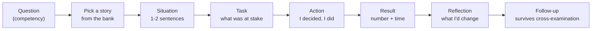

# Behavioural Interviews

> **Interview answer (say this first).** Behavioural interviews are scored the same way as technical ones, but the signal is different: they test how you work with people, how you decide under uncertainty, and whether you can learn from a mistake. The structure is **STAR** — Situation, Task, Action, Result — but the structure is not the answer. The answer is a short story with a real decision, a real number, and a real reflection. Prepare six to eight stories once, from real work, and map each to the competency the question is probing: conflict, failure, ambiguity, leadership, prioritisation, incident, and learning. When you talk about AI and ML work, describe what you actually built and measured, not the glossary. Say "we evaluated faithfulness at 0.94 on a 200-case set" instead of "we used RAG and it worked great". The interviewers are not checking whether you memorised STAR; they are checking whether you own your decisions and tell the truth about the outcome.

> **Note: Honest by design.** This page contains no runnable code. Every answer shape was checked against the structure this book uses elsewhere: situation, action, result, reflection. The model answers are illustrative; use your own numbers, and never invent one you cannot defend in a follow-up.

## Why this exists

Many strong engineers fail on the behavioural round, not the coding round. It is the cheapest part of the interview to prepare and the easiest to get wrong, because the failure modes are predictable:

- **The interviewer does not want a description of your team.** They want your decisions. "We decided" tells them nothing about you.
- **No result means no signal.** A story that ends at "and then we shipped it" leaves the interviewer unable to score impact.
- **Blame is a red flag.** A conflict story where the other person is simply wrong reads as low self-awareness, even when you are right.
- **Memorised definitions do not survive follow-ups.** "We used RAG" collapses the moment they ask what you measured.
- **Overselling AI work is easy to detect.** A senior interviewer asks one question about evaluation or failure, and the story either holds or does not.

Behavioural questions are not small talk. At senior and staff level they often decide the offer, because the technical bar is assumed and the differentiator is judgement.

Here is what weak and strong answers sound like in practice:

- **Weak:** "We had a conflict but eventually aligned." **Strong:** "I disagreed with the rollout plan, so I ran the eval overnight and proposed a 5% canary; we shipped on time."
- **Weak:** "I failed once but learned a lot." **Strong:** "I added retries without a cap, which caused a 40-minute outage; I now retry at one layer with a budget and jitter."
- **Weak:** "We used RAG to improve the chatbot." **Strong:** "I built the retrieval pipeline and the eval gate; faithfulness rose from 0.81 to 0.94 on 200 cases."
- **Weak:** "I just prioritised the important things." **Strong:** "I cut feature B to hit a compliance deadline, published the trade-off, and moved B to the next quarter with a stated date."
- **Weak:** "I worked with the incident team." **Strong:** "I led triage, found the cascading timeout, added a circuit breaker, and the postmortem added the alert that caught it next time."

> **The one-sentence purpose.** A behavioural answer is a short, honest story that shows one decision you made, the trade-off you accepted, and what you learned.

## Start from zero

Assume you have never done a behavioural interview. Here are the words this page keeps using.

| Word | Plain meaning |
| --- | --- |
| **Behavioural interview** | An interview that asks for past examples rather than hypotheticals. |
| **STAR** | Situation, Task, Action, Result — a simple order for telling a work story. |
| **Competency** | The skill a question is probing, such as influence, ownership, or judgement. |
| **Signal** | The evidence the interviewer writes down and scores. |
| **Scorecard** | The form an interviewer fills in, usually with a fixed scale per competency. |
| **Structured interview** | The same questions and scoring for every candidate, to reduce bias. |
| **Story bank** | Your prepared set of real examples, each reusable for several questions. |
| **Action** | What *you* did, not what the team did. |
| **Result** | The measurable outcome, ideally a number and a time frame. |
| **Reflection** | What you learned or would do differently, which shows growth. |
| **Ownership** | Taking responsibility for an outcome, including a bad one. |
| **Scope** | How large your work was: one service, one team, or the whole org. |
| **Influence without authority** | Getting people to act when you are not their manager. |
| **Ambiguity** | Working when the goal, the requirements, or the data are unclear. |
| **Overselling** | Claiming more impact, novelty, or certainty than the evidence supports. |
| **Culture fit** | How you work with others; now usually framed as "values alignment". |
| **Counterfactual** | "What would you do differently?" — the question that tests reflection. |

Two distinctions matter most:

- **Team outcome vs your action.** The team shipped the feature; you decided to gate the release behind an eval and convinced the group to delay by one day. The second sentence is the signal.
- **Result vs reflection.** A result proves impact; a reflection proves you can repeat or improve it. Senior interviews want both, and the reflection is often what separates a good answer from a great one.

## The core idea

Think of a **courtroom witness**. The lawyer does not want a speech; they want a specific, checkable account: where you were, what you saw, what you chose, and what happened. Vague stories collapse under cross-examination (the follow-up). A precise story survives because every claim is one you can support. The mental model is: **pick one real event, tell it small, own your decision, name the number, then say what you learned.**



The same story can answer many questions; only the emphasis changes. A production incident story can answer "failure", "ambiguity", "prioritisation", and "working under pressure" by leading with a different part. That is why you prepare six to eight stories, not sixty.

A weak answer and a strong answer, side by side:

| | Weak answer | Strong answer |
| --- | --- | --- |
| Voice | "We realised…" | "I proposed…" |
| Scope | "It was a big migration." | "It touched three services and one team of six." |
| Tension | None stated | "We had to choose between shipping Friday and gating on evals." |
| Result | "It went well." | "P95 dropped from 1.4s to 0.9s; the launch slipped one day." |
| Reflection | None | "Next time I'd raise the eval gap two weeks earlier." |
| Follow-up | Breaks down | Has an answer for scale, cost, and failure |

> **The mental model in one line.** One real story, told small, with your decision, a number, and a lesson.

## How it works

1. **Decode the competency.** "Tell me about a conflict" wants influence and empathy. "Tell me about a failure" wants ownership and learning. "Tell me about ambiguity" wants judgement without full information.
2. **Choose the story before you speak.** Pick from your prepared bank the one that matches. If you need two seconds, say so: "Let me pick the best example." That is normal.
3. **Set the situation in one or two sentences.** Where, when, what scale, why it mattered. No company secrets; use "a payments team" if needed.
4. **State the task as a tension.** Not "I had to build X" but "we had to choose between shipping on Friday and gating on a quality check." Tension is where judgement shows.
5. **Describe the action as yours.** Use "I" for decisions, "we" for the team's execution. Name the options you considered and why you chose one.
6. **Give the result with a number if you have one.** Latency, error rate, cost, adoption, time saved. If you do not have a number, give a clear qualitative outcome and say so honestly.
7. **Add one reflection.** "What I would do differently" or "what I now do by default." This is the highest-value sentence for senior roles.
8. **Stop.** Behavioural answers should be 60–120 seconds. Long answers lose the interviewer and hide the signal.
9. **Take the follow-up.** When they ask "what about scale?" or "what did you measure?", answer directly and honestly. "We did not measure that; here is what I would measure now" is a strong answer.
10. **Stay consistent.** Never invent a metric you cannot explain. Interviewers compare stories and notes; a contradiction is worse than a modest result.

The delivery test: **can the interviewer write down one decision you made, one number, and one thing you learned?** If not, the story was too vague.

## The syntax you will use

These are the templates and phrasings that make answers land. Read them once and adapt your own stories.

**The STAR skeleton.** A compact order for any story.

```text
Situation: [where, when, scale] — 1–2 sentences.
Task:      [the tension or constraint] — 1 sentence.
Action:    I [considered options] and chose [X] because [reason].
           I [did the concrete work] and [influenced whom to do what].
Result:    [number] improved / changed, over [time frame].
Reflection: next time I would [change], or I now always [habit].
```

The tension line and the reflection line are the two most common omissions. Both are what senior interviewers score.

**Opening lines that set context fast.** Short and specific beats long and dramatic.

```text
"Last year I led the migration of our retrieval service to a new index;
 it served about two million queries a day across four teams."
"Two days before launch we found the eval score had dropped;
 I was the on-call engineer for the assistant."
"I was asked to improve answer quality, but we had no labelled data."
```

**Action phrasing that keeps the focus on you.** Verbs that show judgement, not just motion.

```text
"I proposed…", "I pushed back on…", "I chose X over Y because…",
"I asked [person] for…", "I wrote the design doc that…",
"I escalated when…", "I took the short-term hit to…".
```

**Result phrasing with honest numbers.** Precision is more convincing than a big round number.

```text
"P95 latency fell from 1.4s to 0.9s."
"Cost per thousand answers dropped 42%."
"Faithfulness moved from 0.81 to 0.94 on a 200-case set."
"Adoption reached 60% of the team in six weeks."
"We did not have a clean number; the qualitative outcome was…".
```

**Talking about AI and ML work without overselling.** Separate what you did, what the system did, and what the evidence shows.

```text
What I built:   "I designed the retrieval pipeline and the eval gate."
How it works:   "Hybrid search with a reranker, then an LLM grounded on the top chunks."
What I measured:"Faithfulness and answer relevance on a held-out set of 200 cases."
The limit:      "It still fails on multi-hop questions; we route those to a human."
```

Never say "the AI learns" or "it's basically AGI". Say what the model does, on which inputs, with what error rate.

**A story-bank grid.** Map each story to the competencies it can cover.

| Story | Conflict | Failure | Ambiguity | Leadership | Prioritisation | Incident | Learning |
| --- | --- | --- | --- | --- | --- | --- | --- |
| Launch blocked by a quality regression | ✓ | ✓ | | ✓ | ✓ | | ✓ |
| On-call incident with a cascading timeout | | ✓ | ✓ | | | ✓ | ✓ |
| Unclear requirements for an AI feature | | | ✓ | ✓ | | | ✓ |
| Disagreement with a senior engineer on a design | ✓ | | | ✓ | | | ✓ |
| Too many requests, one small team | | | | ✓ | ✓ | | |

Build the grid from your own history. Eight stories cover almost every question.

## Examples: simple to real

**Example 1 — conflict (resolving a design disagreement).** The competency is influence and empathy, not who was right.

```text
Situation: A senior engineer wanted to ship a model upgrade without an eval gate,
because the deadline was close. I owned the assistant's quality.
Task: I had to protect users from a regression without blocking the team.
Action: I did not argue in the meeting. I ran the offline eval overnight and
brought a one-page comparison showing one regression on billing questions.
I proposed a middle path: ship to 5% of traffic behind a canary with automatic
rollback, and review the eval together in the morning.
Result: We shipped on time; the 48-hour canary caught a second issue on ~3% of
billing questions before full rollout.
Reflection: I now bring data to disagreements early instead of debating opinions.
```

The strength is that the other person is not the villain; the process was. The reflection names a habit.

**Example 2 — failure (owning a mistake).** Pick a real mistake with a real cost, and show what changed.

```text
Situation: I added a retry to our model call to fix timeouts, without a cap.
Task: I wanted to reduce user-visible errors during a provider slowdown.
Action: The retry multiplied load and pushed the provider into a longer outage.
I noticed within twenty minutes, removed the retry, and added a circuit breaker.
Result: The incident lasted about forty minutes and affected 8% of requests.
Reflection: I now retry only at one layer, always with a budget and jitter,
and I test the failure path before shipping resilience code.
```

"I caused this" is a strength. Interviewers trust candidates who can name their own mistake.

**Example 3 — ambiguity (making progress without full information).** The competency is judgement under uncertainty.

```text
Situation: We were asked to "make the support assistant smarter" with no
metrics, no labelled data, and two weeks.
Task: I had to turn a vague goal into something measurable and shippable.
Action: I wrote a one-page definition of success with the product owner,
built a 150-case golden set from real support tickets, and picked two metrics
(faithfulness and escalation rate). I shipped the smallest change that could
move them and reviewed the numbers weekly.
Result: Escalation rate fell 12% over the next month; we had a reusable eval set.
Reflection: I now refuse to start an AI project without a success metric and a draft set.
```

The action converts ambiguity into a measurable question. That is the signal.

**Example 4 — prioritisation (too many things, one small team).** The competency is judgement and communication.

```text
Situation: My team of four had three incoming "top priorities": a new model,
a latency fix, and a compliance requirement, all due in the same quarter.
Task: I had to choose without damaging trust with the stakeholders.
Action: I mapped each to user impact and risk, and found the compliance item
was a hard deadline, the latency fix was cheap, and the model was expensive.
I published the trade-off in one page, shipped the compliance work first,
pulled the latency fix forward because it was small, and moved the model.
Result: We met the hard deadline, cut P95 by 30%, and shipped the model one
quarter later with no surprise. No stakeholder was blindsided.
Reflection: I now publish a one-page priority view at the start of every quarter.
```

The metric is not only speed; it is trust preserved. Say that explicitly.

**Example 5 — talking about AI work honestly.** The competency is technical credibility.

```text
Interviewer: "Tell me about the most advanced AI system you built."
Answer: "It was a retrieval-augmented support assistant. I built the ingestion
and retrieval pipeline, added a reranker, and put an LLM on top grounded in the
top chunks. My main contribution was the evaluation: a 200-case golden set with
faithfulness and relevance metrics, wired into CI. We reached 0.94 faithfulness,
up from 0.81, and cut the escalation rate 12%. It was not magic: it still fails
on multi-hop questions and on brand-new products, so we route those to humans.
The most useful thing I learned is that the eval set, not the model, decided
what we shipped."
```

This is credible because it names the mechanism, the metric, and the limit. That is the opposite of overselling.

**Example 6 — compressing the answer under time pressure.** When the interviewer says "keep it short", drop the detail, keep the spine.

```text
"We had a quality regression two days before launch. I owned the assistant.
I ran the eval overnight, showed the regression, and proposed a canary rather
than blocking. We shipped on time, and the canary caught a second issue within
24 hours. I now always bring data to design disagreements."
```

Five sentences, and it still has situation, action, result, and reflection.

## In production

- **Prepare six to eight stories, not sixty.** Rehearse them out loud once. Reuse each for several competencies by changing the emphasis.
- **Make the tension explicit.** "We had to choose between X and Y" is the sentence that shows judgement. A story without a choice has no signal.
- **Use "I" for decisions and "we" for execution.** Over-claiming credit reads as arrogance; hiding behind "we" reads as no ownership.
- **Quantify, but never invent.** If you have no number, say "we did not have a clean metric" and give the qualitative result. Honesty scores higher than a fabricated percentage.
- **Name one reflection every time.** "What I would do differently" is the highest-value sentence in a senior behavioural answer.
- **Keep it to 60–120 seconds.** Long answers bury the signal and invite the interviewer to interrupt.
- **Do not blame people.** Describe the process, the constraint, or your own mistake. "My manager was an idiot" ends the interview.
- **Bring the AI limit unprompted.** Saying what your system cannot do proves you understand it; hiding it invites a follow-up that exposes you.
- **Match the scope to the level.** A staff-level answer should show org-wide influence, not only a single ticket. Do not inflate, but do not hide scale either.
- **Answer the actual question.** If they ask about conflict, do not give a pure technical story. Read the competency behind the words.
- **Avoid secrets and gossip.** Use anonymised scale and outcomes. Never name a customer's confidential incident.
- **Rehearse the follow-ups, not just the story.** "What was the cost?", "What did you measure?", "What would you change?" are the real test.

> **The honesty test.** If the interviewer asked "how do you know?", would your answer survive? If not, soften the claim or drop it. Credibility compounds across every answer.

## Interview questions

### 1. Tell me about a time you disagreed with a colleague.

**Answer.** Pick a real disagreement about work, not personality. State what each side wanted and why, then describe how *you* moved it forward: data, a small experiment, a middle path, or a clear escalation. End with the outcome and what you changed in your own approach. If the other person was right, say so; that is a strong answer.

**Follow-up: "What if they still disagreed with your conclusion?"** Say how you handled it: a time-boxed experiment, a documented decision with the owner, or escalation to the person accountable. Disagreement is normal; unresolved stalling is not.

**Trap.** Making the colleague the villain. The interviewer is testing your self-awareness, not your argument.

### 2. Tell me about a failure.

**Answer.** Choose a real failure with a cost, and own it. State what you were trying to do, the decision you made, what went wrong, how you detected and contained it, and what changed afterwards. A mistake in production is a fine choice if you can show learning and a concrete behaviour change.

**Follow-up: "Was anyone else affected?"** Be honest about impact and about whether you told people in time. Hiding impact is worse than the impact itself.

**Trap.** A fake failure ("I worked too hard"). Interviewers hear it instantly and stop trusting the rest of the interview.

### 3. Tell me about a time you worked with ambiguity.

**Answer.** Describe a vague goal with missing data or unclear requirements. Show how you converted it into something measurable: a success metric, a draft dataset, a small prototype, a documented assumption. Then show the result and the decision you made with incomplete information.

**Follow-up: "What assumptions did you make, and which one proved wrong?"** Have one assumption ready that turned out false. Naming it shows you track your own uncertainty.

**Trap.** Presenting ambiguity as "there was no direction, so I waited." The signal is action under uncertainty.

### 4. Tell me about a time you led without authority.

**Answer.** Choose a case where you influenced a group you did not manage: a design you proposed, a standard you introduced, an incident you coordinated, or a migration you drove across teams. Focus on how you built agreement — a written proposal, a prototype, a shared metric — and the outcome.

**Follow-up: "How did you handle a team that refused?"** Explain the escalation or the compromise, and why you chose it. Influence is not only persuasion; it is knowing when to escalate.

**Trap.** Describing a project you owned as a manager. The question is specifically about influence without reporting lines.

### 5. How do you prioritise when everything is urgent?

**Answer.** Show a specific quarter or sprint, not a philosophy. Name the criteria you used (user impact, risk, cost, reversibility, hard deadlines), how you made the trade-off visible to stakeholders, and what you deliberately did not do. End with the outcome and how you communicated it.

**Follow-up: "Who did you disappoint, and how did you tell them?"** A prepared answer here is very strong. Say what you cut, who was affected, and how you gave them a realistic date.

**Trap.** Saying "I just work longer hours." That is not prioritisation; it is avoidance of the choice.

### 6. Tell me about a production incident you handled.

**Answer.** Use a clear timeline: detection, triage, mitigation, root cause, and follow-up. Emphasise *your* role — did you lead the call, find the cause, or write the postmortem? Include the user impact and the fix, and name the lasting change such as a new alert or a circuit breaker.

**Follow-up: "What did the postmortem change?"** Name a concrete artefact: an alert threshold, a runbook, a test, a design change. Reviewing without changing is not learning.

**Trap.** Making the incident sound like a hero story. The signal is calm process and prevention, not firefighting drama.

### 7. Tell me about a time you learned something quickly.

**Answer.** Choose a moment when you had to acquire real skill under pressure: a new language, a domain, an unfamiliar system. Describe how you learned (docs, a small prototype, pairing, a spike), how you proved it, and how you applied it to ship something. The proof matters more than the enthusiasm.

**Follow-up: "What did you get wrong while learning?"** Admit a specific early mistake. It makes the learning credible.

**Trap.** Claiming expertise you do not have. A follow-up about internals exposes it, and honesty about the learning curve is the safer, stronger answer.

### 8. Describe your most advanced AI or ML project.

**Answer.** Separate the layers: what you built, how it works, what you measured, and where it fails. Name the model or approach plainly (RAG, fine-tune, agent, classifier), the evaluation set, the key metric, and the limit you found. Credit the team where it is due, and be precise about your own contribution.

**Follow-up: "How did you evaluate it, and what was the error rate?"** This is the test for overselling. Have the eval method, the set size, and at least one failure mode ready. "We did not evaluate rigorously" is acceptable only if you say what you would do now.

**Trap.** Talking in buzzwords without a measurement. "We used a multi-agent RAG pipeline" means nothing until you say what improved and by how much, and what still breaks.

## Remember this

- **One real story, told small: situation, tension, my action, a number, a reflection.**
- **Prepare six to eight stories and reuse them across competencies.** A story bank beats memorised scripts.
- **Use "I" for decisions and "we" for execution.** Own your choices without stealing the team's work.
- **Reflection is the senior signal.** "What I would do differently" is often what decides the offer.
- **Never oversell AI work.** Say what you built, what you measured, and what still fails; credibility is the real score.
