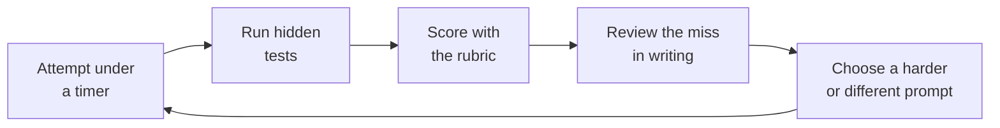

# Timed Coding, SQL, and Debugging Drills

> **Interview answer (say this first).** A timed drill is a short, repeatable rehearsal of one interview skill under a clock — usually coding, SQL, or debugging. Each drill has a prompt, a time box, hidden tests, and a rubric; I attempt it against the clock, run the tests, score myself, write down the one thing I missed, and repeat on a fresh problem. The clock and the rubric are the point, because they turn practice into measurable progress instead of re-reading solutions.

## Why this exists

A strong engineer can still fail a timed round, and the reason is rarely missing knowledge.

Consider a senior backend engineer with eight years of experience. She had shipped a payment service, reviewed hundreds of pull requests, and could explain database internals from memory. In her first interview loop she failed both the coding screen and the SQL round.

- **Coding screen.** She received a medium string problem and a 30-minute limit. She read it slowly, discussed edge cases for six minutes, and wrote a clean but quadratic solution. It was correct. She ran out of time before she found the linear one, and the interviewer marked her down for not attempting the optimisation.
- **SQL round.** She had spent her career behind an ORM, so she never typed raw SQL without autocomplete. Asked for the highest-paid employee in each department, she froze on the grouping, then produced a correlated subquery that returned every tie.

She had the knowledge. What she lacked was **retrieval under pressure**: the ability to recall a pattern, state its cost, and produce working code while a clock runs. That is a separate skill from understanding, and it only improves with deliberate, timed repetition.

This page gives you that repetition loop. It is not a new topic in the sense of new syntax; it is the missing rehearsal layer for everything in Phase 13.

> **The one-sentence purpose.** You do not rise to the occasion in a timed interview; you fall to the level of your timed practice.

## Start from zero

Learn these words first. They are used loosely in conversation and precisely in a drill.

| Word | Plain meaning |
| --- | --- |
| **Drill** | One short, repeatable exercise that trains one interview skill against a clock. |
| **Prompt** | The problem statement for one drill, written as an interviewer would say it out loud. |
| **Time box** | A fixed limit for the drill. When it rings you stop, even mid-sentence. |
| **Rubric** | A short scoring guide with named criteria, so the score is not a feeling. |
| **Hidden test** | Tests you run only after the time box ends, so you cannot tune your code to them. |
| **Edge case** | A boundary input the happy path forgets: empty, one item, duplicates, no solution, the largest value. |
| **Brute force then optimise** | First write the obviously correct slow solution, then find the repeated work and remove it. |
| **Complexity analysis** | Naming how time and memory grow with input size, and why, in Big-O terms. |
| **Dry run** | Tracing the code by hand on a concrete input, line by line, before trusting it. |
| **Think aloud** | Saying your reasoning while you work, so the interviewer can score the reasoning, not just the result. |
| **Query plan** | The tree of operations the database will perform to answer a query. |
| **`EXPLAIN`** | The SQL command that shows the query plan; `EXPLAIN ANALYZE` also runs the query and reports real rows and times. |
| **Index** | A sorted structure (usually a B-tree) that lets the database find rows without scanning the whole table. |
| **Cardinality** | The number of distinct values in a column; low cardinality means few distinct values, high means many. |
| **N+1** | One query to fetch a list, then one more query per row: N+1 round trips instead of one. |
| **Window function** | A function that computes across related rows without collapsing them, such as `ROW_NUMBER` or `SUM OVER`. |
| **Breaking a problem down** | Splitting a prompt into its data shape, its constraints, and its sub-steps before coding. |
| **Retrospect** | The short written review after a drill: what you missed, why, and what you will do next time. |

Two distinctions matter most:

- **Practice (noun) versus practise (verb).** You do practice; you practise a skill. The drill is practice; you practise under a timer.
- **`EXPLAIN` versus `EXPLAIN ANALYZE`.** `EXPLAIN` shows estimates only and runs nothing. `EXPLAIN ANALYZE` executes the statement and reports actual rows and timing, so it is the one that catches a bad estimate.

## The core idea

Think of a gym, not a library. Reading a solution is reading about lifting; a drill is lifting. A single rep changes little, but a logged set of reps with an honest score shows exactly which muscle is weak.

The practice loop has five steps, and the last one feeds back into the first.



The loop is a feedback control system. Without the rubric you cannot see progress. Without the written review the miss is forgotten. Without varied prompts you memorise answers instead of patterns. The clock adds the one resource an interview actually limits: time.

Different drills train different muscles, so vary the type rather than repeating coding problems.

| Drill | Time box | What it trains |
| --- | --- | --- |
| Coding, easy | 15 min | Pattern recognition and clean code |
| Coding, medium | 30 min | Brute force then optimise, dry runs, complexity |
| SQL query | 20 min | Joins, grouping, aggregation, window functions |
| SQL plan reading | 10 min | `EXPLAIN`, indexes, cardinality, N+1 |
| Debug a failing test | 25 min | Reproduce, reduce, one hypothesis, regression test |
| Debug from a log | 15 min | Reading evidence and thinking aloud |
| Complexity analysis | 5 min | Stating cost precisely and defensibly |
| Explain out loud | 5 min | Delivery: saying the answer, not just knowing it |

> **The mental model in one line.** Attempt, test, score, review, repeat — with a fresh problem and a real clock every time.

## How it works

Follow one drill from start to finish. The same steps apply to coding, SQL, and debugging.

1. **Set the timer before you read the prompt.** Fifteen minutes for easy, thirty for medium, twenty for SQL. Starting the clock first removes the temptation to browse the problem until you feel ready.
2. **Restate the problem and ask clarifying questions.** Say the input type, the output type, and the constraints out loud. Ask about empty input, duplicates, sortedness, value ranges, and whether you may mutate the input. Two questions prevent most wrong answers.
3. **State a brute-force plan and its complexity.** "For every pair, check the sum. That is `O(n²)` time and `O(1)` space." A correct slow baseline is worth more than a half-finished clever one, and it proves you can reason about correctness.
4. **Find the repeated work and optimise.** The brute force usually repeats a lookup or a comparison. A repeated lookup wants a hash map, a sorted scan wants two pointers, a running min or max wants a heap, a per-group maximum wants a window function.
5. **Name the target complexity before coding.** "This becomes `O(n)` time and `O(n)` space." Saying it first means the code cannot surprise you and shows you know what "better" means.
6. **Write the code in small, clearly named pieces.** Use `seen`, `left`, `window`, `ranked`. Readability is scored in almost every round.
7. **Dry run on one example and one edge case.** Trace the sample by hand, then trace the boundary: the empty string, the single row, the tie. Boundary bugs are the most common hidden-test failures.
8. **For SQL: write the query, then read the plan.** Run `EXPLAIN ANALYZE`, check how many rows each node actually produced, and look for a sequential scan on a large table where an index should be used.
9. **For SQL: add an index that matches the predicate and the ordering.** An index on `(department_id, salary DESC)` serves both `WHERE department_id = 7` and `ORDER BY salary DESC`. An index on `salary` alone does not match the predicate.
10. **For debugging: reproduce, reduce, hypothesise, instrument, fix, and add a regression test.** Reproduce the failure in one command. Reduce it to the smallest failing case. Write down one hypothesis before changing anything. Instrument to confirm or reject it. Fix the root cause. Add a test that would have caught it.
11. **Stop when the timer rings, then run the hidden tests.** Do not steal extra minutes; the limit is the training stimulus. Running tests only afterwards stops you from tuning code to the test's exact inputs.
12. **Score against the rubric, then write the miss review.** Award points per criterion, not a vague feeling. Then write two sentences: the miss and its cause. That written line is what the next rep targets.

> **The working rule.** Brute force buys correctness, the optimisation buys the score, the dry run buys the hidden tests, and the written review buys the next attempt.

## The syntax you will use

These are the real forms a drill uses. Read them once; each appears in a timed round or a practice session.

**1. A hidden-test harness.** A tiny script that runs fixed cases and reports pass or fail. Write it before the timer, run it after.

```python
# harness.py — run with: python harness.py
from solution import longest_unique_substring

CASES = [
    ("abcabcbb", 3),
    ("bbbbb", 1),
    ("pwwkew", 3),
    ("dvdf", 3),
    ("", 0),        # edge case: empty input
    ("a", 1),       # edge case: single character
]

def run() -> int:
    failures = 0
    for text, expected in CASES:
        got = longest_unique_substring(text)
        if got != expected:
            failures += 1
            print(f"FAIL text={text!r} expected={expected} got={got}")
    print(f"{len(CASES) - failures}/{len(CASES)} passed")
    return failures

if __name__ == "__main__":
    raise SystemExit(run())
```

`raise SystemExit(run())` makes the script exit non-zero on failure, so it behaves like a test runner.

**2. The same test as a `pytest` case.** Parametrised tests make the table of cases explicit.

```python
# test_solution.py — run with: pytest -q
import pytest
from solution import longest_unique_substring

@pytest.mark.parametrize(
    ("text", "expected"),
    [("abcabcbb", 3), ("bbbbb", 1), ("pwwkew", 3), ("dvdf", 3), ("", 0), ("a", 1)],
)
def test_longest_unique_substring(text: str, expected: int) -> None:
    assert longest_unique_substring(text) == expected
```

**3. A SQL window function.** `ROW_NUMBER()` numbers rows inside each group; the outer query keeps row one. This returns one row per department even when salaries tie.

```sql
SELECT department_id, employee_id, salary
FROM (
    SELECT
        department_id,
        employee_id,
        salary,
        ROW_NUMBER() OVER (
            PARTITION BY department_id
            ORDER BY salary DESC, employee_id
        ) AS rn
    FROM employees
) AS ranked
WHERE rn = 1;
```

`PARTITION BY department_id` restarts the numbering per department. `ORDER BY salary DESC, employee_id` breaks ties deterministically, so the same query always returns the same employee.

**4. Reading a plan with `EXPLAIN ANALYZE`.** It runs the query and reports actual rows and time per node.

```sql
EXPLAIN ANALYZE
SELECT department_id, employee_id, salary
FROM employees
WHERE department_id = 7
ORDER BY salary DESC
LIMIT 1;
```

Illustrative output on a one-million-row table with an index on `(department_id, salary DESC)`:

```text
Limit  (cost=0.43..8.46 rows=1 width=12) (actual time=0.031..0.033 rows=1 loops=1)
  ->  Index Scan using idx_employees_dept_salary on employees
        (cost=0.43..845.10 rows=100 width=12) (actual time=0.029..0.029 rows=1 loops=1)
        Index Cond: (department_id = 7)
Planning Time: 0.120 ms
Execution Time: 0.048 ms
```

The `Index Scan` with `Index Cond: (department_id = 7)` is the good outcome: the database seeks straight to the rows it needs. Without the index the same query shows `Seq Scan on employees` and `Rows Removed by Filter` in the millions.

**5. The index that serves the predicate and the ordering.**

```sql
CREATE INDEX idx_employees_dept_salary
    ON employees (department_id, salary DESC);
```

The leading column matches the `WHERE`, and the second column matches the `ORDER BY`, so the `LIMIT 1` can stop after one row.

**6. A debugging workflow command.** `git bisect` binary-searches the commit history to find the change that introduced a bug.

```bash
git bisect start
git bisect bad                 # the current commit is broken
git bisect good v1.4.0         # the last tag that passed
git bisect run pytest -q tests/test_pagination.py
git bisect reset               # return to the branch you started on
```

`git bisect run` automates the search: after about `log2(n)` tests it names the first bad commit.

## Examples: simple to real

Five graded examples, from a coding prompt to a scored self-review.

**Example 1 — a coding prompt: brute force then optimise.** The prompt: "Given a string, return the length of the longest substring that contains no repeated character."

The brute force checks every substring:

```python
def longest_unique_brute_force(text: str) -> int:
    best = 0
    for i in range(len(text)):
        for j in range(i + 1, len(text) + 1):
            window = text[i:j]
            if len(set(window)) == len(window):
                best = max(best, len(window))
    return best
```

Every start and end pair is `O(n²)` pairs, and the `set` costs up to `O(n)`, so this is `O(n³)` time in the worst case and `O(n)` space. That is the baseline to state out loud.

The repeated work is the re-checking of characters already known to be unique. A sliding window keeps a run of unique characters and only moves the left edge when a repeat appears:

```python
def longest_unique_substring(text: str) -> int:
    last_seen: dict[str, int] = {}
    left = 0
    best = 0
    for right, ch in enumerate(text):
        if ch in last_seen and last_seen[ch] >= left:
            left = last_seen[ch] + 1
        last_seen[ch] = right
        best = max(best, right - left + 1)
    return best
```

`left` is the start of the current window and `right` is its end. The check `last_seen[ch] >= left` matters: a repeat older than `left` is outside the window and must be ignored. Each character is visited once and `left` never moves backwards, so this is `O(n)` time and `O(min(n, alphabet))` space. The complexity win from `O(n³)` to `O(n)` is the point to say aloud.

**Example 2 — a SQL prompt from naive to indexed.** The prompt: "For each department, return the highest-paid employee." The table:

```sql
CREATE TABLE employees (
    employee_id   int PRIMARY KEY,
    department_id int NOT NULL,
    salary        numeric(12, 2) NOT NULL
);
```

The naive answer is a correlated subquery. Worse, in application code this shape often becomes the N+1 pattern: fetch the list of departments, then run this query once per department.

```sql
-- Naive: the subquery runs once per employee row, and ties return multiple rows.
SELECT e.department_id, e.employee_id, e.salary
FROM employees AS e
WHERE e.salary = (
    SELECT MAX(salary)
    FROM employees
    WHERE department_id = e.department_id
);
```

The window-function version scans once, ranks inside each department, and keeps rank one. It also returns exactly one employee per department.

```sql
SELECT department_id, employee_id, salary
FROM (
    SELECT
        department_id,
        employee_id,
        salary,
        ROW_NUMBER() OVER (
            PARTITION BY department_id
            ORDER BY salary DESC, employee_id
        ) AS rn
    FROM employees
) AS ranked
WHERE rn = 1;
```

Now read the plan for the simpler, per-department lookup and add the index.

```sql
EXPLAIN ANALYZE
SELECT department_id, employee_id, salary
FROM employees
WHERE department_id = 7
ORDER BY salary DESC
LIMIT 1;

CREATE INDEX idx_employees_dept_salary
    ON employees (department_id, salary DESC);
```

Before the index the plan is a `Seq Scan` over every row with a filter, then a sort. After it, the plan is an `Index Scan` with `Index Cond: (department_id = 7)` and it stops after one row because of `LIMIT 1`. The index matches both the predicate (`department_id`) and the ordering (`salary DESC`). Note the cardinality trade-off: `department_id` has low cardinality, so an index just on `department_id` is often ignored for large scans; the composite index earns its keep because it also satisfies the ordering.

**Example 3 — a debugging prompt: a failing test, a bisect, and the root cause.** The prompt: "A test that passed last week now fails. Find the cause." The test:

```python
# tests/test_pagination.py
from app.pagination import pages

def test_pages_covers_every_item():
    assert list(pages([1, 2, 3, 4, 5], size=2)) == [[1, 2], [3, 4], [5]]
```

It fails because the last partial page is dropped: the code returns `[[1, 2], [3, 4]]`. The failure arrived somewhere in the last fifty commits, so binary-search the history instead of reading all of them.

```bash
git bisect start
git bisect bad
git bisect good v1.4.0
git bisect run pytest -q tests/test_pagination.py
git bisect reset
```

`git bisect` names the first bad commit. Its diff changes `range(0, len(items), size)` to `range(0, len(items) - size, size)` — someone fixed a different off-by-one and introduced this one. The root cause, not the symptom, is the loop bound. The fix restores the full range and guards the input:

```python
def pages(items, size):
    if size <= 0:
        raise ValueError("size must be positive")
    return [items[i:i + size] for i in range(0, len(items), size)]
```

The existing test is now the regression test: it fails on the broken commit and passes on the fix. The drill's lesson is the order — reproduce, reduce, one hypothesis, instrument, fix, then lock it in with a test.

**Example 4 — an edge case a hidden test catches.** The hidden test includes `("", 0)`. A candidate who hard-codes the initial answer to `1` passes every non-empty case and fails this one.

```python
def longest_unique_substring_buggy(text: str) -> int:
    last_seen: dict[str, int] = {}
    left = 0
    best = 1                     # BUG: wrong for the empty string
    for right, ch in enumerate(text):
        if ch in last_seen and last_seen[ch] >= left:
            left = last_seen[ch] + 1
        last_seen[ch] = right
        best = max(best, right - left + 1)
    return best
```

`longest_unique_substring_buggy("")` returns `1`, but the correct answer is `0`. The fix is to start `best` at `0` and let the loop handle every non-empty case. Boundary inputs — empty, one item, duplicates, ties, the maximum value — belong in your own harness, because the interviewer's hidden tests will contain them.

**Example 5 — a rubric-scored self-review of a timed attempt.** Score every attempt against the same rubric so the number means something across reps.

| Criterion | Points | Full marks look like |
| --- | --- | --- |
| Clarify | 2 | Restated input and output; asked about empty input and duplicates |
| Brute force | 2 | Correct baseline written and its complexity stated |
| Optimise | 3 | Better complexity found and justified |
| Correctness | 2 | All hidden tests pass; a dry run was done |
| Communication | 1 | Named the invariant and thought aloud throughout |

A real review for the longest-substring attempt:

```text
Drill:      longest unique substring, medium, 30 min
Outcome:    5/6 hidden tests passed; finished at 27 min
Score:      5/10
            Clarify 1/2 — asked about empty input, forgot duplicates
            Brute force 0/2 — skipped straight to the sliding window
            Optimise 2/3 — found O(n) but did not state the space bound
            Correctness 1/2 — failed ("", 0)
            Communication 1/1
Miss:       Initialised best = 1, so the empty string returned 1 instead of 0.
Cause:      No dry run on the empty edge case before submitting.
Next rep:   Write the brute force first, and always dry run the empty input.
```

The score is not the point; the "Cause" and "Next rep" lines are. They turn one failed attempt into a specific change for the next one.

## In production

- **Practise under a timer, or the timer practises you.** Untimed practice builds a false sense of speed. The interview limits time, so train with the limit from the first rep.
- **Always state complexity before you code.** It is the cheapest seniority signal in a coding round, and it catches a bad approach before you waste ten minutes writing it.
- **Clarify before coding.** Confirm input type, output type, constraints, empty input, and duplicates. Two questions prevent most wrong answers and show structured thinking.
- **Brute force first, then optimise.** A correct `O(n²)` solution beats a half-finished `O(n)` idea. Say the slow plan, then name the repeated work you are removing.
- **Dry run an edge case.** Trace empty input, a single item, duplicates, or a tie by hand. Most hidden-test failures are boundary failures, not logic failures.
- **For SQL, read the plan, not just the result.** A query that returns the right rows can still scan a million of them. `EXPLAIN ANALYZE` shows where the time actually goes.
- **An index that does not match the predicate is useless.** An index on `salary` does nothing for `WHERE department_id = 7`. Put the filter column first, then the ordering column.
- **Debug by hypothesis, not by changing things.** Write one falsifiable guess, instrument to test it, and change only what the evidence supports. Random edits destroy the signal.
- **Every drill ends with a written miss review.** Two sentences — the miss and its cause — turn a vague feeling of "I was slow" into a target for the next rep.
- **Vary the problems so you cannot memorise.** Repeating one prompt teaches that prompt. Rotate patterns, data shapes, and drill types so you train retrieval, not recall of a specific answer.
- **Thirty timed solutions is a target, not a formality.** The number matters less than the loop: each solution needs a prompt, a time limit, a rubric, and a review. Thirty without reviews is thirty wasted hours.
- **The rubric is what turns practice into progress.** A score you track across reps is evidence of improvement; a score you never write down is a mood.

## Interview questions

### 1. How do you practise for a timed coding round?

**Answer.** I run short, timed reps with a fixed loop. I set the timer before reading the prompt, restate the problem and ask clarifying questions, state a brute-force plan and its complexity, then optimise and name the target complexity. I code, dry run one edge case, and stop when the timer rings. Then I run hidden tests, score against a rubric, and write the one thing I missed. I rotate problems so I train the pattern rather than the answer.

**Follow-up: "Why write the brute force if you already see the fast solution?"** It gives a correct baseline in case the optimisation stalls, and it makes the improvement explicit. Interviewers score the reasoning that turns the slow plan into the fast one.

**Trap.** Practising untimed, then hoping speed arrives on the day. Speed under a clock is its own skill and only improves when the clock is present in practice.

### 2. Why state complexity before you code?

**Answer.** It forces a decision about the approach before the cost of writing it. If I say "this is a nested loop, `O(n²)`", I have already admitted there is a better way and can look for the repeated work. It also gives the interviewer a check on my reasoning, so a wrong complexity is caught in seconds rather than after the code is written.

**Follow-up: "Time and space, or just time?"** Both. A hash-map solution that is `O(n)` time may be `O(n)` space, and the trade-off is part of the answer. In interviews, naming both shows you understand the cost, not just the speed.

**Trap.** Saying only the final complexity after coding. Stating it beforehand is the signal; stating it afterwards reads as a guess.

### 3. How do you answer a SQL question you have not seen before?

**Answer.** I restate the output shape first: one row per group, or one row per employee. Then I write the join and the filter, and check whether the result needs aggregation or a window function. "Per group, keep one row" is a window-function shape such as `ROW_NUMBER` or `RANK`. I run `EXPLAIN ANALYZE`, check for a sequential scan on a large table, and add an index whose leading column matches the predicate.

**Follow-up: "What if salaries tie?"** The choice depends on the requirement. `ROW_NUMBER` returns exactly one row, so I add a deterministic tie-break such as `employee_id`. `RANK` returns all tied rows, which is correct if the question asks for everyone at the top salary.

**Trap.** Reaching for a correlated subquery because it reads naturally. It often runs once per row and returns ties unpredictably.

### 4. What is an N+1 query, and how do you spot it?

**Answer.** It is one query to fetch a list, then one query per row to fetch related data, so a single screen issues N+1 round trips. It is common when an ORM loads a relationship lazily. You spot it in the logs by the same query repeating with different parameters, or in the query plan by many identical lookups. The fix is to fetch the related rows in one query, using a join or an `IN` list, then assemble them in memory.

**Follow-up: "How would you prove it in a test?"** Count the queries for a request and assert the number does not grow with the number of rows. A constant query count is the contract; a count that scales with N is the bug.

**Trap.** Assuming an ORM "just handles it". Lazy loading is the default in many ORMs, and the N+1 appears only under real data volumes.

### 5. How do you debug a failing test under time pressure?

**Answer.** I reproduce it with one command, then reduce it to the smallest failing input. I write down one hypothesis before touching the code, and instrument to confirm or reject it. If I do not know which commit broke it, I use `git bisect run` to binary-search the history. Once I have the root cause I fix that, not the symptom, and add or keep the test as a regression test.

**Follow-up: "What if the failure is not reproducible?"** I look for non-determinism: time, ordering, random seeds, or shared state between tests. I run the test in isolation and in a fixed order, and I add logging rather than guessing.

**Trap.** Changing code to make the test pass before understanding the cause. That hides the bug and often breaks a different case.

### 6. What is a query plan, and how do you read one?

**Answer.** A query plan is the tree of operations the database will perform: scans, joins, sorts, and aggregations. `EXPLAIN` shows the estimated plan; `EXPLAIN ANALYZE` runs it and shows actual rows and time per node. I read it bottom-up: the leaves are the scans, and the expensive nodes are the ones with a large gap between estimated and actual rows, or a large actual row count. The biggest wins are usually removing a sequential scan with an index, or fixing a cardinality estimate that is wildly wrong.

**Follow-up: "What is a bad estimate a symptom of?"** Stale statistics, or a predicate the planner cannot estimate well. Running `ANALYZE` refreshes statistics; a bad estimate can also mean the data distribution is skewed and needs a different index.

**Trap.** Reading only the top cost number. The interesting part is the per-node row counts and the gap between estimate and actual.

### 7. How do you know you are actually improving, not just repeating?

**Answer.** I track the same rubric across attempts: clarify, brute force, optimise, correctness, and communication, out of ten. Improvement shows as a rising median score and fewer repeats of the same miss. I also track the time to a passing hidden test. If scores are flat, I change the drill type or the difficulty rather than repeating the same problem.

**Follow-up: "What if the score goes down?"** That usually means the problems got harder, which is progress in disguise. I check the miss pattern rather than the absolute number, and I make sure I am not repeating one prompt and calling it practice.

**Trap.** Measuring volume — "I did thirty problems" — instead of the loop. Thirty problems with no review is not thirty reps of the skill.

### 8. The timer runs out and you have only a brute-force solution. What do you do?

**Answer.** I stop coding and state clearly what I have: the working baseline, its complexity, and the exact optimisation I would make next — the pattern and the target complexity. A correct slow solution plus a named improvement is a good outcome; a broken fast solution is not. I then say which edge cases I tested and which I would test next.

**Follow-up: "Should you have written the brute force at all?"** Yes. It is correct and it is committed. The mistake would be spending the whole time on an optimisation that never compiled.

**Trap.** Continuing to code past the limit and never explaining the plan. The interviewer scores communication, and a stated direction is worth more than silent typing.

## Remember this

- **The loop is attempt → test → score → review → repeat.** A rep without a rubric and a written miss review does not count.
- **State complexity and clarify before you code.** Brute force first buys correctness; the optimisation buys the score.
- **Dry run an edge case.** Empty input, a single item, duplicates, and ties are where hidden tests fail.
- **For SQL, read the plan and match the index to the predicate.** An index that does not match the `WHERE` clause does nothing.
- **Debug by one hypothesis at a time, and end every drill with a written miss review.**
