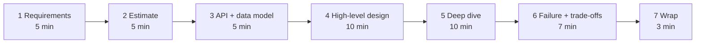
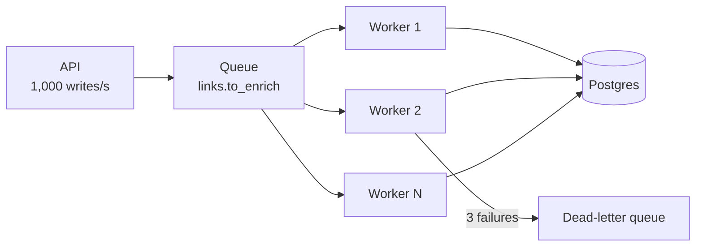

# Backend and Distributed System Design Drills

> **Interview answer (say this first).** A design interview is a timed conversation with a fixed loop, not a drawing contest. I run the same seven moves every time: **requirements, estimate, API and data model, high-level design, one deep dive, failure modes and trade-offs, then a wrap**. I never name a component before I have a number, and I never finish without saying what breaks first and what I would change at ten times the load. Practising the loop against ten prompts is what turns knowledge into a repeatable answer.

## Why this exists

A candidate sits down for a back-end design round. The interviewer says, "Design a URL shortener." The candidate's first sentence is: "I'll use a hash map, Redis, and a load balancer." They draw boxes for eight minutes. Then the interviewer asks:

- How many links are created per second?
- How much storage does that need in a year?
- What happens when Redis is down?
- Is the short code generated before or after the database write?
- What breaks first at ten times the traffic?

The candidate has no answer, because they never asked what they were designing. They run out of time with a pretty diagram and no decisions. The interviewer writes "jumps to solution, no numbers, no failure analysis" and moves on.

This failure is common and easy to fix. The fix is not more system designs to memorise. It is a **method** and a **rubric** you rehearse until the order is automatic. The method forces the cheap questions first and the expensive drawing last. The rubric tells you what the interviewer is actually scoring, so you spend the 45 minutes on the things that earn marks.

This page is a rehearsal layer. It assumes the material in [System design, low-level design, and high-level design](05-system-design-lld-and-hld.md) and [Backend architecture, distributed systems, Kafka, microservices, events](03-backend-architecture-distributed-kafka-microservices-events.md). Where a step feels thin, follow the pointer.

> **The one-sentence rule.** Say the requirement before the component, the number before the box, and the failure mode before the finish.

## Start from zero

Every word below is used later on this page. Read the table before continuing.

| Word | Plain meaning |
| --- | --- |
| **Functional requirement** | Something the system must do, such as "create a short link" or "send a notification". |
| **Non-functional requirement (NFR)** | A quality the system must have: latency, throughput, cost, availability, privacy. |
| **Estimation** | Rough arithmetic that decides whether a design is feasible. |
| **Capacity** | How much the system can carry: requests per second, storage, and connections. |
| **QPS** | Queries per second: how many requests arrive each second, on average or at peak. |
| **Storage estimate** | Rows written per day times bytes per row, scaled to a month or a year. |
| **Back-of-the-envelope** | A calculation done on paper, good to an order of magnitude, to test a hunch. |
| **API contract** | The exact request and response shape of an endpoint: fields, status codes, errors. |
| **Data model** | The tables, columns, keys, and relationships that hold the state. |
| **Consistency** | How fresh a read must be. Strong means the latest write is always visible; eventual means replicas catch up over time. |
| **Availability** | The share of time the system answers requests, usually written as a percentage. |
| **Partition tolerance** | The system keeps working when the network splits and parts cannot talk. |
| **Queue** | A buffer that holds work until a worker is free to process it. |
| **Idempotency** | Doing the same operation twice has the same effect as doing it once. |
| **Backpressure** | Telling a producer to slow down when consumers cannot keep up. |
| **Cache** | A fast copy of data that avoids a slower lookup. |
| **Index** | A data structure that makes a lookup fast at the cost of slower writes and more storage. |
| **Sharding** | Splitting one logical data set across several machines by a key. |
| **Replication** | Keeping copies of the same data on several machines for safety and read scale. |
| **SLO** | Service-Level Objective: a measurable reliability target, such as 99.9% of reads under 100 ms. |
| **Failure mode** | A specific way the system can fail, such as "the cache is down" or "the worker crashes mid-job". |
| **Trade-off** | Gaining one property by giving up another, such as consistency for latency. |
| **Changing requirement** | A new constraint the interviewer adds mid-interview that must change the design. |

Three distinctions matter before we start:

- **Requirements come before technology.** "Use Redis" is an answer only after you know the read rate, the latency target, and what happens when Redis dies.
- **Estimation is a decision tool, not a maths test.** One rough number can rule out a design. That is the point.
- **A trade-off is a sentence, not a feeling.** "We chose eventual consistency for the feed because a two-second delay is invisible; we would revisit if the product needed a read-your-own-writes guarantee."

## The core idea

Think of a design interview as a **guided tour of a building you have not measured yet**. You start by asking who lives there and how many people visit (requirements). You count the visitors and the rooms (estimate). You sketch the floor plan (high-level design). You open one wall to show the wiring (deep dive). You point at the fire exits (failure modes). Then you say what you would add if the building doubled (the 10× change).

The order is the whole method. A candidate who starts at the wiring has no floor plan. A candidate who starts at the floor plan but never counts visitors designs for the wrong crowd.



### The timing plan for a 45-minute design

| Minutes | Move | What you produce |
| --- | --- | --- |
| 0–5 | Requirements | Functional list, non-functional targets, out-of-scope list |
| 5–10 | Estimate | QPS, peak factor, storage per year, concurrency |
| 10–15 | API and data model | Endpoints, request/response fields, tables and keys |
| 15–25 | High-level design | Components and the path a request takes |
| 25–35 | Deep dive | One hard component designed in detail |
| 35–42 | Failure and trade-offs | Failure modes, consistency choice, scaling plan |
| 42–45 | Wrap | Two or three decisions, and the 10× change |

The times are a guide, not a contract. The **order** is the contract. If the clock is short, compress every step; do not skip one and jump ahead.

### The rubric the interviewer is using

| Dimension | 1 — weak | 3 — fine | 5 — strong |
| --- | --- | --- | --- |
| **Requirement clarity** | Starts drawing immediately | Asks a few questions | Splits functional from NFR, writes out of scope, states assumptions |
| **Estimation** | No numbers | One rough number | QPS, peak, storage, concurrency, all labelled |
| **Design** | Random boxes | A working request path | Clear data flow, each box owns one concern, defensible choices |
| **Depth** | Nothing explained | One shallow description | One component designed with keys, indexes, state, and edge cases |
| **Failure handling** | Not mentioned | "We'd add a retry" | Named failure modes, fallbacks, consistency choice, blast radius |
| **Communication** | Silent drawing | Explains after | Thinks aloud, checks in, adapts, closes with trade-offs |

The last row is the one candidates forget. **Communication is scored.** An unspoken correct decision earns nothing, because the interviewer cannot grade a thought.

> **The mental model in one line.** Requirements, estimate, API, design, one deep dive, failure and trade-offs, wrap — in that order, every time, for every prompt.

## How it works

Follow one interview from the first question to the closing sentence.

1. **Restate the requirements and ask what matters.** Say the problem back in one sentence. Then ask the three questions that change the design: what is the read-to-write ratio, what is the scale, and what consistency does the product need? Write functional requirements in one list and non-functional targets in another. Put the out-of-scope items in a third list. This takes five minutes and prevents a wrong design.
2. **Make a back-of-the-envelope estimate.** Turn the answers into numbers: writes per second, reads per second, peak factor, storage per year, and concurrency. Label every input as illustrative. The estimate decides the architecture before you draw it.
3. **Sketch the API and the data model.** Write the two or three endpoints the product needs, with request fields, response fields, and error codes. Then write the tables, their primary keys, and the indexes that serve the main query. The API and the schema are the design, expressed precisely.
4. **Draw the high-level design.** Draw the path a request takes: client, gateway, service, data store, cache, queue. Say which box owns which concern. Do not optimise yet. Keep only boxes you can defend.
5. **Deep dive the hardest component.** Pick the one component the estimate or the requirements made hard — the ID generator, the fan-out, the rate limiter, the ledger. Design its data structures, its keys, its state, and its edge cases. One deep dive beats ten shallow ones.
6. **Cover failure modes, consistency, and scaling.** For each component, say what happens when it is slow, dead, or wrong: cache, fall back, degrade, queue, or reject. State the consistency choice out loud. Say how each layer scales: cache first, then read replicas, then sharding.
7. **State the trade-offs and the 10× change.** Name the trade-off you accepted and the condition that would flip it. Then answer the question every senior interviewer asks: what would you change at ten times the load?
8. **Finish with a summary.** Two or three sentences: the decisions that shaped the design and the one thing you would test first. That summary is what the interviewer writes down.

### Ten prompts to drill

Practise each prompt in 45 minutes, aloud, with the timing plan above.

| # | Prompt | The hardest part | The decision that earns marks |
| --- | --- | --- | --- |
| 1 | URL shortener | Code generation and read scale | Generate the code before the write; cache reads |
| 2 | News feed | Fan-out to many followers | Push for normal users, pull for celebrities |
| 3 | Chat | Message ordering and delivery | Per-conversation ordering; idempotent delivery |
| 4 | Rate limiter | Atomicity across replicas | One Lua script in Redis, or a local bucket per node |
| 5 | Job queue | At-least-once delivery | Idempotent workers and a dead-letter queue |
| 6 | Notification service | Fan-out, retries, and provider limits | Queue per channel, dedup key, backpressure |
| 7 | Payment ledger | Exactly-once charging | Idempotency key plus a double-entry ledger |
| 8 | Metrics pipeline | High write volume, late data | Append-only store, time-window aggregation, drop policy |
| 9 | Search | Ranking quality and index freshness | Inverted index, sharding by document, reindex path |
| 10 | Multi-tenant SaaS | Isolation and noisy neighbours | Tenant id in every key; per-tenant quotas |

## The syntax you will use

These are the real forms you write on a whiteboard. Each one appears in a design answer.

**1. An estimate block.** Writes, reads, storage, and concurrency. Rough is fine; labelled is mandatory.

```python
WRITES_PER_SEC = 1_000
READ_WRITE_RATIO = 10
READS_PER_SEC = WRITES_PER_SEC * READ_WRITE_RATIO        # 10,000
ROWS_PER_DAY = WRITES_PER_SEC * 86_400                    # 86,400,000
BYTES_PER_ROW = 500
STORAGE_PER_DAY_GB = ROWS_PER_DAY * BYTES_PER_ROW / 1e9   # 43.2
STORAGE_PER_YEAR_TB = STORAGE_PER_DAY_GB * 365 / 1_000    # ~15.8
concurrency = int(READS_PER_SEC * 0.05)                   # 500 in flight at 50 ms
print(READS_PER_SEC, ROWS_PER_DAY, round(STORAGE_PER_DAY_GB, 1),
      round(STORAGE_PER_YEAR_TB, 1), concurrency)
# 10000 86400000 43.2 15.8 500
```

Say the inputs out loud: "I am assuming 1,000 writes a second, a 10:1 read ratio, and 500 bytes per row." If an input is wrong, the interviewer can correct it, and the design changes with it.

**2. An API sketch.** Endpoints, fields, and error codes. This is the contract, not the implementation.

```text
POST /v1/links
  request:  {"long_url": "https://example.com/a/very/long/path", "expires_at": null}
  response: 201 {"code": "aZ3kP9q", "short_url": "https://sho.rt/aZ3kP9q"}
  errors:   400 invalid URL, 409 duplicate, 429 rate limited

GET /v1/links/{code}
  response: 302 Location: <long_url>
  errors:   404 unknown or expired
```

The status codes are part of the design: `201` means created, `302` means redirect, `409` means the caller already created this link.

**3. A table schema.** A primary key, the access path, and one index matching the main query.

```sql
CREATE TABLE links (
    code       TEXT PRIMARY KEY,                 -- base62, 7 characters
    long_url   TEXT NOT NULL,
    owner_id   BIGINT NOT NULL,
    created_at TIMESTAMPTZ NOT NULL DEFAULT now(),
    expires_at TIMESTAMPTZ,
    CONSTRAINT links_code_len CHECK (char_length(code) = 7)
);

-- Serve "list my recent links" without scanning the whole table.
CREATE INDEX links_owner_created_idx ON links (owner_id, created_at DESC);

-- One owner cannot create the same long URL twice; md5 keeps the index small.
CREATE UNIQUE INDEX links_owner_url_uniq ON links (owner_id, md5(long_url));
```

The primary key is the lookup the read path uses. The composite index is the lookup the product screen uses. A schema without indexes is an unfinished design.

**4. A queue and worker diagram.** The write path returns fast; workers do the slow part.



The API acknowledges the write after the queue accepts it, so the user does not wait for enrichment. Workers scale horizontally. The dead-letter queue holds jobs that keep failing, so a poison message cannot block the line.

## Examples: simple to real

Five graded examples. The first contrasts two candidates; the rest build a real answer.

**Example 1 — the same prompt, badly and well.** Watch the first sentence decide the score.

*Bad answer (no requirements, no numbers):*

```text
"I'll use a hash map, Redis for caching, and a load balancer.
The code is a base62 hash of the URL. We shard by code.
I'll add Kafka for events and Kubernetes to scale."
```

This names six technologies in fifteen seconds and answers none of the questions that matter. There is no read rate, no storage number, no failure mode, and no trade-off. It is a memorised reference architecture.

*Good answer (requirements, then estimate, then design):*

```text
"Before I design, three questions: is this read-heavy or write-heavy,
what is the scale, and do links ever expire or get deleted?"

"Assume 1,000 writes/s, a 10:1 read ratio, 500 bytes per row.
That is 86.4M rows/day, about 43 GB/day, roughly 15.8 TB/year.
10,000 reads/s is too much for one primary, so I put a cache in front."

"Two endpoints: POST /v1/links and GET /v1/links/{code}.
One table, links, keyed by code, with an index on (owner_id, created_at)."

"Request path: client -> gateway -> link service -> cache -> Postgres,
with an async worker for click analytics. Reads hit the cache first."
```

Same prompt, same time. The second candidate has already earned the requirement and estimation marks and has not drawn a single box yet.

**Example 2 — an estimation that changes the design.** The URL shortener again, and the number that forces a cache.

```python
WRITES_PER_SEC, READ_WRITE_RATIO = 1_000, 10
READS_PER_SEC = WRITES_PER_SEC * READ_WRITE_RATIO
CACHE_HIT_RATE = 0.95
DB_READS_PER_SEC = int(READS_PER_SEC * (1 - CACHE_HIT_RATE))
print(READS_PER_SEC, DB_READS_PER_SEC)      # 10000 500
```

Ten thousand reads a second will overload one primary. With a 95% cache hit rate the database sees only 500 reads a second, which it can serve comfortably. The cache is not a nice-to-have; it is the thing that makes the read path feasible. **One estimate turned a wish list into an argument.**

**Example 3 — a deep dive into one component, with a failure mode.** The payment ledger, and the retry that must not double-charge.

The hazard: a client sends a charge, the server commits it, the response is lost on the network, and the client retries. Without a guard, the customer is charged twice. The fix is an **idempotency key**: a client-generated id that is unique per charge attempt. The key and the ledger entries commit in one transaction, so a second attempt with the same key changes nothing.

```sql
CREATE TABLE charges (
    idempotency_key TEXT PRIMARY KEY,     -- client supplies; unique per attempt
    request_hash    TEXT NOT NULL,        -- stored so a reused key with a new body can be detected
    txn_id          UUID NOT NULL,
    created_at      TIMESTAMPTZ NOT NULL DEFAULT now()
);

CREATE TABLE ledger_entries (
    entry_id     BIGSERIAL PRIMARY KEY,
    txn_id       UUID NOT NULL,
    account_id   BIGINT NOT NULL,
    amount_minor BIGINT NOT NULL,         -- signed; a transaction sums to zero
    created_at   TIMESTAMPTZ NOT NULL DEFAULT now()
);
```

The charge is one atomic statement with a data-modifying CTE. If the key already exists, the `ON CONFLICT` does nothing and no entries are posted.

```sql
WITH new_charge AS (
    INSERT INTO charges (idempotency_key, request_hash, txn_id)
    VALUES ($1, $2, $3)
    ON CONFLICT (idempotency_key) DO NOTHING
    RETURNING txn_id
)
INSERT INTO ledger_entries (txn_id, account_id, amount_minor)
SELECT $3, $4, -$5 WHERE EXISTS (SELECT 1 FROM new_charge)   -- debit the customer
UNION ALL
SELECT $3, $6,  $5 WHERE EXISTS (SELECT 1 FROM new_charge);  -- credit the merchant
```

Two entries, one negative and one positive, summing to zero: money leaves one account and enters another, and the ledger stays balanced. The **failure mode** is a retry after a timeout; the idempotency key makes the retry a no-op. State this out loud, because it is the mark for failure handling.

**Example 4 — adapting when the interviewer changes a requirement.** The news feed, and the celebrity problem.

The first design fans out on write: when a user posts, copy the post into every follower's timeline. Reads are then a single cheap lookup. The interviewer adds: "One account has 50 million followers." Now a single post writes 50 million rows, and the publish takes minutes.

| Approach | Write cost | Read cost | Best for |
| --- | --- | --- | --- |
| **Fan-out on write** (push) | High: one row per follower | Low: read the timeline | Users with few followers |
| **Fan-out on read** (pull) | Low: store the post once | High: merge many follows | Celebrities and very active accounts |
| **Hybrid** | Medium | Medium | Almost every real feed |

The hybrid keeps push for normal accounts and pull for accounts above a threshold. The read path merges the precomputed timeline with the recent posts of a few large accounts.

```python
FOLLOW_FANOUT_LIMIT = 100_000

def delivery_mode(follower_count: int) -> str:
    return "push" if follower_count < FOLLOW_FANOUT_LIMIT else "pull"

print(delivery_mode(200), delivery_mode(50_000_000))   # push pull
```

The lesson is the move, not the number: **when a requirement changes, rerun the affected part of the loop and say what you gave up.** Here you trade a more complex read for a bounded write.

**Example 5 — a rubric self-score of a timed attempt.** Score every attempt so improvement is visible.

```python
RUBRIC = {
    "requirements": 0.20, "estimation": 0.15, "design": 0.25,
    "depth": 0.20, "failure": 0.10, "communication": 0.10,
}
attempt_1 = {"requirements": 2, "estimation": 1, "design": 4,
             "depth": 3, "failure": 1, "communication": 3}   # each out of 5
attempt_2 = {"requirements": 4, "estimation": 4, "design": 4,
             "depth": 4, "failure": 3, "communication": 4}

def score(a):
    return round(sum(a[k] * w for k, w in RUBRIC.items()) / 5 * 100)

print(score(attempt_1), score(attempt_2))   # 51 78
```

The first attempt was strong on design but weak on requirements, estimation, and failure handling, which cost it almost half the marks. The second attempt fixed those first, and the score rose by 27 points without a fancier diagram. **Score the dimensions, not the drawing.**

## In production

- **Never design before requirements.** The first sentence should be a question, not a technology. A component named before a number is a guess you will have to defend.
- **Estimate out loud and label every input.** "Assume 1,000 writes a second" invites the interviewer to correct you. Silent arithmetic hides a wrong assumption behind confident arithmetic.
- **Write the API and data model first.** The endpoints and the schema force precision. If you cannot write the primary key, you do not yet understand the read path.
- **One deep dive beats ten shallow ones.** Pick the component the estimate made hard and design it fully. Shallow boxes everywhere score as if nothing was designed.
- **State consistency explicitly.** Say whether the read must be strongly consistent or may be eventual, and say it per operation. The same system can be strong for payments and eventual for a feed.
- **Give every component a failure mode.** Slow, dead, or wrong: choose cache, fall back, degrade, queue, or reject in advance, and say the blast radius.
- **Name the trade-off you accepted.** "We chose cache in front of the database and accept up to 60 seconds of staleness on link clicks." A design with no stated trade-off reads as memorised.
- **Answer "what breaks first?" before you are asked.** Walking the request path and naming the limiting stage is the single most senior-sounding move in the interview.
- **Adapt to the changed requirement instead of restarting.** Rerun the affected part of the loop, say what you gave up, and keep the rest of the design.
- **Timebox yourself.** If you are at minute 25 and still drawing the high-level design, you will never reach failure modes, which is where seniority shows.
- **Communication is scored, so think aloud.** Narrate the decision, not the syntax. A correct thought nobody hears earns nothing.
- **Practise ten prompts, not one.** The method is transferable; the recall of a single design is not. Ten timed attempts build the habit.

## Interview questions

### 1. How do you start a 45-minute design interview?

**Answer.** With questions, not components. I restate the problem in one sentence, then ask the three things that change the design: the read-to-write ratio, the scale, and the consistency the product needs. I split functional requirements from non-functional targets and write an out-of-scope list. Then I state my assumptions for anything I could not get. No drawing until the problem is agreed, because a box drawn before a number is a guess.

**Follow-up: "The interviewer says 'just assume anything'."** I still say the assumptions out loud and label them, because the design depends on them. "Assume 1,000 writes a second, a 10:1 read ratio, and a 99.9% monthly SLO" gives us something to defend and something to challenge.

**Trap.** Naming a technology in the first sentence. It signals that you skipped the problem and will run out of time.

### 2. Why estimate before you design?

**Answer.** Because one number can rule out a design. If the read rate is 10,000 queries a second, a single primary database is not feasible and a cache becomes mandatory. If the storage is 15 TB a year, a single machine may still hold it but backups and rebuilds become the constraint. The estimate tells me whether the problem is small enough for one service or large enough to need sharding. I use writes per second, reads per second, peak factor, storage per year, and Little's law for concurrency.

**Follow-up: "What if your numbers are wrong?"** That is fine, as long as they are labelled. The interviewer can correct an assumption and I rerun the affected step. A wrong labelled number is a conversation; a wrong hidden number is a failed design.

**Trap.** Estimating only the happy path. Retries, fan-out, and background jobs also consume capacity and money.

### 3. How do you choose what to deep dive?

**Answer.** I walk the request path and pick the component the estimate or the requirements made hard. In a URL shortener it is the code generator and the read path. In a feed it is the fan-out. In a payment system it is the ledger and its idempotency. I design that one component properly: data structures, keys, indexes, state, and edge cases. Depth in one place proves I have built systems; shallow coverage everywhere proves I have read about them.

**Follow-up: "What if the interviewer wants three components?"** I give each a short, correct answer and then offer to go deep on one. Spreading ten minutes over three components produces three shallow descriptions, which is the weakest outcome.

**Trap.** Deep-diving the component that is easy to talk about rather than the one that is hard.

### 4. How do you choose between consistency and availability?

**Answer.** Per operation, not per company. During a network partition, a system must choose whether to refuse some requests to stay correct (consistent) or accept them and reconcile later (available). I make the choice per feature: a payment ledger is consistent, because a wrong balance is unacceptable; a presence indicator is available, because stale presence is harmless. I say the choice out loud and name the cost, so the interviewer sees it was deliberate rather than accidental.

**Follow-up: "What about outside a partition?"** There is still a latency-versus-consistency trade. Strong consistency costs coordination round trips, so even without a partition I choose it only where correctness demands it.

**Trap.** Reciting "choose two of three". Partition tolerance is not optional on a real network; the real decision is what to do while partitioned.

### 5. What do you do when the interviewer changes a requirement?

**Answer.** I do not restart. I rerun the affected part of the loop. If a feed suddenly has a 50-million-follower account, I change the fan-out for large accounts from push to pull, keep push for everyone else, and say that the read path is now more complex. Then I say what I gave up: a bounded write in exchange for a merged read. Adapting in place, out loud, is exactly what the interviewer is testing.

**Follow-up: "How do you decide the threshold?"** From the estimate. If a push costs one row per follower, an account with millions of followers makes the write path unaffordable, so the threshold sits where one publish still fits the write budget.

**Trap.** Freezing and finishing the original design. Ignoring the new constraint loses the marks for adaptability and communication.

### 6. How do you cover failure handling without running out of time?

**Answer.** I reserve the last seven minutes and go component by component, answering one question: slow, dead, or wrong. For each, I name the response — cache the read, fall back to a default, degrade the feature, queue the write, or reject the request. I state the blast radius and, where it matters, the consistency choice. I do not write code for failure paths; I name them. Naming them in advance is what seniority sounds like.

**Follow-up: "Which failure do you care about most?"** The one on the critical path with the largest blast radius — usually the primary data store or the single external provider. That one gets a fallback and an alert; the rest degrade quietly.

**Trap.** Saying "we'd add retries" and stopping. Retries create duplicates, so retries without idempotency are a new failure, not a fix.

### 7. What does a strong closing look like?

**Answer.** Two or three sentences that name the decisions that shaped the design, the trade-off each one made, and the condition that would change it. Then I answer the 10× question: cache first, then read replicas, then shard by the entity key. Finally I say the one thing I would test first. The closing is what the interviewer writes down, so it should be the clearest thing I say.

**Follow-up: "What would you test first?"** The assumption the design rests on. In a shortener that is the cache hit rate; if it is below 90%, the database read path becomes the bottleneck and the design changes.

**Trap.** Ending on the diagram. The boxes are already on the board; the trade-off sentence is what is missing.

### 8. How do you practise for the design interview?

**Answer.** I rehearse the same loop against ten different prompts, timed at 45 minutes, out loud. I score each attempt against a rubric with six dimensions — requirement clarity, estimation, design, depth, failure handling, and communication — and I fix the lowest dimension next time rather than redrawing the whole system. Repetition across prompts builds the transferable habit; one brilliant attempt at one prompt does not.

**Follow-up: "Why out loud?"** Because reading an answer is recognition and speaking it is recall. The interview tests delivery under time pressure, so the rehearsal must include the clock and the voice.

**Trap.** Practising by reading model designs. That builds familiarity with one answer, not the ability to run the method on a new prompt.

## Remember this

- **Requirements, estimate, API, design, one deep dive, failure and trade-offs, wrap.** Run that loop, in that order, on every prompt.
- **A number before a box.** One estimate — QPS, peak, storage, concurrency — decides the architecture before you draw it.
- **One deep dive beats ten shallow ones.** Design the component the estimate made hard, with keys, indexes, state, and edge cases.
- **Every component has a failure mode and every design has a trade-off.** Slow, dead, or wrong; state the response, the blast radius, and what you gave up.
- **Communication is scored.** Think aloud, adapt when the requirement changes, and close with the 10× change and the thing you would test first.
