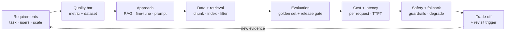
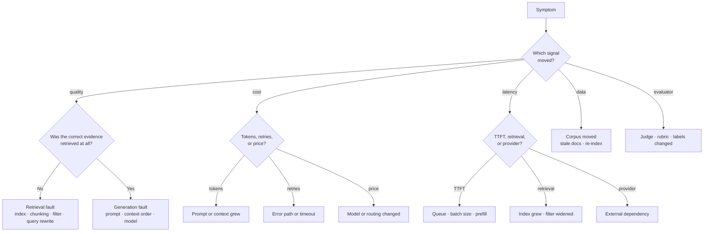

# AI System Design and Incident Drills

> **Interview answer (say this first).** An AI system-design interview is a fire drill, not a drawing contest. I run one sequence every time: **clarify the task and the quality bar, justify the approach (RAG, fine-tune, or prompt; agent or workflow), design the data and retrieval, design the evaluation and release gate, estimate cost and latency, cover safety, privacy, and fallback, then name the trade-off and the trigger that would change my mind.** If the interviewer then says "the answers got worse" or "the bill doubled", I do not guess. I isolate the fault by layer — retrieval, generation, data, or evaluator for quality; tokens, retries, or price for cost; TTFT, retrieval, or provider for latency — and I say out loud which measurement separates the branches.

## Why this exists

Here is a real interview failure. The interviewer asks: "Design a question-answering service over 50,000 internal documents." The candidate draws a vector database, a language model, and a cache in four minutes. The boxes are correct. Then the interviewer asks three questions:

- "What is the quality metric, and on which dataset do you measure it?"
- "What does one request cost, and what is the monthly bill?"
- "Usage is flat, but users say the answers got worse this week. What do you check first?"

The candidate has no answer for any of them. There is no evaluation, so "better" and "worse" are opinions. There is no cost estimate, so nobody knows whether the design is affordable. And there is no way to localise a regression, so the only move left is to guess at the prompt.

That candidate failed for a specific reason: **they designed a diagram, not a system.** A system has numbers, a release gate, and a debugging path. The interviewer is not grading the boxes. They are grading whether you can answer "how do you know it works, what does it cost, and what do you do when it breaks?"

This page is rehearsal. You will practise ten prompts under time, score yourself against a rubric, and drill the three incidents that interviewers use most: quality dropped, cost spiked, and latency regressed.

> **The one-sentence rule.** An AI design is judged on its evaluation and its cost per request, not on how many components it has.

## Start from zero

Every word below is used later on this page. Read the table before continuing.

| Word | Plain meaning |
| --- | --- |
| **Requirement** | Something the system must do (functional) or a quality it must have (non-functional: latency, cost, privacy). |
| **Quality metric** | The one number that says whether an answer is good, such as answer accuracy or faithfulness. |
| **Evaluation dataset** | A fixed set of inputs, with expected outputs or labels, used to score a version. |
| **Golden set** | A small, human-reviewed evaluation dataset you trust enough to gate a release on. |
| **Retrieval quality** | How well the search step finds the relevant evidence, measured by recall and ranking metrics. |
| **Faithfulness** | The share of an answer's claims that the retrieved context actually supports. |
| **Latency (TTFT / end-to-end)** | Time to first token (the wait before output starts) and total time until the answer is complete. |
| **Cost per request** | The money spent to serve one request, from input tokens, output tokens, and infrastructure. |
| **Unit economics** | Cost per unit of business value, such as cost per answered question, not just the total bill. |
| **Guardrails** | Checks that block unsafe, off-policy, or malformed input and output. |
| **Human-in-the-loop** | A person reviews or approves an action the system would otherwise take alone. |
| **Drift** | The system's inputs or behaviour changing over time, so a metric moves for real reasons. |
| **Evaluator drift** | The score moving because the judge, rubric, or labels changed, not the system. |
| **RAG** | Retrieval-augmented generation: fetch evidence, then answer from it. |
| **Agent** | A system that decides its own next step, usually by calling tools in a loop. |
| **Tool call** | One action the model requests, such as a database read or an API write. |
| **Idempotency** | Running the same operation twice has the same effect as running it once. |
| **Fallback** | A worse-but-useful answer served when the preferred path is slow, down, or unsafe. |
| **SLO** | Service-level objective: a target such as "p95 end-to-end under 3 seconds". |
| **Incident** | A real event where the system failed its promise to users. |
| **Root cause** | The specific mechanism that produced the incident, not the first symptom. |
| **Trade-off** | Gaining one property by giving up another, such as quality for cost. |

Three distinctions decide most interview answers, so fix them now:

- **A metric is not a dataset.** A metric is the formula; a dataset is the evidence. "Faithfulness 0.88" means nothing without the golden set version behind it.
- **Drift is not evaluator drift.** Drift is the system changing. Evaluator drift is the ruler changing. They produce the same symptom and need opposite fixes.
- **Cost is not latency.** They usually move together, but a cached answer can cut cost with no latency change, and a queue can cut cost while raising latency. Name which one you are optimising.

## The core idea

Think of a **fire drill**. The building does not practise because a fire is likely today. It practises so that when the alarm rings, nobody invents a plan under pressure. An AI design interview works the same way. The interviewer's follow-up is the alarm. You do not get to think of a new method on the spot; you run the sequence you have rehearsed.

The sequence has a fixed shape:



Cheap decisions come first because they are cheap to change. The drawing comes late, and only after the quality bar and the budget are agreed.

### The timing plan

An AI design round is usually 45–60 minutes. Spend it like this.

| Minutes | Move | What the interviewer is grading |
| --- | --- | --- |
| 0–5 | Clarify the task and the quality bar | Do you ask what "good" means before you design? |
| 5–9 | Choose and justify the approach | Can you say why not the alternative? |
| 9–16 | Design the data and retrieval path | Do you think about ingestion, not only query time? |
| 16–24 | Design evaluation and the release gate | Is quality measurable and enforced? |
| 24–30 | Estimate cost and latency | Are the numbers real and labelled? |
| 30–34 | Cover safety, privacy, and fallback | What breaks when a dependency fails? |
| 34–45 | Handle the incident drills and trade-offs | Can you isolate a fault by layer? |
| 45–55 | Close: decisions and revisit triggers | Can you summarise and defend? |

### The six AI-specific drills, and the one trap in each

| Drill | Typical prompt | The single trap |
| --- | --- | --- |
| **RAG design** | "Answer questions over 50,000 internal documents." | Designing query time only and ignoring ingestion, chunking, and re-indexing. |
| **Agent design** | "Build an agent that issues customer refunds." | Unbounded autonomy: no step cap, no spend cap, and no approval for irreversible actions. |
| **Gateway** | "One gateway for ten teams calling five models." | A cache key without the tenant, so one team reads another team's cached answer. |
| **Evaluation platform** | "Run evaluations on every release." | An LLM judge that was never calibrated against human labels. |
| **Serving** | "Serve a 70-billion-parameter model at 100 requests per second." | Sizing by parameter count and forgetting the KV cache, which limits concurrency. |
| **Cost** | "Cut spend 40% without losing quality." | Dropping everyone to a smaller model instead of routing by difficulty. |

> **The mental shortcut.** Requirements decide the metric, the metric decides the data, and the data decides the cost. Get the order wrong and the interview becomes a drawing contest.

## How it works

Follow one design from the first question to a defended trade-off, then the three incidents.

1. **Clarify the task and the quality bar.** Ask who the user is, what job they are doing, and what a good answer looks like. Turn "good" into one primary metric and one guard metric. Example: primary `answer accuracy`; guard `faithfulness` and `p95 latency`. Write the out-of-scope list. This takes five minutes and prevents a wrong design.
2. **State the scale and the constraints.** Turn every unknown into a labelled assumption: documents, questions per day, peak factor, region, budget ceiling, and any data-residency rule. Say the numbers out loud, because the interviewer will correct a number faster than a whole design.
3. **Choose the approach and justify it.** Answer three questions in order.
   - *Prompt or retrieval or fine-tune?* Use a prompt when the task is stable and the knowledge is general. Add RAG when the answer depends on private or changing data, because retrieval updates by re-indexing, not retraining. Fine-tune when you must change *form* — tone, format, a narrow classification — or when a small model must match a large one on a fixed task. Fine-tuning teaches behaviour; it does not reliably teach fresh facts.
   - *Agent or workflow?* Use a fixed workflow when the steps are known, because it is cheaper, testable, and deterministic. Use an agent only when the next step genuinely depends on what the last step returned. Say that out loud; it is the most common senior-level distinction.
   - *What is the fallback?* Name it before the interviewer asks. "If the model is down, return the retrieved sources with a label."
4. **Design the data and retrieval.** Cover ingestion as well as query time: parse, chunk on structure, embed, index, and version. State the filter that enforces access control. State the candidate size and whether you rerank. For an agent, state the tools, the schemas, and which tools are read-only.
5. **Design the evaluation and the release gate.** Name the golden set, its size, its slices (multi-hop, no-answer, acronym), and who labels it. Name the metrics per stage: retrieval recall for the search half, faithfulness and accuracy for the generation half. Then state the gate: a version ships only if every metric clears its floor on the pinned dataset and judge. Gate an offline run first, then a small canary.
6. **Estimate cost and latency.** Compute cost per request from input tokens, cached input tokens, and output tokens, then multiply by daily volume. Compute latency as a budget: retrieval, TTFT, and streaming, summing to the end-to-end target. Both are arithmetic, and both are design inputs, not reports.
7. **Cover safety, privacy, and fallback.** Say where guardrails run (at the gateway, before any model work), how tenant isolation is enforced (a filter in the query, never a line in the prompt), what needs human approval (irreversible or over-budget actions), and what the user sees when the preferred path fails.
8. **Name the trade-off and the revisit trigger.** Close with the two or three decisions that shaped the design and the condition that would flip each one. "We chose retrieval over fine-tuning because policy changes monthly; we would revisit if recall stays under 0.80 after a reranker."

### The debugging drills

Never guess. Isolate the layer first. This tree is the whole method.



- **"Quality dropped."** Check the evaluator first, because it is cheapest: did the judge model, rubric, or dataset version change? Then split quality into retrieval and generation. If the correct chunk was **not** retrieved, it is a retrieval regression: re-index, chunking, filters, or query rewrite. If it **was** retrieved but unused, it is a generation regression: prompt, context order, or model. If both look fine, the corpus moved — stale or conflicting documents.
- **"Cost spiked."** Split the bill three ways: tokens, retries, and price. Tokens grow when a prompt or context gets longer. Retries grow when an error path starts firing at every layer. Price changes when the model or the routing policy changes. One query over the logs answers it.
- **"Latency regressed."** Split the budget. TTFT rising means queueing, batching, or prefill — the system is saturated. Retrieval rising means the index grew or the filter widened. Provider latency rising means an external dependency moved and your timeout is now the bottleneck.

### Ten practice prompts

Rehearse each against a timer, then score yourself with the rubric in the examples.

| # | Prompt | Time | What it tests |
| --- | --- | --- | --- |
| 1 | Design an assistant over 50,000 internal documents. | 40 min | RAG end to end with an evaluation gate. |
| 2 | Design a support agent that can issue refunds. | 40 min | Bounded autonomy and approval. |
| 3 | Design one AI gateway for ten teams and five models. | 35 min | Tenancy, quota, cache keys, and routing. |
| 4 | Design an evaluation service for every release. | 35 min | Datasets, judge calibration, and the gate. |
| 5 | Serve a 70B model at 100 requests per second. | 40 min | Capacity, KV cache, batching, cost. |
| 6 | Cut AI spend 40% without losing quality. | 30 min | Unit economics and the lever order. |
| 7 | "Answers got worse this week." Debug it. | 15 min | Quality isolation by layer. |
| 8 | "The bill doubled this month." Debug it. | 15 min | Cost isolation: tokens, retries, price. |
| 9 | "p95 latency doubled overnight." Debug it. | 15 min | Latency isolation: TTFT, retrieval, provider. |
| 10 | Choose RAG, fine-tuning, or prompting for a legal-document task. | 20 min | Approach justification and trade-offs. |

## The syntax you will use

These are the small artefacts an AI design interview expects you to be able to sketch. Each is short and runnable in Python 3.12+.

**An evaluation-run record.** A run pins every version, so a later comparison is trustworthy and evaluator drift is visible.

```python
from dataclasses import dataclass, field
from datetime import datetime

@dataclass(slots=True)
class EvalRun:
    run_id: str
    system_version: str
    dataset_version: str          # golden set version
    judge_version: str            # evaluator version, so drift is traceable
    started_at: datetime
    metrics: dict[str, float] = field(default_factory=dict)

    def gate(self, floors: dict[str, float]) -> bool:
        """Ship only if every metric clears its floor."""
        return all(self.metrics.get(name, 0.0) >= floor for name, floor in floors.items())

run = EvalRun(
    run_id="run-2026-09-13-01",
    system_version="rag-2026.09.13",
    dataset_version="golden-2026-09",
    judge_version="judge-3-prompt-v7",
    started_at=datetime.now(),
    metrics={"recall@50": 0.91, "faithfulness": 0.88, "answer_accuracy": 0.84},
)
print(run.gate({"recall@50": 0.90, "faithfulness": 0.85, "answer_accuracy": 0.85}))  # False
```

The run fails because `answer_accuracy` is 0.84 against a 0.85 floor. A gate is only useful if it can say no.

**A cost-per-request estimate.** Split input into fresh and cached tokens, because they are priced differently.

```python
from dataclasses import dataclass

@dataclass(frozen=True, slots=True)
class Price:
    input: float          # USD per million fresh input tokens
    cached_input: float   # USD per million cache-read tokens
    output: float         # USD per million output tokens

def cost_per_request(inp: int, cached: int, out: int, p: Price) -> float:
    fresh = inp - cached
    return (
        fresh / 1e6 * p.input
        + cached / 1e6 * p.cached_input
        + out / 1e6 * p.output
    )

price = Price(input=0.60, cached_input=0.15, output=2.40)   # illustrative rates
per_request = cost_per_request(2600, 1800, 350, price)
print(round(per_request, 6))                 # 0.00159
print(round(per_request * 20_000, 2))        # 31.8   USD per day
print(round(per_request * 20_000 * 30, 2))   # 954.0  USD per 30 days
```

**A retrieval-debugging query.** Recall@50 per run, split by question slice, tells you whether the search half regressed. This is PostgreSQL.

```sql
-- Recall@50 per run and per question slice.
-- Drive from the question set, so a question that returned no candidates counts as a miss.
WITH ranked AS (
    SELECT q.id   AS question_id,
           q.split,
           MIN(l.rank) FILTER (WHERE l.chunk_id = q.expected_chunk_id) AS hit_rank
    FROM eval_question AS q
    LEFT JOIN retrieval_log AS l
           ON l.question_id = q.id AND l.run_id = $1
    GROUP BY q.id, q.split
)
SELECT k.split,
       COUNT(*)                                        AS questions,
       COUNT(*) FILTER (WHERE k.hit_rank <= 50)        AS found_in_top_50,
       ROUND(
           COUNT(*) FILTER (WHERE k.hit_rank <= 50)::numeric / COUNT(*),
           4
       )                                               AS recall_at_50
FROM ranked AS k
GROUP BY k.split
ORDER BY k.split;
```

Driving from `eval_question` with a `LEFT JOIN` matters: a question whose retrieval returned nothing has no `retrieval_log` rows, and an inner join would drop it from both numerator and denominator — making a retrieval failure look like an improvement. A chunk that was never retrieved has `hit_rank = NULL`, and `NULL <= 50` is not true, so it is excluded from the numerator. Ranking the slices separately stops a strong average from hiding a broken slice.

**A trace span sketch.** In production you would use OpenTelemetry; this is the shape.

```python
import time
from collections.abc import Iterator
from contextlib import contextmanager

@contextmanager
def span(trace: dict[str, float], name: str) -> Iterator[None]:
    start = time.perf_counter()
    try:
        yield
    finally:
        trace[name] = round((time.perf_counter() - start) * 1000.0, 1)

trace: dict[str, float] = {}
with span(trace, "retrieve"):
    time.sleep(0.25)          # stand-in for the vector search
with span(trace, "generate"):
    time.sleep(0.90)          # stand-in for the model call
print(trace)   # {'retrieve': 250.x, 'generate': 900.x}; timings vary by machine
```

Per-stage spans are what make the isolation tree above possible. One total-latency number cannot tell TTFT from retrieval.

## Examples: simple to real

**Example 1 — a RAG design from requirements to gate and cost.**

*Requirements.* 50,000 internal documents, 4,000 words each; 20,000 questions per day; p95 end-to-end under 3 seconds; answers must cite sources; no cross-team leakage.

*Quality bar.* Primary metric `answer accuracy` on a 500-question golden set. Guard metrics `recall@50` for retrieval and `faithfulness` for generation. Floors: 0.85, 0.90, 0.85.

*Data and retrieval.* About 260 million tokens of text; chunked at 500 tokens with 50 overlap gives roughly 580,000 chunks, which is still modest for a vector store. Hybrid search (dense plus keyword), fused with reciprocal rank fusion, then a cross-encoder reranking 50 candidates down to 5. A mandatory `tenant_id` filter enforces isolation.

*Evaluation and gate.* Every release runs the golden set, and the gate blocks if any floor fails. A 5% canary watches accuracy, p95 latency, and cost before the ramp.

*Cost and latency.* Input 2,600 tokens (1,800 cached), output 350 tokens.

```python
# From the Price class above: input 0.60, cached 0.15, output 2.40 per million tokens.
per_request = cost_per_request(2600, 1800, 350, Price(0.60, 0.15, 2.40))
print(round(per_request, 6))                  # 0.00159
print(round(per_request * 20_000 * 30, 2))    # 954.0  per 30 days
```

Roughly 0.16 cents per request, or about 954 USD for a 30-day month at 20,000 questions a day. Latency budget: retrieval 350 ms, prefill 700 ms, streaming 1,400 ms — 2,450 ms, inside the 3-second target with margin (time to first token, including retrieval, is about 1,050 ms). If a support ticket costs 4 USD of agent time, and the assistant resolves half of them, unit economics are strongly positive. **That last sentence is the one interviewers remember.**

**Example 2 — an agent design with bounded autonomy and approval.**

*Requirements.* A support agent that can send replies, issue refunds, and delete accounts. Refunds over 50 USD and any account deletion need a human. Three retries maximum, then stop.

```python
from dataclasses import dataclass
from enum import StrEnum

class Action(StrEnum):
    SEND_REPLY = "send_reply"
    ISSUE_REFUND = "issue_refund"
    DELETE_ACCOUNT = "delete_account"

@dataclass(frozen=True, slots=True)
class Decision:
    action: Action
    amount_usd: float
    confidence: float
    reversible: bool

def route(d: Decision, budget_usd: float) -> str:
    if not d.reversible or d.action is Action.DELETE_ACCOUNT:
        return "human_approval"        # irreversible: always ask
    if d.amount_usd > budget_usd:
        return "human_approval"        # over the agent's spending cap
    if d.confidence < 0.80:
        return "human_approval"        # below the confidence floor
    return "auto_execute"

print(route(Decision(Action.SEND_REPLY, 0.0, 0.95, True), 50.0))      # auto_execute
print(route(Decision(Action.ISSUE_REFUND, 120.0, 0.97, True), 50.0))  # human_approval
print(route(Decision(Action.ISSUE_REFUND, 20.0, 0.72, True), 50.0))   # human_approval
print(route(Decision(Action.DELETE_ACCOUNT, 0.0, 0.99, False), 50.0)) # human_approval
```

Explain the three bounds together: an **action** bound (irreversible actions always ask), a **spend** bound (a per-action cap), and a **confidence** bound (uncertain work asks). Add a total step cap and a per-run cost cap at the loop level, and make every tool call idempotent so a retry cannot refund twice. Human-in-the-loop is a design choice with a cost: it adds latency and headcount, so scope it to irreversible or expensive actions rather than everything.

**Example 3 — a debugging drill: "quality dropped 8%", isolated to retrieval.**

Two eval runs, one week apart. Recall fell; faithfulness did not.

```python
from dataclasses import dataclass

@dataclass(frozen=True, slots=True)
class RunMetrics:
    run: str
    recall_at_50: float
    faithfulness: float
    answer_accuracy: float

before = RunMetrics("2026-09-06", 0.92, 0.90, 0.86)
after  = RunMetrics("2026-09-13", 0.81, 0.90, 0.78)

def isolate(before: RunMetrics, after: RunMetrics) -> str:
    if after.recall_at_50 < before.recall_at_50 - 0.02:
        return "RETRIEVAL: recall fell, so generation never saw the evidence"
    if after.faithfulness < before.faithfulness - 0.02:
        return "GENERATION: evidence arrived but the answer drifted from it"
    if after.answer_accuracy < before.answer_accuracy - 0.02:
        return "DATA: the corpus or the labels moved"
    return "NO CHANGE"

print(isolate(before, after))
# RETRIEVAL: recall fell, so generation never saw the evidence
```

Accuracy fell 8 points, but faithfulness is unchanged at 0.90. If the generation half had regressed, faithfulness would have fallen too. The retrieval half broke. Now use the SQL above: is the drop in every slice, or only in one tenant or one document type? A drop in one slice usually means a filter widened or a re-index lost a set of documents. **The interview move is the sentence, not the fix:** "Recall dropped while faithfulness held, so this is retrieval. I would check the last index build and the filter before touching the prompt."

**Example 4 — a debugging drill: a cost spike isolated to a prompt change.**

The bill rose 44% overnight and no model changed.

```python
def tokens_per_day(requests: int, in_tok: int, out_tok: int) -> tuple[int, int]:
    return requests * in_tok, requests * out_tok

# Before: a concise instruction.
in_before, out_before = tokens_per_day(20_000, 2_600, 350)
# After: "explain your reasoning step by step" was added to the prompt.
in_after, out_after = tokens_per_day(20_000, 2_650, 780)

def daily_cost(in_tok: int, out_tok: int) -> float:
    return in_tok / 1e6 * 0.60 + out_tok / 1e6 * 2.40   # illustrative rates

inside = daily_cost(in_before, out_before)
now = daily_cost(in_after, out_after)
print(round(inside, 2))        # 48.0
print(round(now, 2))           # 69.24
print(round(now / inside, 2))  # 1.44
```

Input tokens barely moved (2,600 to 2,650), but output tokens more than doubled (350 to 780). Output is priced four times input at these rates, so a one-line prompt change raised the bill 44%. **Isolate cost into tokens, retries, and price before changing anything.** Here the answer is a prompt constraint on answer length, not a smaller model, because quality is unaffected.

**Example 5 — a rubric self-score.**

Score every rehearsal out of 5 on each criterion, then compute a weighted total. Records beat memory.

```python
weights = {
    "requirements": 0.15, "approach": 0.15, "data_retrieval": 0.15,
    "evaluation": 0.15, "cost_latency": 0.15, "safety": 0.10,
    "tradeoffs": 0.10, "clarity": 0.05,
}
scores = {                # one recorded rehearsal, each score out of 5
    "requirements": 4, "approach": 4, "data_retrieval": 3,
    "evaluation": 3, "cost_latency": 2, "safety": 4,
    "tradeoffs": 3, "clarity": 5,
}
total = sum(weights[k] * scores[k] for k in weights) / 5
print(round(total, 3))                                   # 0.67
print(sorted(weights, key=lambda k: scores[k])[:2])      # ['cost_latency', 'data_retrieval']
```

A 0.67 is a passing-but-weak answer. The two weakest criteria are cost and data/retrieval, so the next rehearsal is prompt 6 (cost) and prompt 1 (retrieval), not another general attempt. **A rubric turns "I think that went well" into a study plan.**

## In production

- **AI designs are judged on evaluation and cost, not architecture.** A correct diagram with no quality metric and no cost-per-request number scores as an incomplete answer. Lead with both.
- **State the quality metric and the dataset before the design.** One primary metric, one or two guard metrics, the golden set size, its slices, and who labelled it. "Better" is not a metric.
- **Every AI system needs a fallback and a release gate.** Name what the user sees when the preferred path fails, and name the check that blocks a bad version. A design with neither is a demo.
- **Latency has two parts, TTFT and end-to-end.** A slow first token feels frozen; slow streaming feels sluggish. Budget them separately, and never sum p95s and call it the total.
- **Cost per request is a design input, not a report.** Compute it from input, cached input, and output tokens before you choose the model. Watch unit economics — cost per answered question — because a **rising** total bill with rising volume can still be a win when cost per answered question is falling.
- **Agents need bounded autonomy.** A step cap, a spend cap, a confidence floor, and human approval for irreversible actions. Retries must be idempotent, or a refund fires twice.
- **Isolate failures by layer, never guess.** Quality splits into retrieval, generation, data, and evaluator. Cost splits into tokens, retries, and price. Latency splits into TTFT, retrieval, and provider. Say which measurement separates the branches.
- **Retrieval failures and generation failures look the same to users.** The user sees one wrong answer. Only per-stage logging tells you whether the evidence was missing or ignored, which is why the log line is part of the design.
- **Drift and evaluator drift are different.** Drift is the system moving; evaluator drift is the ruler moving. Rule out the evaluator first, because re-pinning a judge is cheaper than rebuilding a pipeline.
- **Human-in-the-loop is a design choice with a cost.** Approval adds latency and headcount, so scope it to irreversible or expensive actions and measure the queue.
- **Answer "what breaks first".** For each dependency, know the timeout, the fallback, and the blast radius. If two things fail at once, say which one you protect.
- **Record the decision and its trade-off.** Close with the two or three choices that shaped the design and the revisit trigger for each. That closing sentence is what the interviewer writes down.

## Interview questions

### 1. Walk me through your method for an AI system-design interview.

**Answer.** I run a fixed sequence. Clarify the task, the users, and the quality bar — one primary metric and one guard metric, on a named dataset. State scale and constraints as labelled assumptions. Choose the approach and say why not the alternative: prompt, RAG, or fine-tuning; workflow or agent. Design the data and retrieval path, including ingestion and access control. Design the evaluation and the release gate. Estimate cost per request and a latency budget. Cover safety, privacy, and the fallback. Close with the trade-off and the revisit trigger. The order matters, because the metric and the budget constrain the drawing.

**Follow-up: "What if the interviewer interrupts with a follow-up?"** That is the drill. I keep the sequence but jump to the branch the follow-up is testing — usually isolation by layer or a trade-off — and return to the plan afterwards.

**Trap.** Drawing components first. A candidate who sketches a vector database before asking what "good" means has optimised the wrong thing and cannot answer the quality or cost questions later.

### 2. When do you choose RAG, fine-tuning, or prompting?

**Answer.** Prompting first, when the task is stable and the knowledge is general, because it is free to change. Add RAG when the answer depends on private or changing data, because retrieval updates by re-indexing instead of retraining. Fine-tune when you must change form — tone, output shape, a narrow classification — or when a small model must match a large one on a fixed task. Fine-tuning teaches behaviour; it does not reliably teach fresh facts, and it does not give you citations.

**Follow-up: "Can you combine them?"** Yes, and often should. Fine-tune the form and retrieve the facts: a tuned small model that answers in your schema, grounded in freshly retrieved evidence. Each layer has its own cost and revisit trigger.

**Trap.** Reaching for fine-tuning to add knowledge. When the data changes weekly, a retraining loop is slower and more expensive than re-indexing, and it still cannot cite a source.

### 3. How do you design the evaluation and the release gate?

**Answer.** Two layers, both versioned. Retrieval: recall@50 at the candidate size, plus a rank-aware metric for ordering, measured on a golden set with independent labels. Generation: faithfulness, answer accuracy, and citation correctness. I split the golden set into slices — multi-hop, acronym, no-answer — because an average hides a broken slice. The gate is a CI check: every metric must clear a floor on the pinned dataset and pinned judge version. Offline first, then a small canary that watches accuracy, latency, and cost before the ramp.

**Follow-up: "How do you build the golden set?"** From real user questions, labelled by a human or a strong model with human spot-checks, never from the retriever's own output. Keep a tuning split and a held-out split.

**Trap.** Gating on an average alone, or on an LLM judge that was never calibrated against human labels. An uncalibrated judge can be confidently wrong and will pass a regression.

### 4. Our answers got worse this week. How do you debug it?

**Answer.** I do not change the prompt first. I isolate the layer. First, rule out evaluator drift: did the judge model, rubric, or dataset version change? Then split quality. Was the correct chunk in the retrieved context? If not, it is retrieval — index build, chunking, filters, or query rewrite. If it was retrieved and unused, it is generation — prompt, context order, or model. If both look healthy, the corpus moved: stale or conflicting documents. Then I use the slice-level query to see whether the drop is everywhere or confined to one tenant or document type.

**Follow-up: "What measurement separates the branches?"** Recall@50 for the retrieval half and faithfulness for the generation half. If recall fell and faithfulness held, generation never had a chance.

**Trap.** Starting with a prompt change. It is the cheapest edit and the easiest to make uselessly when the evidence never reached the model.

### 5. The AI bill doubled this month. How do you debug it?

**Answer.** Split cost into tokens, retries, and price. Query the logs: did tokens per request grow, did the retry rate rise, or did routing and price change? Tokens grow when a prompt, a context window, or an answer length changes. Retries grow when an error path starts firing at every layer, so check whether retries were stacked. Price changes when the model tier or the routing policy changes. Only then choose a lever, and in risk order: cache, route easy requests to a smaller model, right-size and quantize, then trim context.

**Follow-up: "What is the cheapest big win?"** Utilisation. Cost per token is inversely proportional to it, so a GPU at a quarter load costs about four times as much per token as the same GPU at full load.

**Trap.** Cutting model quality everywhere and only then discovering accuracy dropped. Route by difficulty and keep a quality floor in the SLO.

### 6. p95 latency doubled overnight. How do you isolate it?

**Answer.** Split the budget with per-stage spans. If TTFT rose, the system is queueing or the batch grew — the GPU is saturated, so the fix is capacity, batching, or admission control. If retrieval rose, the index grew or the filter widened, so the candidate set or a metadata filter is the cause. If provider latency rose, an external dependency moved and the timeout is now the bottleneck; the fix is a shorter deadline on the caller and a fallback. Never tune the prompt to fix a saturation problem.

**Follow-up: "How do you tell saturation from a slow dependency?"** Saturation worsens with load and improves when load drops. A slow dependency is flat across load. That is the experiment: vary the load and watch the stage.

**Trap.** Reporting one total-latency number. End-to-end latency cannot tell TTFT from retrieval, so it cannot point at a layer.

### 7. How do you bound an agent's autonomy, and when do you add a human?

**Answer.** Four bounds. An action bound: irreversible actions always need approval. A spend bound: a per-action and per-run cap. A confidence bound: uncertain decisions ask. A loop bound: a step cap and a no-progress detector that stops the run. Then make every tool call idempotent, so a retry cannot act twice. Add a human where an error is expensive or irreversible, and measure the approval queue, because human-in-the-loop is a real cost.

**Follow-up: "How do you test the bounds?"** Replay recorded runs with injected failures — a tool timeout, a refund above the cap, a low-confidence decision — and check that each one takes the correct path.

**Trap.** Treating "read-only tools" as safe. Reads can leak data across tenants, and a chain of reads plus one write is not read-only.

### 8. How do you balance quality, latency, and cost, and what breaks first?

**Answer.** I set one as the constraint and optimise a second. Usually quality is the floor, the SLO fixes latency, and cost is what I optimise under both. Then I name the dials in risk order: caching, routing by difficulty, right-sizing and quantizing, and trimming context. For each dependency I say what breaks first — the model provider is usually the slowest and most expensive stage, so the fallback is a smaller model or retrieval-only with a label. The answer is a trade-off with a number behind it, not a preference.

**Follow-up: "What would change your mind?"** A quality floor that cannot be met on the cheaper path, a cost ceiling that rules out the large model per request, or a latency target that rules out multiple serial model calls.

**Trap.** Claiming you can have all three. Saying "faster, cheaper, and better" without naming what you gave up reads as inexperience.

## Remember this

- **A design is judged on its evaluation and its cost per request.** Name the quality metric, the dataset, the release gate, and the number before you name the components.
- **Run the same sequence every time.** Requirements → quality bar → approach → data and retrieval → evaluation gate → cost and latency → safety and fallback → trade-off.
- **Debug by layer, never by guess.** Quality: retrieval, generation, data, evaluator. Cost: tokens, retries, price. Latency: TTFT, retrieval, provider.
- **Rule out evaluator drift first.** Re-pinning a judge is cheaper than rebuilding a pipeline, and it produces the same symptom.
- **Close with a trade-off and a revisit trigger.** That sentence tells the interviewer you have run a system, not just read about one.
