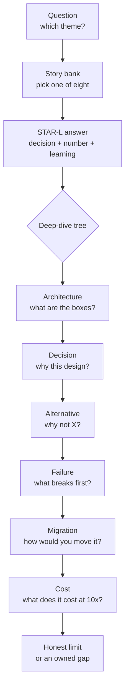

# Behavioural Stories and Project Deep Dives

> **Interview answer (say this first).** The non-coding half of a senior interview is prepared, not improvised. I keep a **story bank** of eight real events from my work, each written in **STAR-L** — Situation, Task, Action, Result, Learning — with a real number in the result and one honest learning at the end. I keep a **deep-dive question tree** for two projects, so I can answer “why not X?”, “what breaks first?”, and “how would you migrate?” without hesitating. I answer with my decisions, not the team’s, and I always stop at the result and the learning.

> **Note: Honest by design.** This page contains no runnable code. Every number in the examples is illustrative; use your own, and never claim one you cannot defend in a follow-up.

> **How this page relates to the rest of the phase.** [Behavioural interviews](12-behavioral-interviews.md) and [Project deep dives and architecture walkthroughs](13-project-deep-dives-and-architecture-walkthroughs.md) teach the questions; this page packages your answers into a bank you can rehearse, and adds the hostile follow-up tree.

## Why this exists

An engineer I will call Dana passed every coding round. In the behavioural round the interviewer asked, “Tell me about the migration you led.” Dana talked for six minutes: the vendor evaluation, the meetings, the weekend cutover. She never said what changed, never gave a number, and never named a decision she personally made. When the interviewer asked “Why did you not stay on the old platform?”, she said “It was the direction from above.” When asked “What breaks first if traffic doubles?”, she paused and said “We would scale it.” She was rejected — not for lack of skill, but because the interview could not find a single decision she owned.

That is the failure this page prevents. It has predictable shapes:

- **Rambling without a result.** A story that ends at “and then we shipped it” gives the interviewer nothing to score.
- **No decision of your own.** “We decided” hides you. An answer full of “we” reads as no ownership.
- **Cannot answer “why not X?” about your own project.** If you cannot name the alternative you rejected and the reason, the interviewer concludes you inherited the design rather than chose it.
- **Cannot answer “what breaks first?”** This question separates people who ran a system from people who only built the happy path.
- **A failure story with no change afterwards.** “I learned a lot” is not a lesson. A senior interviewer wants the habit you adopted.
- **Overselling.** One follow-up about measurement or cost exposes a story that was never real.

The non-coding half is the cheapest part of the interview to prepare and the easiest to lose. A story bank and a deep-dive tree turn it into recall instead of improvisation.

> **The one-sentence purpose.** Prepare eight real stories and one project tree, so every answer ends with a result and a learning that you can defend.

## Start from zero

Assume you have never prepared this material. Here are the words this page keeps using.

| Word | Plain meaning |
| --- | --- |
| **Behavioural question** | A question that asks for a past example (“tell me about a time…”) rather than a hypothetical or a definition. |
| **STAR** | Situation, Task, Action, Result — a simple order for telling a work story. |
| **STAR-L** | STAR plus **Learning**: the one sentence about what you would do differently, or what you now do by default. |
| **Story bank** | Your prepared set of eight real examples, each reusable for several different questions. |
| **Signal** | The evidence the interviewer writes down and scores — one decision, one number, one lesson. |
| **Ownership** | Taking responsibility for an outcome, including a bad one, instead of describing what “we” or “they” did. |
| **Conflict** | A disagreement about work (a design, a priority, a deadline), not a personality clash. |
| **Ambiguity** | A goal, requirement, or dataset that is unclear, so you must choose a path without full information. |
| **Influence without authority** | Getting people who do not report to you to change what they do. |
| **Failure** | A real mistake with a real cost, which you detected, contained, and learned from. |
| **Mentoring** | Helping another person grow — reviewing their work, pairing, or unblocking them — and being able to show the effect. |
| **Measurable impact** | A change stated as a number (latency, cost, error rate, adoption) over a time frame, not an adjective. |
| **Deep dive** | An interview where you explain one project in detail and defend its design decisions. |
| **Trade-off** | What you gave up to get something else — for example, freshness for cost, or speed for safety. |
| **“Why not X?”** | The interviewer’s question about an option you did *not* choose. It tests whether the choice was reasoned. |
| **“What breaks first?”** | The question about the first component to fail as load, data, or traffic grows. It tests intuition for limits. |
| **Migration** | A planned move from one system, schema, or provider to another while the service keeps running. |
| **Follow-up tree** | The chain of deepening questions after your first answer. The tree, not the first answer, is the real interview. |
| **Mock interview** | A full rehearsal with another person (or a recording) who asks the hostile follow-ups you did not prepare. |
| **Self-review** | Listening back to your own recording and scoring it against a checklist before the real interview. |

Two distinctions matter most:

- **Team outcome versus your action.** The team shipped the feature; *you* proposed the canary and brought the eval that delayed the launch by one day. The second sentence is the signal.
- **Result versus learning.** The result proves impact; the learning proves you can repeat or improve it. Senior interviews want both, and the learning is often what decides the offer.

## The core idea

Think of a library and a tree. The **story bank** is the library: eight real events, indexed by theme, so you can pull the right one in two seconds. The **deep dive** is the tree: the interviewer asks about your architecture, then a decision, then the alternative, then failure, then migration, then cost — walking down until you either show judgement or run out of answers.

The first answer is only the entrance to the tree. The tree is where you are scored.



A **story bank** is a table: each real event mapped to the themes it can answer, the signal it carries, and the metric that makes it credible.

| Theme | Story | Signal (the decision) | Metric |
| --- | --- | --- | --- |
| Failure | Uncapped retry caused a 40-minute outage | I removed the retry and added a circuit breaker (a switch that stops calls to a failing dependency) | 8% of requests affected, 40 minutes |
| Conflict | Senior engineer wanted to ship without an eval gate | I brought data instead of arguing, proposed a canary | 48-hour canary caught a second issue |
| Ambiguity | “Make the assistant smarter” with no data | I defined success and built a 150-case golden set | Escalations down 12% |
| Leadership | Three “top priorities”, one team of four | I published the trade-off and cut one item | Met the hard deadline; P95 down 30% |
| Mentoring | A junior engineer owned their first production change | I paired on the runbook and let them lead the rollout | Ramp-up from 3 months to 6 weeks |
| Impact | Retrieval quality was unreliable | I built the retrieval pipeline and the eval gate | Faithfulness 0.81 → 0.94 on 200 cases |
| Disagreement | Two teams wanted different retry policies | I wrote one standard and proved it with a game day | Error rate down, one policy adopted org-wide |
| Migration | Tenant data migration with no downtime | I planned a dual-write, a compatibility window, and a rollback | Cutover with zero downtime; rollback tested |

The **deep-dive question tree** is the order the interviewer walks. Prepare an answer for every level, because each level is a question you will be asked.

| Level | Question | What a strong answer contains |
| --- | --- | --- |
| 1. Architecture | “Draw the boxes.” | A five-box diagram with labelled arrows, not twenty boxes. |
| 2. Decision | “Why this design?” | Context, the constraint that drove it, the cost you accepted. |
| 3. Alternative | “Why not X?” | The rejected option, the reason, and the condition that would flip it. |
| 4. Failure | “What breaks first?” | The first bottleneck under 10x load and the mitigation. |
| 5. Migration | “How would you migrate off it?” | A staged plan that keeps serving traffic. |
| 6. Cost | “What does it cost at 10x?” | Cost per request, the dominant line item, and the lever. |

**Every answer ends with a result and a learning.** The result is the number that proves impact; the learning is the sentence that proves growth. A story with a result but no learning reads as luck. A story with a learning but no result reads as an opinion. You need both, in that order.

## How it works

1. **List the themes interviewers probe.** Seven cover almost everything: **failure, conflict, ambiguity, leadership, mentoring, impact, and disagreement**. Related themes — prioritisation, incident handling, and learning — reuse the same stories with a different emphasis.
2. **Map eight real stories to them.** Write the short name of each event and tick every theme it can answer. Eight stories with overlap beat twenty that are each used once.
3. **Write each story in STAR-L.** Situation in two sentences, Task as a tension, Action in “I” voice, Result as a number, Learning as one sentence. If you cannot write the number, the story is not ready.
4. **Put a number in every result.** Latency, cost, error rate, adoption, time saved, or incident duration. If you truly have no number, say so honestly and give the clearest qualitative outcome — “we did not have a clean metric; the change removed a weekly manual step.”
5. **Rehearse out loud and time each story.** Target 60–120 seconds. Reading silently is not rehearsal; your mouth needs the reps, and the timer stops rambling.
6. **Prepare the project deep dive from memory.** Close the slides and draw the architecture on a blank page. If you cannot draw it from memory, you cannot explain it under pressure.
7. **State three numbers for the deep dive.** Scale (QPS — queries per second — or data size), latency (P95, the 95th-percentile response time), and cost (per request). These three answer “is this a toy or a production system?” before the interviewer asks.
8. **Name one decision you would change.** Prepare one concrete improvement, ideally one you have already applied. “I would shard the index per tenant from day one” beats “nothing.”
9. **Build the “why not X?” and “what breaks first?” answers.** For each major decision, write the rejected alternative, the reason, and the condition that would flip it. For the system, write the first bottleneck and the next one.
10. **Practise hostile follow-ups, then record and self-review.** Have someone chain the hard questions: “what breaks first?”, “how would you migrate?”, “what if the provider doubles the price?” Record the answer, score it against the checklist in the examples, and fix the weakest line before the real interview.

The delivery test: **can the interviewer write down one decision you made, one number, and one thing you learned?** If not, the story was too vague.

## The syntax you will use

These are the forms that make the material reusable. Adapt them to your own history.

**A STAR-L story template.** Five labelled lines; the last two are the ones candidates forget.

```text
Situation: [where, when, scale] — two sentences maximum.
Task:      [the tension or constraint] — one sentence.
Action:    I [considered options] and chose [X] because [reason].
           I [did the concrete work] and [influenced whom to do what].
Result:    [number] changed from [before] to [after] over [time frame].
Learning:  I now [habit], or next time I would [specific change].
```

A filled version, so the shape is clear:

```text
Situation: Our checkout service ran on hand-managed VMs; a bad deploy took
40 minutes to roll back.
Task: I had ten weeks and one other engineer to move it to containers
without missing the Black Friday freeze.
Action: I chose a managed Kubernetes cluster over self-hosted because we had
no platform team. I moved one low-risk service first and used its numbers
to convince the payments team to move next.
Result: Rollback fell from 40 minutes to 90 seconds; we shipped three times
more often that quarter with no rise in incidents.
Learning: I now migrate the smallest service first and use its numbers to win
the next team, instead of writing a plan for everyone at once.
```

**A story-bank table.** One row per story; tick the themes it can answer. This is your index under pressure.

| Story | Failure | Conflict | Ambiguity | Leadership | Mentoring | Impact | Disagreement |
| --- | --- | --- | --- | --- | --- | --- | --- |
| Uncapped retry outage | ✓ | | ✓ | | | ✓ | |
| Eval-gate disagreement | | ✓ | | ✓ | | ✓ | ✓ |
| Vague assistant goal | | | ✓ | ✓ | | ✓ | |
| Three priorities, one team | | | | ✓ | | ✓ | |
| Junior engineer’s first release | | | | | ✓ | ✓ | |
| Retrieval quality project | | | | | | ✓ | |
| Retry-standard debate | | ✓ | | ✓ | | | ✓ |
| Data migration cutover | ✓ | | ✓ | ✓ | | ✓ | |

Build the grid from your own history and check that every theme has at least two rows. Eight stories cover almost every question.

**A deep-dive question tree.** The order the interviewer walks, with the answer you prepare at each level.

```text
Architecture  -> "A gateway, a retrieval service, Postgres+pgvector, a reranker,
                  and the model API behind a queue for re-indexing."
Decision      -> "Managed model API over self-hosting: spiky load, no GPU on-call."
Alternative   -> "Why not fine-tune? Knowledge changes weekly; only 300 labels."
Failure       -> "What breaks first? The shared Postgres write path at ~2 QPS."
Migration     -> "How would you move off pgvector? Dual-write, shadow reads,
                  compare recall, then cut over per tenant."
Cost          -> "About $0.004/query; generation is 60%. Cache and small-model routing."
```

**A hostile follow-up drill.** Say each question out loud to a partner, or to a recorder, and answer without notes.

```text
1. "Why not X?"                 -> rejected option + reason + flip condition
2. "What breaks first?"         -> first bottleneck + mitigation
3. "How would you migrate?"     -> dual-write, verify, cut over, roll back
4. "What if the price doubles?" -> levers: cache, smaller model, provider swap
5. "What would you change?"     -> one concrete improvement you have applied
```

**A self-review checklist.** Score a recorded answer against each line; fix the lowest.

```text
[ ] One real event, not a summary of a role.
[ ] A tension: "we had to choose between X and Y".
[ ] "I" for decisions, "we" for team execution.
[ ] A number in the result, or an honest "we had no clean metric".
[ ] One learning sentence at the end.
[ ] Under 120 seconds; no apology or filler at the start.
[ ] Survives "why not X?" and "what breaks first?" without notes.
```

## Examples: simple to real

**Example 1 — a weak story versus a strong STAR-L story.** The weak version is the kind Dana told. It has motion but no decision, no number, and no learning.

```text
Weak:
"We migrated our service to Kubernetes. It was a big project with a lot of
stakeholders. We had many meetings and eventually we moved everything.
It went well and I learned a lot."
```

The strong version answers the same question but every line carries signal:

```text
Situation: Our checkout service ran on hand-managed VMs; a bad deploy took
40 minutes to roll back.
Task: I had ten weeks and one other engineer to move it to containers
without missing the Black Friday freeze.
Action: I chose a managed Kubernetes cluster over self-hosted because we had
no platform team. I wrote the rollback runbook and moved one low-risk service
first, then used its numbers to win over the payments team.
Result: Rollback fell from 40 minutes to 90 seconds; deploys tripled with no
rise in incidents.
Learning: I now migrate the smallest service first and let its numbers make
the argument for me.
```

The difference is three things: a named choice (“managed over self-hosted”), a number in the result (40 minutes → 90 seconds), and a learning that changed a habit.

**Example 2 — eight stories mapped to seven themes.** This is what a prepared bank looks like on one page. You read the row, not a script.

| # | Story | Failure | Conflict | Ambiguity | Leadership | Mentoring | Impact | Disagreement |
| --- | --- | --- | --- | --- | --- | --- | --- | --- |
| 1 | Uncapped retry caused a 40-minute outage | ✓ | | ✓ | | | ✓ | |
| 2 | Disagreed on shipping without an eval gate | | ✓ | | ✓ | | ✓ | ✓ |
| 3 | “Make the assistant smarter” with no data | | | ✓ | ✓ | | ✓ | |
| 4 | Three priorities, one team of four | | | | ✓ | | ✓ | |
| 5 | Junior engineer’s first production release | | | | | ✓ | ✓ | |
| 6 | Retrieval pipeline and eval gate | | | | | | ✓ | |
| 7 | Two teams, one retry policy | | ✓ | | ✓ | | | ✓ |
| 8 | Tenant data migration with no downtime | ✓ | | ✓ | ✓ | | ✓ | |

Seven themes, eight stories, and every theme is covered — most have two or more options. If one story feels thin under questioning, you swap in another rather than stretch it.

**Example 3 — a four-level “why not X?” drill.** The interviewer keeps asking “why not” until you either show reasoning or run out. Each level needs a reason and the condition that would change your mind.

```text
Decision: we used Postgres full-text search plus embeddings, not a vector database. (If you want BM25 ranking specifically, note that Postgres needs an extension such as ParadeDB's `pg_search`; stock full-text search uses `ts_rank`.)

Level 1 — "Why not dense vectors alone?"
  Because product codes and error strings must match exactly; embeddings miss them.
  Flip if: queries become purely semantic and codes disappear from the workload.

Level 2 — "Why not a dedicated vector database?"
  Our index was under 10 million vectors and we already ran Postgres; one less
  system to operate for a team of two.
  Flip if: the index passes ~50 million vectors or recall drops below target.

Level 3 — "Why not Elasticsearch?"
  It would add a second cluster and a second query language for the same benefit.
  Flip if: we needed faceting, highlighting, and log search in the same place.

Level 4 — "Why not build your own index?"
  Index maintenance is a full-time specialism; no user value in owning it.
  Flip if: licensing or residency rules forbade every managed option.
```

Four levels, four reasons, four flip conditions. The flip conditions are what make the answer sound reasoned rather than dogmatic.

**Example 4 — a hostile follow-up chain and a calm answer.** The interviewer is not being cruel; they are walking the tree. Short, prepared answers beat long, defensive ones.

```text
Q: "What breaks first if traffic grows 10x?"
A: "The shared Postgres. Retrieval pods scale horizontally to about 40, but the
   write path for re-indexing is single-node. I would shard by tenant and move
   re-indexing to a streaming pipeline with backpressure."

Q: "How would you migrate off the current index without downtime?"
A: "Dual-write to both indexes, run shadow reads and compare recall, cut over
   tenant by tenant, and keep the old index warm until the last tenant moves.
   Rollback is switching the read flag back per tenant."

Q: "What if the model provider doubles the price?"
A: "Cost is about $0.004 per query and generation is 60% of it. I would raise
   the cache hit rate, route easy queries to a smaller model behind the same
   eval gate, and qualify a second provider in parallel. I would not cut
   quality blindly; the eval gate decides whether a cheaper route ships."
```

Three questions, three answers with a number or a concrete control. Calm, specific, no defensiveness.

**Example 5 — a recorded self-review checklist.** Record a two-minute answer on your phone, listen back once, and score it. The point is to find the weakest line, not to feel good or bad.

```text
Recording: "Failure story — uncapped retry"  Attempt: 3   Duration: 1:48

[✓] Real event, not a role summary.
[✓] Tension stated: "reduce errors without causing an outage".
[✓] "I" for the decision, "we" for the team's response.
[✓] Number in the result: 40 minutes, 8% of requests.
[✗] Learning was vague: "I learned to be careful." -> rewrite:
     "I now retry at one layer with a budget and jitter, and I test the
      failure path before shipping resilience code."
[✓] Under 120 seconds.
[ ] Next: record the "why not X?" follow-up for the same story.
```

The learning line was the weak point, so the next attempt fixes only that. Self-review is how the story gets shorter and sharper over repetitions.

## In production

- **Every story ends with a result and a learning.** The result proves impact; the learning proves growth. Missing either one halves the signal.
- **Use numbers, not adjectives.** “Big migration” scores nothing; “rollback fell from 40 minutes to 90 seconds” scores. One real number beats ten superlatives.
- **Prepare eight stories that cover the themes.** Failure, conflict, ambiguity, leadership, mentoring, impact, disagreement. Check that each theme has at least two rows.
- **One story can answer several questions.** An incident story answers failure, ambiguity, leadership, and prioritisation by changing the emphasis, not the facts.
- **The deep dive is about your decisions, not the framework.** The interviewer does not care that you used Kafka; they care why you chose it and what it cost.
- **Always name the alternative you rejected.** “We chose X over Y because Z, accepting cost C” is the sentence that proves a real choice.
- **Be ready for “what breaks first?” and “how would you migrate?”.** These two questions appear in almost every senior deep dive. Prepare them before the interview, not during it.
- **A failure story must show what changed afterwards.** Name the new alert, the runbook, the test, or the habit. A lesson without a behaviour change is a slogan.
- **Rehearse out loud and record it.** Your mouth needs the reps and the timer catches rambling. Reading a story silently is not rehearsal.
- **Never claim a result you cannot defend.** A follow-up about how you measured it will expose a invented number, and credibility is scored across the whole interview.
- **The follow-up tree is the real interview.** The first answer is the entrance; the score comes from how far down the tree you can keep answering with specifics.
- **Honesty about a limitation reads as senior.** Naming what your system cannot do — and how you route around it — is more convincing than claiming there is no limit.

> **The honesty test.** If the interviewer asked “how do you know?”, would your answer survive? If not, soften the claim or drop it. Credibility compounds across every answer.

## Interview questions

### 1. Tell me about yourself in two minutes.

**Answer.** Open the story bank with a short thread, not a résumé. Name your current scope, one project that shows your strengths, and the kind of work you want next. Use the elevator pitch from a deep dive: the problem, your role, and one number. Keep it to 90 seconds and let the interviewer steer.

**Follow-up: “Which part of that was yours?”** Be precise. Name what you designed or built and what a teammate owned. Specific ownership is stronger than a broad claim.

**Trap.** Reciting a chronology of every job. The question is asking for a thesis about your work, not a timeline.

### 2. Tell me about a failure.

**Answer.** Pick a real mistake with a real cost, and own it. State what you were trying to do, the decision you made, what went wrong, how you detected and contained it, and — most importantly — what changed afterwards. A production mistake is a fine choice if the learning is concrete.

**Follow-up: “What was the impact, and when did you tell people?”** Answer honestly about who was affected and how quickly you raised it. Hiding impact is worse than the impact itself.

**Trap.** A fake failure such as “I worked too hard” or “I cared too much”. Interviewers hear it instantly and stop trusting the rest of the interview.

### 3. Tell me about a conflict with a colleague.

**Answer.** Choose a work disagreement, not a personality clash. State what each side wanted and why, then describe how you moved it forward: data, a small experiment, a middle path, or a clear escalation. End with the outcome and what you changed in your own approach. If the other person was right, say so.

**Follow-up: “What if they had still disagreed?”** Describe the time-boxed experiment, the documented decision, or the escalation to whoever was accountable. Disagreement is normal; unresolved stalling is not.

**Trap.** Making the colleague the villain. The interviewer is testing your self-awareness, not your argument.

### 4. Why did you choose X over Y in that project?

**Answer.** Give the context and the constraint that drove the choice, the option you rejected, and the cost you accepted. Then name the condition that would flip the decision — for example, “if the index passed 50 million vectors, I would move to a dedicated store.” That shows the choice was reasoned, not inherited.

**Follow-up: “When would you choose Y instead?”** Answer with a threshold: volume, a stable format, a residency rule, or a cost ceiling. A condition proves you understand both options.

**Trap.** Describing only the chosen option. Without the rejected alternative, the answer sounds like a preference, not a decision.

### 5. What breaks first if the load grows ten times?

**Answer.** Start from today’s numbers, multiply, and name the first bottleneck: the shared database, the write path, the model quota, or the cache. Give the mitigation and then the next bottleneck after it. “It scales horizontally” is a property, not an answer.

**Follow-up: “What does 10x cost?”** Estimate from your cost per request and say which layer dominates. Cost scaling is part of scaling, not a separate topic.

**Trap.** Claiming there is no bottleneck. Every real system has a first bottleneck; finding it is the skill.

### 6. How would you migrate this system without downtime?

**Answer.** Describe a staged plan: dual-write to the old and new systems, run shadow reads and compare results, cut over a small slice first, then move the rest gradually. Keep a rollback path — a per-tenant read flag is cheap insurance. Name what you would verify before the full cutover.

**Follow-up: “What is the riskiest step?”** Usually the data backfill or the dual-write consistency window. Say how you would detect a divergence and how you would pause the migration safely.

**Trap.** “We would take a maintenance window.” For a senior role that is often the wrong answer; the question is testing whether you can migrate a live system.

### 7. Tell me about a time you mentored someone.

**Answer.** Choose a specific person and a specific outcome. Describe what they could not do at the start, what you did (paired, reviewed, gave them the runbook and let them lead), and how you measured progress — ramp-up time, a release they shipped, or a review they now own.

**Follow-up: “What did you change in how you mentored them?”** Admit one early mistake, such as explaining instead of letting them try. The adjustment is the signal.

**Trap.** Describing a team you managed. Mentoring is about growing one person, and it works even when you have no reporting line.

### 8. What do you do when a follow-up exposes something you did not prepare?

**Answer.** Say so plainly and reason out loud. “I did not measure that at the time; here is what I would measure now and why.” Then give the honest limit. Interviewers prefer a candidate who can reason under an unprepared question to one who invents an answer.

**Follow-up: “So what would you go and find out?”** Name the metric, the query, or the experiment you would run. Turning “I don’t know” into a plan is a senior behaviour.

**Trap.** Bluffing. A confident-sounding invented number collapses at the next question and costs you every earlier answer.

## Remember this

- **One real story, told small:** situation, tension, my action, a number, a learning. Every answer ends with a result and a learning.
- **Eight stories cover seven themes.** Failure, conflict, ambiguity, leadership, mentoring, impact, disagreement — check that each theme has at least two rows.
- **The deep dive rewards decisions, not components.** For every choice, name the alternative you rejected and the condition that would flip it.
- **Prepare “why not X?”, “what breaks first?”, and “how would you migrate?”** before the interview. The follow-up tree is the real interview.
- **Rehearse out loud, record it, and self-review.** Never claim a result you cannot defend; naming an honest limitation reads as senior.
