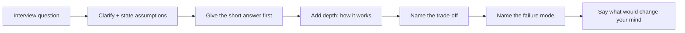

# Phase 13 — Interview Preparation

This phase is different from the others. It does not teach new material; it is a revision and rehearsal layer over everything you have already read. Its job is to turn knowledge into answers you can deliver under pressure.

Every page is a question bank organised by interview type, with model answers, follow-ups, and the traps interviewers use to separate people who memorised a definition from people who understand the system. Where an answer needs depth, it points back to the phase that taught it.

## How to use this phase

- **Answer first, then check.** Read the question, say your answer out loud, then read the model answer. The gap you feel is the thing to revise.
- **Follow the pointer.** If a question exposes a weak topic, go back to the phase page rather than memorising the answer here.
- **Practice the structure.** Most technical answers should follow requirements → design → trade-off → failure mode. Most behavioural answers should follow situation → action → result.
- **Rehearse out loud.** Reading an answer is not the same as saying it. The interview tests delivery, not recognition.

## What you will be able to do

By the end of this phase you should be able to:

- Answer Python coding and internals questions, and solve coding problems cleanly.
- Handle backend interviews: FastAPI, SQL, PostgreSQL, Redis, and REST API design.
- Discuss backend architecture, distributed systems, Kafka, microservices, and event-driven design.
- Answer infrastructure questions on Docker, Kubernetes, and AWS.
- Run a system-design interview, and separate low-level from high-level design.
- Explain LLM fundamentals, transformers, and embeddings.
- Discuss RAG architecture, debugging, and evaluation.
- Explain agent architecture and LangGraph.
- Discuss MCP and multi-agent architecture.
- Answer AI security, observability, and evaluation questions.
- Discuss AI platform architecture, model serving, cost, reliability, and trade-offs.
- Handle behavioural questions with clear, honest stories.
- Walk through your projects and architecture decisions confidently.

## The answer pattern

Almost every strong technical answer follows that shape. It is the same loop you used in Phase 11, compressed into a few sentences.

## Topic order

1. [Python coding interviews and internals](01-python-coding-interviews-and-internals.md).
2. [Backend interviews: FastAPI, SQL, PostgreSQL, Redis, REST](02-backend-interviews-fastapi-sql-postgres-redis-rest.md).
3. [Backend architecture, distributed systems, Kafka, microservices, events](03-backend-architecture-distributed-kafka-microservices-events.md).
4. [Infrastructure interviews: Docker, Kubernetes, AWS](04-infrastructure-interviews-docker-kubernetes-aws.md).
5. [System design, low-level design, and high-level design](05-system-design-lld-and-hld.md).
6. [LLM fundamentals and transformer questions](06-llm-fundamentals-and-transformer-questions.md).
7. [RAG interviews: architecture, debugging, evaluation](07-rag-interviews-architecture-debugging-evaluation.md).
8. [Agent and LangGraph interviews](08-agent-and-langgraph-interviews.md).
9. [MCP and multi-agent interviews](09-mcp-and-multi-agent-interviews.md).
10. [AI security, observability, and evaluation](10-ai-security-observability-and-evaluation.md).
11. [AI platform, serving, cost, and reliability](11-ai-platform-serving-cost-and-reliability.md).
12. [Behavioural interviews](12-behavioral-interviews.md).
13. [Project deep dives and architecture walkthroughs](13-project-deep-dives-and-architecture-walkthroughs.md).
14. [Timed coding, SQL, and debugging drills](14-timed-coding-sql-and-debugging-drills.md) — practising the timed parts with a rubric.
15. [Backend and distributed system design drills](15-backend-and-distributed-system-design-drills.md) — ten prompts and a 45-minute method.
16. [AI system design and incident drills](16-ai-system-design-and-incident-drills.md) — designing and debugging AI systems under questioning.
17. [Behavioural stories and project deep dives](17-behavioral-stories-and-project-deep-dives.md) — a reusable story bank and a hostile follow-up tree.

> **The one rule.** Never answer with a definition alone. Say what it is, why it exists, what it costs, and when it breaks. That is the difference between a candidate who read a book and one who has run a system.

## Checkpoint and evidence

Complete this checkpoint before moving on. It follows the [competency and evidence contract](../projects/competency-evidence.md) — **learn → build → measure → break → explain**. The artifact is the proof; the explanation is the interview rehearsal.

| Step | Artifact | Pass condition |
| --- | --- | --- |
| **Build** | `artifacts/phase-13/` — 30 timed coding solutions, 15 SQL problems, 10 backend/distributed design drills, 10 AI system-design drills, and 8 behavioural stories. | Every drill has a prompt, a time limit, and a rubric. |
| **Measure** | Timed scores against the rubrics across repeated attempts. | You improve across repetitions, not on one lucky attempt. |
| **Break** | Hostile follow-ups: “why not X?”, “what breaks first?”, “how would you migrate?” | You answer with a trade-off and a failure mode. |
| **Explain** | A recorded five-minute project presentation and a recorded system-design answer. | The walkthrough links to your own artifacts and survives the question tree. |

> **Evidence tip.** Keep the artifact in your own repository and record it in the [checkpoint record](../projects/competency-evidence.md#the-checkpoint-record). If the artifact does not exist, the phase is not finished.
