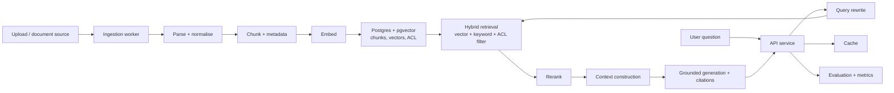

# Project 1 — Production Enterprise RAG Engine

> Build a retrieval-augmented generation service that answers questions over an enterprise document corpus, cites its sources, and respects document permissions.

## Goal

Prove you can build the retrieval half of an AI product properly. The model is a small part; the work is ingestion, retrieval quality, access control, citations, and measurement. By the end you should be able to answer, with numbers, "why does this answer say that?" and "what does it cost per query?"

## What you will build

A service that:

- ingests PDF, DOCX, and HTML documents, normalises the text, and stores it in chunks;
- embeds the chunks and indexes them for both semantic and keyword search;
- answers a question by retrieving, reranking, and generating a grounded answer with citations;
- enforces per-user document permissions so a user never sees content they are not allowed to;
- exposes an evaluation endpoint and a small labelled dataset so quality is a number, not an opinion.

## Functional requirements

- **Ingestion.** Accept uploads (or a watched directory), extract text, detect and handle scanned pages, record source metadata (title, author, dates, ACL).
- **Normalisation.** Consistent Unicode, whitespace, and hyphenation handling; reject or flag empty/oversized files.
- **Chunking.** A configurable strategy (at minimum recursive, with parent-child as a stretch); store chunk text, position, and parent reference.
- **Embeddings.** A configured embedding model; store vectors with the model identity so a model change is detectable.
- **Retrieval.** Hybrid search combining vector similarity and keyword search, merged by rank fusion; metadata filters (date, source, type).
- **Access control.** Retrieval filters by the caller's permissions *before* ranking returns results; a permitted-only result set.
- **Reranking.** A second-stage reranker over the top candidates.
- **Query handling.** Rewrite follow-up questions into standalone queries.
- **Generation.** Grounded answers with inline citations to chunk ids; abstain when the retrieved evidence is insufficient.
- **Versioning.** Re-ingesting changed documents supersedes old chunks without breaking in-flight queries.
- **Caching.** Cache embeddings and repeated query results.
- **Evaluation.** A labelled question set with known relevant documents, and a command that prints retrieval and answer metrics.

## Non-functional requirements

- **Latency.** State a target (for example, p95 under 3 seconds excluding generation) and measure it per stage.
- **Cost.** Report cost per query from your own token usage; show that caching and routing reduce it.
- **Isolation.** Two tenants cannot retrieve each other's content; demonstrate this with a test.
- **Reliability.** A failing model or vector search degrades gracefully (keyword-only fallback) rather than erroring.
- **Observability.** One trace per request covering embed, search, rerank, and generate; a metrics endpoint.
- **Security.** Credentials from the environment; no document text in logs.

## Suggested architecture

## Suggested stack

- **Language:** Python, FastAPI for the service.
- **Data:** PostgreSQL with pgvector; a queue or background worker for ingestion.
- **Cache:** Redis.
- **Models:** one embedding model and one generation model, behind a small provider adapter so you can swap them.
- **Local run:** Docker Compose for Postgres, Redis, and the service.

## Data model sketch

| Store | Holds | Notes |
| --- | --- | --- |
| `documents` | source, title, version, hash, ACL | one row per document version |
| `chunks` | text, position, parent id, document id, embedding | delete/supersede on re-ingest |
| `queries` (optional) | question, answer, retrieved ids, latency, cost | for offline analysis |
| vector index | embeddings | one per embedding model version |

## Milestones

1. **M0 — Skeleton.** Service runs, health endpoint, config from environment, Compose stack.
2. **M1 — Ingestion.** Upload a PDF/DOCX/HTML, parse, chunk, store; show the chunks.
3. **M2 — Retrieval.** Embed, store vectors, and run dense search; then add keyword search and fusion.
4. **M3 — Generation.** Rerank, build context, generate an answer with citations; abstain when evidence is weak.
5. **M4 — Access control.** Per-user permissions enforced at retrieval; a leak test that fails if isolation breaks.
6. **M5 — Evaluation.** Labelled set, retrieval metrics (recall@k, MRR, NDCG), faithfulness, and a repeatable eval command.
7. **M6 — Hardening.** Caching, versioning, graceful degradation, tracing, cost report, README and ADRs.

## Acceptance criteria

- [ ] One documented command brings up the whole stack locally.
- [ ] I can ingest 100+ documents and query them.
- [ ] Answers include citations that actually support the claims (spot-check ten).
- [ ] The system abstains or says "not enough evidence" for out-of-corpus questions.
- [ ] A cross-tenant retrieval test passes: a user cannot retrieve another tenant's chunks.
- [ ] The eval command prints retrieval and answer metrics against a labelled set.
- [ ] A trace shows time spent in embed, search, rerank, and generate.
- [ ] I can state the cost per query and show caching reduces it.
- [ ] Killing the model call still returns keyword-only results rather than a 500.

## Stretch goals

- Parent-child chunking and small-to-big retrieval.
- HyDE or multi-query retrieval, measured against the baseline.
- Knowledge-base versioning with blue/green index swaps.
- A tiny UI for upload and chat.

## What to document

- README: setup, architecture, and the eval command.
- Two ADRs: your chunking strategy and your hybrid-search fusion choice.
- A one-page cost and latency report from your own measurements.

## How to build it, step by step

Build the thinnest end-to-end path first: one document in, one grounded answer with a real citation out. Everything else (hybrid search, reranking, ACLs, evaluation) is an upgrade to a slice that already works. This order keeps retrieval quality and permissions measurable instead of hypothetical.

1. Create the repository: a Python + FastAPI skeleton with `pyproject.toml`, lint/format/test commands, and config loaded from the environment.
2. Bring up PostgreSQL with pgvector and Redis with `docker compose`, and make one documented command start the stack.
3. Write the schema migration for `documents`, `chunks`, and the optional `queries` table; enable the vector extension.
4. Define the domain types and config: chunking parameters, embedding model id, retrieval `k`, and the ACL shape attached to a document.
5. Build the smallest end-to-end slice: ingest one PDF, parse the text, chunk it recursively, and store the chunks with position and parent reference.
6. Put the embedding model behind a small adapter interface; embed the stored chunks and write vectors next to the chunks, recording the model identity.
7. Run dense (vector) search for a question and return the top-k chunk ids.
8. Generate a grounded answer from those chunks with inline chunk-id citations, and abstain when the evidence is weak.
9. Add keyword search with PostgreSQL full-text and merge it with dense results by rank fusion; make the fusion constant configurable.
10. Add metadata filters (source, date, type) to retrieval.
11. Add query rewriting so follow-up questions become standalone queries.
12. Add a second-stage reranker over the top candidates, and measure the lift against no reranking.
13. Enforce access control: filter retrieval by the caller's permissions before ranking returns results, and write a cross-tenant leak test that fails loudly.
14. Add document versioning: re-ingesting a changed document supersedes old chunks as one atomic step without breaking in-flight queries.
15. Add caching for embeddings and repeated query results; record hits and misses.
16. Add observability: one trace per request spanning embed, search, rerank, and generate, plus a metrics endpoint.
17. Compute cost per query from your own token usage; compare cached versus uncached.
18. Add graceful degradation: keyword-only results when the embedding or model call fails, never a 500.
19. Build the labelled question set and the eval command that prints recall@k, MRR, NDCG, and faithfulness; run it before and after each change.
20. Harden and document last: measure p95 latency per stage, write the README, the two ADRs (chunking and fusion), and the cost/latency report, then re-run the acceptance checks.

> **Build order tip.** Get one document from upload to a cited answer end to end before you add hybrid search, reranking, or ACLs. Every later quality claim is only meaningful once this thinnest slice works.

## Builds on

Phase 1 (Production Python), Phase 3 (RAG Engineering), Phase 7 (AI Platform Engineering), Phase 8 (Evaluation, Observability and Reliability). Reference Phase 13 for how to present it in a deep dive.
