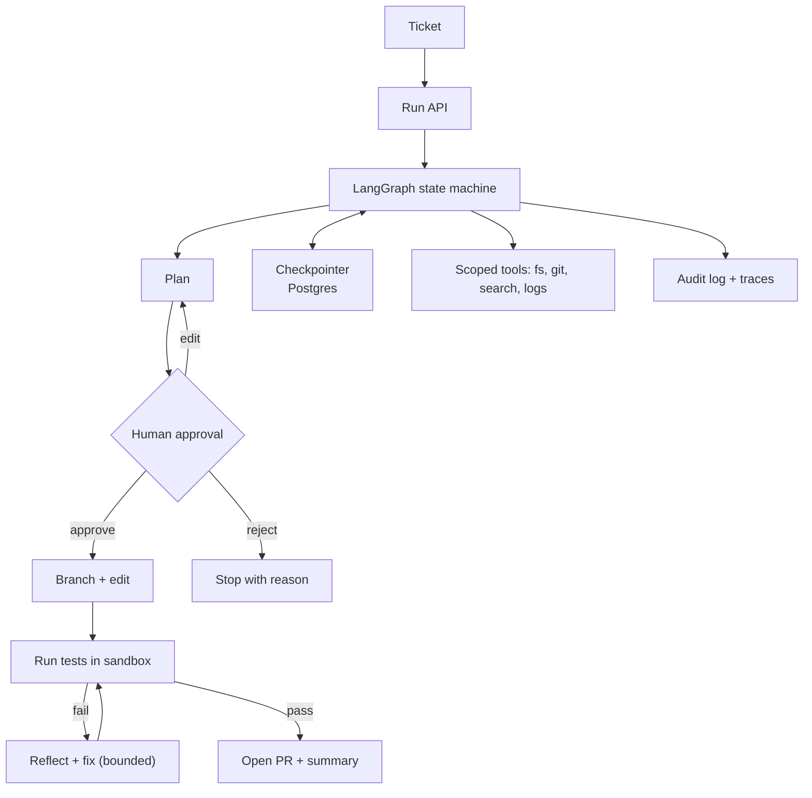

# Project 2 — Autonomous Enterprise Workflow Agent

> Build an agent that takes a work item (a ticket or issue), investigates the codebase and docs, proposes a plan, waits for human approval, makes the change, runs the tests, and opens a pull request.

## Goal

Prove you can run an agent that takes **real, reversible-but-consequential actions** safely. This is the project that tests durable execution, human-in-the-loop, tool permissions, sandboxing, and failure recovery — the parts that separate a demo agent from one you would let near a repository.

## What you will build

An agent that, given a ticket, works through a bounded pipeline:

```text
Ticket
  -> understand the task
  -> search docs and source
  -> inspect history and logs
  -> write an implementation plan
  -> human approval gate
  -> create a branch
  -> change code
  -> run tests
  -> analyse failures and fix
  -> open a pull request
  -> post a summary
```

Every arrow is a checkpoint, and every step is idempotent and resumable.

## Functional requirements

- **Intake.** Accept a ticket reference and fetch its content from your chosen tracker (a GitHub issue is enough).
- **Investigation tools.** Read files, search code, read git history, query logs or monitoring, and read documentation — each as a scoped tool.
- **Planning.** Produce a structured plan (a list of steps with intended files/commands) that a human reviews.
- **Approval gate.** Pause durably for approve / reject / edit; execute the exact approved payload and nothing else.
- **Execution.** Create a branch, apply changes, and run the test suite in a sandbox.
- **Reflection loop.** On test failure, analyse the failure and attempt a bounded number of fixes.
- **Delivery.** Open a pull request with a clear description and post a summary back to the ticket.
- **Resumability.** If the process dies at any step, restarting resumes from the last checkpoint without repeating side effects.
- **Bounded behaviour.** Hard limits on steps, tokens, wall-clock time, and tool calls; a loop detector that stops repeated identical actions.
- **Audit.** Every tool call, approval, and state transition is logged with who, what, when, and the outcome.

## Non-functional requirements

- **Safety.** Tools are least-privilege: a read token for reads, a scoped write token for the branch, no force-push, no merge.
- **Isolation.** Code execution happens in a sandbox with no access to production credentials or the network beyond what the task needs.
- **Idempotency.** Re-running any step does not duplicate a commit, comment, or PR.
- **Observability.** One trace per run with a span per step and tool; a per-run cost and token report.
- **Recovery.** A killed worker leaves the run resumable, not corrupted.
- **Testability.** The agent can run against a disposable demo repository and a mocked tracker.

## Suggested architecture



## Suggested stack

- **Language:** Python.
- **Orchestration:** LangGraph with a persistent checkpointer.
- **State:** PostgreSQL for runs, steps, approvals, and audit.
- **Queue:** a worker queue for long runs (Redis or SQS).
- **Sandbox:** a container per run with a read-only mount and an explicit writable workspace.
- **Integrations:** GitHub API (issues, branches, PRs) and a git CLI, all behind tool adapters.

## Data model sketch

| Store | Holds |
| --- | --- |
| `runs` | ticket, status, current step, budget used, timestamps |
| `steps` | per-step input, output, status, attempts |
| `approvals` | proposed payload, hash, approver, decision, timestamp |
| `effects` | idempotency keys for commits, comments, PRs |
| `audit` | append-only record of tool calls and decisions |

## Milestones

1. **M0 — Skeleton.** Run API, state schema, checkpointer, and a mock ticket.
2. **M1 — Plan only.** The agent investigates read-only tools and produces a plan; nothing is written.
3. **M2 — Approval + branch.** Human approves, the agent creates a branch and a trivial commit.
4. **M3 — Edit + test.** Apply a small change, run tests, and loop on failures with a cap.
5. **M4 — Durable resume.** Kill the worker mid-run and show it resumes without duplicate effects.
6. **M5 — PR + summary.** Open a real PR against a demo repo and post a summary.
7. **M6 — Hardening.** Loop detection, budgets, sandboxing, audit, tracing, cost report, README and ADRs.

## Acceptance criteria

- [ ] A run survives a process kill at any step and resumes correctly.
- [ ] No step can execute twice and create a duplicate commit, comment, or PR (prove it).
- [ ] Approval is bound to the exact payload; changing the payload after approval does not execute the change.
- [ ] The agent stops after the configured step/token/time limits instead of looping.
- [ ] A repeated-action loop is detected and halted with a clear reason.
- [ ] Code execution has no access to production credentials or the public internet beyond the allowlist.
- [ ] Every tool call is visible in a trace and the audit log.
- [ ] I can state the cost of one run and the token budget it respected.
- [ ] A rejected plan stops the run and records why.

## Stretch goals

- Multiple repositories or monorepo path scoping.
- A reviewer agent that critiques the diff before the PR.
- A UI showing pending approvals and run history.
- Learned routing: cheap model for investigation, strong model for planning and fixes.

## What to document

- README: how to run against the demo repo, and the safety model.
- Two ADRs: the graph design (state and edges) and the tool-permission model.
- One page on failure recovery: what happens at each crash point.

## How to build it, step by step

Build the state machine and its checkpointer before any tool writes anything, because durable resume and idempotency are properties of the graph, not features you add later. Build the read-only investigate-and-plan phase first, then the approval gate, then the write path. Leave sandbox hardening, budgets, and audit polish until the end.

1. Create the repository: a Python app with config from the environment, lint/test commands, and a `docker compose` with PostgreSQL and Redis.
2. Define the run and step state schema and sketch the graph nodes and edges on paper; keep the pipeline explicitly bounded.
3. Create the PostgreSQL tables: `runs`, `steps`, `approvals`, `effects`, and `audit`.
4. Wire the checkpointer to PostgreSQL and prove a run persists and resumes from a checkpoint.
5. Add a mock ticket source and a run API (`start`, `status`); get a run from created to a terminal state with no tools at all.
6. Implement the read-only investigation tools (read file, search code, git history, docs) behind scoped adapters using a read-only token.
7. Have the agent produce a structured plan from the ticket and investigation, and store it on the run.
8. Add the approval gate: pause durably, record approve/reject/edit, and resume on the decision.
9. Bind approval to the exact payload hash and demonstrate that a payload changed after approval is not executed.
10. Add the write path: create a branch and apply only the approved changes.
11. Add the execution sandbox: run the test suite in a container with a read-only mount and an explicit writable workspace.
12. Add the bounded reflection loop: on failure, analyse and attempt fixes up to a cap, then stop with a clear reason.
13. Add idempotency keys for commits, comments, and pull requests; prove re-running a step creates no duplicates.
14. Test durable resume: kill the worker at each step, restart, and confirm no repeated side effects.
15. Add loop detection and hard budgets for steps, tokens, wall-clock time, and tool calls.
16. Open a real pull request against a disposable demo repository and post a summary back to the ticket.
17. Add tracing with one span per step and tool, plus the append-only audit log and a per-run cost/token report.
18. Harden and document last: tighten least-privilege tokens and the sandbox network allowlist, write the README, the two ADRs (graph design and tool-permission model), and the failure-recovery page, then re-run the acceptance checks.

> **Build order tip.** Build the graph and its checkpointer before any tool writes anything. Durable resume and idempotency are properties of the state machine, so test them on a trivial run early rather than retrofitting them later.

## Builds on

Phase 1 (Production Python), Phase 4 (Agentic AI Engineering), Phase 5 (MCP and Tool Ecosystems), Phase 6 (Distributed Systems), Phase 8 (Evaluation and Observability), Phase 9 (Security and Governance). Phase 13 covers the project deep dive.
