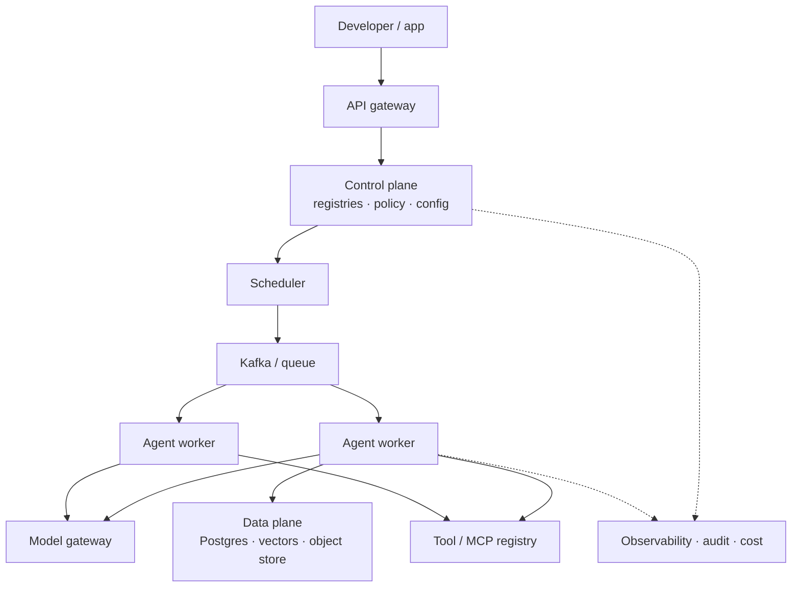

# Project 3 — Open-Source Agent Platform / AI Control Plane

> Build the control plane that lets many teams run many agents: registries, a scheduler, worker pools, a model gateway, and the governance around them.

## Goal

Prove you can design and operate a **platform**, not just an app. This is the project that tests tenancy, versioning, scheduling, policy, cost control, and the control/data/runtime split. It is the most system-design-heavy project in the book.

## What you will build

A platform with two faces:

- a **control plane** where agents, models, tools, prompts, and evaluations are registered, versioned, and governed;
- a **runtime plane** where registered agents are scheduled and executed by worker pools, using the gateway and registries.

The core architecture:

```text
Developers / Applications
          |
        SDK / API
          |
      API Gateway
          |
      Control Plane
          |
  +-------+--------+---------+
  |       |        |         |
Agent   Model    Tool      Prompt
Registry Registry Registry  Registry
  +-------+--------+---------+
          |
       Scheduler
          |
        Kafka
          |
  +-------+--------+
  |       |        |
Agent   Agent    Agent
Worker  Worker   Worker
          |
      Kubernetes
```

## Functional requirements

- **Registries.** Register and version agents, models, tools, MCP servers, prompts, evaluation datasets, and evaluators. Each entry is immutable once published.
- **Agent deployment.** Publish an agent version and route traffic to it; promote between environments.
- **Model gateway.** One API in front of multiple providers with routing, provider abstraction, fallback, load balancing, caching, and per-tenant quotas.
- **Scheduler.** Accept run requests, place them on queues by capability, and track status.
- **Workers.** Execute runs durably, reporting progress, heartbeats, and completion; recover leased work from dead workers.
- **Multi-tenancy.** Per-tenant isolation for data, keys, quotas, and cost attribution.
- **Policy.** RBAC/ABAC decisions and allowlists enforced at the gateway, not in prompts.
- **Evaluation and gates.** Register evaluators; require an eval gate before promoting a version.
- **Observability and audit.** Traces across gateway, scheduler, and workers; an append-only audit log.
- **Cost control.** Token budgets per run/tenant and a cost dashboard.

## Non-functional requirements

- **Scalability.** Workers scale on queue depth; the control plane stays stateless.
- **Availability.** A model or registry outage degrades gracefully, not fatally.
- **Isolation.** A buggy or hostile tenant cannot affect another tenant's runs or data.
- **Reproducibility.** A run records the exact agent, model, prompt, and tool versions used.
- **Governance.** Every promotion is traceable to an approver and an evaluation result.

## Suggested architecture



## Suggested stack

- **Language:** Python.
- **Control plane:** FastAPI, PostgreSQL.
- **Messaging:** Kafka (or a managed equivalent), Redis for caching and quotas.
- **Runtime:** Kubernetes with horizontal pod autoscaling on queue depth.
- **Infra:** Terraform and Helm; container images in a registry.
- **Observability:** OpenTelemetry, Prometheus, Grafana.

## Control-plane data model sketch

| Registry | Key fields |
| --- | --- |
| Agents | name, version, image/config ref, capabilities, owner, status |
| Models | provider, model id, price, limits, health |
| Tools / MCP | server, tool schema, scopes, version |
| Prompts | template, variables, version, eval result |
| Evaluations | dataset version, evaluator, thresholds, result |
| Runs | tenant, agent version, status, cost, trace id |

## Milestones

1. **M0 — Skeleton.** Gateway + control plane + Postgres; register a model and a stub agent.
2. **M1 — Registries.** Create, version, and read back agents, models, and prompts.
3. **M2 — Gateway.** Route a call through the model gateway with fallback and quota.
4. **M3 — Scheduler + worker.** Run an agent end-to-end through a queue with status tracking.
5. **M4 — Durability.** Recover a lost worker's run; prove no duplicate side effects.
6. **M5 — Tenancy + policy.** Per-tenant keys, quotas, cost attribution, and an allowlist decision at the gateway.
7. **M6 — Evaluation gate.** Block promotion of a version that fails its eval threshold.
8. **M7 — Hardening.** Autoscaling, tracing, audit, cost dashboard, IaC, README and ADRs.

## Acceptance criteria

- [ ] I can register a model, a prompt, a tool, and an agent, each with a version.
- [ ] Promoting a version is gated on an evaluation result and is auditable.
- [ ] A run flows gateway -> scheduler -> worker -> gateway -> tool and returns a result.
- [ ] Killing a worker mid-run recovers the run without duplicate effects.
- [ ] Workers scale on queue depth and scale back down.
- [ ] A tenant cannot exceed its token budget, and cannot see another tenant's data or cost.
- [ ] A disallowed tool is refused at the gateway (not by the prompt).
- [ ] A trace shows the full path across gateway, scheduler, and worker.
- [ ] The platform deploys from Terraform + Helm with one documented pipeline.

## Stretch goals

- A self-service portal or CLI for publishing agents.
- Blue-green or canary promotion of an agent version with automatic rollback.
- A shared tool/MCP marketplace with review workflow.
- Chargeback reports per team.

## What to document

- README: architecture, the control/data/runtime split, and how to publish an agent.
- Three ADRs: the registry model, the scheduling and queue design, and the tenancy model.
- A failure-mode table: what happens when the gateway, scheduler, queue, or a worker fails.

## Builds on

Phase 6 (Distributed Systems), Phase 7 (AI Platform Engineering), Phase 9 (Security and Governance), Phase 10 (Model Serving), Phase 11 (AI Systems Architecture), Phase 12 (Multi-Agent Systems).
