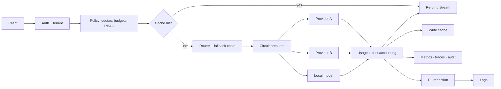

# Project 4 — Production LLM Gateway

> Build one API that fronts every model provider, with routing, fallback, quotas, caching, and observability — the piece every AI product eventually needs.

## Goal

Prove you can build the single chokepoint that makes a multi-provider AI system reliable and affordable. It is a small surface with a lot of depth: every request passes through routing, budgets, retries, caching, and audit. If you build this well, your Project 3 gets much easier.

## What you will build

A gateway that:

- exposes one API (OpenAI-compatible is a good target) that accepts a chat request;
- routes to one of several providers or models by task, cost, latency, tenant, or context length;
- falls back when a provider fails, and opens a circuit breaker when it is unhealthy;
- enforces per-tenant token quotas and cost budgets;
- caches responses (exact and semantic) and streams tokens to the caller;
- records usage and cost per tenant, model, and request;
- filters PII out of what it logs.

## Functional requirements

- **Unified API.** One request shape; adapters translate to and from each provider.
- **Streaming.** Stream tokens through to the client with correct framing.
- **Routing.** A configurable policy chooses a model; support small-model-first with escalation.
- **Fallback.** On timeout, rate limit, or provider error, try the next candidate; never fall back to a model that violates a hard constraint (region, context, quality floor).
- **Health and circuit breaking.** Track provider health; stop sending traffic to a failing provider for a cooldown.
- **Retries.** Retry only transient errors, with exponential backoff and jitter.
- **Quotas and budgets.** Per-tenant request/token limits and cost budgets checked before the call.
- **Caching.** Exact-match response cache and a semantic cache with a similarity threshold; cache keys include model, version, parameters, and tenant.
- **Usage accounting.** Tokens in/out, cost, latency, and which model served, per request.
- **PII filtering.** Redact configured patterns before logging or storing prompts.
- **Multi-tenancy and RBAC.** Per-tenant keys; scoped access to models and admin functions.
- **Audit.** Who called what, when, with what result.

## Non-functional requirements

- **Latency overhead.** The gateway adds only a small, measured amount over the provider call.
- **Ride through failure.** One provider outage reduces quality or raises latency, but does not take the gateway down.
- **Cost control.** A tenant cannot exceed its budget; a runaway loop is stopped.
- **Correctness of accounting.** Reported tokens and cost reconcile with provider responses within a small tolerance.
- **Streaming reliability.** A mid-stream provider error surfaces to the client rather than being silently truncated.

## Suggested architecture

## Suggested stack

- **Language:** Python, FastAPI.
- **Data:** PostgreSQL for tenants, keys, budgets, and usage; Redis for rate limits, quotas, and caches.
- **Vector cache (semantic):** pgvector or Redis on embeddings.
- **Observability:** OpenTelemetry, Prometheus, Grafana.

## Data model sketch

| Store | Holds |
| --- | --- |
| `tenants` | id, name, status, RBAC role |
| `api_keys` | key hash, tenant, scopes, created, revoked |
| `budgets` | tenant, period, limit, spent |
| `usage` | request id, tenant, model, tokens in/out, cost, latency |
| `cache` | key, response, model version, ttl |
| `audit` | actor, action, model, decision, timestamp |

## Milestones

1. **M0 — Skeleton.** One API that proxies one provider; health endpoint; config.
2. **M1 — Adapters.** Two providers behind one interface; streaming works for both.
3. **M2 — Routing + fallback.** Policy-based routing and a fallback chain; test a provider failure.
4. **M3 — Resilience.** Retries with jitter and a circuit breaker; prove a failing provider is bypassed.
5. **M4 — Quotas + accounting.** Per-tenant token/cost budgets and a usage report.
6. **M5 — Caching.** Exact and semantic caches with correct cache keys; measure the hit rate and savings.
7. **M6 — Security + ops.** Keys, RBAC, PII redaction, audit, traces, metrics, README and ADRs.

## Acceptance criteria

- [ ] One request shape works against at least two providers.
- [ ] Streaming works end to end for both.
- [ ] Killing the primary provider triggers fallback and the request still succeeds (or fails cleanly).
- [ ] A provider that keeps failing is circuit-broken and skipped for the cooldown.
- [ ] A tenant over its budget is refused before the provider call.
- [ ] A repeated identical request is served from cache; a paraphrased request hits the semantic cache above the threshold.
- [ ] Cache keys separate tenants; a cross-tenant cache test passes.
- [ ] Usage and cost per tenant reconcile with provider responses.
- [ ] Prompts in logs have PII redacted; no secrets are logged.
- [ ] I can state the gateway's added latency (p50/p95).

## Stretch goals

- Load balancing across multiple keys for one provider.
- Prompt/response logging with a retention policy and replay.
- A cost dashboard with per-model and per-tenant breakdowns.
- A/B routing between two models with quality and cost comparison.

## What to document

- README: the API, the routing policy, and how to add a provider.
- Two ADRs: the routing/fallback policy and the caching strategy.
- A one-page cost and latency report.

## How to build it, step by step

Start with one provider and streaming, because the unified request and response shape is the whole foundation. Add a second adapter behind the same interface before routing and fallback, and add caching only after usage accounting so you can prove the savings. Security, PII handling, and cost reconciliation come last.

1. Create the repository: a FastAPI skeleton with config from the environment, a health endpoint, and lint/test commands.
2. Bring up PostgreSQL and Redis with `docker compose`, and wire configuration and migrations.
3. Define the unified request/response shape (OpenAI-compatible is a good target) and the provider adapter interface.
4. Build the thinnest end-to-end slice: proxy a chat request to one provider and return the response.
5. Add streaming pass-through from that provider with correct framing.
6. Add a second provider adapter behind the same interface, make provider selection config-driven, and stream for both.
7. Add a routing policy that chooses a model by task, cost, context length, or tenant, with small-model-first escalation.
8. Add the fallback chain and enforce its hard constraints (region, context, quality floor).
9. Add retries for transient errors only, with exponential backoff and jitter.
10. Add provider health tracking and a circuit breaker, and prove a failing provider is skipped for its cooldown.
11. Add tenants and API keys, hash keys at rest, and scope access to models.
12. Add quotas and budgets checked before the provider call, and refuse a tenant over budget.
13. Add usage accounting: tokens in and out, cost, latency, and serving model per request.
14. Add the exact-match response cache with keys that include model, version, parameters, and tenant.
15. Add the semantic cache with an embedding and a similarity threshold, then measure hit rate and savings.
16. Add a cross-tenant cache test that fails if keys leak between tenants.
17. Add PII redaction before prompts are logged or stored, plus the audit record.
18. Add tracing and metrics, and measure gateway overhead (p50/p95) over the provider call.
19. Reconcile reported tokens and cost against provider responses within a tolerance, then write the cost/latency report.
20. Harden and document last: RBAC and admin scopes, the two ADRs (routing/fallback and caching), and the README, then re-run the acceptance checks.

> **Build order tip.** Start with one provider and streaming, because the request and response contract is the foundation. Add the second adapter before routing and fallback, and add caching only after usage accounting so you can prove the savings.

## Builds on

Phase 1 (Production Python), Phase 6 (Distributed Systems), Phase 7 (AI Platform Engineering), Phase 8 (Evaluation and Observability), Phase 9 (Security and Governance).
