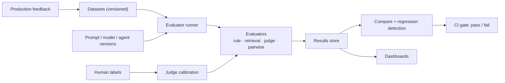

# Project 5 — AI Evaluation Platform

> Build the system that answers "is this change better?" — datasets, evaluators, experiments, regression detection, and gates that block bad releases.

## Goal

Prove you can make AI quality **measurable and enforceable**. This project is less about models and more about rigour: versioned datasets, reproducible runs, honest metrics, and a gate that a team cannot talk its way past. It is the project interviewers love because it shows engineering discipline rather than prompt tricks.

## What you will build

A platform that:

- stores versioned evaluation datasets (questions, expected outputs, and relevant source ids for RAG);
- stores versioned prompts, models, and agents so a result can name exactly what produced it;
- runs batch evaluations over a target system and records results;
- supports several evaluator types: rule-based, exact-match, retrieval metrics, and LLM-as-judge (pointwise and pairwise);
- compares two runs and flags regressions with confidence, not vibes;
- compares cost and latency alongside quality;
- exposes dashboards and a CI gate that fails a release when quality drops;
- ingests production feedback (thumbs, corrections) into new dataset candidates.

## Functional requirements

- **Datasets.** Create, version, and diff datasets; label relevance for retrieval evaluation; scrub PII.
- **Artifacts.** Register prompt, model, and agent versions; every run records the exact set used.
- **Runners.** Execute a target (a prompt, a RAG pipeline, or an agent) over a dataset in batch; handle retries and partial failures.
- **Evaluators.** Pluggable evaluators: deterministic checks, retrieval metrics (recall@k, MRR, NDCG), faithfulness/correctness via judge, and pairwise comparison.
- **Judge hygiene.** Order-swap to detect position bias, calibration against a small human-labelled set, and agreement reported (for example, kappa).
- **Comparison.** Statistical comparison of two runs (means with intervals; a significance test where appropriate) and a regression flag.
- **Gate.** A CI-invocable endpoint or command that fails if a metric drops beyond a threshold.
- **Dashboards.** Quality, cost, and latency over time, per artifact version.
- **Feedback loop.** Accept production signals and propose new dataset cases for review.

## Non-functional requirements

- **Reproducibility.** A run is repeatable: same dataset version, same artifact versions, same seeds; results stable within expected variance.
- **Cost control.** Judging is expensive; budget it, cache judgements, and sample where appropriate.
- **Honesty.** Report variance and confidence; never present a single run as a definitive win.
- **Accessibility of results.** A non-expert can see what changed and why a gate failed.

## Suggested architecture

## Suggested stack

- **Language:** Python.
- **Data:** PostgreSQL for datasets, runs, and results; object storage for large artifacts.
- **Jobs:** a queue or workflow engine for batch runs.
- **Dashboard:** Grafana or a simple web UI.
- **CI:** a GitHub Action that calls the gate.

## Data model sketch

| Store | Holds |
| --- | --- |
| `datasets` / `dataset_versions` | cases, labels, relevance ids |
| `artifacts` | prompt / model / agent versions |
| `runs` | dataset version, artifact versions, status, cost |
| `results` | per-case output, evaluator scores, explanations |
| `judgements` | judge model, prompt, raw scores, order |
| `gates` | run id, thresholds, pass/fail, approver |

## Milestones

1. **M0 — Skeleton.** Dataset and run models; run a trivial evaluator.
2. **M1 — Datasets.** Version, diff, and PII-scrub datasets.
3. **M2 — Deterministic + retrieval metrics.** Exact-match and recall@k/MRR/NDCG against labels.
4. **M3 — Judge.** Pointwise LLM-as-judge with a rubric; store explanations.
5. **M4 — Pairwise + calibration.** Pairwise comparison with order swap; calibrate against human labels; report agreement.
6. **M5 — Regression + gate.** Statistical comparison and a CI gate that blocks a regression.
7. **M6 — Dashboards + feedback.** Quality/cost/latency trends and a feedback intake.

## Acceptance criteria

- [ ] I can create a versioned dataset and run an evaluation over it.
- [ ] A run names the exact dataset, prompt, model, and agent versions used.
- [ ] Retrieval metrics match a hand-computed example.
- [ ] Pairwise judging with order swap detects a biased judge.
- [ ] Judge scores are calibrated against human labels and agreement is reported.
- [ ] Comparing two runs flags a regression with an interval, not a bare number.
- [ ] The CI gate fails a run that drops below a threshold (demonstrate it on a real PR).
- [ ] Dashboards show quality, cost, and latency per version.
- [ ] Judge cost per run is reported and cached judgements reduce it.

## Stretch goals

- Synthetic dataset generation from documents, reviewed by a human.
- Difficulty slicing (easy/hard subsets) to see where a regression comes from.
- Shadow evaluation of a candidate against live traffic.
- Human-evaluation workflow with an inter-rater agreement report.

## What to document

- README: how to define a dataset, an evaluator, and a gate.
- Two ADRs: the evaluator interface and the judge-calibration approach.
- A short report on one real quality decision you made with the platform.

## How to build it, step by step

Start with one dataset version, one artifact version, and one deterministic evaluator that runs end to end, because the run record is the spine of the whole platform. Add richer evaluators on top of a reproducible run. Statistical comparison, the gate, and dashboards come after single runs are stable; feedback intake and judge calibration are later still.

1. Create the repository: a Python app with config, lint/test commands, and `docker compose` for PostgreSQL and object storage.
2. Define the data model: `datasets`/`dataset_versions`, `artifacts`, `runs`, `results`, `judgements`, and `gates`.
3. Write migrations and the versioned dataset and artifact APIs, keeping published versions immutable.
4. Create a tiny labelled dataset version (with relevant ids for retrieval) and register one prompt and model version.
5. Build the runner: execute a target over the dataset in batch and record a run with exact artifact versions and a seed.
6. Add the first evaluator (rule-based or exact-match) and store per-case results.
7. Add retrieval metrics (recall@k, MRR, NDCG) and verify them against a hand-computed example.
8. Add retries and partial-failure handling in the runner, and confirm a run is reproducible.
9. Add dataset diffing and PII scrubbing for new versions.
10. Add the pointwise LLM-as-judge with a rubric, storing raw scores and explanations.
11. Add judge cost budgeting, caching of judgements, and sampling where appropriate.
12. Add pairwise judging with order swap, and demonstrate detection of a biased judge.
13. Calibrate the judge against a small human-labelled set and report agreement (for example, kappa).
14. Capture cost and latency alongside quality for each run.
15. Add run comparison with intervals and a significance test, producing a regression flag.
16. Build the CI gate: a command or endpoint that fails a run below threshold, wire it to a GitHub Action, and demonstrate it on a real PR.
17. Add dashboards for quality, cost, and latency over time, per artifact version.
18. Add feedback intake that accepts production signals and proposes reviewed dataset candidates.
19. Harden and document last: the two ADRs (evaluator interface and judge-calibration approach), the README, and a short report of one real quality decision, then re-run the acceptance checks.

> **Build order tip.** Make one dataset version, one artifact version, and one evaluator produce a reproducible run before adding judges. The gate and the dashboards are only trustworthy once a single run is repeatable.

## Builds on

Phase 3 (RAG Engineering), Phase 4 (Agentic AI Engineering), Phase 8 (AI Evaluation, Observability and Reliability).
