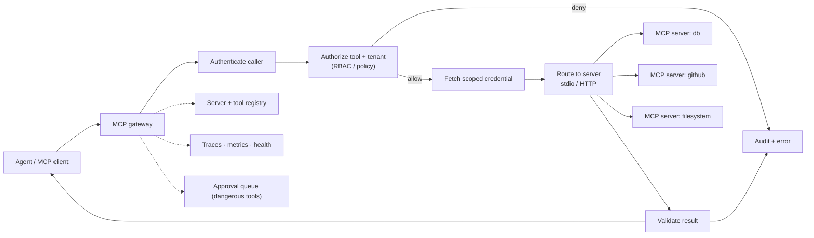

# Project 6 — Enterprise MCP Gateway

> Build the front door for MCP servers: one gateway that discovers tools, enforces policy, scopes credentials, and audits every tool call.

## Goal

Prove you can make **tool use safe in an enterprise**. MCP gives agents a standard way to call tools; this project is the layer that decides which tools exist, who may call them, with what credentials, and records what happened. It is a focused security-and-platform project that pairs well with Project 2.

## What you will build

A gateway that sits between MCP clients (agents) and MCP servers (capability providers) and:

- registers MCP servers and discovers their tools, resources, and prompts;
- exposes one endpoint that aggregates many servers' tools behind a single namespace;
- authenticates callers and authorizes each tool call against policy;
- injects scoped, short-lived credentials so the caller's token never passes through;
- allowlists tools per tenant and role, and requires approval for dangerous ones;
- rate-limits, logs, traces, and audits every call;
- health-checks servers and versions their tool schemas.

## Functional requirements

- **Server registry.** Register an MCP server (local stdio or remote transport) with its identity, owner, and status.
- **Discovery.** Connect to a server, list its tools/resources/prompts, and cache the schemas with a version; treat partial discovery (a server that is slow or down) as a first-class state, not a crash.
- **Aggregation.** Expose a unified tool list with namespacing to avoid collisions.
- **Call routing.** Route a tool call to the correct server over the correct transport; validate arguments against the schema *before* forwarding, and validate the result against its contract *before* the model sees it.
- **Conformance suite.** Run a contract suite against two server versions: a compatible schema change is accepted, a breaking change is rejected, a server that disappears mid-call is handled with a timeout and a structured error, and a malformed tool result is rejected (see [MCP Conformance, Contract Testing, and Schema Evolution](../phase-05-mcp-tool-ecosystems/21-mcp-conformance-contract-testing-and-schema-evolution.md)).
- **Authentication.** Identify the calling user/agent; validate bearer tokens fully — signature against the issuer's JWKS, issuer, audience, and expiry — or use mTLS/workload identity for service callers (see [Identity: OAuth 2.0, OIDC, mTLS, and Sessions](../phase-09-ai-security-and-governance/20-identity-oauth-oidc-mtls-and-sessions.md)).
- **Authorization.** Decide allow/deny per tool from RBAC roles, tenant, and policy; deny by default.
- **Credential scoping.** Fetch per-server, per-tenant, short-lived credentials from a secret store; never forward the caller's token.
- **Allowlists and approvals.** Per-tenant tool allowlists; a human approval gate for destructive tools.
- **Threat model.** A written STRIDE threat model naming assets, trust boundaries, abuse cases, controls, and residual risk, plus a security test suite that tries invalid tokens, replay, unauthorised tool access, and prompt-injected tool output (see [Application Security, Threat Modeling, and Supply Chain](../phase-09-ai-security-and-governance/21-application-security-threat-modeling-and-supply-chain.md)).
- **Rate limiting and quotas.** Per-tenant and per-tool limits.
- **Resilience.** Timeouts, retries for transient errors, and circuit breaking per server.
- **Observability and audit.** Traces per call and an append-only audit record (which tool, who, tenant, arguments hash, decision, result).
- **Versioning and health.** Negotiate protocol and tool versions, detect tool schema changes (rug pulls), pin the version a caller was promised, and health-check servers.

## Non-functional requirements

- **Security first.** The gateway is the enforcement point; the model is never trusted. No token passthrough.
- **Isolation.** A tenant's tool access cannot leak to another tenant.
- **Least privilege.** Every downstream credential is scoped to the minimum needed.
- **Auditability.** Every decision is reconstructable after the fact.
- **Low overhead.** The gateway adds small, measured latency per call.

## Suggested architecture

## Suggested stack

- **Language:** Python (the official MCP SDK) or another MCP SDK.
- **Data:** PostgreSQL for the registry, policy, and audit; Redis for rate limits and cached health.
- **Secrets:** a secret manager (Vault or a cloud equivalent) for scoped credentials.
- **Observability:** OpenTelemetry, Prometheus.

## Data model sketch

| Store | Holds |
| --- | --- |
| `servers` | id, transport, endpoint, owner, health, status |
| `tools` | server id, name, schema, schema fingerprint, version |
| `policies` | role/tenant → allowed tools, scopes, approval required |
| `credentials` | reference to a scoped secret per server/tenant (not the secret itself) |
| `audit` | caller, tenant, tool, args hash, decision, latency, result status |
| `approvals` | pending dangerous calls, approver, decision |

## Milestones

1. **M0 — Skeleton.** Gateway process; register one local MCP server (stdio); list its tools.
2. **M1 — Discovery + aggregation.** Connect to two servers; expose a namespaced tool list.
3. **M2 — Call routing.** Call a tool, validate arguments and results against the schema.
4. **M3 — Auth + authz.** Authenticate a caller; allow/deny per tool and tenant; deny by default.
5. **M4 — Scoped credentials.** Fetch per-server credentials; prove no token passthrough.
6. **M5 — Allowlists + approvals.** Per-tenant allowlists and an approval gate for destructive tools.
7. **M6 — Resilience + audit.** Timeouts, circuit breaking, rate limits, traces, audit, schema-change detection, README and ADRs.

## Acceptance criteria

- [ ] The gateway aggregates tools from at least two MCP servers behind one endpoint.
- [ ] A tool call is validated against its schema before execution and its result after.
- [ ] An unauthenticated caller is refused; an unauthorized tool is denied by policy (not by the prompt).
- [ ] The caller's token is never forwarded to a server; the server receives a scoped gateway credential.
- [ ] A destructive tool requires approval; the approved payload is the one executed.
- [ ] A tool schema change is detected and the new version is reviewed before use.
- [ ] A failing server is circuit-broken and does not stall other tools.
- [ ] Every call (allow and deny) appears in the audit log with the reason.
- [ ] A tenant cannot see or call another tenant's tools.
- [ ] I can state the gateway's added latency per call.
- [ ] The conformance suite scores the gateway's contract quality, rejects a malformed tool result before the model sees it, and refuses a breaking schema change.
- [ ] A server that disappears mid-call is handled with a timeout and recovers, and a bad gateway version rolls back without dropping requests.

## Stretch goals

- Tool result caching and semantic dedup of repeated calls.
- Usage analytics per tool and per tenant.
- A policy engine (OPA-style) instead of hard-coded rules.
- A marketplace view of available servers and tools with review workflow.

## What to document

- README: how to register a server and write a policy.
- Two ADRs: the authorization model and the credential-scoping design.
- A threat model for tool poisoning, rug pulls, and the confused deputy.

## How to build it, step by step

Start with one local stdio server: connect, discover, and list its tools. Add a second server and aggregation next, then the call-routing path with schema validation. Authorization, credential scoping, and approvals come after the proxy works, because policy is easier to test against a working call path. Resilience, schema-change detection, audit, and docs go last.

1. Create the repository: a Python app using an MCP SDK, config from the environment, and lint/test commands.
2. Bring up PostgreSQL and Redis with `docker compose`, and write the schema for `servers`, `tools`, `policies`, `credentials`, `audit`, and `approvals`.
3. Build the server registry and register a local stdio MCP server with identity, owner, and status.
4. Connect to that server, discover its tools/resources/prompts, and cache the schemas with a version.
5. Expose a unified tool list endpoint from the one server.
6. Register a second server over a remote transport and aggregate both behind one namespaced tool list.
7. Build call routing: send a tool call to the correct server over the correct transport.
8. Validate arguments against the tool schema before execution and the result after.
9. Add caller authentication (API key or OIDC) and refuse unauthenticated callers.
10. Add authorization: per-tool, per-tenant, and per-role allow/deny with deny-by-default policy.
11. Add scoped credentials: fetch per-server, per-tenant, short-lived credentials from a secret store, and prove no token passthrough.
12. Add per-tenant tool allowlists.
13. Add the approval gate for destructive tools, binding execution to the approved payload.
14. Add rate limiting and quotas per tenant and per tool.
15. Add resilience: timeouts, retries for transient errors, and a per-server circuit breaker.
16. Add schema-change (rug-pull) detection and per-server health checks.
17. Add tracing and the append-only audit log for every call, allow and deny, with the reason.
18. Prove tenant isolation: a tenant cannot see or call another tenant's tools.
19. Measure the gateway's added latency per call.
20. Harden and document last: the threat model, the two ADRs (authorization model and credential-scoping design), and the README, then re-run the acceptance checks.

> **Build order tip.** Get one local server discovered, aggregated, and called with schema validation before writing any policy. Authorization and credential scoping are easier to test once a working call path exists.

## Builds on

Phase 5 (MCP and Tool Ecosystems), Phase 7 (AI Platform Engineering), Phase 9 (AI Security and Governance).
