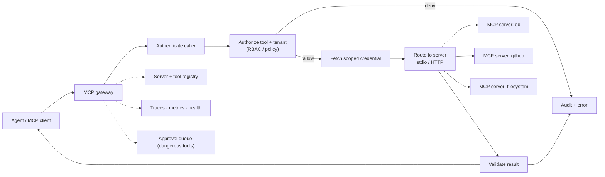

# Project 6 — Enterprise MCP Gateway

> Build the front door for MCP servers: one gateway that discovers tools, enforces policy, scopes credentials, and audits every tool call.

## Goal

Prove you can make **tool use safe in an enterprise**. MCP gives agents a standard way to call tools; this project is the layer that decides which tools exist, who may call them, with what credentials, and records what happened. It is a focused security-and-platform project that pairs well with Project 2.

## What you will build

A gateway that sits between MCP clients (agents) and MCP servers (capability providers) and:

- registers MCP servers and discovers their tools, resources, and prompts;
- exposes one endpoint that aggregates many servers' tools behind a single namespace;
- authenticates callers and authorizes each tool call against policy;
- injects scoped, short-lived credentials so the caller's token never passes through;
- allowlists tools per tenant and role, and requires approval for dangerous ones;
- rate-limits, logs, traces, and audits every call;
- health-checks servers and versions their tool schemas.

## Functional requirements

- **Server registry.** Register an MCP server (local stdio or remote transport) with its identity, owner, and status.
- **Discovery.** Connect to a server, list its tools/resources/prompts, and cache the schemas with a version.
- **Aggregation.** Expose a unified tool list with namespacing to avoid collisions.
- **Call routing.** Route a tool call to the correct server over the correct transport; validate arguments against the schema.
- **Authentication.** Identify the calling user/agent (API key or OIDC).
- **Authorization.** Decide allow/deny per tool from RBAC roles, tenant, and policy; deny by default.
- **Credential scoping.** Fetch per-server, per-tenant, short-lived credentials from a secret store; never forward the caller's token.
- **Allowlists and approvals.** Per-tenant tool allowlists; a human approval gate for destructive tools.
- **Rate limiting and quotas.** Per-tenant and per-tool limits.
- **Resilience.** Timeouts, retries for transient errors, and circuit breaking per server.
- **Observability and audit.** Traces per call and an append-only audit record (which tool, who, tenant, arguments hash, decision, result).
- **Versioning and health.** Detect tool schema changes (rug pulls) and health-check servers.

## Non-functional requirements

- **Security first.** The gateway is the enforcement point; the model is never trusted. No token passthrough.
- **Isolation.** A tenant's tool access cannot leak to another tenant.
- **Least privilege.** Every downstream credential is scoped to the minimum needed.
- **Auditability.** Every decision is reconstructable after the fact.
- **Low overhead.** The gateway adds small, measured latency per call.

## Suggested architecture

## Suggested stack

- **Language:** Python (the official MCP SDK) or another MCP SDK.
- **Data:** PostgreSQL for the registry, policy, and audit; Redis for rate limits and cached health.
- **Secrets:** a secret manager (Vault or a cloud equivalent) for scoped credentials.
- **Observability:** OpenTelemetry, Prometheus.

## Data model sketch

| Store | Holds |
| --- | --- |
| `servers` | id, transport, endpoint, owner, health, status |
| `tools` | server id, name, schema, schema fingerprint, version |
| `policies` | role/tenant → allowed tools, scopes, approval required |
| `credentials` | reference to a scoped secret per server/tenant (not the secret itself) |
| `audit` | caller, tenant, tool, args hash, decision, latency, result status |
| `approvals` | pending dangerous calls, approver, decision |

## Milestones

1. **M0 — Skeleton.** Gateway process; register one local MCP server (stdio); list its tools.
2. **M1 — Discovery + aggregation.** Connect to two servers; expose a namespaced tool list.
3. **M2 — Call routing.** Call a tool, validate arguments and results against the schema.
4. **M3 — Auth + authz.** Authenticate a caller; allow/deny per tool and tenant; deny by default.
5. **M4 — Scoped credentials.** Fetch per-server credentials; prove no token passthrough.
6. **M5 — Allowlists + approvals.** Per-tenant allowlists and an approval gate for destructive tools.
7. **M6 — Resilience + audit.** Timeouts, circuit breaking, rate limits, traces, audit, schema-change detection, README and ADRs.

## Acceptance criteria

- [ ] The gateway aggregates tools from at least two MCP servers behind one endpoint.
- [ ] A tool call is validated against its schema before execution and its result after.
- [ ] An unauthenticated caller is refused; an unauthorized tool is denied by policy (not by the prompt).
- [ ] The caller's token is never forwarded to a server; the server receives a scoped gateway credential.
- [ ] A destructive tool requires approval; the approved payload is the one executed.
- [ ] A tool schema change is detected and the new version is reviewed before use.
- [ ] A failing server is circuit-broken and does not stall other tools.
- [ ] Every call (allow and deny) appears in the audit log with the reason.
- [ ] A tenant cannot see or call another tenant's tools.
- [ ] I can state the gateway's added latency per call.

## Stretch goals

- Tool result caching and semantic dedup of repeated calls.
- Usage analytics per tool and per tenant.
- A policy engine (OPA-style) instead of hard-coded rules.
- A marketplace view of available servers and tools with review workflow.

## What to document

- README: how to register a server and write a policy.
- Two ADRs: the authorization model and the credential-scoping design.
- A threat model for tool poisoning, rug pulls, and the confused deputy.

## Builds on

Phase 5 (MCP and Tool Ecosystems), Phase 7 (AI Platform Engineering), Phase 9 (AI Security and Governance).
