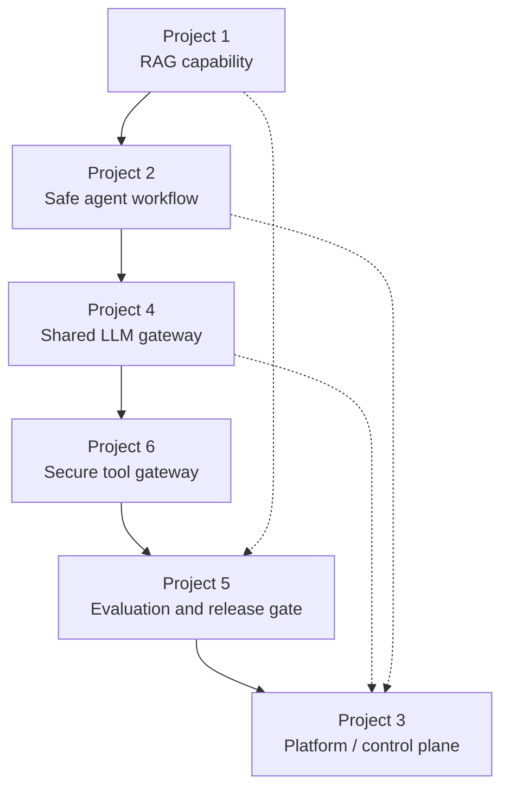

# Portfolio Spine

> Six independent demos are not a portfolio. A portfolio is a small number of connected systems that share contracts, tell one story, and prove you can build and operate a platform. This page defines that spine.

## Why this exists

The six project briefs are deliberately ambitious. Trying to finish all of them to the same standard is the fastest way to finish none of them. Worse, six disconnected demos tell an interviewer nothing about how you think about integration, reuse, and trade-offs.

The fix is a **portfolio spine**: build a small set of capabilities that connect, choose one as your showcase system, and integrate at least two supporting capabilities into it. You demonstrate depth *and* platform thinking, and you always have a coherent story to tell.

> **The rule.** One primary project, fully built and operated, plus one smaller specialization project. Completing all six is optional and rarely necessary.

## The spine

The projects are ordered so each one can feed the next. Read `→` as "can be reused by".

The spine is a recommendation, not a straitjacket. The point is that capabilities accumulate: the gateway serves every agent, the tool gateway serves every tool call, the evaluation platform gates every release, and the platform registers and runs them all.

## Choosing your primary and secondary

| If your target role is… | Primary project | Secondary project |
| --- | --- | --- |
| Senior Software Engineer | 4 — LLM Gateway | 1 — RAG Engine |
| Senior AI Engineer | 1 — RAG Engine | 5 — Evaluation Platform |
| Agentic AI Engineer | 2 — Workflow Agent | 6 — MCP Gateway |
| AI Platform Engineer | 3 — Agent Platform | 4 — LLM Gateway |
| Staff / Principal AI Engineer | 3 — Agent Platform | 5 — Evaluation Platform |
| AI Systems Architect | 3 — Agent Platform (connected to 1, 2, 4) | any two supporting capabilities |

A **capability** counts as secondary if it is integrated into the primary system rather than built as a separate product — for example, adding the LLM gateway as the model path inside your RAG engine, or wiring the evaluation platform as the release gate for your agent.

## Shared contracts

To make the spine real, reuse the same contracts across projects. This is where the platform thinking shows.

| Contract | Defined by | Reused by |
| --- | --- | --- |
| One chat/completion request shape | Project 4 | Projects 1, 2, 3, 5 |
| One tool-call envelope (name, arguments, result, error) | Project 6 | Projects 2, 3, 12 work |
| One trace/span format and correlation id | Phase 8 | All projects |
| One evaluation record (dataset, metric, result, version) | Project 5 | Projects 1, 2, 3 |
| One tenant and identity model | Project 3 | Projects 4, 6 |
| One artifact version (model, prompt, agent, dataset) | Project 3 | Projects 1, 5 |

If two of your projects speak the same request and trace formats, that is a portfolio. If they each invent their own, that is six demos.

## Universal project gates

Every primary project must clear the same gates. They are the evidence contract applied to a whole system.

### Build

- A stranger can run it from a clean checkout with one documented command.
- The core path is covered by unit, integration, and contract tests.
- The service has versioned schemas and a documented API.

### Measure

- p50, p95, and p99 latency are known.
- Throughput, saturation, error rate, and cost are measured.
- AI quality has a labelled dataset and a repeatable evaluation.
- Baselines and improvements are recorded.

### Break

- A dependency outage, timeout, duplicate message, worker death, and budget exhaustion have been tested.
- The recovery path is documented in a runbook.
- At least one incident report explains what happened and what changed.

### Secure

- Threat model, trust boundaries, assets, and abuse cases are documented.
- Authentication, authorization, tenant isolation, secret handling, and audit behaviour are tested.
- Dependency and image security checks run in CI.

### Explain

- Two or three ADRs show alternatives and consequences.
- The architecture can be drawn from memory.
- You can answer "why not X?" and "what breaks first?"
- You can explain one decision to an engineer and to an executive.

## Local and cloud paths

Every project must have two deployment paths:

- **Local, low-cost.** `docker compose` (or `kind`/`minikube` for the platform projects) with a local model or a mocked provider. A learner with no cloud account can still finish it.
- **Cloud.** A Terraform and Helm path for the platform projects, or a documented single-service deploy for the others. The cloud path is optional to run but must exist and be reviewed.

Do not require a paid service or a GPU to complete a project. A local substitute must always work.

## Reproducible demo data

Each project needs a small dataset with fixed seeds so results are repeatable:

- a set of documents for the RAG project, with known answers and citations;
- a set of tasks for the agent projects, including a failure case;
- a set of prompts for the gateway benchmark;
- a labelled evaluation set for the evaluation platform.

Fixed seeds mean a reviewer can reproduce your numbers. A result you cannot reproduce is an anecdote.

## The portfolio summary

At the end, write a one-page summary per project and a single portfolio index. Each summary states:

- what the system does, in two sentences;
- the architecture, as a diagram;
- three real numbers (latency, cost, quality);
- one failure you found and fixed;
- one decision you would make differently;
- the link to the running demo or recording.

That page is what you attach to a job application and what you walk an interviewer through.

> **The test of a good portfolio.** An interviewer can see how the pieces connect, reproduce your results, and ask "why not X?" about any decision — and you can answer all three.

## Related pages

- [Competency and evidence contract](competency-evidence.md) — the evidence each gate must produce.
- [Definition of done](definition-of-done.md) — the shared bar in checklist form.
- [Final Projects](index.md) — the six briefs.
